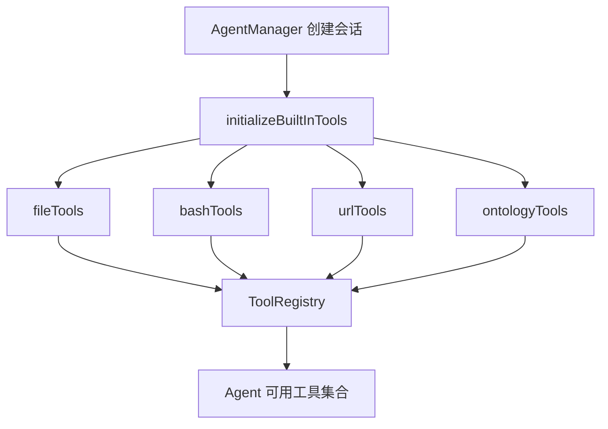
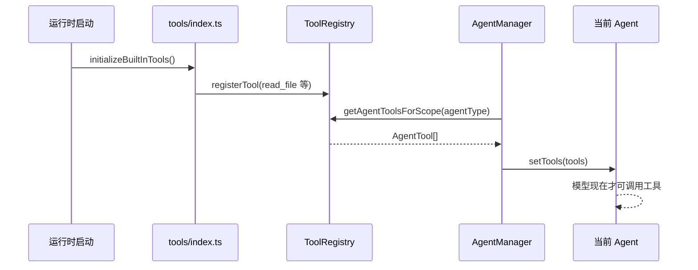

# E41：工具必须先注册，Agent 才能使用

小林让毕业旅行 Agent “读取预算表并生成预算摘要”。模型本身不能读文件，它只能请求一个叫 `read_file` 或 `read_document` 的工具。这个工具为什么会出现在模型可选列表里？答案在工具注册流程里。

本节阅读 [packages/core/src/lib/integrations/pi-agent/tools/index.ts](../../../../packages/core/src/lib/integrations/pi-agent/tools/index.ts)、[packages/core/src/lib/integrations/pi-agent/tools/registry.ts](../../../../packages/core/src/lib/integrations/pi-agent/tools/registry.ts) 和 [packages/core/src/lib/integrations/pi-agent/agent-manager.ts](../../../../packages/core/src/lib/integrations/pi-agent/agent-manager.ts)。

## 1. 内置工具不是自动加载的

[packages/core/src/lib/integrations/pi-agent/tools/index.ts 第 43—87 行](../../../../packages/core/src/lib/integrations/pi-agent/tools/index.ts#L43)：

```ts
export function initializeBuiltInTools(): void {
  if (isInitialized) {
    return;
  }

  const registry = getToolRegistry();
  fileTools.forEach(tool => registerTool(tool));
  documentTools.forEach(tool => registerTool(tool));
  ontologyTools.forEach(tool => registerTool(tool));
  ontologyDataTools.forEach(tool => registerTool(tool));
  systemTools.forEach(tool => registerTool(tool));
  bashTools.forEach(tool => registerTool(tool));
  skillTools.forEach(tool => registerTool(tool));
  urlTools.forEach(tool => registerTool(tool));
  askUserQuestionTools.forEach(tool => registerTool(tool));
  scheduleTools.forEach(tool => registerTool(tool));
  isInitialized = true;
}
```

这段代码说明两件事。第一，工具要显式注册；导入模块不等于工具已经进入 Agent。第二，注册是一次性的，`isInitialized` 防止重复注册。小林的旅行 Agent 能看到文件、命令、URL、本体等工具，是因为会话创建流程调用了这个初始化函数。



图中每条箭头都代表“注册到同一个全局注册表”。如果某类工具没有被 `initializeBuiltInTools` 放进去，后面即使模型知道工具名字，也不会真正拥有这个工具。

## 2. 注册表按名字保存工具定义

[packages/core/src/lib/integrations/pi-agent/tools/registry.ts 第 24—38 行](../../../../packages/core/src/lib/integrations/pi-agent/tools/registry.ts#L24)：

```ts
export class ToolRegistry {
  private tools = new Map<string, ToolRegistration<any, any>>();

  register(registration: ToolRegistration<any, any>): void {
    const { name } = registration;
    if (this.tools.has(name)) {
      console.warn(`工具 "${name}" 已存在，将被覆盖`);
    }
    this.tools.set(name, registration);
  }
}
```

这里的 `name` 是工具身份。`read_file`、`execute_command`、`generate_file_url` 都靠 `name` 区分。重复注册同名工具不会并存，而是覆盖。对新手来说，这一点很重要：工具不是按文件名运行，而是按注册对象里的 `name` 暴露给 Agent。

## 3. AgentManager 创建 Agent 时才把工具塞进去

[packages/core/src/lib/integrations/pi-agent/agent-manager.ts 第 159—170 行](../../../../packages/core/src/lib/integrations/pi-agent/agent-manager.ts#L159)：

```ts
initializeBuiltInTools();

const context: ToolExecutionContext = {
  sessionId,
  workingDirectory: options?.agentBaseDir,
};
setToolContext(sessionId, context);
getToolContextManager().setDefaultContext(context);
```

[packages/core/src/lib/integrations/pi-agent/agent-manager.ts 第 298—304 行](../../../../packages/core/src/lib/integrations/pi-agent/agent-manager.ts#L298)：

```ts
const scopeTools = getAgentToolsForScope(options?.agentType);
const tools = bindToolsToSession(
  filterDisallowedToolsForAgentType(scopeTools, options?.agentType),
  sessionId
);
agent.setTools(tools as AgentTool<any>[]);
```

这里才是“工具进入某个 Agent”的位置。注册表只是仓库；`agent.setTools` 才把过滤后的工具集合交给当前运行时。小林的毕业旅行 Agent 并不是直接拿到整个 Node.js 权限，而是拿到一组经过注册、过滤、绑定会话的工具。

## 4. 失败边界

| 失败点 | 现象 | 源码原因 |
| --- | --- | --- |
| 没有调用 `initializeBuiltInTools` | Agent 工具列表为空 | 注册表没有填充 |
| 工具名重复 | 后注册覆盖先注册 | `Map` 以 `name` 为 key |
| 只注册不 `setTools` | 模型仍不能调用 | 注册表和当前 Agent 状态是两层 |
| `agentType` 传错 | 工具集合异常 | 后续作用域过滤依赖 agent 类型 |

## 5. 测试证据与缺口

[packages/core/src/lib/integrations/pi-agent/tools/__tests__/registry.test.ts](../../../../packages/core/src/lib/integrations/pi-agent/tools/__tests__/registry.test.ts) 覆盖了注册、获取、启用、禁用、按 scope 过滤等行为。它能证明注册表自身逻辑可靠，但不能证明每个 UI 入口都一定用正确 `agentType` 创建会话。

## 6. 源码深读：从“有代码”到“当前会话可调用”

把 E41 的链路拆成四个状态，读者就不会把工具文件和工具能力混为一谈。

| 状态 | 代表代码 | 是否可被模型调用 | 原因 |
| --- | --- | --- | --- |
| 工具文件存在 | `file-tools.ts` 中定义 `ReadFileTool` | 否 | 只是源码定义，没有进入注册表 |
| 工具注册 | `registerTool(tool)` | 还不一定 | 注册表知道它，但当前 Agent 未必拿到 |
| 工具过滤 | `getAgentToolsForScope(agentType)` | 取决于当前类型 | scope 可能把工具过滤掉 |
| 工具注入 | `agent.setTools(tools)` | 是 | 当前 Agent state 中已经有工具集合 |

如果小林的旅行 Agent 说“我不能读取文件”，排查顺序也应按这四步走。先看 `initializeBuiltInTools` 是否执行，再看 `ToolRegistry` 是否有 `read_file`，然后看 `agentType` 是否过滤掉它，最后看创建 Agent 时是否调用 `setTools`。如果反过来一开始就查模型 prompt，很可能会错过真正的运行时问题。

这里还有一个细节：`initializeBuiltInTools` 用 `isInitialized` 保证只注册一次，这对热更新和重复创建会话很重要。否则同名工具会不断覆盖，日志里充满“工具已存在”，很难判断是正常覆盖还是错误重复初始化。

## 7. 源码链路补强与练习

### 7.1 沿着一次工具注入完整走一遍

现在把“小林让旅行 Agent 读取预算文件”这件事拆成运行时真正经历的步骤。第一步不是读取文件，而是系统启动时调用 [packages/core/src/lib/integrations/pi-agent/tools/index.ts 第 43 行](../../../../packages/core/src/lib/integrations/pi-agent/tools/index.ts#L43) 的 `initializeBuiltInTools()`。这个函数把 `fileTools`、`documentTools`、`ontologyTools`、`ontologyDataTools`、`systemTools`、`bashTools`、`skillTools`、`urlTools`、`askUserQuestionTools`、`scheduleTools` 逐组注册进全局注册表。也就是说，内置工具不是散落在文件里的“可选函数”，而是在一个明确的初始化时刻进入统一容器。

第二步发生在 [packages/core/src/lib/integrations/pi-agent/tools/registry.ts 第 24 行](../../../../packages/core/src/lib/integrations/pi-agent/tools/registry.ts#L24)。`ToolRegistry` 内部用 `Map<string, ToolRegistration>` 保存工具，key 是工具名。`register()` 做的事情很简单：取出 `registration.name`，如果已存在就警告，然后覆盖写入 Map。这里有一个初学者很容易忽略的点：工具名是运行时身份，不是文件名。文件叫 `file-tools.ts`，但真正暴露给模型的是 `read_file`、`write_file`、`edit_file`、`list_files`、`delete_file` 这些 name。

第三步是把注册表里的工具转换成 Pi Agent 能识别的形态。`toAgentToolsForScope()` 不把整个 `ToolRegistration` 交出去，而是映射成 `{ name, label, description, parameters, execute }`。这说明 registry 里可以保存更多元信息，例如 `category`、`enabled`、`scopes`，但模型真正调用时只需要知道工具名、说明、参数 schema 和执行函数。

第四步才到 AgentManager。源码在 [packages/core/src/lib/integrations/pi-agent/agent-manager.ts 第 161 行](../../../../packages/core/src/lib/integrations/pi-agent/agent-manager.ts#L161) 先初始化内置工具，在 [packages/core/src/lib/integrations/pi-agent/agent-manager.ts 第 299 行](../../../../packages/core/src/lib/integrations/pi-agent/agent-manager.ts#L299) 再根据当前 `agentType` 取出工具集合并交给 agent。此时 `read_file` 才从“源码中定义的工具”变成“当前会话里模型能调用的工具”。



这张图要表达的是一个顺序关系：源码定义、注册、过滤、注入缺一不可。任何一步断掉，用户看到的结果都可能是“Agent 不会用工具”。但错误原因完全不同：没有注册是启动问题；被过滤是权限问题；没有注入是会话创建问题；工具执行失败才是具体工具问题。

为了排查这类问题，可以按下面的证据链检查：

| 证据 | 应该看到什么 | 看不到时说明什么 |
| --- | --- | --- |
| 启动日志 | `initializeBuiltInTools START/DONE` | 运行时没有完成工具初始化 |
| registry 数量 | `registered ${total} tools` | 某组工具可能没有被加入 `index.ts` |
| scope 后数量 | `getAgentToolsForScope(agentType)` 返回非空 | 当前 `agentType` 可能过滤过严 |
| agent 注入 | 创建 Agent 后 `setTools` 收到工具数组 | 会话创建链路没有把工具传进去 |

测试也要沿着这条链验收。[packages/core/src/lib/integrations/pi-agent/tools/__tests__/registry.test.ts 第 1 行](../../../../packages/core/src/lib/integrations/pi-agent/tools/__tests__/registry.test.ts#L1) 适合验证注册表本身；[packages/core/src/lib/integrations/pi-agent/__tests__/agent-manager.test.ts 第 1 行](../../../../packages/core/src/lib/integrations/pi-agent/__tests__/agent-manager.test.ts#L1) 适合验证 AgentManager 创建会话时是否拿到了正确工具集合。它们验证的不是同一层，所以不能用一个测试替代另一个测试。

纸面推演：如果新增一个 `search_code` 工具文件，但没有在 `tools/index.ts` 里注册，它会自动出现在 Agent 里吗？答案是不会。

口头验收：读者应能解释“工具文件存在、工具注册、工具进入 Agent”是三件不同的事。

## 8. 本节小结

Agent 能行动的第一步不是模型变强，而是运行时把工具定义注册到 `ToolRegistry`，再把过滤后的工具集合交给当前 Agent。下一节继续看：为什么不同类型的 Agent 看到的工具集合不同。
