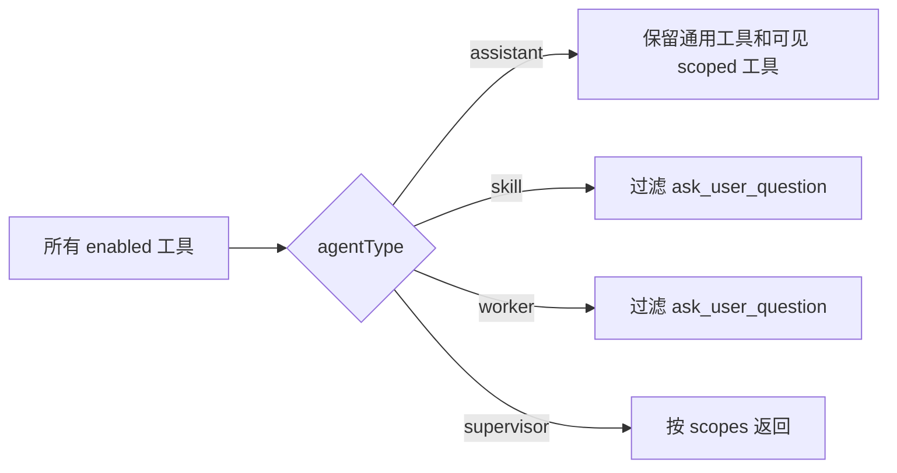
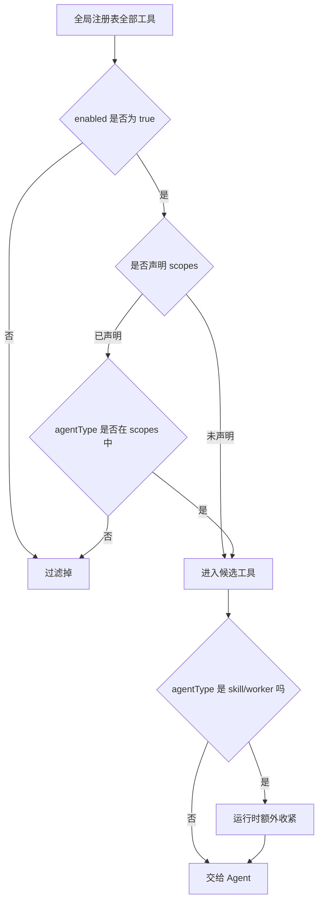

# E42：工具作用域决定哪类 Agent 能看见哪类工具

同样是工具，普通助手、Skill 会话、worker、supervisor 不一定都应该看到。小林的毕业旅行 Skill 可以读写自己的输出目录，但如果后台 worker 也能随便向用户弹问题，就会打断主对话。因此，工具注册后还要经过作用域过滤。

本节阅读 [packages/core/src/lib/integrations/pi-agent/tools/registry.ts](../../../../packages/core/src/lib/integrations/pi-agent/tools/registry.ts) 和 [packages/core/src/lib/integrations/pi-agent/agent-manager.ts](../../../../packages/core/src/lib/integrations/pi-agent/agent-manager.ts)。

## 1. 工具可以声明 scopes

[packages/core/src/lib/integrations/pi-agent/tools/registry.ts 第 84—103 行](../../../../packages/core/src/lib/integrations/pi-agent/tools/registry.ts#L84)：

```ts
getEnabledForScope(agentType?: string): ToolRegistration<any, any>[] {
  if (!agentType) {
    return this.getEnabled();
  }
  return this.getEnabled().filter((t) => {
    if (!t.scopes || t.scopes.length === 0) return true;
    return t.scopes.includes(agentType);
  });
}
```

规则很直接：没有声明 `scopes` 的工具对所有类型可见；声明了 `scopes` 的工具，只有 `agentType` 命中时才可见。这里没有复杂权限系统，但已经有基础隔离能力。

## 2. worker 和 skill 会额外去掉提问工具

[packages/core/src/lib/integrations/pi-agent/tools/registry.ts 第 238—244 行](../../../../packages/core/src/lib/integrations/pi-agent/tools/registry.ts#L238)：

```ts
export function getAgentToolsForScope(agentType?: string): AgentTool<TSchema>[] {
  const tools = globalRegistry.toAgentToolsForScope(agentType);
  if (agentType === "worker" || agentType === "skill") {
    return tools.filter((tool) => tool.name !== "ask_user_question");
  }
  return tools;
}
```

这是一个具体的产品边界。`ask_user_question` 是向用户发起选择卡片的工具；如果后台 worker 或 Skill 子流程随意调用它，用户会被多个执行体打断。源码选择对 `worker` 和 `skill` 过滤掉它。



读图时要注意：`enabled` 是第一道门，`scope` 是第二道门，特殊 agent 类型过滤是第三道门。三道门任何一道不通过，模型都看不到这个工具。

## 3. AgentManager 使用过滤后的集合

[packages/core/src/lib/integrations/pi-agent/agent-manager.ts 第 298—304 行](../../../../packages/core/src/lib/integrations/pi-agent/agent-manager.ts#L298)：

```ts
const scopeTools = getAgentToolsForScope(options?.agentType);
const tools = bindToolsToSession(
  filterDisallowedToolsForAgentType(scopeTools, options?.agentType),
  sessionId
);
agent.setTools(tools as AgentTool<any>[]);
```

这说明过滤不是只用于展示，而是直接影响 `agent.setTools`。换句话说，工具不可见就不能被当前 Agent 调用。

## 4. 失败边界

| 问题 | 结果 | 定位点 |
| --- | --- | --- |
| `agentType` 为空 | 返回所有 enabled 工具 | `getEnabledForScope` 第一分支 |
| scoped 工具没有包含当前类型 | 工具不可见 | `t.scopes.includes(agentType)` |
| worker 想调用 `ask_user_question` | 工具被移除 | `getAgentToolsForScope` 特殊过滤 |
| 工具被 disabled | scope 命中也不可见 | `getEnabled()` 是前置条件 |

## 5. 测试证据与缺口

[packages/core/src/lib/integrations/pi-agent/tools/__tests__/registry.test.ts](../../../../packages/core/src/lib/integrations/pi-agent/tools/__tests__/registry.test.ts) 中有按 `worker`、`skill`、`supervisor` 获取工具的断言，能证明过滤逻辑存在。缺口是端到端 UI 不一定覆盖每个入口创建时传入的 `agentType` 是否正确。

## 6. 源码深读：三道门的顺序不能颠倒

作用域过滤最容易被讲浅，因为看起来只是 `filter`。但在运行时，它实际承担“能力分配”的职责。

第一道门是 `enabled`。注册表里可以有工具，但只有 `enabled:true` 的工具会进入候选集合。这允许系统临时关闭某些能力。第二道门是 `scopes`。如果工具没有声明 scopes，就视为通用工具；如果声明了 scopes，就必须匹配当前 `agentType`。第三道门是显式业务规则：`worker` 和 `skill` 移除 `ask_user_question`。

这三道门的顺序影响排错。比如小林在普通助手中可以看到提问卡片，但在旅行 Skill 中看不到，不应先怀疑 UI 卡片坏了，而要先检查 `agentType === "skill"` 时的特殊过滤。再比如某个本体写入工具声明了 `scopes: ['assistant']`，即使它本身 `enabled:true`，Skill 会话也不应看到它。

| 排查问题 | 应查源码 | 判断 |
| --- | --- | --- |
| 工具完全不可见 | `getEnabled()` | 是否被 disabled |
| 只在某类 Agent 不可见 | `getEnabledForScope` | scopes 是否匹配 |
| skill/worker 无法提问 | `getAgentToolsForScope` | 是否命中特殊过滤 |
| 日志显示工具数量异常 | `agent-manager.ts` 的 `setTools` | 是否传错 agentType |

`agentType` 不是展示文案，而是工具可见性计算的输入；省略它会使 scope 过滤失去正确依据。

## 7. 源码链路补强与练习

### 7.1 scope 过滤到底过滤了什么

现在用小林的旅行 Skill 来看 scope 的完整判断。假设同一个系统里同时有普通助手、旅行 Skill、后台 worker。它们都从同一个全局注册表取工具，但不能直接看到同一批工具。原因在 [packages/core/src/lib/integrations/pi-agent/tools/registry.ts 第 95 行](../../../../packages/core/src/lib/integrations/pi-agent/tools/registry.ts#L95)：`getEnabledForScope(agentType)` 先拿到所有 `enabled` 工具，再看每个工具是否声明了 `scopes`。如果工具没有声明 `scopes`，它被认为是通用工具；如果声明了 `scopes`，当前 `agentType` 必须包含在数组里。

这条规则看起来简单，但实际决定了“能力隔离”。比如 `create_domain` 在 [packages/core/src/lib/integrations/pi-agent/tools/ontology-tools.ts 第 120 行](../../../../packages/core/src/lib/integrations/pi-agent/tools/ontology-tools.ts#L120) 声明了多个 scope，意味着它不是所有上下文都天然可见，而是只对被列出的 Agent 类型开放。这样设计的原因是：本体结构修改是高影响操作，不能因为工具已经注册就让任何 Agent 都能使用。

第二层过滤在 [packages/core/src/lib/integrations/pi-agent/tools/registry.ts 第 238 行](../../../../packages/core/src/lib/integrations/pi-agent/tools/registry.ts#L238)。`getAgentToolsForScope(agentType)` 会在 `worker` 或 `skill` 类型下额外处理工具集合，尤其避免把某些需要用户交互的工具暴露给不适合交互的运行环境。这里要区分两种“不可见”：一种是工具自己通过 `scopes` 声明不开放；另一种是运行时针对某类 Agent 做额外收紧。



这张图里的关键不是“过滤条件很多”，而是每道门的责任不同。`enabled` 是开关，表示工具当前是否启用；`scopes` 是声明式权限，表示工具设计上允许哪些 Agent 类型使用；`agentType` 的特殊处理是运行时策略，表示某些环境不适合承载某类交互。

对新手来说，排查工具不可见时要避免一句“权限问题”带过。正确问题应该分层问：

| 问题 | 应看字段或函数 | 可能结论 |
| --- | --- | --- |
| 工具有没有注册 | `ToolRegistry.getAll()` | 没注册就不会进入任何 scope |
| 工具有没有启用 | `enabled` | disabled 工具不会进入候选集合 |
| 当前类型是否匹配 | `scopes.includes(agentType)` | scope 不匹配是设计结果 |
| 是否有额外策略 | `getAgentToolsForScope` | skill/worker 可能进一步收紧 |

如果小林在普通助手里能看到“向用户提问”的卡片，但在旅行 Skill 会话里看不到，这不一定是 bug。它可能是运行时故意避免 Skill 内部再弹出选择卡，防止嵌套交互变得不可控。反过来，如果某个应该只有项目 Agent 使用的本体写入工具出现在普通 Skill 中，那就是权限边界过宽，需要回到 `scopes` 修正，而不是在 UI 层隐藏按钮。

测试验收也要覆盖“可见”和“不可见”两面。[packages/core/src/lib/integrations/pi-agent/tools/__tests__/registry.test.ts 第 1 行](../../../../packages/core/src/lib/integrations/pi-agent/tools/__tests__/registry.test.ts#L1) 应验证未声明 scopes 的工具默认可见、声明 scopes 的工具只在匹配类型可见、disabled 工具无论 scope 如何都不可见。只有同时证明正例和反例，scope 才不是一句文档说明。

### 7.2 新手最容易混淆的四个词

这一节要把四个词分开：注册、启用、授权、注入。它们经常在口语里都被说成“有工具”，但在源码里不是同一回事。

| 词 | 对应源码 | 解决的问题 | 常见误判 |
| --- | --- | --- | --- |
| 注册 | `registerTool` | 系统知道这个工具存在 | 注册了就一定能用 |
| 启用 | `enabled` | 这个工具当前是否开放 | scope 不匹配时误以为 disabled |
| 授权 | `scopes` | 哪类 Agent 能看到它 | 把 UI 隐藏当权限 |
| 注入 | `agent.setTools` | 当前 Agent 是否拿到工具数组 | registry 有工具但当前会话没有 |

小林打开旅行 Skill 时，最容易出现的排查错误是：看到源码里有 `ask_user_question`，就认为 Skill 一定能弹选择卡。正确判断必须继续看 `agentType`。如果当前会话是 `skill`，工具集合还会经过 skill/worker 特殊策略。这个策略不是前端展示层做的，而是在工具转成 AgentTool 之前完成。

再看反例：如果一个工具没有声明 `scopes`，它默认被视为通用工具。这不代表它就一定安全，只代表源码没有用 scope 限制它。真正是否应该通用，要回到工具副作用判断：只读工具可以更宽，写入工具、本体结构工具、调度工具应该更谨慎。课程读到这里，读者应能自己提出审查问题：这个工具如果被 skill、worker、project 同时看到，会不会造成目录、权限或交互问题？

验收时可以让读者做一个小表：把 `read_file`、`create_domain`、`ask_user_question`、`schedule_task` 分别写出“是否注册、是否 enabled、是否声明 scopes、在哪些 agentType 下可见”。如果写不出来，就说明只是记住结论，没有真正理解过滤机制。

纸面推演：一个工具声明 `scopes: ['assistant']`，当前会话 `agentType: 'skill'`，它会不会进入 Skill 会话？不会。

口头验收：读者应能说明 `enabled`、`scopes`、`agentType` 三者的关系。

## 8. 本节小结

工具注册解决“系统有哪些工具”，作用域过滤解决“当前 Agent 能看见哪些工具”。下一节进入工具执行前最重要的第二个条件：会话上下文。
