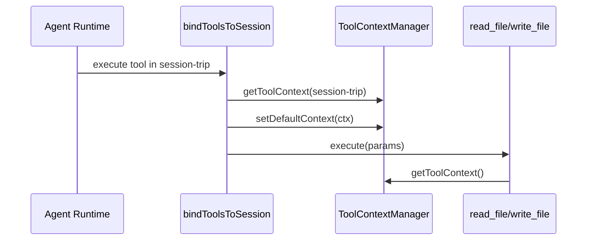
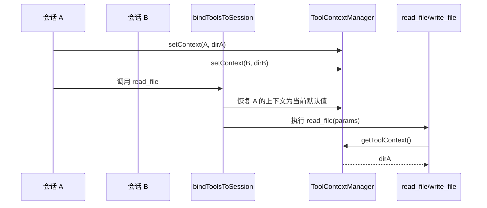

# E43：工具上下文把 sessionId 和工作目录绑在一起

小林的旅行 Agent 让工具写 `output/plan.md`。这个相对路径到底写到哪里？不是工具自己猜，也不是模型决定，而是由工具上下文里的 `workingDirectory` 决定。

本节阅读 [packages/core/src/lib/integrations/pi-agent/tools/context.ts](../../../../packages/core/src/lib/integrations/pi-agent/tools/context.ts)、[packages/core/src/lib/integrations/pi-agent/tools/bind-session.ts](../../../../packages/core/src/lib/integrations/pi-agent/tools/bind-session.ts) 和 [packages/core/src/lib/integrations/pi-agent/agent-manager.ts](../../../../packages/core/src/lib/integrations/pi-agent/agent-manager.ts)。

## 1. ToolExecutionContext 很小，但非常关键

[packages/core/src/lib/integrations/pi-agent/tools/context.ts 第 12—23 行](../../../../packages/core/src/lib/integrations/pi-agent/tools/context.ts#L12)：

```ts
export interface ToolExecutionContext {
  sessionId?: string;
  workingDirectory?: string;
}
```

只有两个字段，却决定工具属于哪个会话、在哪个目录里行动。这里没有 `projectId`、`skillName`、`windowId`，说明工具层刻意不关心业务入口。工具只关心执行边界。

## 2. 上下文按 sessionId 保存，也有 defaultContext

[packages/core/src/lib/integrations/pi-agent/tools/context.ts 第 28—53 行](../../../../packages/core/src/lib/integrations/pi-agent/tools/context.ts#L28)：

```ts
class ToolContextManager {
  private contexts = new Map<string, ToolExecutionContext>();
  private defaultContext: ToolExecutionContext = {};

  setContext(sessionId: string, context: ToolExecutionContext): void {
    this.contexts.set(sessionId, context);
  }

  getContext(sessionId?: string): ToolExecutionContext {
    if (!sessionId) {
      return this.defaultContext;
    }
    return this.contexts.get(sessionId) || this.defaultContext;
  }
}
```

如果工具执行时拿不到明确 `sessionId`，就会读 `defaultContext`。这就是为什么后面需要 `bindToolsToSession`，让每个工具调用前把当前会话上下文刷新进去。

## 3. bindToolsToSession 防止多会话串上下文

[packages/core/src/lib/integrations/pi-agent/tools/bind-session.ts 第 22—38 行](../../../../packages/core/src/lib/integrations/pi-agent/tools/bind-session.ts#L22)：

```ts
export function bindToolsToSession<T extends Pick<AgentTool<any>, "execute">>(
  tools: T[],
  sessionId: string,
): T[] {
  return tools.map((tool) => ({
    ...tool,
    execute: (toolCallId, params, signal, onUpdate) => {
      const ctx = getToolContext(sessionId);
      getToolContextManager().setDefaultContext(ctx);
      return (tool.execute as any)(toolCallId, params as never, signal, onUpdate);
    },
  })) as T[];
}
```

这段代码解决的是并发会话共享全局上下文的问题：每次工具执行前，先按当前 `sessionId` 取上下文，再设置为 default。



这张图里最后一步看似奇怪：工具内部通常不传 `sessionId`，而是读 default context。因此绑定层必须在调用前刷新 default context。读者应把它看成“执行前校准”：同一个 `read_file` 工具函数可以服务很多会话，但每次执行前都要先把刻度校准到当前会话的工作目录。

## 4. AgentManager 创建和复用时都会刷新上下文

[packages/core/src/lib/integrations/pi-agent/agent-manager.ts 第 138—145 行](../../../../packages/core/src/lib/integrations/pi-agent/agent-manager.ts#L138)：

```ts
const context: ToolExecutionContext = {
  sessionId,
  workingDirectory: options?.agentBaseDir,
};
setToolContext(sessionId, context);
getToolContextManager().setDefaultContext(context);
```

复用已有 Agent 时也会刷新上下文。这很重要，因为同一个 session 的工作目录可能在恢复、项目切换或 Skill 入口中重新传入。

## 5. 失败边界

| 失败点 | 表现 | 原因 |
| --- | --- | --- |
| 没有设置 `workingDirectory` | 文件路径解析报错或回退到 dataRoot | 工具缺少边界根 |
| 没有绑定 session | 多会话可能共享错误 defaultContext | 工具 execute 没有 session 参数 |
| 复用 Agent 时不刷新 | 新工作目录不生效 | 旧上下文残留 |

## 6. 测试证据与缺口

[packages/core/src/lib/integrations/pi-agent/tools/__tests__/working-directory.test.ts](../../../../packages/core/src/lib/integrations/pi-agent/tools/__tests__/working-directory.test.ts) 覆盖了不同工作目录、Skill 运行目录、Windows 路径等场景。它证明路径上下文有单元测试，但不能证明所有业务入口都传了正确 `agentBaseDir`。

## 7. 源码深读：为什么全局 defaultContext 是风险点

`ToolContextManager` 同时保存 `contexts` 和 `defaultContext`，这是为了兼容工具 `execute(toolCallId, params, signal, onUpdate)` 这种签名。问题在于：工具 execute 参数里没有 `sessionId`。当工具内部调用 `getToolContext()` 时，如果不传 sessionId，就会拿到 default context。

这带来一个具体风险：A 会话刚把 default context 设置成旅行 Skill 目录，B 会话随后执行文件工具，如果没有在调用前刷新 default context，B 可能沿用 A 的目录。`bindToolsToSession` 的价值就在这里。它不是为了代码好看，而是为了在每次工具调用前，把“当前 session 应该使用的上下文”重新放到 default context。

小林的场景可以这样理解：

| 会话 | 期望目录 | 风险 |
| --- | --- | --- |
| 旅行 Skill | `data/skills/trip-planner` | 写旅行计划 |
| 预算助手 | `data/projects/budget/files` | 写预算摘要 |

如果两个会话共用错误 default context，预算摘要可能写进旅行 Skill 输出目录。这类问题很隐蔽，因为工具调用本身可能返回成功，只有用户后来找文件时才发现写错位置。

## 8. 源码链路补强与练习

### 8.1 为什么工具上下文必须在每次调用前恢复

工具上下文的源码很短，但它解决的是多会话环境里最危险的一类问题：同一个进程里有多个 Agent，每个 Agent 的工作目录不同，而工具函数本身是全局注册的。如果工具函数只读一个全局变量，A 会话刚设置完目录，B 会话马上调用工具，就可能串目录。

[packages/core/src/lib/integrations/pi-agent/tools/context.ts 第 32 行](../../../../packages/core/src/lib/integrations/pi-agent/tools/context.ts#L32) 的 `setContext(sessionId, context)` 按会话保存上下文；[packages/core/src/lib/integrations/pi-agent/tools/context.ts 第 36 行](../../../../packages/core/src/lib/integrations/pi-agent/tools/context.ts#L36) 的 `getContext(sessionId?)` 如果有 sessionId 就取该会话上下文，如果没有就返回 `defaultContext`。这两个接口共同说明：系统既支持“按 session 精确取”，也保留了“当前默认上下文”的模式。

为什么还需要绑定？因为 Pi Agent 调用工具时传入的是工具名、参数、callId 等信息，具体工具内部不一定知道当前属于哪个高层业务入口。`bindToolsToSession` 的价值就是把工具执行函数包一层：在真正执行前，把当前 session 对应的上下文恢复成 default context。这样 `read_file`、`write_file`、`execute_command` 调用 `getToolContext()` 时，读到的是当前会话目录。



这张图要让读者看到：上下文不是“创建时设置一次就结束”。真正安全的点在于“每次工具调用前恢复”。如果只在会话创建时设置一次 default context，最后一次创建或恢复的会话会污染后续工具调用。这个 bug 很难用肉眼发现，因为工具会成功返回，只是文件写到了错误目录。

小林的旅行案例可以具体化：

| 场景 | 正确上下文 | 串上下文后的结果 |
| --- | --- | --- |
| 旅行 Skill 写攻略 | `data/skills/trip-planner` | 正确生成到旅行技能产物 |
| 项目 Agent 写访谈报告 | `data/projects/{id}` | 可能误写进旅行 Skill 目录 |
| 预算助手读 CSV | 预算项目目录 | 可能读到另一个项目的同名 CSV |

这也是为什么 [packages/core/src/lib/integrations/pi-agent/tools/__tests__/working-directory.test.ts 第 1 行](../../../../packages/core/src/lib/integrations/pi-agent/tools/__tests__/working-directory.test.ts#L1) 很关键。它不只是测试路径字符串，而是在证明工具执行时能拿到正确工作目录。对新手来说，`sessionId` 不只是聊天历史编号；在工具系统里，它还是“这次工具调用应该在哪个目录里发生”的索引。

验收时要特别注意一个边界：`ToolExecutionContext` 只保存 `sessionId` 和 `workingDirectory`，它不保存用户身份、权限角色、项目业务状态。不要把它误解成完整权限系统。它解决的是工具执行的目录绑定问题；更高层的权限和 scope 仍由 AgentManager、注册表和业务上下文控制。

纸面推演：两个会话同时调用 `write_file('output/a.md')`，如果没有 `bindToolsToSession`，风险是什么？答案是工具可能读取最近一次写入的 default context，导致写错目录。

口头验收：读者应能解释 `sessionId` 不是为了显示，而是为了在工具调用前恢复正确执行上下文。

## 9. 本节小结

工具上下文是工具安全执行的入口条件。下一节看路径解析如何基于这个上下文阻止越界访问。
