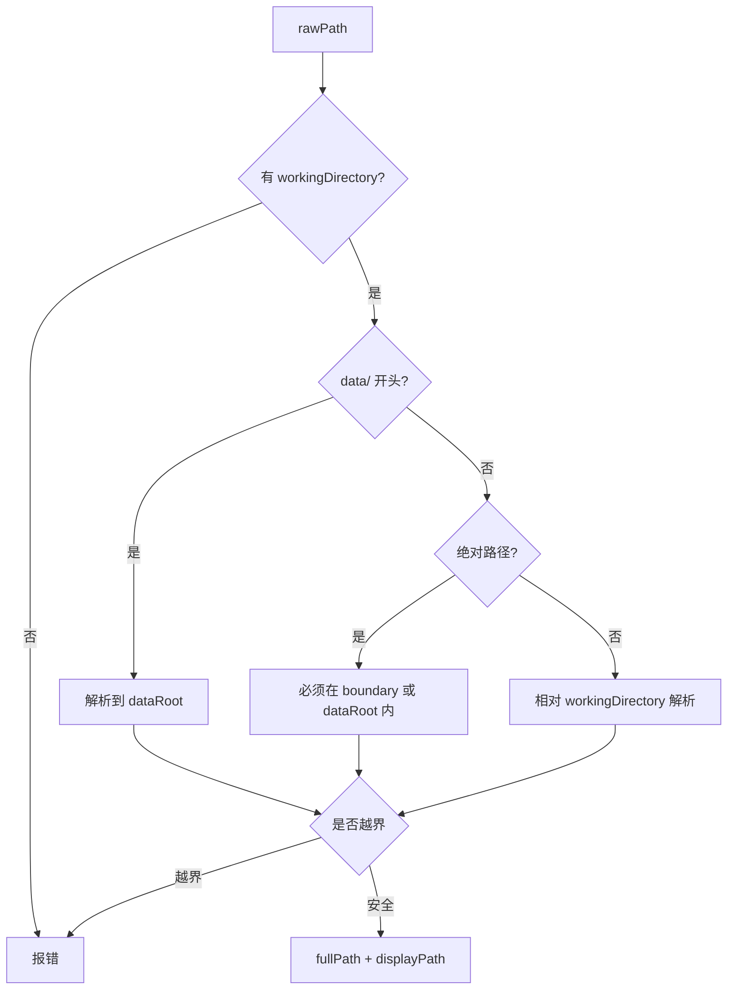
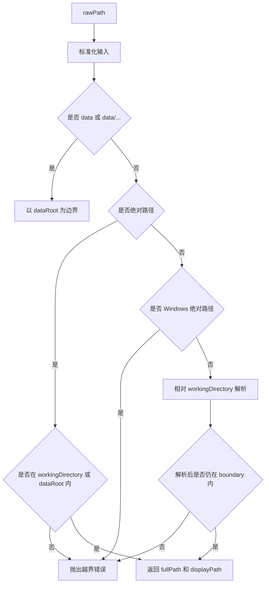

# E44：工具路径先经过词法边界解析，但软链接还需要真实路径检查

小林让 Agent 读取 `../secrets.txt`。如果工具照做，就可能越过旅行项目目录，读到不该读的文件。`resolveToolPath` 会挡住这类路径文本逃逸；但如果工作目录里有一个指向外部的软链接，仅看字符串仍不足以确认真实目标安全。本课要同时讲清已有边界与软链接边界。

本节阅读 [packages/core/src/lib/integrations/pi-agent/tools/path-utils.ts](../../../../packages/core/src/lib/integrations/pi-agent/tools/path-utils.ts)。

## 1. 没有 workingDirectory 就没有路径边界

[packages/core/src/lib/integrations/pi-agent/tools/path-utils.ts 第 54—59 行](../../../../packages/core/src/lib/integrations/pi-agent/tools/path-utils.ts#L54)：

```ts
export function resolveToolPath(rawPath: string): ResolvedToolPath {
  const toolContext = getToolContext();
  const boundary = toolContext.workingDirectory;
  if (!boundary) {
    throw new Error("Tool boundary not configured: workingDirectory must be injected via tool context");
  }
}
```

这段代码把“边界必须存在”写死。工具不应该在没有工作目录的情况下猜路径，因为猜路径就意味着可能读写到错误位置。

## 2. `data/` 是特殊允许的全局数据边界

[packages/core/src/lib/integrations/pi-agent/tools/path-utils.ts 第 65—83 行](../../../../packages/core/src/lib/integrations/pi-agent/tools/path-utils.ts#L65)：

```ts
if (normalizedInput.startsWith("data/")) {
  const relativeToData = normalizedInput.slice("data/".length);
  const fullPath = path.resolve(dataRootAbs, relativeToData);
  if (!isInsidePath(fullPath, dataRootAbs)) {
    throw new Error(`Invalid path: "${rawPath}" escapes data directory boundary`);
  }
  return { fullPath, boundary: dataRootAbs, displayPath: displayPathFor(fullPath, dataRootAbs) };
}
```

普通相对路径相对 `workingDirectory` 解析；`data/...` 相对 `getDataRoot()` 解析。这给运行时数据提供了一个明确入口，同时仍然禁止 `data/../../` 这种越界。

## 3. 绝对路径也必须在允许边界内

[packages/core/src/lib/integrations/pi-agent/tools/path-utils.ts 第 104—123 行](../../../../packages/core/src/lib/integrations/pi-agent/tools/path-utils.ts#L104)：

```ts
if (path.isAbsolute(rawPath)) {
  const fullPath = path.resolve(rawPath);
  if (!isInsidePath(fullPath, boundaryAbs) && !isInsidePath(fullPath, dataRootAbs)) {
    throw new Error(`Invalid path: "${rawPath}" escapes working directory boundary`);
  }
  return {
    fullPath,
    boundary: isInsidePath(fullPath, dataRootAbs) ? dataRootAbs : boundaryAbs,
    displayPath: displayPathFor(fullPath, boundaryAbs),
  };
}

if (isWindowsAbsolutePath(rawPath)) {
  throw new Error(`Invalid path: Windows absolute paths are not accepted by this runtime (${rawPath})`);
}
```

绝对路径不是完全禁止，而是必须位于工作目录或 dataRoot 内。Windows 绝对路径被单独拦截，避免跨平台路径语义被误读。



读这张图时要抓住一个原则：不同输入形式有不同解析规则，但所有分支最终都要过“解析后的字符串路径是否仍在边界内”检查。这里还没有解析文件系统中的软链接。

## 4. displayPath 是给模型看的路径

[packages/core/src/lib/integrations/pi-agent/tools/path-utils.ts 第 33—45 行](../../../../packages/core/src/lib/integrations/pi-agent/tools/path-utils.ts#L33)：

```ts
function displayPathFor(fullPath: string, boundary: string): string {
  const dataRoot = path.resolve(getDataRoot());
  if (isInsidePath(fullPath, dataRoot)) {
    const relative = toPosixPath(path.relative(dataRoot, fullPath));
    return relative ? `data/${relative}` : "data";
  }
  if (isInsidePath(fullPath, boundary)) {
    const relative = toPosixPath(path.relative(boundary, fullPath));
    return relative || ".";
  }
  return toPosixPath(fullPath);
}
```

工具实际执行用 `fullPath`，返回给模型看的是 `displayPath`。这样可以隐藏操作系统路径差异，也能让模型继续使用稳定的相对路径。

## 5. 词法边界不等于真实文件边界

`isInsidePath(child, parent)` 使用 `path.relative` 比较两个已经规范化的路径字符串。它能识别 `../outside.md`、`data/../../x` 和边界外绝对路径，却没有调用 `fs.realpath`：

```text
workingDirectory = /data/projects/trip
/data/projects/trip/link -> /Users/xinao/private
rawPath = link/secret.txt
```

对 `resolveToolPath` 而言，规范化结果仍以 `/data/projects/trip` 为词法父目录，因此可以通过；文件系统真正访问时，软链接会把目标带到 `/Users/xinao/private/secret.txt`。这两种边界必须分开命名：

| 边界 | 检查对象 | 当前实现 |
| --- | --- | --- |
| 词法边界 | 规范化后的路径字符串是否包含逃逸 | `resolveToolPath` 已实现 |
| 真实路径边界 | 解开软链接后的目标是否仍在允许目录 | `resolveToolPath` 未实现，调用工具需另行检查 |

E47 的递归 `list_files` 会对每个目录项调用 `fs.realpath` 并跳过越界项，这是具体工具的额外保护；不能反推所有文件工具都自动具有同样保护。`read_file`、写入/编辑和删除路径若经过边界内软链接，还需要专门测试与修复。因此当前 helper 不能被描述成完整沙箱。

一个更完整的实现通常需要：对已存在目标求 `realpath`；对即将创建的文件求最近存在父目录的 `realpath`；再与真实 boundary 比较；同时考虑检查后到使用前目标被替换的竞态。本节只确认当前安全边界，不把建议中的防护误写成现有实现。

## 6. 失败边界

| 输入 | 结果 |
| --- | --- |
| 缺少 `workingDirectory` | 直接报 `Tool boundary not configured` |
| `../outside.md` | 解析后越界，报错 |
| `data/../../x` | 越过 dataRoot，报错 |
| `C:\Users\...` | Windows 绝对路径被拒绝 |
| `output/plan.md` | 在 workingDirectory 内解析 |
| `link/secret.txt`，其中 `link` 指向边界外 | 词法检查可能通过；需要真实路径检查 |

## 7. 测试证据与缺口

[packages/core/src/lib/integrations/pi-agent/tools/__tests__/working-directory.test.ts 第 1 行](../../../../packages/core/src/lib/integrations/pi-agent/tools/__tests__/working-directory.test.ts#L1) 覆盖工作目录、data 路径、Skill 目录和 Windows 路径。还必须核对边界内软链接指向外部文件、外部目录和不存在目标三类用例；没有这些断言时，不能声称文件工具已经形成真实路径沙箱。UI 是否把拒绝原因转成用户能理解的话术，也需要组件或端到端测试。

## 8. 源码深读：为什么同样是路径，要分四种输入

`resolveToolPath` 没有简单地 `path.resolve(boundary, rawPath)`，因为工具会收到多种路径写法。

第一种是 `"data"` 或 `data/...`。这是显式进入运行时数据根，适合访问 `data/skills`、`data/projects` 等数据产物。第二种是普通相对路径，例如 `output/plan.md`，它应当相对当前工作目录。第三种是绝对路径，它只有在已经位于工作目录或 dataRoot 内时才被允许。第四种是 Windows 绝对路径，它被单独识别并拒绝，避免跨平台运行时把 `C:\...` 当成普通相对字符串。

| 输入 | 解析基准 | 为什么这样处理 |
| --- | --- | --- |
| `output/plan.md` | `workingDirectory` | 当前会话产物路径 |
| `data/skills/x/output.md` | `dataRoot` | 明确访问运行时数据 |
| `/abs/path/in/data/...` | 绝对路径自身 | 允许已经在边界内的绝对路径 |
| `C:\tmp\a.md` | 拒绝 | 避免 Windows 路径语义混乱 |

这个函数还负责把返回路径转换成 `displayPath`。这不是小细节。模型继续调用工具时，如果看到的是 `/Users/.../data/skills/...` 这类绝对路径，跨平台、打包环境和用户隐私都会变差；如果看到 `data/skills/...` 或相对路径，就更稳定。

## 9. 源码链路补强与练习

### 9.1 路径解析不是拼接字符串，而是先排除词法逃逸

`resolveToolPath(rawPath)` 是本单元最值得逐行读的函数之一。它先从 [packages/core/src/lib/integrations/pi-agent/tools/path-utils.ts 第 54 行](../../../../packages/core/src/lib/integrations/pi-agent/tools/path-utils.ts#L54) 读取 tool context 里的 `workingDirectory`。如果没有 `workingDirectory`，它直接抛错：`Tool boundary not configured`。这条错误很重要，因为它拒绝了“没有词法边界也继续执行”的隐式 fallback。

接着它把输入标准化：去掉多余斜杠，把反斜杠转成正斜杠，去掉开头的 `./`。这一步不是为了美观，而是为了让 `./output/a.md`、`output/a.md` 这种等价写法进入同一套判断逻辑。然后函数按四类输入分支处理。

| 分支 | 源码位置 | 判断重点 | 允许原因 |
| --- | --- | --- | --- |
| `data` | [packages/core/src/lib/integrations/pi-agent/tools/path-utils.ts 第 65 行](../../../../packages/core/src/lib/integrations/pi-agent/tools/path-utils.ts#L65) | 指向 dataRoot 本身 | 明确访问运行时数据根 |
| `data/...` | [packages/core/src/lib/integrations/pi-agent/tools/path-utils.ts 第 73 行](../../../../packages/core/src/lib/integrations/pi-agent/tools/path-utils.ts#L73) | `isInsidePath(fullPath, dataRoot)` | 只能进入 dataRoot 内部 |
| skill 运行目录下的 `agents/...` / `skills/...` | [packages/core/src/lib/integrations/pi-agent/tools/path-utils.ts 第 88 行](../../../../packages/core/src/lib/integrations/pi-agent/tools/path-utils.ts#L88) | 当前 boundary 是否是某个 skill runtime directory | 兼容技能产物访问 |
| 绝对路径 | [packages/core/src/lib/integrations/pi-agent/tools/path-utils.ts 第 104 行](../../../../packages/core/src/lib/integrations/pi-agent/tools/path-utils.ts#L104) | 必须位于 workingDirectory 或 dataRoot 内 | 允许已知边界内绝对路径 |
| Windows 绝对路径 | [packages/core/src/lib/integrations/pi-agent/tools/path-utils.ts 第 116 行](../../../../packages/core/src/lib/integrations/pi-agent/tools/path-utils.ts#L116) | 直接拒绝 | 避免跨平台路径语义混乱 |
| 普通相对路径 | [packages/core/src/lib/integrations/pi-agent/tools/path-utils.ts 第 120 行](../../../../packages/core/src/lib/integrations/pi-agent/tools/path-utils.ts#L120) | 解析后仍必须在 boundary 内 | 最常见的会话产物路径 |

核心判断函数是 `isInsidePath(child, parent)`。它不是靠字符串 `startsWith` 简单判断，而是使用 `path.relative(parent, child)`。如果结果为空，说明就是 parent 自身；如果结果不是以 `..` 开头、也不是绝对路径，说明 child 在**规范化路径字符串上**位于 parent 内部。这样可以抵抗 `../`，但不能解析软链接指向。



这张图解释了为什么“相对路径安全”这个说法不准确。`../secrets.txt` 也是相对路径，但解析后会离开 boundary，所以必须拒绝。通过这张图只能证明 `fullPath` 没有发生词法逃逸；若目标路径含软链接，还要继续证明真实文件位置没有逃逸。

`displayPath` 也值得单独讲。工具对文件系统执行时使用 `fullPath`，给模型和用户返回时使用 `displayPath`。如果文件位于 dataRoot 内，返回 `data/...`；如果位于工作目录内，返回相对路径。这样做同时解决三个问题：隐藏本机绝对路径、减少跨平台差异、让后续工具调用更稳定。

测试验收不能只测正常路径，还必须测逃逸路径、绝对路径、Windows 路径和 dataRoot 路径。[packages/core/src/lib/integrations/pi-agent/tools/__tests__/working-directory.test.ts 第 1 行](../../../../packages/core/src/lib/integrations/pi-agent/tools/__tests__/working-directory.test.ts#L1) 应该被当成理解这节的配套材料：它证明路径边界不是写在注释里的规约，而是工具执行前必须通过的运行时检查。

纸面推演：`workingDirectory=/data/skills/trip-planner` 时，`output/plan.md` 和 `data/skills/trip-planner/output/plan.md` 分别怎样解析？合格答案必须指出前者走 workingDirectory，后者走 dataRoot。

口头验收：读者应能解释为什么工具返回 `displayPath`，而不是直接把系统绝对路径交给模型继续使用。

## 10. 本节小结

路径解析的第一步不是“把字符串拼成路径”，而是排除规范化后的词法逃逸。`resolveToolPath` 能拒绝 `../` 和边界外绝对路径，却不解析软链接；具体文件工具仍需承担真实路径检查。下一节开始看读取工具怎样使用这个边界，并继续保留这项限制。
