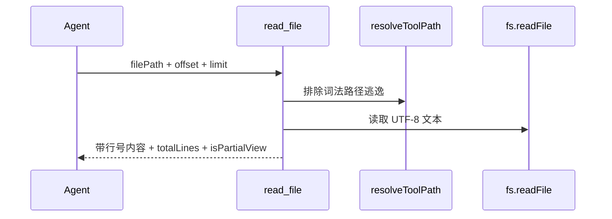
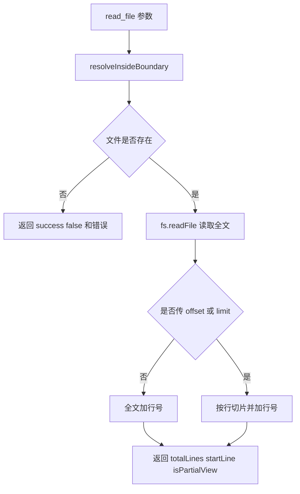

# E45：`read_file` 返回的是受限、带行号的文件视图

小林让 Agent 检查旅行预算文件。Agent 不能直接打开硬盘文件，而是调用 `read_file`。这个工具会先解析路径边界，再读取内容，并把内容加上行号返回。

本节阅读 [packages/core/src/lib/integrations/pi-agent/tools/file-tools.ts](../../../../packages/core/src/lib/integrations/pi-agent/tools/file-tools.ts)。

## 1. 参数要求相对工作目录

[packages/core/src/lib/integrations/pi-agent/tools/file-tools.ts 第 154—164 行](../../../../packages/core/src/lib/integrations/pi-agent/tools/file-tools.ts#L154)：

```ts
const ReadFileParamsSchema = Type.Object({
  filePath: Type.String({ minLength: 1 }),
  offset: Type.Optional(Type.Number()),
  limit: Type.Optional(Type.Number()),
});

const ReadFileTool: ToolRegistration = {
  name: "read_file",
  description: "读取指定文件的内容。支持 offset/limit 参数分段读取大文件。返回带行号的内容。",
};
```

`offset` 和 `limit` 是为了大文件读取。新手容易误以为读文件就是一次把全部内容塞给模型；源码实际支持分页，避免一次返回过多内容。

## 2. 读取前先走路径边界

[packages/core/src/lib/integrations/pi-agent/tools/file-tools.ts 第 175—204 行](../../../../packages/core/src/lib/integrations/pi-agent/tools/file-tools.ts#L175)：

```ts
const { fullPath, boundary: workingDir, displayPath } =
  resolveInsideBoundary(params.filePath);

try {
  await fs.access(fullPath);
} catch {
  throw new Error(`File not found: ${displayPath}`);
}

const rawContent = await fs.readFile(fullPath, "utf-8");
```

路径由 `resolveInsideBoundary` 解析，包含 `../` 或边界外绝对路径的词法逃逸到不了 `fs.readFile`。E44 已说明该 helper 不解析软链接；边界内软链接指向外部文件仍是本工具的真实路径缺口。文件不存在时，工具返回的是基于 `displayPath` 的错误，避免把系统绝对路径作为主要交互语言。

## 3. 行号是为了后续精确编辑

[packages/core/src/lib/integrations/pi-agent/tools/file-tools.ts 第 208—239 行](../../../../packages/core/src/lib/integrations/pi-agent/tools/file-tools.ts#L208)：

```ts
if (params.offset !== undefined || params.limit !== undefined) {
  const offset = Math.max(1, params.offset ?? 1);
  const limit = params.limit ?? 2000;
  const selectedLines = allLines.slice(offset - 1, offset - 1 + limit);
  content = addLineNumbers(selectedLines.join("\n"), offset);
  isPartialView = endIdx < totalLines || startIdx > 0;
} else {
  content = addLineNumbers(rawContent);
}
```

返回行号不是为了好看，而是为了后续 `edit_file` 能定位。小林的预算文件如果第 23 行金额写错，Agent 需要先看到行号，再构造足够明确的替换片段。



图中 `isPartialView` 是新手最容易忽略的信号。看到它为 true 时，说明当前不是完整文件，不能直接对全文件下结论。

## 4. 失败边界

| 失败 | 工具返回 |
| --- | --- |
| 路径越界 | `success:false` 和路径错误 |
| 边界内软链接指向外部文件 | 当前词法检查可能通过；需要 `realpath` 防护 |
| 文件不存在 | `File not found` |
| 读取中被 abort | 抛出取消错误并进入 catch |
| 只读了部分文件 | `isPartialView:true`，提示继续用 offset/limit |

## 5. 测试证据与缺口

[packages/core/src/lib/integrations/pi-agent/tools/__tests__/working-directory.test.ts 第 1 行](../../../../packages/core/src/lib/integrations/pi-agent/tools/__tests__/working-directory.test.ts#L1) 能证明已断言的词法路径和工作目录行为。它不能在缺少相应用例时证明软链接真实目标被限制。文件读取的 UI 展示、父目录诊断日志是否对用户可见，也不在这些测试直接覆盖范围内。

## 6. 源码深读：读取结果不是一段纯文本

`read_file` 返回的 `details` 里包含 `success`、`filePath`、`content`、`totalLines`、`startLine`、`isPartialView`。这些字段共同构成“文件视图契约”。

| 字段 | 用途 | 新手容易犯的错 |
| --- | --- | --- |
| `filePath` | 返回 displayPath | 把它当系统绝对路径继续拼接 |
| `content` | 带行号文本 | 忽略行号导致 edit_file 无法精确定位 |
| `totalLines` | 文件总行数 | 只读部分时误判全文件 |
| `startLine` | 当前视图起始行 | 分页读取时忘记 offset |
| `isPartialView` | 是否局部视图 | 把局部内容当完整内容 |

例如预算文件有 5000 行，第一次读取只返回第 1—200 行。Agent 如果根据这 200 行说“所有预算都正常”，就是错误推理。正确做法是看到 `isPartialView:true` 后继续读取后续范围，或先用搜索工具定位关键词，再读取相关片段。

文件不存在时，工具还会尝试记录父目录内容。这是给开发者排查用的日志，不等于用户界面一定显示这些文件。“内部诊断日志”和“工具返回给模型的结果”属于不同观察面。

## 7. 源码链路补强与练习

### 7.1 `read_file` 的返回结果如何约束后续推理

`read_file` 的执行函数从 [packages/core/src/lib/integrations/pi-agent/tools/file-tools.ts 第 160 行](../../../../packages/core/src/lib/integrations/pi-agent/tools/file-tools.ts#L160) 开始。它拿到 `filePath`、`offset`、`limit` 后，第一件事不是读文件，而是调用 `resolveInsideBoundary(params.filePath)`。这说明文件工具复用 E44 的词法路径边界；它证明规范化字符串没有逃逸，却没有为真实软链接目标提供独立证明。

第二步是检查文件存在。源码在读取失败时会尝试列出父目录中的文件并打印日志，这对开发者排查“路径拼错”很有用。但工具最终返回给模型的是 `{ success:false, error, filePath }`。这里要让新手明白：日志是运行时诊断信息，工具返回是模型可见信息，两者不是一回事。

第三步才是读取内容。读取后会把内容拆成行，并根据 `offset/limit` 截取局部。没有传分页参数时，默认返回全文件带行号内容；传了分页参数时，返回指定范围，同时计算 `isPartialView` 和 `note`。源码中 `offset` 是 1-based，数组切片时再转成 0-based，这也是读者读源码时容易卡住的地方。



这个返回契约会直接影响 Agent 后续行为：

| 返回字段 | 正确用法 | 错误用法 |
| --- | --- | --- |
| `filePath` | 作为用户可读路径或后续工具参数参考 | 当成本机绝对路径 |
| `content` | 结合行号定位文本 | 删除行号后再猜位置 |
| `totalLines` | 判断文件规模 | 忽略大文件后续内容 |
| `startLine` | 确定当前片段从哪里开始 | 把片段误认为从第一行开始 |
| `isPartialView` | 决定是否继续读取 | 只读第一页就下最终结论 |
| `note` | 提醒如何继续分页 | 当成文件正文的一部分 |

小林让 Agent 检查 `预算.csv` 是否有异常。如果预算文件很长，Agent 只读了前 200 行并看到 `isPartialView:true`，它只能说“目前读取范围内未发现异常”，不能说“整个文件没有异常”。这就是工具契约对模型推理的约束：工具给的是证据范围，模型回答不能超出证据范围。

测试方面，`read_file` 至少要覆盖：正常读取带行号、分页返回 `isPartialView`、词法越界、不存在路径，以及边界内软链接指向外部文件。[packages/core/src/lib/integrations/pi-agent/tools/__tests__/tool-execution.test.ts 第 1 行](../../../../packages/core/src/lib/integrations/pi-agent/tools/__tests__/tool-execution.test.ts#L1) 可以验证工具执行形态，[packages/core/src/lib/integrations/pi-agent/tools/__tests__/working-directory.test.ts 第 1 行](../../../../packages/core/src/lib/integrations/pi-agent/tools/__tests__/working-directory.test.ts#L1) 则验证路径上下文。只有实际加入并通过软链接用例，才能证明读取没有跨过真实文件边界。

### 7.2 读文件后的正确工作习惯

`read_file` 的行号不是给人看的装饰，而是给下一步编辑建立锚点。一个成熟 Agent 读完文件后，通常要做三件事。

第一，确认证据范围。如果 `isPartialView:false`，可以认为当前返回覆盖了全文件；如果 `isPartialView:true`，只能对当前范围负责。比如读到第 1—200 行，不能判断第 201—5000 行没有预算异常。

第二，确认目标文本是否唯一。如果后续要用 `edit_file`，不能只说“改第 35 行”，因为 `edit_file` 的参数不是行号，而是 `oldString/newString`。行号帮助模型回到文件里找到上下文，真正传给 `edit_file` 的应是一段唯一文本。

第三，确认文件类型。`read_file` 只是按 UTF-8 文本读取。对 Excel、Word、CSV 这类结构化材料，优先用文档工具。否则模型可能看到一堆不可读字符，误以为文件损坏，实际上是工具选错了。

| 读完后的判断 | 后续动作 |
| --- | --- |
| 文件很短且完整返回 | 可以基于全文总结 |
| 文件很长且局部返回 | 继续分页或缩小读取范围 |
| 要修改某段内容 | 提取唯一上下文后用 `edit_file` |
| 是表格或 Word 文档 | 改用 `read_spreadsheet` / `read_document` |

把这个流程放回小林案例：她让 Agent “把预算表里的交通费汇总一下”。如果文件是 `budget.md`，`read_file` 可以读；如果是 `budget.xlsx`，直接 `read_file` 就不是好策略。Agent 应先识别材料类型，选择文档工具，然后基于分页结果逐步总结。这就是工具选择能力，而不是单个工具能力。

### 7.3 按源码顺序复述 `read_file`

读者可以用下面这条顺序检查自己是否真正读懂源码：

1. 创建工具上下文，用于日志、取消信号和进度更新。
2. 调用 `resolveInsideBoundary`，把用户输入路径变成 `fullPath` 和 `displayPath`。
3. 用 `fs.access` 确认文件存在；不存在时记录父目录诊断信息。
4. 用 `fs.readFile(fullPath, "utf-8")` 读取原始文本。
5. 根据 `offset/limit` 决定全文返回还是局部返回。
6. 调用 `addLineNumbers` 给返回内容加行号。
7. 组装 `success/filePath/content/totalLines/startLine/isPartialView`。
8. 出错时返回 `success:false/error/filePath`。

如果读者能复述这八步，就不会把 `read_file` 理解成“Node 的 readFile 包装”。它实际还包含边界、安全、分页、行号、错误返回和后续编辑准备。

纸面推演：预算文件 5000 行，第一次只读 `offset=1, limit=200`，能否判断文件后面没有异常？不能，因为 `isPartialView` 表示只读了局部。

口头验收：读者应能解释 `read_file` 为什么要返回行号、`totalLines` 和 `isPartialView`。

## 8. 本节小结

`read_file` 提供分页、行号和词法路径限制下的文件视图，不是无限制硬盘读取；当前仍需补真实路径防护，才能把软链接也纳入完整边界。下一节看写入和编辑为什么风险更高。
