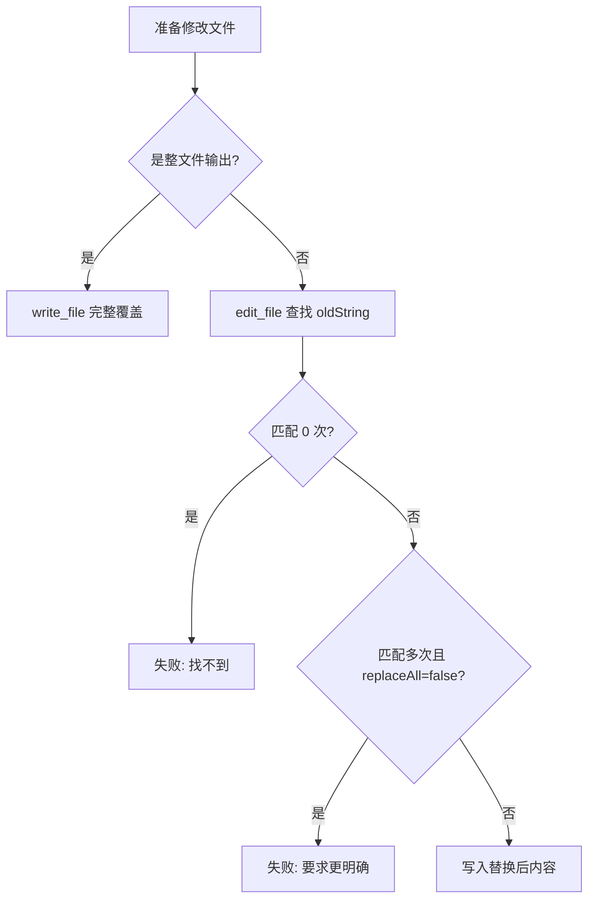
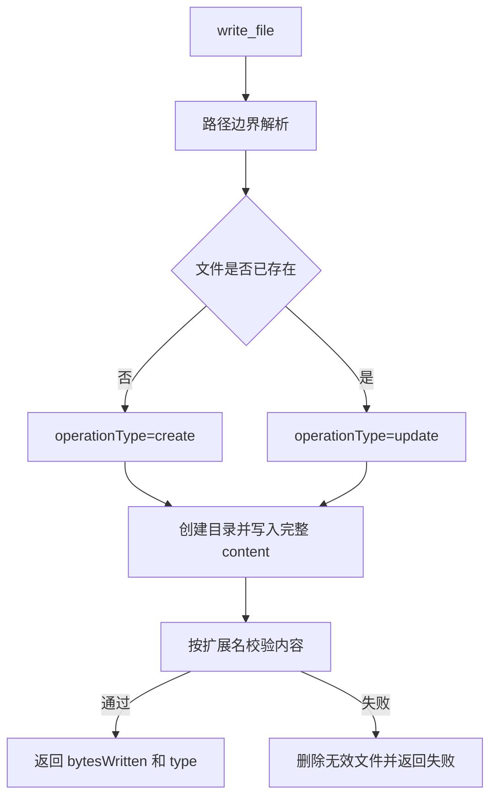

# E46：写入和编辑工具要防止模糊修改

小林让 Agent 修改预算摘要。写文件和改文件都是副作用操作，比读取更危险。源码里用两种策略降低风险：`write_file` 明确是完整覆盖；`edit_file` 要求被替换内容足够唯一。

本节阅读 [packages/core/src/lib/integrations/pi-agent/tools/file-tools.ts](../../../../packages/core/src/lib/integrations/pi-agent/tools/file-tools.ts)。

## 1. write_file 是完整覆盖

[packages/core/src/lib/integrations/pi-agent/tools/file-tools.ts 第 271—314 行](../../../../packages/core/src/lib/integrations/pi-agent/tools/file-tools.ts#L271)：

```ts
const WriteFileParamsSchema = Type.Object({
  filePath: Type.String({ minLength: 1 }),
  content: Type.String({ description: "要写入的完整内容。注意：会完整覆盖原文件" }),
});

const { fullPath, displayPath } = resolveInsideBoundary(params.filePath);
let operationType: "create" | "update" = "create";
try {
  await fs.access(fullPath);
  operationType = "update";
} catch {}

await ensureDir(dirPath);
await fs.writeFile(fullPath, params.content, "utf-8");
```

这里没有“追加模式”。如果目标文件已存在，工具会更新整个文件。让 Agent 写文件前，应确认它拿到了完整的新内容，而不是只给了一个片段。

## 2. 写入后会做格式校验

[packages/core/src/lib/integrations/pi-agent/tools/file-tools.ts 第 318—329 行](../../../../packages/core/src/lib/integrations/pi-agent/tools/file-tools.ts#L318)：

```ts
const validationResult = validateFileContent(params.filePath, params.content);
if (!validationResult.valid) {
  try {
    await fs.unlink(fullPath);
  } catch {}
  throw new Error(`文件写入后校验失败: ${validationResult.error}`);
}
```

如果写入内容不符合某些文件格式校验，工具会删除刚写入的无效文件。这是强副作用边界：它保护数据质量，但失败后目标文件可能不存在。

## 3. edit_file 要求唯一匹配

[packages/core/src/lib/integrations/pi-agent/tools/file-tools.ts 第 421—440 行](../../../../packages/core/src/lib/integrations/pi-agent/tools/file-tools.ts#L421)：

```ts
if (!originalContent.includes(params.oldString)) {
  throw new Error(`String to replace not found in file.`);
}

const matches = originalContent.split(params.oldString).length - 1;
if (matches > 1 && !params.replaceAll) {
  throw new Error(
    `Found ${matches} matches of the string to replace, but replaceAll is false.`
  );
}
```

如果预算摘要里有三处“住宿费”，Agent 不能只说“把住宿费改成酒店费”，除非明确 `replaceAll=true`，否则必须提供更长上下文，定位唯一一处。



这张图说明：安全编辑不是“能改就改”，而是先证明目标唯一。

## 4. 失败边界

| 场景 | 正确理解 |
| --- | --- |
| `oldString === newString` | 直接失败，因为没有实际变化 |
| `oldString` 找不到 | 失败，不会猜测近似文本 |
| 匹配多处 | 默认失败，除非明确 `replaceAll` |
| 写入后格式校验失败 | 写入结果可能被删除 |

## 5. 测试证据与缺口

现有工具测试主要覆盖路径和注册，`edit_file` 的多匹配、无匹配、格式校验等还需要更直接的单元测试。本文按源码说明行为，不声称所有编辑边界都有自动化测试证明。

## 6. 源码深读：为什么写入比读取更需要“意图明确”

读取工具失败，通常只是没有拿到信息；写入和编辑失败，可能已经产生或试图产生副作用。因此源码把操作结果拆得更细。

`write_file` 会返回 `type: "create" | "update"`。这能让 Agent 知道本次操作是创建了新文件，还是覆盖了旧文件。小林让 Agent 生成 `trip-plan.md` 时，如果返回 `update`，说明之前已有同名文件被覆盖，后续回答就应该提醒“已更新原文件”，而不是说“新建了文件”。

`edit_file` 则返回 `replacementCount`、`originalLength`、`newLength`。这三个字段帮助模型判断修改是否符合预期。比如只想修改一处预算金额，却返回 `replacementCount: 5`，就说明可能改多了；如果 `newLength` 极端变小，说明替换片段可能过大。

| 工具 | 适合场景 | 不适合场景 |
| --- | --- | --- |
| `write_file` | 生成完整报告、导出完整计划 | 只改文件中一行小内容 |
| `edit_file` | 精确替换一个已知片段 | 旧文本不唯一或模型没读过文件 |

高质量 Agent 不应在没读文件的情况下直接 `edit_file`。正确顺序通常是：先 `read_file`，确认目标文本和上下文，再 `edit_file`。这也是为什么 E45 强调行号和局部视图。

## 7. 源码链路补强与练习

### 7.1 写入工具为什么要先区分“创建”和“覆盖”

`write_file` 从 [packages/core/src/lib/integrations/pi-agent/tools/file-tools.ts 第 276 行](../../../../packages/core/src/lib/integrations/pi-agent/tools/file-tools.ts#L276) 开始执行。它的参数只有两个：`filePath` 和 `content`。这看起来比 `read_file` 更简单，但风险更高，因为写入会改变磁盘状态。源码先排除词法路径逃逸，再用 `fs.access(fullPath)` 判断文件是否已存在，从而得到 `operationType: "create" | "update"`。这条路径同样没有独立解析软链接；若父目录或目标是指向边界外的链接，真实写入位置仍需额外防护。

这个 `operationType` 不是无关紧要的返回字段。小林让 Agent 生成 `output/trip-plan.md` 时，如果文件不存在，返回 `create` 表示新建；如果文件已存在，返回 `update` 表示旧内容被完整覆盖。模型后续向用户说明结果时必须区分这两者，否则用户会误以为没有覆盖历史版本。

写入完成后，源码会调用 `validateFileContent`。这个函数根据扩展名做基础格式校验：JSON 必须能 `JSON.parse`；Markdown 的代码块数量必须成对；YAML 不能混用 tab 和空格；JS/TS 大括号数量要粗略匹配。如果校验失败，`write_file` 会尝试删除刚写入的无效文件，再抛出错误。这不是完美的编译检查，但它能拦住一批明显脏数据。



相比之下，`edit_file` 从 [packages/core/src/lib/integrations/pi-agent/tools/file-tools.ts 第 379 行](../../../../packages/core/src/lib/integrations/pi-agent/tools/file-tools.ts#L379) 开始，风险重点不是“覆盖整个文件”，而是“是否改到了正确位置”。它要求 `oldString` 必须存在；如果匹配多处且 `replaceAll` 不是 true，就直接失败。这条规则保护的是“单点修改”的语义：只想改一处时，工具不能默默改第一处，也不能凭模型猜哪一处才是目标。

| 工具 | 修改粒度 | 源码保护点 | 读者应形成的习惯 |
| --- | --- | --- | --- |
| `write_file` | 整个文件 | create/update、格式校验、bytesWritten | 生成完整新版本时使用 |
| `edit_file` | 局部文本 | oldString 必须唯一或显式 replaceAll | 修改前先读取上下文 |

一个具体错误例子：小林的攻略中有两处“预算待确认”，分别指酒店和交通。Agent 没有先读取上下文，直接 `edit_file({ oldString:'预算待确认', newString:'预算 800 元' })`。源码会发现两处匹配并拒绝。这不是工具“不聪明”，而是工具不应该替模型做含糊决定。正确流程是先 `read_file` 找到酒店那一段，把更长的上下文作为 `oldString`，再做唯一替换。

测试验收需要关注副作用：写入成功后文件内容是否真的存在，格式无效时是否返回失败，`edit_file` 多匹配时是否拒绝，`replaceAll:true` 时是否按预期替换多处。[packages/core/src/lib/integrations/pi-agent/tools/__tests__/tool-execution.test.ts 第 1 行](../../../../packages/core/src/lib/integrations/pi-agent/tools/__tests__/tool-execution.test.ts#L1) 适合验证工具执行结果；但如果要证明“不会误改用户文件”，还应补更细的文件内容前后对比测试。

### 7.2 修改文件前要先回答的三个问题

对零基础读者来说，最重要的不是背 `write_file` 和 `edit_file` 的参数，而是形成修改前的判断习惯。

第一，是否需要保留旧内容？如果答案是否定的，例如“生成一份新的旅行总计划”，`write_file` 更直接；如果答案是肯定的，例如“把酒店预算从 800 改成 900”，就应该先读文件，再用 `edit_file` 做局部替换。

第二，目标文本是否唯一？`edit_file` 的保护逻辑只认识字符串，不认识“我心里想改哪一处”。如果 `oldString` 在文件里出现多次，工具会拒绝。此时正确做法不是打开 `replaceAll` 碰运气，而是把更长的上下文放进 `oldString`，让目标唯一。

第三，修改后的文件是否仍然有效？源码的格式校验只是基础保护。JSON 能解析，不代表字段语义正确；Markdown 代码块闭合，不代表链接都有效；TS 大括号数量匹配，不代表能通过类型检查。所以写入后还应结合后续测试或检查命令。

| 修改目标 | 推荐策略 | 原因 |
| --- | --- | --- |
| 新生成完整报告 | `write_file` | 输出整体由 Agent 生成 |
| 更新报告中的一段 | `read_file` → `edit_file` | 保留其他内容 |
| 多处统一替换 | 明确 `replaceAll:true` | 让副作用可预期 |
| 改 JSON/TS/Markdown | 写后校验 + 必要测试 | 基础格式通过不等于业务正确 |

小林说“把所有待确认都改成已确认”时，可以考虑 `replaceAll:true`；但如果她说“把酒店那一项待确认改掉”，不能全局替换。这个区别来自用户意图，不是工具自动能理解的。工具的责任是发现模糊并拒绝，Agent 的责任是读懂意图并提供足够上下文。

### 7.3 修改类工具的验收问题

检查写入和编辑工具时，应问五个问题：

| 验收问题 | 通过标准 |
| --- | --- |
| 是否先过词法路径边界 | 拒绝 `../` 和边界外绝对路径；不能单独证明软链接真实目标在边界内 |
| 是否区分创建和覆盖 | 返回 `create/update` |
| 是否校验写入内容 | JSON/Markdown/YAML/TS 有基础校验 |
| 是否拒绝模糊替换 | 多匹配且未 `replaceAll` 时失败 |
| 是否返回可解释结果 | 有 `bytesWritten` 或 `replacementCount` |

这五个问题能帮助读者从“能写文件”升级到“可控地修改文件”。小林的旅行计划是用户资产，不是临时字符串。任何覆盖、删除或批量替换，都要能解释修改范围和修改结果。

纸面推演：文件里有两处完全相同的“预算待确认”，调用 `edit_file` 且不传 `replaceAll` 会怎样？会失败并要求提供更多上下文或明确全量替换。

口头验收：读者应能解释 `write_file` 与 `edit_file` 的根本区别：前者整文件覆盖，后者基于唯一文本片段做局部替换。

## 8. 本节小结

文件修改工具的核心是“可证明地修改正确目标”。下一节看列目录和删除如何处理递归、软链接和不可逆副作用。
