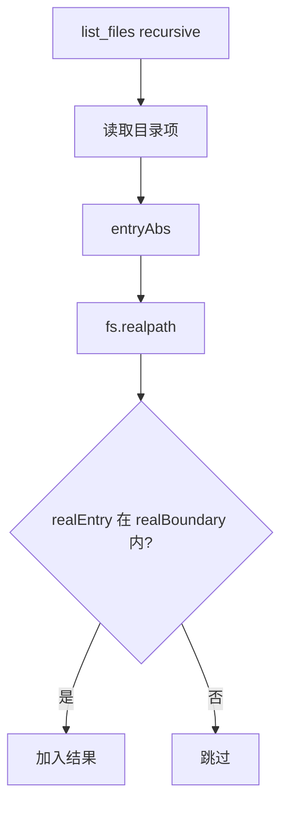
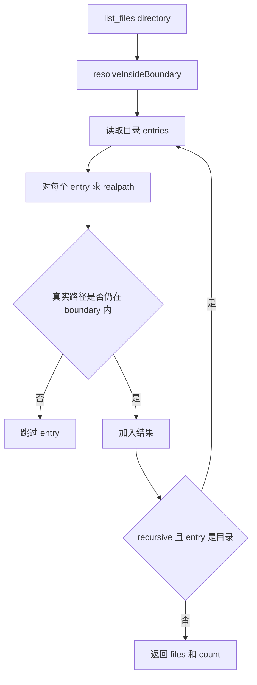

# E47：列目录和删除文件必须处理递归与软链接边界

小林让 Agent “看看输出目录里有哪些文件”，这是 `list_files` 的任务。她又要求“删掉临时草稿”，这会用到 `delete_file`。一个是观察，一个是破坏性副作用；两者都必须在路径边界内执行。

本节阅读 [packages/core/src/lib/integrations/pi-agent/tools/file-tools.ts](../../../../packages/core/src/lib/integrations/pi-agent/tools/file-tools.ts)。

## 1. list_files 先解析目录边界

[packages/core/src/lib/integrations/pi-agent/tools/file-tools.ts 第 522—548 行](../../../../packages/core/src/lib/integrations/pi-agent/tools/file-tools.ts#L522)：

```ts
const ListFilesParamsSchema = Type.Object({
  directory: Type.Optional(Type.String({ default: "." })),
  recursive: Type.Optional(Type.Boolean()),
});

const dirPath = params.directory || ".";
const { fullPath, boundary, displayPath } = resolveInsideBoundary(dirPath);
await fs.access(fullPath);
```

默认目录是 `"."`，也就是当前工具工作目录。调试“为什么看不到文件”时，首先要问：当前工具上下文的 `workingDirectory` 到底是什么？

## 2. 递归时要检查 symlink 越界

[packages/core/src/lib/integrations/pi-agent/tools/file-tools.ts 第 554—575 行](../../../../packages/core/src/lib/integrations/pi-agent/tools/file-tools.ts#L554)：

```ts
let realBoundary: string;
try {
  realBoundary = await fs.realpath(boundary);
} catch {
  realBoundary = boundary;
}

const realEntry = await fs.realpath(entryAbs);
if (realEntry !== realBoundary && !realEntry.startsWith(realBoundary + path.sep)) {
  continue;
}
```

如果目录里有一个软链接指向边界外，普通字符串路径看起来可能还在目录里，但真实路径已经越界。源码用 `realpath` 检查每个 entry，越界就跳过。



这张图说明递归列目录不是把每个目录项盲目返回。每个 entry 都会先解析真实位置，越界项不会进入结果或继续递归。不过，`fs.readdir(fullPath)` 发生在逐项检查之前；如果最初传入的 `fullPath` 本身经过边界内软链接指向外部目录，代码仍可能先打开该目录，再过滤其条目。这是“没有把名称返回给模型”与“从未访问外部目录”的区别。

## 3. delete_file 会递归删除目录

[packages/core/src/lib/integrations/pi-agent/tools/file-tools.ts 第 627—664 行](../../../../packages/core/src/lib/integrations/pi-agent/tools/file-tools.ts#L627)：

```ts
const { fullPath, displayPath } = resolveInsideBoundary(params.filePath);
await fs.access(fullPath);
const stats = await fs.stat(fullPath);

if (stats.isDirectory()) {
  await fs.rm(fullPath, { recursive: true });
} else {
  await fs.unlink(fullPath);
}
```

删除工具比读取和列目录更危险。它受 `resolveInsideBoundary` 的词法限制，但没有像递归列表那样对目标执行 `realpath` 边界比较；路径中若经过边界内软链接，真实目标仍需额外防护。目录删除还是递归的，而且没有回收站。调用成功意味着目标内容可能已不可恢复，因此执行前必须明确目标、范围与恢复方案。

## 4. 失败边界

| 场景 | 行为 |
| --- | --- |
| 列不存在目录 | 返回 `success:false` |
| 递归遇到坏 symlink | 跳过该 entry |
| symlink 指向边界外 | 跳过，防止越界泄露 |
| 删除目录 | `fs.rm(... recursive:true)`，不可逆 |
| 删除路径发生 `../` 等词法越界 | 在解析阶段失败 |
| 删除路径经过边界内软链接 | 当前缺少真实目标边界证明 |

## 5. 测试证据与缺口

[packages/core/src/lib/integrations/pi-agent/tools/__tests__/working-directory.test.ts](../../../../packages/core/src/lib/integrations/pi-agent/tools/__tests__/working-directory.test.ts) 覆盖路径边界；但删除工具的人工确认、UI 风险提示、回收机制并不由这段源码提供，后续如果要产品化应补端到端和交互测试。

## 6. 源码深读：观察型工具和破坏型工具要分开验收

`list_files` 和 `delete_file` 都使用 `resolveInsideBoundary`，但风险完全不同。

`list_files` 的风险是信息泄露。即使它不修改文件，如果递归展开了指向外部目录的软链接，也可能把工作目录外的文件名暴露给模型。因此源码在递归时对每个 entry 做 `realpath` 检查。这个检查不是性能优化，而是信息边界保护。

`delete_file` 的风险是不可逆副作用。源码能保证目标路径在规范化字符串上位于边界内，却没有证明解开软链接后的目标仍在边界内；它也没有二次确认或回收站。产品层如果允许普通用户通过 Agent 删除目录，应补真实路径防护、确认、撤销或版本机制。已有词法检查不等于删除体验已经安全完整。

| 工具 | 核心风险 | 源码保护 |
| --- | --- | --- |
| `list_files` | 泄露边界外目录结构 | `realpath` 跳过越界 symlink |
| `delete_file` | 不可逆删除、软链接真实目标越界 | 现有词法限制；真实路径防护仍需补齐 |

小林要求“清理临时文件”时，Agent 应先 `list_files` 看清目标，再删除明确文件。直接删除整个目录，虽然工具可能允许，但不是安全的交互习惯。

## 7. 源码链路补强与练习

### 7.1 列目录是观察，删除是副作用，不能用同一套标准看待

`list_files` 的执行从 [packages/core/src/lib/integrations/pi-agent/tools/file-tools.ts 第 527 行](../../../../packages/core/src/lib/integrations/pi-agent/tools/file-tools.ts#L527) 开始。它先把 `directory` 默认为 `"."`，再进入 `resolveInsideBoundary`。也就是说，即使只是列出当前目录，也必须先知道“当前目录”属于哪个工具上下文。没有上下文的目录扫描不是中性操作，因为它可能泄露运行进程所在机器的文件结构。

递归扫描时，源码有一个关键动作：先拿到 `realBoundary`，然后对每个 entry 做 `fs.realpath(entryAbs)`。如果真实路径不在 boundary 内，就跳过。这个逻辑专门处理软链接。没有它时，`output/external-link` 表面上位于工作目录内部，但它可能指向用户桌面、系统目录或另一个项目目录。递归 list 如果跟进去，就会把边界外文件名暴露给模型。



这张图说明：`list_files` 的安全目标不是“不报错”，而是“即使遇到软链接，也不让模型看到不该看的东西”。所以它遇到损坏 symlink 或权限不足时会跳过，而不是强行读取。

`delete_file` 从 [packages/core/src/lib/integrations/pi-agent/tools/file-tools.ts 第 631 行](../../../../packages/core/src/lib/integrations/pi-agent/tools/file-tools.ts#L631) 开始。它先过词法路径边界，再判断目标是文件还是目录。文件走 `fs.unlink`，目录走 `fs.rm(fullPath, { recursive: true })`。这说明源码层面允许递归删除目录。当前检查只证明路径字符串没有显式逃逸，既不证明软链接真实目标安全，也不证明删除动作符合用户意图。

| 操作 | 是否改变磁盘 | 主要风险 | 合格交互策略 |
| --- | --- | --- | --- |
| `list_files` | 否 | 信息泄露、软链接越界 | 允许作为删除前观察步骤 |
| `delete_file` | 是 | 不可逆删除、删错目录 | 删除前确认目标，优先删明确文件 |

小林说“帮我清理旅行计划里的临时文件”。合格 Agent 不应立刻删除 `output/` 整个目录，而应先 `list_files({ directory:'output' })`，把候选文件列出来，再删除名称明确、范围明确的临时文件。如果用户表达的是“清理所有临时文件”，交互层还应有确认机制。源码目前提供的是工具边界，不是完整产品级撤销系统。

测试方面，除了正常列目录和删除文件，还必须看软链接越界、递归目录、目标不存在、目录删除这些情况。[packages/core/src/lib/integrations/pi-agent/tools/__tests__/working-directory.test.ts 第 1 行](../../../../packages/core/src/lib/integrations/pi-agent/tools/__tests__/working-directory.test.ts#L1) 是边界测试的重点；如果后续产品允许普通用户触发删除，还应增加确认流程或回收站相关测试。

### 7.2 删除前为什么必须先观察

`delete_file` 在源码层面能做的事情有限：确认路径没有词法逃逸、确认目标存在、判断文件或目录、执行删除。它不能知道软链接真实目标是否越界，也不能知道用户是否后悔或这个文件是不是唯一副本。因此产品实现需要补真实路径限制，Agent 的使用流程还要补“删除前观察”。

一个合理流程通常是：

1. 用 `list_files` 查看目录。
2. 把候选目标缩小到明确文件。
3. 如果是目录，说明会递归删除。
4. 对不确定目标向用户确认。
5. 删除后返回被删除的 `displayPath` 和类型。

这个流程不是繁琐，而是对不可逆副作用的基本尊重。小林说“删除临时文件”时，`output/draft.md` 和 `output/final-plan.md` 的风险完全不同。前者可能是草稿，后者可能是最终成果。Agent 不能因为两个文件都在工作目录内，就把它们当成同等可删。

| 用户话术 | 是否足够明确 | Agent 应做什么 |
| --- | --- | --- |
| “删掉 output/tmp.md” | 明确 | 可删除，返回结果 |
| “清理临时文件” | 不够明确 | 先列目录并筛候选 |
| “删掉 output 目录” | 高风险 | 明确提示会递归删除 |
| “把没用的都删了” | 极不明确 | 必须追问或给候选清单 |

这一节也要让读者意识到：安全不是只有“越界访问”一种。`delete_file('output')` 可能完全在边界内，但仍然是高风险操作。边界检查解决的是“能不能碰这个范围”；交互确认解决的是“该不该做这个动作”。二者缺一不可。

### 7.3 递归和软链接为什么必须一起讲

只讲递归，不讲软链接，会让读者误以为“只要从工作目录开始扫就安全”。但文件系统不是树那么简单，软链接会让目录树出现跳转。`output/link` 这个路径看起来在 `output` 里面，真实目标却可能在工作目录外。源码用 `realpath` 检查真实路径，就是为了处理这个跳转。

| 表面路径 | 真实路径 | 是否应返回 |
| --- | --- | --- |
| `output/draft.md` | 工作目录内 | 应返回 |
| `output/assets/logo.png` | 工作目录内 | 应返回 |
| `output/link-to-desktop` | 工作目录外 | 递归时应跳过 |
| `output/broken-link` | 无法解析 | 应跳过或失败，不应展开 |

删除工具没有同样的逐项 `realpath` 逻辑，它直接对目标执行文件系统删除。因此删除前更需要通过观察工具缩小范围，而生产实现仍应补目标真实路径校验。读者要把两个动作配套理解：`list_files` 帮助看清目标，`delete_file` 才执行副作用；前者不能替后者消除底层软链接风险。

### 7.4 本节最低验收标准

学完本节，读者至少要能回答：

1. 为什么 `list_files` 不修改文件也需要边界？
2. 为什么递归目录时要用 `realpath`？
3. 为什么 `delete_file` 删除目录比删除文件风险更高？
4. 为什么路径在边界内不等于可以直接删？
5. 产品层为什么可能还需要确认、撤销或版本机制？

如果这些问题答不出来，就还没有真正理解文件工具的安全边界。

纸面推演：`output/link` 是一个指向项目外部目录的软链接，`list_files({ directory:'output', recursive:true })` 是否应展开它？不应展开，因为 `realpath` 后会发现越界。

口头验收：读者应能解释为什么“列目录”也需要安全边界，而不是只有“删除文件”才需要。

## 8. 本节小结

列目录保护信息边界，删除文件保护副作用边界。下一节进入更危险的工具：命令执行。
