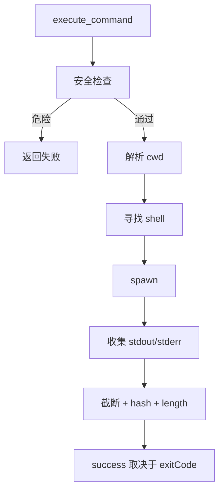
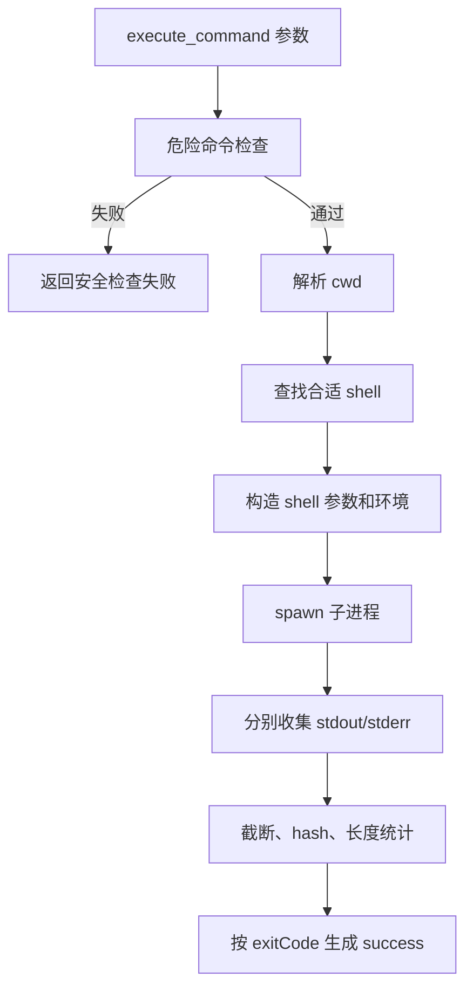

# E48：命令执行工具由 shell、安全检查和输出边界共同组成

小林让 Agent “运行命令检查生成的 Markdown 是否存在”。命令执行看起来只是 `spawn`，但源码里至少有四层关键逻辑：选 shell、解析工作目录、拦截危险命令、截断输出。

本节阅读 [packages/core/src/lib/integrations/pi-agent/tools/bash-tools.ts](../../../../packages/core/src/lib/integrations/pi-agent/tools/bash-tools.ts)。

## 1. shell 不是硬编码 `/bin/sh`

[packages/core/src/lib/integrations/pi-agent/tools/bash-tools.ts 第 27—39 行](../../../../packages/core/src/lib/integrations/pi-agent/tools/bash-tools.ts#L27)：

```ts
const SUPPORTED_SHELL_NAMES = new Set(["bash", "zsh", "sh"]);

const DEFAULT_SHELL_PATHS = [
  "/bin/bash",
  "/bin/zsh",
  "/usr/bin/bash",
  "/usr/bin/zsh",
  "/usr/local/bin/bash",
  "/usr/local/bin/zsh",
  "/opt/homebrew/bin/bash",
  "/opt/homebrew/bin/zsh",
  "/bin/sh",
];
```

源码会寻找可用 shell，而不是假设所有环境都有同一个路径。Windows 还会优先 PowerShell/cmd，避免 Git Bash 改写路径。这对跨平台桌面应用很关键。

## 2. 工作目录优先来自 tool context

[packages/core/src/lib/integrations/pi-agent/tools/bash-tools.ts 第 279—299 行](../../../../packages/core/src/lib/integrations/pi-agent/tools/bash-tools.ts#L279)：

```ts
async function resolveWorkingDirectory(paramsWorkingDirectory?: string): Promise<string> {
  const effectiveDir = getToolContext().workingDirectory;
  if (effectiveDir) {
    return effectiveDir;
  }

  if (paramsWorkingDirectory) {
    if (pathWin32.isAbsolute(paramsWorkingDirectory) || paramsWorkingDirectory.startsWith("/")) {
      return paramsWorkingDirectory;
    }
    return `${getDataRoot()}/${paramsWorkingDirectory}`;
  }

  return getDataRoot();
}
```

这里和文件工具略有不同：命令工具在没有 context 时会退到参数或 dataRoot。更重要的是，参数若是 Unix 或 Windows 绝对路径，会被原样接受；函数没有验证该目录是否位于 dataRoot。因而 `resolveWorkingDirectory` 是优先级选择器，不是路径沙箱。

| 输入状态 | 最终 cwd | 安全含义 |
| --- | --- | --- |
| tool context 有 `workingDirectory` | 固定使用 context 值 | 模型参数不能覆盖会话注入目录 |
| context 缺失，参数是相对路径 | 拼到 dataRoot | 有明确数据根，但仍应规范化检查 |
| context 缺失，参数是绝对路径 | 原样使用 | 当前没有 dataRoot 边界限制 |
| 两者都缺失 | dataRoot | 使用可写运行时数据根 |

正常生产会话应由 agent-manager 注入 tool context，降低模型控制 cwd 的机会；但测试和其他调用方仍可能走 fallback。教材不能把“多数主链有 context”写成“任意调用都不能离开工作目录”。

## 3. 危险命令会被拦截

[packages/core/src/lib/integrations/pi-agent/tools/bash-tools.ts 第 481—524 行](../../../../packages/core/src/lib/integrations/pi-agent/tools/bash-tools.ts#L481)：

```ts
const DANGEROUS_COMMANDS = [
  "rm -rf /",
  "mkfs",
  "dd if=",
  ":(){:|:&};:",
  "chmod -R 777 /",
];

function isCommandSafe(command: string): { safe: boolean; reason?: string } {
  for (const dangerous of DANGEROUS_COMMANDS) {
    if (command.includes(dangerous)) {
      return { safe: false, reason: `命令包含危险操作: ${dangerous}` };
    }
  }
  return { safe: true };
}
```

这是黑名单式保护，不是完整安全沙箱。它能挡住显眼危险命令，但不能证明任意命令都安全。

## 4. 输出会被截断、哈希和记录长度

[packages/core/src/lib/integrations/pi-agent/tools/bash-tools.ts 第 642—660 行](../../../../packages/core/src/lib/integrations/pi-agent/tools/bash-tools.ts#L642)：

```ts
const result = {
  success: exitCode === 0,
  exitCode,
  stdout: stdout.text.trim(),
  stdoutLength: stdout.originalLength,
  stdoutHash: stdout.hash,
  stdoutTruncated: stdout.truncated,
  stderr: stderr.text.trim(),
  stderrLength: stderr.originalLength,
  stderrHash: stderr.hash,
  stderrTruncated: stderr.truncated,
  workingDirectory: cwd,
  shell: shellPath,
};
```

大输出不会无限塞回模型，而是保留头尾并给出长度、哈希和截断标记。读者看到 `stdoutTruncated:true` 时，不能假设输出完整。



这张图强调：命令工具不是单纯执行字符串，而是一条带保护和观测信息的执行链。

## 5. 失败边界

| 场景 | 返回 |
| --- | --- |
| 命令命中危险模式 | `success:false`，安全检查失败 |
| 找不到 shell | `success:false` |
| 命令超时 | `success:false`，`error:"命令执行超时"` |
| exitCode 非 0 | `success:false`，带 stdout/stderr |
| 输出太大 | 返回截断结果和 hash |
| context 缺失且传入边界外绝对 cwd | 当前可能执行；需要调用入口或工具层额外限制 |

## 6. 测试证据与缺口

[packages/core/src/lib/integrations/pi-agent/tools/__tests__/bash-tools-shell.test.ts](../../../../packages/core/src/lib/integrations/pi-agent/tools/__tests__/bash-tools-shell.test.ts) 覆盖 shell 选择、Windows 分支和相关 helper。命令实际安全性无法只靠黑名单测试证明；对破坏性命令仍应在产品层和权限层继续加保护。

## 7. 源码深读：命令结果要从四个字段一起看

命令执行结束后，不能只看 stdout。至少要同时看 `success`、`exitCode`、`stdout`、`stderr`。

| 字段 | 含义 | 判断误区 |
| --- | --- | --- |
| `success` | 源码按 `exitCode === 0` 计算 | stdout 有内容不代表成功 |
| `exitCode` | 子进程退出码 | 非 0 通常表示命令失败 |
| `stdout` | 标准输出 | 可能只是部分结果，且可能被截断 |
| `stderr` | 标准错误 | 有 stderr 不一定失败，但必须阅读 |
| `stdoutTruncated` | stdout 是否被截断 | true 时不能基于返回片段作完整判断 |

例如小林要求检查 `trip-plan.md` 是否存在，命令可以是 `test -f output/trip-plan.md`。这个命令成功时可能没有 stdout，但 `exitCode=0`；失败时也可能没有 stdout，但 `exitCode=1`。如果读者只看有没有输出，就会误判。

命令工具还有一个日志保护细节：`redactSensitiveText` 会把 Bearer token、API key、secret、password 等敏感片段替换掉。它保护的是日志预览，不是命令执行本身。也就是说，模型仍不应该把密钥交给命令；日志脱敏只是最后一道保护。

## 8. 源码链路补强与练习

### 8.1 命令执行为什么不能只看 stdout

`execute_command` 从 [packages/core/src/lib/integrations/pi-agent/tools/bash-tools.ts 第 550 行](../../../../packages/core/src/lib/integrations/pi-agent/tools/bash-tools.ts#L550) 开始。它先做危险命令检查，再解析工作目录，再寻找 shell，最后用 `spawn` 创建子进程。这个顺序很重要：如果先启动 shell 再检查安全，就已经太晚；如果没有工作目录就执行，命令可能跑到错误目录；如果硬编码 `/bin/sh`，Windows 或某些 macOS 环境就可能不稳定。

工作目录解析在 [packages/core/src/lib/integrations/pi-agent/tools/bash-tools.ts 第 279 行](../../../../packages/core/src/lib/integrations/pi-agent/tools/bash-tools.ts#L279)。优先级是：先用 tool context 里的 `workingDirectory`，其次才看参数里的 `workingDirectory`，最后回退到 `getDataRoot()`。文件工具没有 boundary 就拒绝，命令工具则允许 fallback；其中绝对参数 cwd 当前不会经过 dataRoot 范围校验。这既解释“为什么文件工具报没有边界而命令工具还能跑”，也说明命令工具的隔离不能只依赖该函数。

危险命令检查在 [packages/core/src/lib/integrations/pi-agent/tools/bash-tools.ts 第 484 行](../../../../packages/core/src/lib/integrations/pi-agent/tools/bash-tools.ts#L484)。它有固定字符串黑名单，也有正则模式。它能拦截一批明显破坏性命令，例如 `rm -rf /`、`mkfs`、`dd if=`。但这不是完整沙箱。黑名单只能作为前置防线，不能替代工作目录、权限、用户确认和审计。



命令结果不能只看 `stdout`，必须把下面字段合起来读：

| 字段 | 源码含义 | 正确判断 |
| --- | --- | --- |
| `success` | `exitCode === 0` | 最直接的成功标记 |
| `exitCode` | 子进程退出码 | 非 0 通常表示失败 |
| `stdout` | 标准输出保留片段 | 有内容不等于成功 |
| `stderr` | 标准错误保留片段 | 有 stderr 不一定失败，但需要解释 |
| `stdoutTruncated` / `stderrTruncated` | 输出是否被截断 | true 时不能声称看到了完整输出 |
| `stdoutHash` / `stderrHash` | 原始输出 hash | 用于日志追踪和截断后比对 |

小林要求“检查预算文件是否存在”。命令 `test -f output/budget.csv` 成功时可能没有 stdout，失败时也可能没有 stdout。此时判断依据是 `exitCode`，不是有没有文字输出。再比如 `grep` 找不到关键词返回 `exitCode=1`，这可能表示“没有匹配”，不一定表示系统异常。教材要教读者读懂工具结果，而不是机械地把非 0 都翻译成“程序坏了”。

输出边界也很关键。[packages/core/src/lib/integrations/pi-agent/tools/bash-tools.ts 第 340 行](../../../../packages/core/src/lib/integrations/pi-agent/tools/bash-tools.ts#L340) 的 `BoundedTextBuffer` 会保留头部和尾部，中间超长部分用截断标记替代，同时记录原始长度和 hash。这样既避免把巨大日志塞满上下文，又保留排查价值。模型看到 `stdoutTruncated:true` 时，应继续用更精确的命令缩小范围，而不是基于片段得出全局结论。

测试要覆盖 shell 查找、Windows/Unix 参数差异、危险命令拦截、输出截断、非 0 exitCode、超时错误等。[packages/core/src/lib/integrations/pi-agent/tools/__tests__/bash-tools-shell.test.ts 第 1 行](../../../../packages/core/src/lib/integrations/pi-agent/tools/__tests__/bash-tools-shell.test.ts#L1) 和 [packages/core/src/lib/integrations/pi-agent/tools/__tests__/tool-execution.test.ts 第 1 行](../../../../packages/core/src/lib/integrations/pi-agent/tools/__tests__/tool-execution.test.ts#L1) 分别对应 shell 层和工具执行层，不能只测“echo hello”就宣布命令工具安全。

纸面推演：命令 `grep x huge.log` 返回 `stdoutTruncated:true`，能不能据此说日志只有返回片段里的内容？不能，因为输出被截断。

口头验收：读者应能说明 `success` 与 `exitCode` 的关系，并指出黑名单不是完整沙箱。

## 9. 本节小结

命令工具把模型请求转换成受检查的 shell 子进程。下一节看生成文件 URL 和系统时间这类轻量系统工具。
