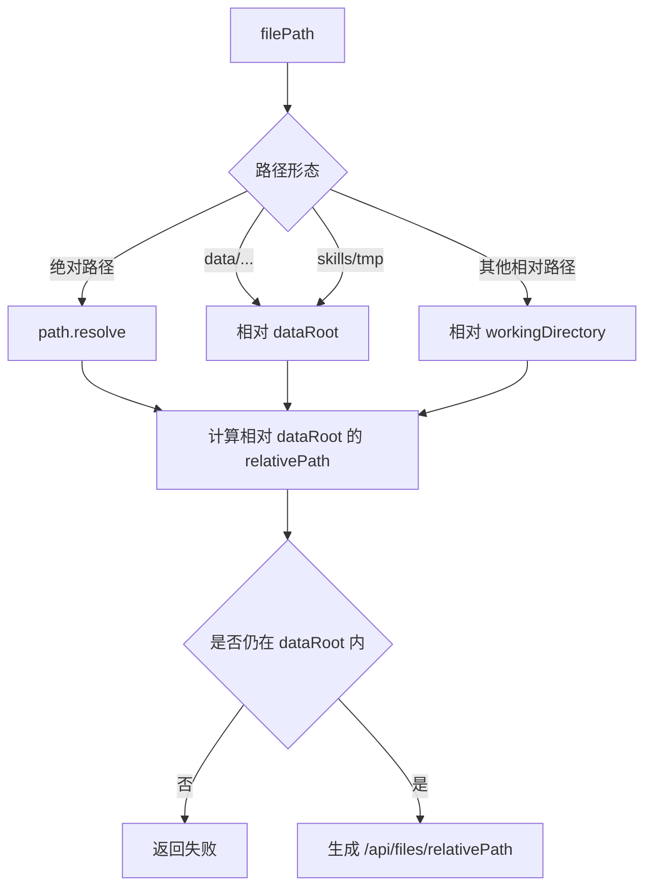

# E49：URL 和时间工具把系统事实包装成受限结果

小林让 Agent “给我一个能打开行程图的链接”。这不是把任意文件暴露出去，而是用 `generate_file_url` 为 data 目录内文件生成 API URL。另一个轻量工具 `get_current_time` 则把当前时间变成结构化结果。

本节阅读 [packages/core/src/lib/integrations/pi-agent/tools/url-tools.ts](../../../../packages/core/src/lib/integrations/pi-agent/tools/url-tools.ts) 和 [packages/core/src/lib/integrations/pi-agent/tools/system-tools.ts](../../../../packages/core/src/lib/integrations/pi-agent/tools/system-tools.ts)。

## 1. URL 工具先把输入路径解析到 dataRoot 内

[packages/core/src/lib/integrations/pi-agent/tools/url-tools.ts 第 86—111 行](../../../../packages/core/src/lib/integrations/pi-agent/tools/url-tools.ts#L86)：

```ts
const toolContext = getToolContext();
const cwd = getDataRoot();
const portableInputPath = params.filePath.replace(/\\/gu, '/');

if (path.isAbsolute(params.filePath)) {
  absolutePath = params.filePath;
} else if (portableInputPath.startsWith('data/')) {
  absolutePath = path.resolve(cwd, portableInputPath.slice('data/'.length));
} else {
  const baseDir = toolContext.workingDirectory || cwd;
  absolutePath = path.resolve(baseDir, params.filePath);
}

const relativePath = path.relative(cwd, absolutePath);
if (relativePath === '..' || relativePath.startsWith(`..${path.sep}`) || path.isAbsolute(relativePath)) {
  throw new Error(`File must be under project directory. Got: ${absolutePath}`);
}
```

无论输入是绝对路径、`data/...` 还是相对路径，最终都必须位于 `getDataRoot()` 下。它生成的是 data 文件 API 链接，不是任意本地文件访问链接。

## 2. URL 形态指向 `/api/files/`

[packages/core/src/lib/integrations/pi-agent/tools/url-tools.ts 第 113—129 行](../../../../packages/core/src/lib/integrations/pi-agent/tools/url-tools.ts#L113)：

```ts
const urlRelativePath = relativePath.split(path.sep).join('/');
const baseUrl = params.baseUrl || "http://localhost:3000";
const apiUrl = `${baseUrl}/api/files/${urlRelativePath}`;
const ext = path.extname(params.filePath).toLowerCase();
const isImage = ['.png', '.jpg', '.jpeg', '.gif', '.svg', '.webp'].includes(ext);
```

`isImage` 只是帮助前端或模型理解展示方式，不改变文件访问边界。

## 3. 时间工具返回多种时间表达

[packages/core/src/lib/integrations/pi-agent/tools/system-tools.ts 第 82—126 行](../../../../packages/core/src/lib/integrations/pi-agent/tools/system-tools.ts#L82)：

```ts
const now = new Date();
const result = {
  success: true,
  timestamp: now.getTime(),
  isoString: now.toISOString(),
  localTime: now.toLocaleString("zh-CN"),
  timeZone: Intl.DateTimeFormat().resolvedOptions().timeZone,
  milliseconds: now.getMilliseconds(),
};
```

时间工具体现同一个设计原则：系统事实不靠模型猜，而由工具返回。

```mermaid
flowchart LR
    A[生成文件] --> B[generate_file_url]
    B --> C{文件在 dataRoot 内?}
    C -->|否| X[失败]
    C -->|是| D[/api/files/relativePath]
    E[需要当前时间] --> F[get_current_time]
    F --> G[timestamp + isoString + timezone]
```

图中两个工具都不复杂，但都体现“模型请求事实，工具返回事实”的边界。

## 4. 失败边界

| 场景 | 结果 |
| --- | --- |
| 文件不在 dataRoot 下 | URL 工具失败 |
| baseUrl 未传 | 默认 `http://localhost:3000` |
| 文件扩展名不是图片 | `fileType:"file"` |
| 时间格式需求不同 | 由调用方基于 timestamp/isoString 转换 |

## 5. 测试证据与缺口

[packages/core/src/lib/integrations/pi-agent/tools/__tests__/url-tools.test.ts](../../../../packages/core/src/lib/integrations/pi-agent/tools/__tests__/url-tools.test.ts) 覆盖 URL 路径解析与 dataRoot 边界。`get_current_time` 较简单，但涉及真实时间，测试时应使用 fake timer 才能稳定断言。

## 6. 源码深读：URL 工具不是文件服务器本身

`generate_file_url` 做的是“把 dataRoot 内路径转换成 `/api/files/...` URL”。它不负责读取文件内容，也不负责鉴权、缓存、下载头、MIME 细节。真正返回文件的是 Web API 中的文件路由。这里的工具只把 Agent 生成的产物变成用户可访问的引用。

这也解释了为什么它必须检查 dataRoot。假设 Agent 生成 `/api/files/../../etc/passwd`，即使 API route 后面还有保护，工具层也不应制造这种危险 URL。安全系统通常不是只靠一层判断，而是每层都收紧自己的边界。

时间工具也是同理。`get_current_time` 不做复杂日程推理，它只返回当前系统时间、ISO 字符串、本地时间和时区。小林说“明天早上九点提醒我”时，Agent 应先拿事实时间，再计算 `runAt`，最后交给调度工具。不能让模型只凭训练知识猜“现在是什么时间”。

| 需求 | 应用工具 | 后续步骤 |
| --- | --- | --- |
| 打开生成图片 | `generate_file_url` | 前端或用户访问 `/api/files/...` |
| 确认当前日期 | `get_current_time` | 用 timestamp/isoString 做时间计算 |
| 设置未来提醒 | `get_current_time` + `schedule_task` | 计算 runAt 后创建调度 |

## 7. 源码链路补强与练习

### 7.1 URL 工具生成的是访问入口，不是文件权限本身

`generate_file_url` 从 [packages/core/src/lib/integrations/pi-agent/tools/url-tools.ts 第 55 行](../../../../packages/core/src/lib/integrations/pi-agent/tools/url-tools.ts#L55) 开始。它接收 `filePath` 和可选 `baseUrl`，然后把输入路径转换成 dataRoot 下的相对路径。源码有几种路径处理：绝对路径直接 `path.resolve`；`data/...` 会去掉 `data/` 后相对 `getDataRoot()`；`skills/...` 和 `tmp/...` 也相对 dataRoot；其他路径则相对当前 tool context 的 `workingDirectory`。

最关键的检查不是拼出 URL，而是检查 `absolutePath` 相对 dataRoot 的 `relativePath`。如果结果是 `..`、以 `..${path.sep}` 开头，或仍然是绝对路径，就抛错。这一步证明：URL 工具只能为 dataRoot 内的文件生成 `/api/files/...` 地址。它不会把用户机器上的任意绝对路径直接暴露成 HTTP 地址。



这说明 URL 工具和文件服务器 API 是两层。URL 工具负责“只生成合法范围内的地址”；真正访问 `/api/files/...` 时，还需要 API route 负责读取和返回文件。任何一层都不能假设另一层一定安全。小林让 Agent 生成旅行计划图片后，`generate_file_url('output/map.png')` 会把工作目录下的文件映射到 dataRoot 内相对路径，再返回可打开地址；但如果传入 `/etc/passwd`，它应被拒绝。

时间工具则解决另一个问题：模型不能靠训练记忆猜“现在几点”。如果小林说“明天上午九点提醒我确认高铁票”，Agent 应先通过时间工具拿到当前时间事实，再计算 `runAt`，再交给调度工具。时间工具本身不负责判断“明天是否工作日”、不负责创建任务；它只提供系统事实。把事实获取和业务决策分开，是 Agent 工具设计的基本原则。

| 用户需求 | 工具给出的事实 | 还需要谁继续处理 |
| --- | --- | --- |
| “打开这张图” | 文件 URL、相对路径、文件类型 | 前端或浏览器访问 |
| “现在是哪天” | 当前时间、ISO 字符串、时区 | 模型解释给用户 |
| “明天提醒我” | 当前时间事实 | 模型计算 runAt，调度工具保存 |

[packages/core/src/lib/integrations/pi-agent/tools/__tests__/url-tools.test.ts 第 1 行](../../../../packages/core/src/lib/integrations/pi-agent/tools/__tests__/url-tools.test.ts#L1) 应重点验证 URL 只指向 dataRoot 内文件、`data/...` 输入能正确规范化、越界路径失败、图片扩展名能识别为 image。时间工具则需要验证返回字段稳定、时区表达可用。两者共同目标是：系统事实必须可验证，不能让模型随口编。

### 7.2 URL、路径、文件内容三者不能混在一起

新手经常把这三个问题混成一个：“文件在哪里”“文件内容是什么”“怎么打开文件”。在工具系统里，它们必须拆开。

`read_file` 或文档工具回答“文件内容是什么”；`resolveToolPath` 回答“这个路径能否定位到边界内文件”；`generate_file_url` 回答“这个 dataRoot 内文件是否能映射成可访问 URL”。URL 工具不会读取文件正文，也不会证明文件内容正确。它只是把已经存在于允许目录内的文件，包装成 `/api/files/...` 形式。

| 问题 | 应用能力 | 返回重点 |
| --- | --- | --- |
| 文件是否存在 | 文件/文档工具读取或列目录 | success、error、files |
| 内容是否正确 | `read_file` / `read_document` | content、分页字段 |
| 用户能否打开 | `generate_file_url` | url、relativePath、fileType |

小林说“给我旅行地图图片链接”，合格链路不是直接编一个 URL。Agent 应先确认图片文件已经生成，路径在 dataRoot 内，然后调用 URL 工具。如果 URL 返回成功，仍只能说明访问入口已生成；图片是否渲染正常，还需要前端或浏览器实际打开验证。

时间工具也类似。它返回的是当前时间事实，不负责业务承诺。小林说“出发前一天提醒我”，Agent 需要先知道当前日期、旅行出发日期，再计算提醒日期。如果出发日期未知，应该追问；如果当前时间未知，应该调用时间工具。不能用模型训练时的日期，也不能用用户话语里的“明天”直接写死。

### 7.3 两个轻量工具的共同原则

URL 工具和时间工具看起来无关，一个处理文件访问，一个处理当前时间。但它们共同承担同一类职责：把运行时事实转换成结构化结果。

| 工具 | 事实来源 | 不应承担的责任 |
| --- | --- | --- |
| `generate_file_url` | dataRoot 内文件路径 | 不读取文件、不保证内容正确 |
| 时间工具 | 当前运行环境时间 | 不替用户决定日程、不保存任务 |

这类工具最容易被低估，因为它们没有复杂业务算法。但 Agent 系统如果缺少它们，就会退回到模型猜测：猜文件 URL、猜当前时间、猜用户能否打开文件。高质量运行时要尽量把可查证的事实交给工具，而不是让模型从语言里编造。

纸面推演：`generate_file_url('/etc/passwd')` 是否应该成功？不应该，因为最终相对 dataRoot 会越界。

口头验收：读者应能说明 URL 工具为什么不是“本地文件任意分享器”。

## 8. 本节小结

URL 和时间工具看起来轻量，但同样遵守“事实由工具返回，边界由运行时控制”。下一节看更复杂的文档工具。
