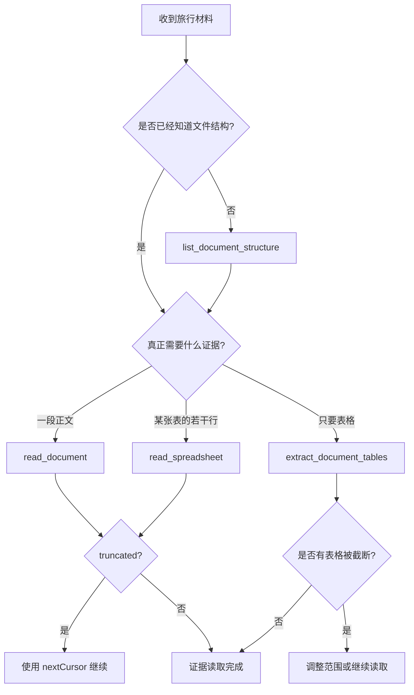
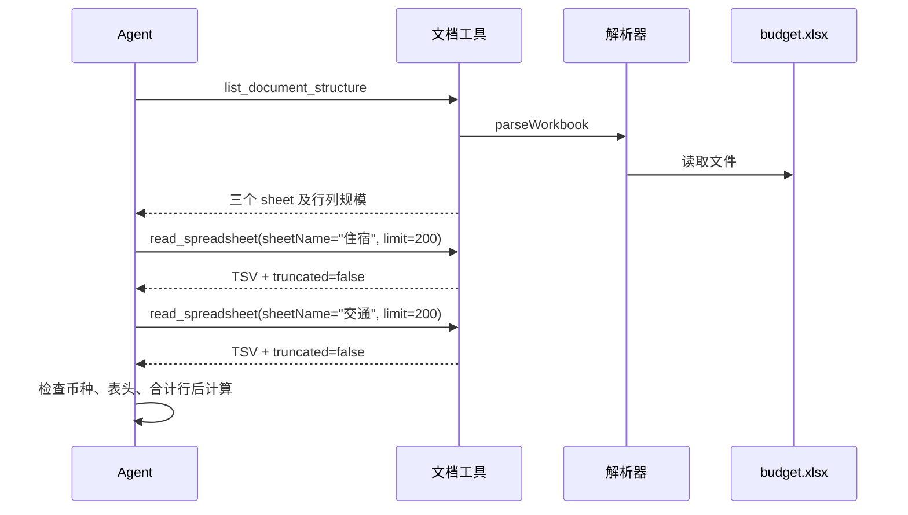

# E50：文档工具为什么要先看结构，再分页读取内容

小林把两份材料交给旅行 Agent：一份二十页的攻略文档，一份包含“交通、住宿、门票”三个工作表的预算文件。他问：“去杭州三天大约要准备多少钱？”

如果 Agent 不看文件结构就直接读取全文，可能遇到三个问题：把无关段落全部送入模型、默认读错工作表、只读到前半段却误以为已经读完。文档工具的目标因此不是“把文件打开”，而是把大型、异构的材料变成**可选择、可分页、可验证**的证据。

本节阅读 [packages/core/src/lib/integrations/pi-agent/tools/document-tools.ts](../../../../packages/core/src/lib/integrations/pi-agent/tools/document-tools.ts) 和对应测试。读完后，读者应能根据任务选择四种工具，解释每个分页字段，并沿源码定位路径、解析、选表、截断和错误返回问题。

## 1. 零基础准备：先认识六个术语

| 术语 | 通俗解释 | 在本节中的作用 |
| --- | --- | --- |
| 文档 AST | 解析器得到的结构化文档模型，不是原始字节 | 让标题、段落和表格可以被统一处理 |
| workbook | 一个表格文件整体 | 例如 `budget.xlsx` |
| sheet | workbook 中的一张工作表 | 例如“交通”或“住宿” |
| cursor | 下一页从哪里开始的书签 | 调用方无需自己猜下一次 offset |
| TSV | 用制表符分隔列的文本 | 便于把二维表格稳定交给模型 |
| `details` | 机器可继续使用的元数据 | 记录总量、返回量、是否截断和下一页位置 |

工具结果中的 `content` 面向模型阅读，`details` 面向程序判断。比如 `content` 可能是十行预算数据，而 `details.truncated === true` 和 `details.nextCursor` 告诉调用方：这只是第一页，还不能据此宣布总预算。

## 2. 四种工具分别回答什么问题

| 工具 | 核心问题 | 分页单位 | 典型输入 |
| --- | --- | --- | --- |
| `list_document_structure` | 文件里面有什么结构？ | 不适用 | 尚不了解的大文件 |
| `read_document` | 这一段正文是什么？ | 字符 | Word、Markdown、HTML 等文本型材料 |
| `read_spreadsheet` | 某张表的这些行是什么？ | 行 | Excel、CSV |
| `extract_document_tables` | 文件中的表格是什么？ | 每个表格的行 | 只关心预算表或清单 |

拆成四个工具并非重复设计。结构探测、正文阅读、二维表格阅读和表格抽取具有不同输入、分页单位和失败方式；做成“万能读取”反而会让调用方无法表达真正意图。



这张图不是要求每次机械地调用全部工具，而是要求先确定信息需求。已知文件是只有十行的 CSV 时，可以直接读表；面对未知的大型 Office 文件时，先看结构通常更稳妥。

## 3. 四个工具共享的安全执行骨架

四个工具虽处理不同结构，但执行顺序大体一致：

```text
校验参数
  → 检查取消信号
  → 把用户路径解析到允许边界内
  → 确认目标是普通文件
  → 调用文档或工作簿解析器
  → 选择正文、sheet 或表格
  → 限制返回规模
  → 同时返回 content 与 details
```

[packages/core/src/lib/integrations/pi-agent/tools/document-tools.ts 第 22—58 行](../../../../packages/core/src/lib/integrations/pi-agent/tools/document-tools.ts#L22) 定义默认上限、最大上限、取消检查、文件检查、数值钳制、cursor 解析和统一文本结果。

`clampNumber` 会取整并把数值限制在允许区间内。文本默认最多返回 12,000 个字符，最大 60,000；表格默认最多返回 200 行，最大 1,000 行。这个边界防止调用方用异常大的 `limit` 一次吞入整个文件。

`ensureFile` 通过 `stat` 确认目标确实是文件。路径存在但实际是目录，同样不能进入解析器。[packages/core/src/lib/integrations/pi-agent/tools/path-utils.ts 第 54—131 行](../../../../packages/core/src/lib/integrations/pi-agent/tools/path-utils.ts#L54) 没有调用 `realpath` 再比较符号链接最终目标，所以现有源码证明的是规范化路径的词法范围检查，不能扩大为“符号链接目标一定不会越界”；这也是测试清单中仍需单独验证的安全边界。

取消信号目前只在正式解析前检查一次。它能阻止一个已经被取消的调用开始解析，却不表示解析大型 Office 文件的中途一定可以立即打断。教材必须准确描述这项边界，不能把“一次前置检查”写成“全程可取消”。

## 4. `read_document`：把长正文切成可连续读取的字符页

[packages/core/src/lib/integrations/pi-agent/tools/document-tools.ts 第 106—168 行](../../../../packages/core/src/lib/integrations/pi-agent/tools/document-tools.ts#L106) 定义参数并执行正文读取：

```ts
const { fullPath, displayPath } = resolveInsideBoundary(params.filePath);
await ensureFile(fullPath);
const ast = await parseDocument(fullPath);
const slice = sliceDocumentText(ast, {
  offset: parseCursor(params.cursor) ?? params.offset,
  limit: clampNumber(params.limit, DEFAULT_TEXT_LIMIT, 1, MAX_TEXT_LIMIT),
});
```

逐句理解：

1. `resolveInsideBoundary` 把输入路径解析成规范化绝对路径，并用 `path.relative` 检查它是否处于工作目录或受支持数据目录的词法范围内。
2. `ensureFile` 阻止目录进入文档解析器。
3. `parseDocument` 将格式差异收敛为文档 AST。
4. `sliceDocumentText` 从指定字符位置截取有限内容。

当 `cursor` 与 `offset` 同时出现时，合法 cursor 优先。因为 cursor 代表上一页返回的连续读取位置；调用方只需原样带回，不必重新计算偏移。无效 cursor 会解析为 `undefined`，随后退回显式 `offset`。

一次结果至少要从两个层面阅读：

```text
content: 当前页正文
details: totalChars / returnedChars / offset / limit / truncated / nextCursor / tablesCount
```

如果 `truncated` 为 `true`，当前内容只是局部证据；`nextCursor` 才是下一页入口。只读取第一页就汇总整份攻略，是调用策略错误，不是解析器成功的证明。

## 5. `read_spreadsheet`：先选工作表，再按行读取

[packages/core/src/lib/integrations/pi-agent/tools/document-tools.ts 第 170—245 行](../../../../packages/core/src/lib/integrations/pi-agent/tools/document-tools.ts#L170) 先解析 workbook，再选择 sheet：

```ts
const sheet = params.sheetName
  ? workbook.sheets.find((candidate) => candidate.name === params.sheetName)
  : workbook.sheets[0];
if (!sheet) {
  return toTextResult(`未找到工作表: ${params.sheetName ?? "(第一个工作表)"}`, {
    availableSheets: workbook.sheets.map((candidate) => candidate.name),
  });
}
```

调用方提供 `sheetName` 时，工具要求精确找到该表；没有提供时才默认第一张。找不到不是“整个文件无法读取”，所以工具返回可用工作表名称，帮助 Agent 修正下一次调用。

选表之后，`getRangeRows` 按行截取，`rowsToTsv` 把二维单元格转换为 TSV。结果中的 `rowCount` 是整张表行数，`returnedRows` 是本次返回行数；两者不能混用。

以预算表为例：

```text
workbook: budget.xlsx
sheets: 交通(80 行)、住宿(12 行)、门票(25 行)
任务: 估算住宿费用
```

正确做法是选择“住宿”并读取其行数据。默认第一张“交通”虽然也能成功返回，但答非所问。由此可见，“工具调用成功”不等于“证据选择正确”。

## 6. `list_document_structure`：先建立文件地图

[packages/core/src/lib/integrations/pi-agent/tools/document-tools.ts 第 247—295 行](../../../../packages/core/src/lib/integrations/pi-agent/tools/document-tools.ts#L247) 根据扩展名选择结构解析：`.xlsx` 和 `.csv` 走 workbook，其余支持格式走 document。

对 workbook，结构结果包含每张 sheet 的名称、行数和列数；对文档，结果包含块数量、表格数量和解析器提供的结构摘要。它回答的是“去哪里读”，不是“业务答案是什么”。

小林的预算问题可以分成以下步骤：

1. 调用结构工具，确认存在“交通、住宿、门票”。
2. 根据问题选择三个相关 sheet，而不是默认第一张。
3. 分别分页读取，直到 `truncated` 为 `false`。
4. 检查币种、表头和合计行，再计算预算。

结构摘要减少盲读，但不能代替正文。知道“住宿表有 12 行”，并不知道十二行中的价格是多少。

## 7. `extract_document_tables`：只保留二维证据

[packages/core/src/lib/integrations/pi-agent/tools/document-tools.ts 第 297—362 行](../../../../packages/core/src/lib/integrations/pi-agent/tools/document-tools.ts#L297) 从文档或 workbook 中抽取表格，并对每个表格分别应用行数上限。

这个工具适合“从攻略 Word 中找酒店对比表”，因为全文可能包含大量景点介绍。需要注意：`limit` 是每张表的限制，不是所有表共享的总行数上限；`truncatedTables` 用于指出哪些表格没有完整返回。

对于 workbook，`sheetName` 可以缩小抽取范围。当前实现中，指定不存在的 sheet 时可能得到“未找到表格”和 `tablesCount: 0`，其反馈不如 `read_spreadsheet` 的 `availableSheets` 详细。排障时必须根据所调用的具体工具判断，而不能假设所有“找不到 sheet”都返回同样结构。

## 8. 错误为什么会作为工具结果返回

各工具的执行体用 `try/catch` 捕获运行错误，并返回文本与 `{ error: true }` 之类的详情，而不是继续向外抛出未处理异常。这样模型可以看到受控失败并决定修正路径、文件或参数。

必须区分三种结果：

| 结果 | 例子 | 调用方下一步 |
| --- | --- | --- |
| 正常成功 | 返回预算表前 200 行 | 检查是否截断 |
| 可恢复的业务结果 | sheet 不存在并返回可用 sheet | 选择正确名称重试 |
| 受控错误结果 | 路径越界、不是文件、解析失败 | 根据 `error` 和内容修正或告知用户 |

“Promise 已完成”只代表工具调用得到了结果对象，不代表文档读取成功。调用方必须检查结果内容和详情，而不能仅以“没有 throw”判断成功。

## 9. 一条完整的旅行预算读取链



图中 Agent 最后的计算依赖前面返回的真实数据。结构工具负责导航，读取工具负责证据，模型负责在证据之上推理；三者职责不能颠倒。

## 10. 测试证据与尚未覆盖的边界

[packages/core/src/lib/integrations/pi-agent/tools/__tests__/document-tools.test.ts 第 34—109 行](../../../../packages/core/src/lib/integrations/pi-agent/tools/__tests__/document-tools.test.ts#L34) 当前直接覆盖了 Markdown 分页、CSV 行分页、CSV 结构摘要、CSV 表格抽取和路径越界。

这些测试能证明基本合同存在，但不能推出所有 Office 场景都可靠。当前文件没有直接覆盖：

- 真实 DOCX 和 XLSX 样本；
- 不存在的 sheet 反馈；
- cursor 与 offset 的优先级及无效 cursor；
- 默认值、取整和最大限制；
- 取消信号、目录输入、空文件和损坏文件；
- 每张表分别截断；
- 符号链接逃逸和 `onUpdate` 进度通知。

因此，准确结论是“已有测试固定了文本/CSV 的核心路径与边界逃逸”，而不是“文档工具已覆盖所有格式和失败情况”。

## 11. 从症状定位问题

| 症状 | 优先检查 | 可能原因 |
| --- | --- | --- |
| 只得到前半段攻略 | `truncated`、`nextCursor` | 调用方没有继续分页 |
| 得到交通费却没有住宿费 | `sheetName` 和结构摘要 | 默认读了第一张 sheet |
| 路径存在仍报错 | 目标类型与真实边界 | 目标是目录或越过允许边界 |
| 返回“未找到工作表” | `availableSheets` | 名称拼写或工作表选择错误 |
| 返回成功对象但没有数据 | `details.error`、文本提示、空表状态 | 把完成调用误判为成功读取 |
| 大文件取消后仍短暂占用解析 | 取消检查位置 | 当前只在解析前检查一次 |

## 12. 练习：设计一次不遗漏数据的读取计划

给定 `budget.xlsx`，结构摘要显示“交通 350 行、住宿 12 行、门票 25 行”。每次表格读取默认最多 200 行。要计算三项总预算，完整计划应当是：

1. 分别指定三个 sheet，不能只读默认第一张。
2. “交通”第一页返回 200 行后检查 `truncated`，使用 `nextCursor` 读取剩余 150 行。
3. “住宿”和“门票”各读取一页，并确认没有截断。
4. 识别表头、币种、空值和合计行，防止重复求和。
5. 只有证据完整后才输出总预算，并说明所依据的工作表。

如果读者只回答“调用 `read_spreadsheet`”，仍未达到验收要求；必须说明选表、分页完成条件和数据解释边界。

## 13. 本节小结

文档工具把“打开文件”拆成四种可验证行为：先用结构摘要定位，再按字符或行分页读取，必要时只抽取表格，并通过 `details` 判断证据是否完整。

最重要的判断链是：

```text
路径是否允许 → 目标是否为文件 → 解析成何种结构 → 选择哪部分
            → 返回是否截断 → 是否需要下一页 → 证据是否足以回答
```

掌握这条链以后，读者不仅知道应该调用哪个工具，还能解释“为什么读错”“漏在哪里”和“下一步怎样取得完整证据”。
