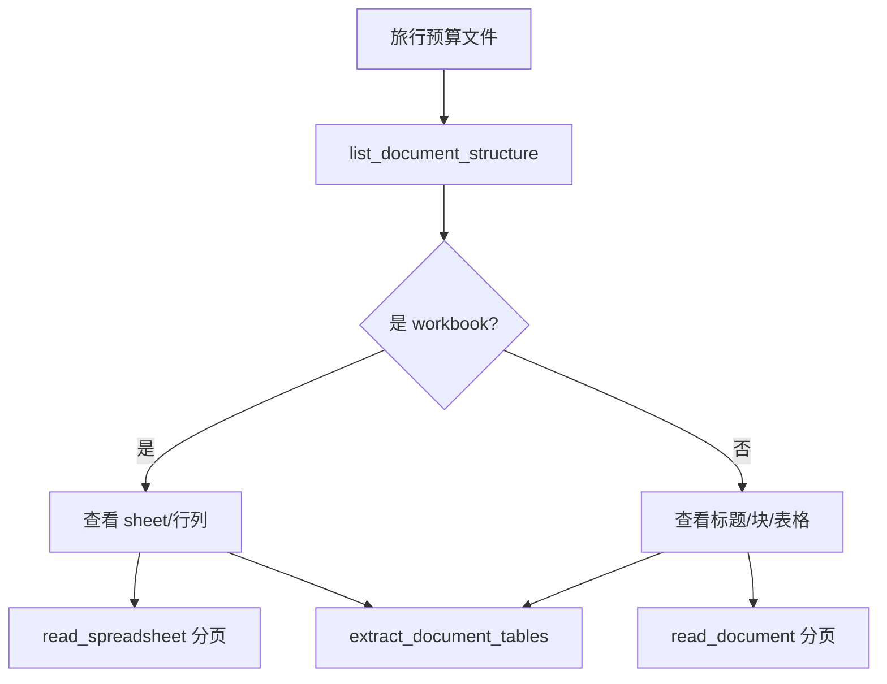
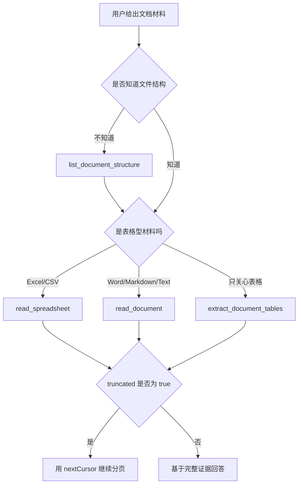

# E50：文档工具先看结构，再分页读取大内容

小林上传了一份旅行预算 Excel 和一份攻略 Word。普通 `read_file` 只能把文本读出来；文档工具会解析文档结构、表格和分页，适合处理更真实的业务材料。

本节阅读 [packages/core/src/lib/integrations/pi-agent/tools/document-tools.ts](../../../../packages/core/src/lib/integrations/pi-agent/tools/document-tools.ts)。

## 1. read_document 有字符分页

[packages/core/src/lib/integrations/pi-agent/tools/document-tools.ts 第 106—162 行](../../../../packages/core/src/lib/integrations/pi-agent/tools/document-tools.ts#L106)：

```ts
const ReadDocumentParamsSchema = Type.Object({
  filePath: Type.String({ minLength: 1 }),
  offset: Type.Optional(Type.Number()),
  limit: Type.Optional(Type.Number()),
  cursor: Type.Optional(Type.String()),
});

const { fullPath, displayPath } = resolveInsideBoundary(params.filePath);
await ensureFile(fullPath);
const ast = await parseDocument(fullPath);
const slice = sliceDocumentText(ast, {
  offset: parseCursor(params.cursor) ?? params.offset,
  limit: clampNumber(params.limit, DEFAULT_TEXT_LIMIT, 1, MAX_TEXT_LIMIT),
});
```

文档读取先走路径边界，再确认是文件，然后解析成 AST，最后按字符范围切片。`cursor` 优先于 `offset`，用于连续分页。

## 2. read_spreadsheet 有工作表和行分页

[packages/core/src/lib/integrations/pi-agent/tools/document-tools.ts 第 170—239 行](../../../../packages/core/src/lib/integrations/pi-agent/tools/document-tools.ts#L170)：

```ts
const sheet = params.sheetName
  ? workbook.sheets.find((candidate) => candidate.name === params.sheetName)
  : workbook.sheets[0];
if (!sheet) {
  return toTextResult(`未找到工作表: ${params.sheetName ?? "(第一个工作表)"}`, {
    availableSheets: workbook.sheets.map((candidate) => candidate.name),
  });
}

const range = getRangeRows(sheet, offset, limit);
const text = rowsToTsv(range.rows) || "(表格为空)";
```

Excel/CSV 不是一个文本流，而是多个 sheet 和二维行列。工具找不到指定 sheet 时不会猜，而是返回可用 sheet 列表。

## 3. list_document_structure 是大文件的入口

[packages/core/src/lib/integrations/pi-agent/tools/document-tools.ts 第 254—289 行](../../../../packages/core/src/lib/integrations/pi-agent/tools/document-tools.ts#L254)：

```ts
if (ext === ".xlsx" || ext === ".csv") {
  const workbook = await parseWorkbook(fullPath);
  return toTextResult(summarizeWorkbookStructure(...), {
    kind: "workbook",
    sheets: workbook.sheets.map((sheet) => ({
      name: sheet.name,
      rowCount: sheet.rowCount,
      columnCount: sheet.columnCount,
    })),
  });
}
const document = await parseDocument(fullPath);
return toTextResult(summarizeDocumentStructure(document), {
  kind: "document",
  blocksCount: document.blocks.length,
  tablesCount: document.tables.length,
});
```

对大文件，正确顺序是先看结构，再决定读哪一段或哪张表。



图中结构探测是入口，不是附属功能。它帮助 Agent 先知道文件形状，再选择合适读取工具。

## 4. 表格抽取只取表格

[packages/core/src/lib/integrations/pi-agent/tools/document-tools.ts 第 312—360 行](../../../../packages/core/src/lib/integrations/pi-agent/tools/document-tools.ts#L312) 显示 `extract_document_tables` 会对 Word/Excel/CSV 提取表格，并用 `limit` 限制每个表格行数。它适合小林只关心费用表、酒店清单、交通时间表的场景。

## 5. 失败边界

| 场景 | 行为 |
| --- | --- |
| 路径越界 | `resolveInsideBoundary` 阶段失败 |
| 目标不是文件 | `ensureFile` 抛错 |
| sheetName 不存在 | 返回可用 sheet 列表 |
| 文档太大 | 返回 `truncated` 和 `nextCursor` |
| 表格行数过多 | `truncatedTables` 记录被截断表格 |

## 6. 测试证据与缺口

[packages/core/src/lib/integrations/pi-agent/tools/__tests__/document-tools.test.ts](../../../../packages/core/src/lib/integrations/pi-agent/tools/__tests__/document-tools.test.ts) 覆盖文档读取、表格读取和结构探测的核心路径。真实 Office 文件格式非常复杂，测试不能代表所有损坏文件或特殊格式都能解析。

## 7. 源码深读：文档工具的关键不是格式多，而是返回可控

文档工具最重要的设计不是“支持 docx/xlsx/csv”，而是把不可控的大文件拆成可控视图。

`read_document` 返回 `totalChars`、`returnedChars`、`offset`、`limit`、`truncated`、`nextCursor`。这些字段告诉 Agent 当前读到了哪里、还剩多少、下一次怎么继续。`read_spreadsheet` 返回 `rowCount`、`columnCount`、`returnedRows`、`truncated`、`nextCursor`。这让表格读取也能分页，而不是一次塞入整张表。

| 工具 | 分页单位 | 适合材料 |
| --- | --- | --- |
| `read_document` | 字符 | Word、Markdown、长文本 |
| `read_spreadsheet` | 行 | Excel、CSV |
| `list_document_structure` | 结构摘要 | 不知道文件形状时 |
| `extract_document_tables` | 表格 | 只关心表格数据时 |

小林上传攻略文档后，Agent 的正确读取策略通常不是直接全文读，而是：先 `list_document_structure` 看标题和表格数量；如果是 Excel，先看 sheet；再按 sheet 或 cursor 读取局部。这样既省上下文，也减少读错区域的概率。

如果文档解析失败，错误可能来自路径、文件类型、文件损坏、解析器能力不足。不能简单归因于“模型不会读文档”，因为读文档是工具和解析器的职责。

## 8. 源码链路补强与练习

### 8.1 文档工具为什么要拆成四个，而不是一个“万能读取”

文档工具集中在 [packages/core/src/lib/integrations/pi-agent/tools/document-tools.ts 第 1 行](../../../../packages/core/src/lib/integrations/pi-agent/tools/document-tools.ts#L1)。它们都先经过 `resolveInsideBoundary` 和 `ensureFile`，说明文档读取仍然服从工具工作目录边界。与 `read_file` 不同的是，文档工具面对的是 Word、Excel、CSV、Markdown、JSON、HTML 等结构不同的材料，所以不能只返回一段原始文本。

`read_document` 从 [packages/core/src/lib/integrations/pi-agent/tools/document-tools.ts 第 89 行](../../../../packages/core/src/lib/integrations/pi-agent/tools/document-tools.ts#L89) 开始，适合读取文本型文档。它通过 `parseDocument(fullPath)` 得到 AST，再用 `sliceDocumentText` 按字符分页。返回字段包括 `totalChars`、`returnedChars`、`offset`、`limit`、`truncated`、`nextCursor`、`tablesCount`。这和 `read_file` 的行分页不同，原因是 Word 或 HTML 的自然边界不一定是源文件行号。

`read_spreadsheet` 从 [packages/core/src/lib/integrations/pi-agent/tools/document-tools.ts 第 151 行](../../../../packages/core/src/lib/integrations/pi-agent/tools/document-tools.ts#L151) 开始，适合 Excel/CSV。它先解析 workbook，再按 `sheetName` 选择工作表，最后按行分页返回 TSV。这里的关键字段是 `sheetName`、`rowCount`、`columnCount`、`returnedRows`、`truncated`、`nextCursor`。小林的预算表如果有“交通”“住宿”“门票”三个 sheet，Agent 必须先确认 sheet，而不是默认第一个就是用户要的内容。

`list_document_structure` 从 [packages/core/src/lib/integrations/pi-agent/tools/document-tools.ts 第 218 行](../../../../packages/core/src/lib/integrations/pi-agent/tools/document-tools.ts#L218) 开始，读取结构摘要。对文本文档，它返回标题、块数量、表格数量；对 Excel/CSV，它返回 sheet 列表、行列规模和合并单元格数量。它是大文档入口，因为它能先告诉 Agent “材料长什么样”，再决定读哪里。

`extract_document_tables` 从 [packages/core/src/lib/integrations/pi-agent/tools/document-tools.ts 第 253 行](../../../../packages/core/src/lib/integrations/pi-agent/tools/document-tools.ts#L253) 开始，只抽表格。它适合“从旅行攻略 Word 里提取预算表”这类任务。如果用户关心的是结构化表格，全文读取会把大量段落也带进上下文；抽表格能减少噪音。



新手要形成一个习惯：读大文件前先问“我需要结构、正文，还是表格？”不要把所有读取都交给 `read_file`。`read_file` 适合源码、普通文本、需要行号编辑的文件；`read_document` 适合长文档阅读；`read_spreadsheet` 适合表格行列；`extract_document_tables` 适合只抽表格。

[packages/core/src/lib/integrations/pi-agent/tools/__tests__/document-tools.test.ts 第 1 行](../../../../packages/core/src/lib/integrations/pi-agent/tools/__tests__/document-tools.test.ts#L1) 的价值就在于证明这些工具不是文案区分，而是真的有不同解析和分页契约。验收时至少要覆盖：结构摘要、指定 sheet、分页 cursor、表格抽取、非文件路径失败、边界外路径失败。只有这样，才能说文档工具既能读，也能可控地读。

纸面推演：小林上传的 Excel 有三个 sheet：预算、酒店、交通。Agent 不知道要读哪个 sheet 时，应先调用什么？应先调用 `list_document_structure`。

口头验收：读者应能解释 `read_file`、`read_document`、`read_spreadsheet`、`extract_document_tables` 的适用差异。

## 9. 本节小结

文档工具把“读取文件”升级为“理解文件结构后分页读取”。下一节看本体工具如何把结构层和实例层分开。
