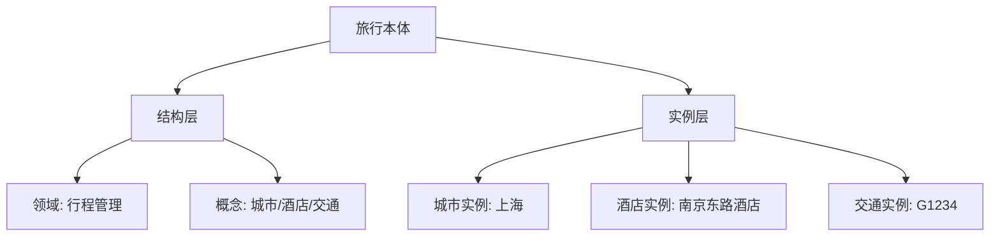
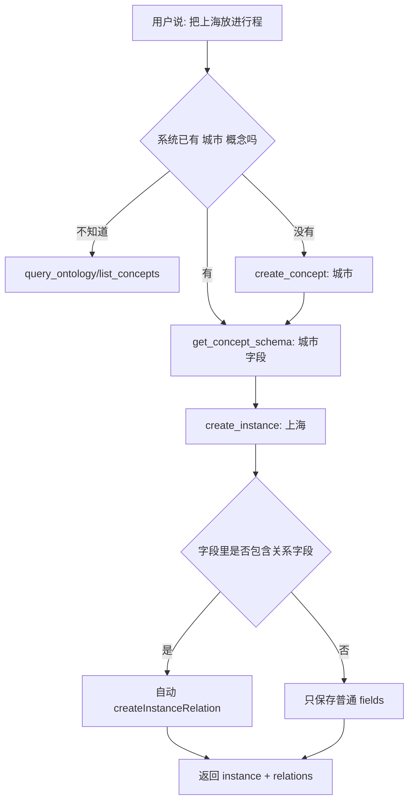

# E51：本体工具必须区分结构层和实例层

小林的旅行计划里有“城市、酒店、交通、景点”这些概念，也有“上海、南京东路酒店、G1234 车次”这些具体记录。本体工具把这两层分开：结构层定义世界长什么样，实例层保存具体数据。

本节阅读 [packages/core/src/lib/integrations/pi-agent/tools/ontology-tools.ts](../../../../packages/core/src/lib/integrations/pi-agent/tools/ontology-tools.ts) 和 [packages/core/src/lib/integrations/pi-agent/tools/ontology-data-tools.ts](../../../../packages/core/src/lib/integrations/pi-agent/tools/ontology-data-tools.ts)。

## 1. 结构层工具操作 domains、concepts、relations

[packages/core/src/lib/integrations/pi-agent/tools/ontology-tools.ts 第 91—121 行](../../../../packages/core/src/lib/integrations/pi-agent/tools/ontology-tools.ts#L91)：

```ts
const QueryOntologyTool: ToolRegistration = {
  name: "query_ontology",
  description: "查询指定项目的完整本体结构定义，包含所有领域、概念和关系。",
  category: "ontology",
  enabled: true,
  async execute(toolCallId, params, signal, onUpdate) {
    const ontology = await ontologyOps.loadOntology(params.ontologyId);
    return successResult(ctx, { success: true, ontologyId: params.ontologyId, ontology });
  },
};
```

`query_ontology` 返回的是结构定义，不是旅行记录。它告诉 Agent “有哪些概念”，不告诉 Agent “小林订了哪家酒店”。

## 2. 创建领域和概念是改结构，不是写业务记录

[packages/core/src/lib/integrations/pi-agent/tools/ontology-tools.ts 第 132—179 行](../../../../packages/core/src/lib/integrations/pi-agent/tools/ontology-tools.ts#L132) 创建领域；[packages/core/src/lib/integrations/pi-agent/tools/ontology-tools.ts 第 185—240 行](../../../../packages/core/src/lib/integrations/pi-agent/tools/ontology-tools.ts#L185) 创建概念：

```ts
const newConcept = await ontologyOps.createConcept(
  params.ontologyId,
  params.domainId,
  params.conceptName,
  params.conceptType,
  params.description
);
```

如果小林还没有“交通安排”这个概念，Agent 可以创建概念。若她已经有一个具体车次，则不应创建概念，而应创建实例。

## 3. 实例层工具操作实际业务数据

[packages/core/src/lib/integrations/pi-agent/tools/ontology-data-tools.ts 第 97—181 行](../../../../packages/core/src/lib/integrations/pi-agent/tools/ontology-data-tools.ts#L97)：

```ts
const CreateInstanceTool: ToolRegistration = {
  name: "create_instance",
  description: "在本体中创建一个概念的实例数据。",
  category: "ontology",
  enabled: true,
  async execute(toolCallId, params, signal, onUpdate) {
    const schema = await schemaValidator
      .loadConceptSchema(params.ontologyId, params.conceptId)
      .catch(() => null);

    const instance = await store.createInstance(
      params.ontologyId,
      params.conceptId,
      plainFields,
      params.createdBy ?? "agent"
    );
    return successResult({ success: true, instance, relations: createdRelations });
  },
};
```

这里的 `fields` 是具体数据。比如“城市=上海、停留天数=2、预算=1200”属于实例字段，不属于概念名称。



这张图是本节最重要的区分：结构层回答“系统能描述什么类型的事物”，实例层回答“这次项目里具体有哪些事物”。

## 4. 实例关系字段会自动建立关系

`create_instance` 会读取概念 schema，把 `type=relation` 的字段从普通字段里分离出来，再用 `createInstanceRelation` 建立关系。这意味着 Agent 不能随便把关系字段当普通文本保存；字段结构要先由 `get_concept_schema` 确认。

## 5. 失败边界

| 错误 | 后果 |
| --- | --- |
| 自己猜 `ontologyId` | 可能写错项目 |
| 把实例当概念创建 | 结构层被污染 |
| 不查 `domainId` 就创建概念 | 可能引用不存在领域 |
| 不查 schema 就创建实例 | 字段或关系可能不符合约束 |
| 关系目标不存在 | 关系创建会失败或返回错误项 |

## 6. 测试证据与缺口

本体工具依赖 `ontology-data-store` 服务层，相关测试分布在本体数据存储模块中。本节只按工具源码解释边界，不声称完整业务本体验收已由工具测试覆盖。

## 7. 源码深读：本体工具的错误通常是“层级用错”

本体工具最难的地方不是 API 数量，而是语义层级。读者要养成一个判断习惯：当前要改的是“结构定义”，还是“具体记录”。

| 用户表达 | 应该进入哪层 | 可能工具 |
| --- | --- | --- |
| “我的旅行需要记录城市和酒店” | 结构层 | `create_concept` |
| “上海是这次旅行的一个城市” | 实例层 | `create_instance` |
| “酒店属于哪个城市” | 结构关系或实例关系 | 先看 schema，再写实例关系 |
| “查一下有哪些概念” | 结构层 | `query_ontology` 或 `list_concepts` |
| “查预算超过 1000 的城市” | 实例层 | `query_instances` |

`ontology-tools.ts` 使用 `ontologyOps`，它关注领域、概念和结构搜索；`ontology-data-tools.ts` 使用 `store`、`queryEngine`、`schemaValidator`、`instance-relations`，它关注数据记录、字段约束和实例关系。这些 import 本身就是分层线索。

小林说“我想把上海放进行程”，这句话不能直接映射为 `create_concept('上海')`。应先判断本体是否已有“城市”概念。如果已有，就创建“上海”实例；如果没有，才创建“城市”概念。这一步是 Agent 语义能力和工具边界结合的地方。

如果层级用错，系统不一定报错。创建一个叫“上海”的概念在技术上可能成功，但业务语义已经污染。这属于“代码成功、业务失败”：返回值只能证明写入动作完成，不能证明本体层级正确。

## 8. 源码链路补强与练习

### 8.1 本体工具的第一道安全线是“语义层级”

本体工具最容易写浅，因为它看起来只是 CRUD。但在 OriginOS 里，本体不是普通表单数据，而是“结构层”和“实例层”的组合。`ontology-tools.ts` 负责结构层，`ontology-data-tools.ts` 负责实例层。它们导入的服务不同，这一点本身就是架构线索：[packages/core/src/lib/integrations/pi-agent/tools/ontology-tools.ts 第 9 行](../../../../packages/core/src/lib/integrations/pi-agent/tools/ontology-tools.ts#L9) 导入 `ontology-ops`；[packages/core/src/lib/integrations/pi-agent/tools/ontology-data-tools.ts 第 9 行](../../../../packages/core/src/lib/integrations/pi-agent/tools/ontology-data-tools.ts#L9) 导入 `store`、`query-engine`、`schema-validator` 和 `instance-relations`。

结构层工具的典型链路是：`query_ontology` 读取完整结构；`create_domain` 创建领域；`create_concept` 在领域下创建概念；`search_ontology` 在结构定义里搜索。它们回答的问题是“系统理解哪些对象类型”。在小林的毕业旅行里，“城市”“酒店”“交通方式”“预算项”通常是概念，不是某一次旅行中的具体记录。

实例层工具回答的是“这次项目里有哪些实际记录”。`create_instance` 从 [packages/core/src/lib/integrations/pi-agent/tools/ontology-data-tools.ts 第 104 行](../../../../packages/core/src/lib/integrations/pi-agent/tools/ontology-data-tools.ts#L104) 开始，它会先尝试加载 concept schema，把 relation 字段和普通字段分开；普通字段写入实例，relation 字段转成实例关系。`query_instances` 从 [packages/core/src/lib/integrations/pi-agent/tools/ontology-data-tools.ts 第 365 行](../../../../packages/core/src/lib/integrations/pi-agent/tools/ontology-data-tools.ts#L365) 开始，它查询实例列表后，还会批量加载实例关系，把每个实例参与的关系附加到返回结果里，避免调用方再做 N+1 查询。



这张图的重点是：小林说的是自然语言，工具要落到正确层级。`上海` 通常不是一个新概念，而是 `城市` 概念下的实例。把“上海”建成概念，代码可能返回成功，但系统知识会被污染。这类错误不会由普通成功状态自动暴露，必须通过 schema、业务约束和结果复核发现。

| 自然语言 | 正确判断 | 推荐工具链 |
| --- | --- | --- |
| “我们需要管理城市、酒店和车票” | 定义对象类型 | `create_domain`、`create_concept` |
| “这次去上海和苏州” | 添加实际记录 | `list_concepts`、`get_concept_schema`、`create_instance` |
| “酒店属于上海” | 添加实例关系 | schema relation 字段或实例关系工具 |
| “查预算超过 1000 的城市” | 查询数据记录 | `query_instances` 加 filters |

测试不能只验证函数能返回 `success:true`，还要验证层级边界：结构工具不会直接写实例；实例工具会遵守 schema；关系字段不会混入普通 fields；查询结果会带关系；无效 ontologyId 或 conceptId 会失败。[packages/core/src/lib/integrations/pi-agent/tools/ontology-data-tools.ts 第 433 行](../../../../packages/core/src/lib/integrations/pi-agent/tools/ontology-data-tools.ts#L433) 的 `get_concept_schema` 尤其重要，因为它是实例写入前的“字段说明书”。没有 schema 就盲写 fields，本质上还是让模型猜数据结构。

### 8.2 本体工具的读源码顺序

建议读者按下面顺序读本体工具，而不是从文件第一行一路读到最后：

1. 先看导出的工具数组：`ontologyTools` 和 `ontologyDataTools` 分别包含哪些工具。
2. 再看每个工具的 `description`，确认它声明自己属于结构层还是实例层。
3. 接着看 `parameters` schema，确认调用前必须知道哪些 ID。
4. 再看 `execute` 里调用的是 `ontologyOps`、`store`、`queryEngine` 还是 `schemaValidator`。
5. 最后看返回结果，确认它返回的是 schema、instance、relations 还是 query result。

这样读源码，读者会自然形成分层意识。比如看到 `create_concept` 需要 `domainId`，就知道它在领域下面建结构；看到 `create_instance` 需要 `conceptId` 和 `fields`，就知道它是在某个概念下面写实际记录。

| 工具 | 必须先知道 | 返回重点 |
| --- | --- | --- |
| `create_domain` | ontologyId | domain |
| `create_concept` | ontologyId、domainId | concept |
| `get_concept_schema` | ontologyId、conceptId | schema.fields |
| `create_instance` | ontologyId、conceptId、fields | instance、relations |
| `query_instances` | ontologyId、conceptId | items、total、relations |

这张表的作用是帮新手建立“先结构、后数据”的调用顺序。没有 domainId 就不能可靠创建概念；不知道 schema 就不应盲目创建实例；不知道实例 ID 就不应创建关系。

纸面推演：小林说“这次旅行去上海和苏州”，应该创建两个 `城市` 概念，还是两个 `城市` 实例？应该创建实例；`城市` 这个概念通常只需要一个。

口头验收：读者应能说明 `query_ontology`、`create_concept`、`create_instance` 的层级差异。

## 9. 本节小结

本体工具的安全边界首先是语义边界：结构和数据不能混。下一节看 Agent 如何在缺少用户选择时主动提问。
