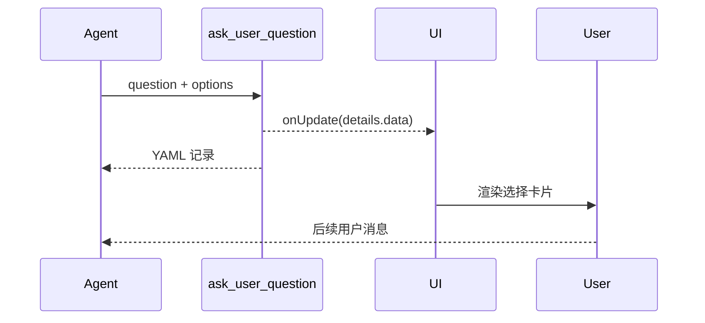
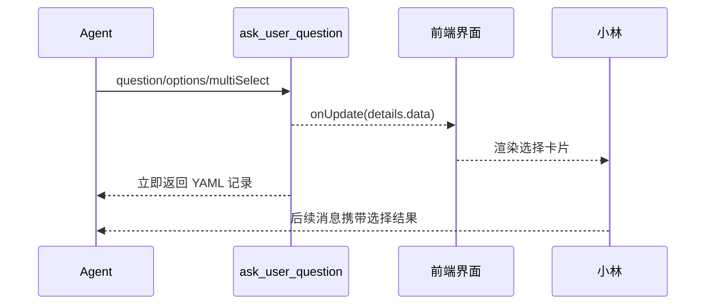

# E52：`ask_user_question` 把不确定性变成可渲染选择

小林说“帮我选一个住宿方案”，但没有说明更重视价格、位置还是安静。此时 Agent 不应该假装知道偏好，也不应该后台乱选。`ask_user_question` 工具把这个不确定点变成用户可选择的卡片。

本节阅读 [packages/core/src/lib/integrations/pi-agent/tools/ask-user-question-tools.ts](../../../../packages/core/src/lib/integrations/pi-agent/tools/ask-user-question-tools.ts) 和 [packages/core/src/lib/integrations/pi-agent/tools/registry.ts](../../../../packages/core/src/lib/integrations/pi-agent/tools/registry.ts)。

## 1. 工具参数就是问题和选项

[packages/core/src/lib/integrations/pi-agent/tools/ask-user-question-tools.ts 第 12—27 行](../../../../packages/core/src/lib/integrations/pi-agent/tools/ask-user-question-tools.ts#L12)：

```ts
const AskUserQuestionParamsSchema = Type.Object({
  question: Type.String({ description: "要问用户的问题内容" }),
  options: Type.Array(Type.Object({
    label: Type.String(),
    description: Type.String(),
  })),
  multiSelect: Type.Boolean({ default: false }),
});
```

这不是自由聊天，而是结构化选择。每个选项都有 `label` 和 `description`，前端才能稳定渲染。

## 2. 工具通过 onUpdate 发送可渲染数据

[packages/core/src/lib/integrations/pi-agent/tools/ask-user-question-tools.ts 第 50—67 行](../../../../packages/core/src/lib/integrations/pi-agent/tools/ask-user-question-tools.ts#L50)：

```ts
if (onUpdate) {
  onUpdate({
    content: [],
    details: {
      type: "progress",
      toolCallId,
      toolName: "ask_user_question",
      status: "in_progress",
      message: params.question,
      data: {
        question: params.question,
        options: params.options,
        multiSelect: params.multiSelect,
      },
      timestamp: Date.now(),
    },
  });
}
```

前端看到的是工具 update 里的 `details.data`，不是从普通文本里解析选项。这样可以避免模型生成一段看起来像选项、但结构不稳定的自然语言。

## 3. 工具立即返回 YAML 文本

[packages/core/src/lib/integrations/pi-agent/tools/ask-user-question-tools.ts 第 70—89 行](../../../../packages/core/src/lib/integrations/pi-agent/tools/ask-user-question-tools.ts#L70)：

```ts
const yaml = `\`\`\`yaml
question: "${params.question}"
options:
${params.options.map(o => `  - label: "${o.label}"\n    description: "${o.description}"`).join('\n')}
multiSelect: ${params.multiSelect}
\`\`\``;

return {
  content: [{ type: "text", text: yaml }],
  details: undefined,
};
```

返回 YAML 是给对话记录和模型看的；真正的互动卡片来自 `onUpdate`。用户后续选择会通过另一条 API 变成新的用户消息，而不是这个工具阻塞等待。



这张图里工具没有同步等待用户回答，这是关键边界。`ask_user_question` 只是把可渲染的问题卡片交给 UI，并把 YAML 记录交回 Agent；真正的答案会在用户点击后，以新的用户消息进入后续回合。因此它不是阻塞式表单，也不是普通文本提问。

## 4. 为什么 skill/worker 会看不到它

上一节已经看到 [packages/core/src/lib/integrations/pi-agent/tools/registry.ts 第 238—244 行](../../../../packages/core/src/lib/integrations/pi-agent/tools/registry.ts#L238) 对 `worker` 和 `skill` 过滤 `ask_user_question`。这样可以避免后台任务或 Skill 子流程随意打断用户。

## 5. 失败边界

| 场景 | 行为 |
| --- | --- |
| signal 已取消 | 返回“操作已取消” |
| 没有 onUpdate | 不会渲染互动卡片，只返回 YAML |
| options 设计不清 | 前端能渲染，但用户仍难以选择 |
| 当前 agentType 为 skill/worker | 工具通常不可见 |

## 6. 测试证据与缺口

注册表测试能证明 skill/worker 过滤该工具。互动卡片的真实渲染和用户选择回流需要前端集成测试，本节不能把工具源码当成完整交互闭环证明。

## 7. 源码深读：提问工具不是聊天文本，而是控制权交还

`ask_user_question` 的作用不是让模型“换一种方式问问题”，而是把当前决策点交还给用户。它和普通 assistant 文本有三个区别。

| 维度 | 普通文本提问 | `ask_user_question` |
| --- | --- | --- |
| 结构 | 自然语言 | `question/options/multiSelect` |
| UI | 只显示文本 | 可以渲染选择卡片 |
| 后续 | 用户自由输入 | 用户选择会形成后续消息 |

这解释了为什么工具通过 `onUpdate` 发送 `details.data`。前端不需要从文字里猜哪几行是选项，也不需要解析 Markdown 列表。它拿到的是稳定结构：问题、选项、是否多选。

小林选择住宿偏好时，如果 Agent 只用文本问“你想住哪里？”，用户可能回答得很散；如果用 `ask_user_question` 给出“近地铁 / 预算低 / 安静 / 景点近”四个选项，系统就能把选择转换成明确输入。

但这个工具不能滥用。它会打断用户，需要产品层控制出现频率。源码已经对 worker/skill 做了过滤，但普通 assistant 仍然可以调用，因此系统提示词和交互设计也应引导 Agent 只在必要时提问。

## 8. 源码链路补强与练习

### 8.1 提问工具不是“生成一段问题文本”

`ask_user_question` 从 [packages/core/src/lib/integrations/pi-agent/tools/ask-user-question-tools.ts 第 29 行](../../../../packages/core/src/lib/integrations/pi-agent/tools/ask-user-question-tools.ts#L29) 开始。它的参数包含 `question`、`options` 和 `multiSelect`。这三个字段把一次追问变成结构化 UI，而不是普通聊天文本。普通文本的问题只能靠用户自由输入；结构化提问可以让前端渲染卡片，让用户在选项里选择。

源码里最关键的是 [packages/core/src/lib/integrations/pi-agent/tools/ask-user-question-tools.ts 第 51 行](../../../../packages/core/src/lib/integrations/pi-agent/tools/ask-user-question-tools.ts#L51) 的 `onUpdate`。工具不是等用户回答后才返回，而是先通过 update 发出一条带 `details.data` 的进度事件。这个 `data` 里包含问题、选项、多选配置。前端拿到的是稳定数据结构，不需要从 Markdown 文本里解析选项。

随后，工具在 [packages/core/src/lib/integrations/pi-agent/tools/ask-user-question-tools.ts 第 74 行](../../../../packages/core/src/lib/integrations/pi-agent/tools/ask-user-question-tools.ts#L74) 生成一段 YAML 文本并立即返回。这段 YAML 是给模型和历史记录看的可读结果，不是前端渲染选择卡片的唯一依据。真正适合 UI 渲染的是 `onUpdate.details.data`。



这张图要讲清楚控制权变化：工具调用不是一次完整问答，而是把控制权交还给用户。小林选择“预算优先”还是“舒适优先”，不是工具同步等待到答案后才结束；而是 UI 先呈现选择，用户选择会通过后续消息回到会话。

| 机制 | 作用对象 | 为什么需要 |
| --- | --- | --- |
| `question` | 用户可读问题 | 明确需要用户决策的点 |
| `options` | 结构化选项 | 避免用户回答过于发散 |
| `multiSelect` | 交互约束 | 表达单选或组合偏好 |
| `onUpdate.details.data` | 前端渲染 | 不靠解析自然语言 |
| YAML 返回 | 模型/历史记录 | 留下可读痕迹 |

提问工具不能滥用。它适合“缺少用户选择会改变结果”的场景，例如旅行预算上限、住宿偏好、是否接受红眼航班。不适合“模型可以自己查证”的问题，例如今天日期、文件是否存在、预算表里有哪些 sheet。后者应该用时间工具、文件工具或文档工具。

测试应覆盖三点：有 `onUpdate` 时能发出结构化 data；没有 `onUpdate` 时工具也能安全返回；signal aborted 时不继续提问。[packages/core/src/lib/integrations/pi-agent/tools/__tests__/tool-execution.test.ts 第 36 行](../../../../packages/core/src/lib/integrations/pi-agent/tools/__tests__/tool-execution.test.ts#L36) 里关于 progress update 的用例，就是理解这类工具的基础。它证明工具可以一边执行一边向前端报告中间状态。

### 8.2 什么时候应该问用户，什么时候应该查工具

提问工具的存在，不代表 Agent 遇到不确定就应该问用户。课程需要把“不确定”分成两类：事实不确定和偏好不确定。

事实不确定，应该优先用工具查。比如预算文件在哪里、当前日期是什么、文档里有哪些 sheet、某个实例是否存在。这些问题有系统事实来源，问用户反而会降低可靠性。

偏好不确定，才适合问用户。比如小林更看重便宜还是舒适、能不能接受转车、想住景区附近还是地铁附近。这些问题没有工具能替用户决定，必须交还给用户。

| 不确定类型 | 例子 | 推荐处理 |
| --- | --- | --- |
| 文件事实 | “预算表在哪？” | `list_files` 或 `list_document_structure` |
| 时间事实 | “现在是什么日期？” | 时间工具 |
| 数据事实 | “有哪些城市实例？” | `query_instances` |
| 用户偏好 | “住便宜还是安静？” | `ask_user_question` |
| 高风险选择 | “是否删除整个 output？” | 追问或确认 |

这一区分直接影响新手能不能写出好的 Agent 交互。如果 Agent 把事实问题都抛给用户，就变成“考用户”；如果 Agent 替用户决定偏好，就变成“乱猜”。好的工具使用习惯是：事实交给系统工具，偏好交给用户选择。

还要注意选项设计。选项不应太抽象，例如“方案 A / 方案 B”对小林没有帮助；应该写成“预算优先：控制总花费”“舒适优先：减少换乘和步行”。`description` 字段就是为了解释选项后果，不是重复 label。

纸面推演：小林同时重视“便宜”和“安静”，选项应该用单选还是多选？如果问题允许组合偏好，应设置 `multiSelect:true`。

口头验收：读者应能解释 `onUpdate` 与工具最终返回 YAML 的区别。

## 9. 本节小结

提问工具把不确定性显式交还给用户，而不是让模型乱猜。下一节看另一个系统能力：调度。
