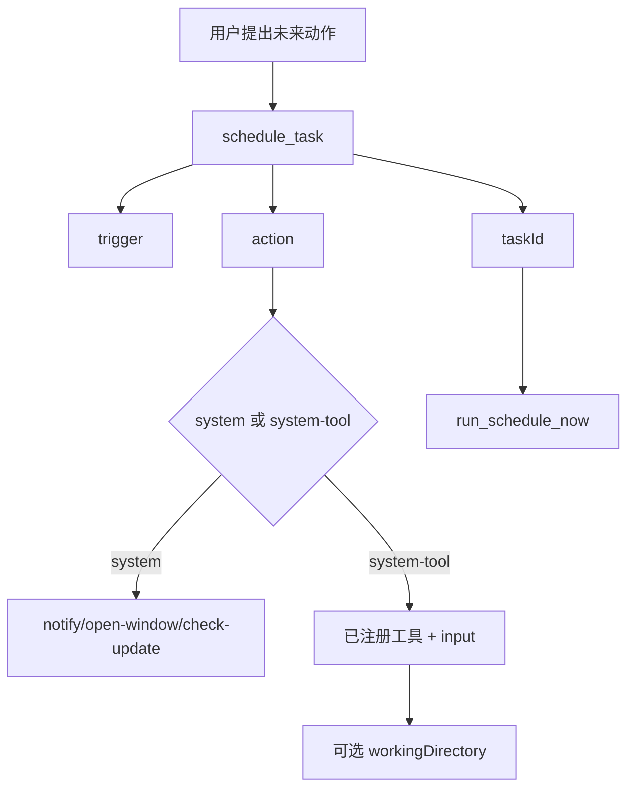
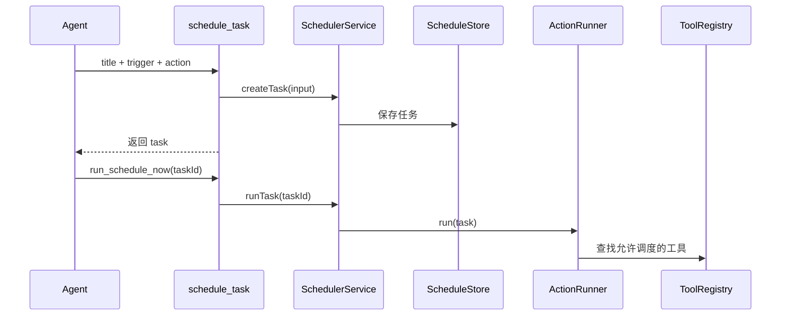

# E53：调度工具允许计划动作，但不接受原始 shell

小林说“明天早上提醒我确认车票”。这类需求不是立即回答，而是创建一个将来执行的任务。`schedule_task` 提供调度能力，但它刻意不接受任意 shell 命令。

本节阅读 [packages/core/src/lib/integrations/pi-agent/tools/schedule-tools.ts](../../../../packages/core/src/lib/integrations/pi-agent/tools/schedule-tools.ts)。

## 1. 触发器分为 once、interval、cron

[packages/core/src/lib/integrations/pi-agent/tools/schedule-tools.ts 第 13—28 行](../../../../packages/core/src/lib/integrations/pi-agent/tools/schedule-tools.ts#L13)：

```ts
const TriggerSchema = Type.Union([
  Type.Object({ type: Type.Literal("once"), runAt: Type.String() }),
  Type.Object({ type: Type.Literal("interval"), everyMs: Type.Number({ minimum: 1000 }) }),
  Type.Object({ type: Type.Literal("cron"), expression: Type.String() }),
]);
```

这三类触发器回答“什么时候运行”。一次性提醒用 `once`；周期检查用 `interval`；固定时间规则用 `cron`。

## 2. action 不接受 raw shell

[packages/core/src/lib/integrations/pi-agent/tools/schedule-tools.ts 第 30—45 行](../../../../packages/core/src/lib/integrations/pi-agent/tools/schedule-tools.ts#L30)：

```ts
const ActionSchema = Type.Union([
  Type.Object({
    type: Type.Literal("system"),
    command: Type.Union([
      Type.Literal("open-window"),
      Type.Literal("notify"),
      Type.Literal("check-update"),
    ]),
  }),
  Type.Object({
    type: Type.Literal("system-tool"),
    toolName: Type.String({ minLength: 1 }),
    input: Type.Record(Type.String(), Type.Unknown()),
    workingDirectory: Type.Optional(Type.String()),
  }),
]);
```

注意这里没有 `command: string` 的 shell 动作。调度可以运行安全系统动作或已注册系统工具，但不能让模型排一个任意命令明天执行。

## 3. 创建任务时保存 action 和 trigger

[packages/core/src/lib/integrations/pi-agent/tools/schedule-tools.ts 第 81—103 行](../../../../packages/core/src/lib/integrations/pi-agent/tools/schedule-tools.ts#L81)：

```ts
const task = await scheduler.createTask({
  title: params.title,
  description: params.description,
  trigger: params.trigger as ScheduleTrigger,
  action: normalizeAction(params.action),
  timezone: params.timezone,
});

if (params.action.type === "system-tool" && params.action.workingDirectory) {
  setToolContext(task.id, { sessionId: task.id, workingDirectory: params.action.workingDirectory });
}
```

如果调度的是系统工具，并且提供工作目录，源码会为这个任务 ID 设置工具上下文。这里的 `task.id` 类似一个调度执行会话的身份。



这张图强调：调度不是“把一句命令存起来以后执行”，而是把触发器和受限 action 存起来。

## 4. 失败边界

| 场景 | 行为 |
| --- | --- |
| interval 小于 1000ms | schema 不通过 |
| action 想传 raw shell | schema 没有这个形态 |
| system-tool 没有上下文 | 工具仍要自己执行边界检查 |
| taskId 不存在 | `runTask` 抛错并返回 `ok:false` |

## 5. 测试证据与缺口

调度工具依赖 scheduler 模块。本节只覆盖工具入口和 action 限制；调度器持久化、cron 解析和实际触发应在 scheduler 单元里单独验证。

## 6. 源码深读：延迟执行比立即执行更危险

立即工具调用至少发生在当前对话现场，用户能看到 Agent 正在做什么。调度任务不同：它把动作放到未来执行。未来执行时，用户可能已经离开当前界面，系统状态也可能变化。因此 `schedule_task` 的 action schema 必须比 `execute_command` 更保守。

源码允许两类 action。`system` 是固定枚举：打开窗口、通知、检查更新。`system-tool` 是调用系统工具，但必须提供 `toolName` 和结构化 `input`。这比保存一段 shell 字符串安全，因为系统仍能在运行时按工具注册表、schema 和上下文执行。

| 动作形态 | 是否允许 | 原因 |
| --- | --- | --- |
| `{ type:'system', command:'notify' }` | 允许 | 固定系统动作 |
| `{ type:'system-tool', toolName, input }` | 允许 | 仍走工具边界 |
| `{ command:'rm -rf tmp' }` | 不允许 | raw shell 不受调度 schema 接受 |

小林要“明天提醒确认车票”，合理 action 是 `system notify`。如果她要“明天重新读取预算表”，也应调度一个已注册工具，而不是保存一段 shell。

## 7. 源码链路补强与练习

### 7.1 调度工具保存的是“受限动作”，不是一段未来要执行的命令

`schedule_task` 从 [packages/core/src/lib/integrations/pi-agent/tools/schedule-tools.ts 第 81 行](../../../../packages/core/src/lib/integrations/pi-agent/tools/schedule-tools.ts#L81) 开始。它的参数由 `title`、`description`、`trigger`、`action`、`timezone` 组成。这里最重要的是 `trigger` 和 `action` 分离：trigger 决定何时运行，action 决定运行什么。很多调度系统出问题，就是把“何时”和“做什么”混在一段 shell 里保存。

trigger 有三种：一次性 `once`、间隔 `interval`、cron `cron`。action 有两类：`system` 和 `system-tool`。[packages/core/src/lib/integrations/pi-agent/tools/schedule-tools.ts 第 37 行](../../../../packages/core/src/lib/integrations/pi-agent/tools/schedule-tools.ts#L37) 明确 `system-tool` 必须是 `{ toolName, input, projectId?, workingDirectory? }`，不是 raw shell。工具描述也明确写着 never accepts raw shell commands。

创建任务时，工具会 new 一个 `SchedulerService`，调用 [packages/core/src/modules/scheduler/scheduler-service.ts 第 103 行](../../../../packages/core/src/modules/scheduler/scheduler-service.ts#L103) 的 `createTask()` 保存任务。如果 action 是 `system-tool` 且带 `workingDirectory`，还会调用 `setToolContext(task.id, { sessionId: task.id, workingDirectory })`。这一步说明：调度任务未来执行时也需要工具上下文，否则项目绑定的系统工具不知道应该在哪个目录工作。

真正运行任务时，`run_schedule_now` 会调用 [packages/core/src/modules/scheduler/scheduler-service.ts 第 153 行](../../../../packages/core/src/modules/scheduler/scheduler-service.ts#L153) 的 `runTask(taskId)`。如果任务 action 是 `system-tool`，默认 action runner 会进入 [packages/core/src/modules/scheduler/system-tool-runner.ts 第 9 行](../../../../packages/core/src/modules/scheduler/system-tool-runner.ts#L9)。这里还会继续检查：action 必须是 system-tool；工具 category 必须允许被调度；项目型 system-tool 必须有注入的 workingDirectory。



这张图解释了调度的风险：立即执行命令出错，影响发生在现在；调度任务出错，可能在用户离开后、上下文变化后、另一个时间点发生。因此调度工具必须保存结构化动作，而不是保存一段模型临时生成的 shell。

| 小林的需求 | 合理 action | 不合理 action |
| --- | --- | --- |
| “明天提醒我确认车票” | `{ type:'system', command:'notify' }` | shell 调系统通知 |
| “每天检查预算表” | `{ type:'system-tool', toolName:'read_spreadsheet', input:{...} }` | `cron + grep budget.csv` |
| “打开旅行计划窗口” | `{ type:'system', command:'open-window' }` | 保存任意打开命令 |

测试验收不能只测 `createTask` 成功，还要测 raw shell 无法通过 schema、system-tool action 需要合法工具、项目型任务需要工作目录、`runTask` 会记录运行结果。[packages/web/src/modules/scheduler/__tests__/scheduler-service.test.ts 第 1 行](../../../../packages/web/src/modules/scheduler/__tests__/scheduler-service.test.ts#L1) 和 [packages/core/src/modules/scheduler/system-tool-runner.ts 第 23 行](../../../../packages/core/src/modules/scheduler/system-tool-runner.ts#L23) 对应的限制共同说明：调度能力是工具体系的一部分，不是另开一扇绕过安全边界的门。

### 7.2 调度任务的三次边界检查

调度链路里至少有三次边界检查。

第一次在参数 schema。`action` 只接受 `system` 或 `system-tool`，所以 raw shell 在工具入参阶段就不应成立。第二次在任务执行器。`SystemToolRunner` 会检查 action 类型和工具 category，避免调度系统调用不适合后台执行的工具。第三次在具体工具内部。即使调度的是 `read_file`，文件工具仍然会做路径边界检查。

| 检查位置 | 解决的问题 |
| --- | --- |
| `schedule-tools.ts` 参数 schema | 不保存任意 shell |
| `system-tool-runner.ts` | 不运行不允许调度的工具 |
| 具体工具 execute | 继续执行自身路径、参数、安全检查 |

小林创建一个“明天读取预算表”的任务时，任务创建成功不代表未来读取一定成功。到执行时间，文件可能被删除，工作目录可能缺失，schema 可能不匹配。调度系统能保证的是任务形态受限、执行有记录；具体业务结果仍要看运行时工具返回。

纸面推演：小林要求“每天凌晨执行 `rm -rf tmp` 清理文件”，`schedule_task` 是否能直接保存这个 shell 命令？不能，因为 action schema 不接受 raw shell。

口头验收：读者应能解释为什么调度工具比立即命令执行更需要限制 action 形态。

## 8. 本节小结

调度工具把未来动作变成受限任务，而不是延迟执行任意命令。下一节看工具失败、重复调用和事件状态如何被识别。
