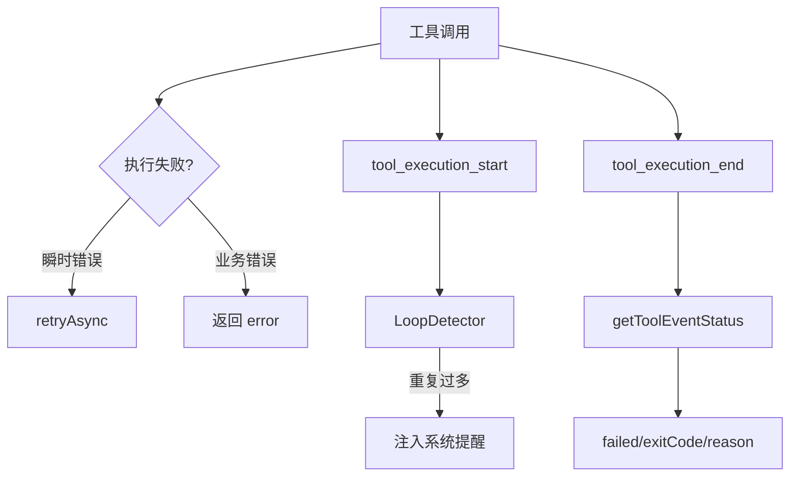
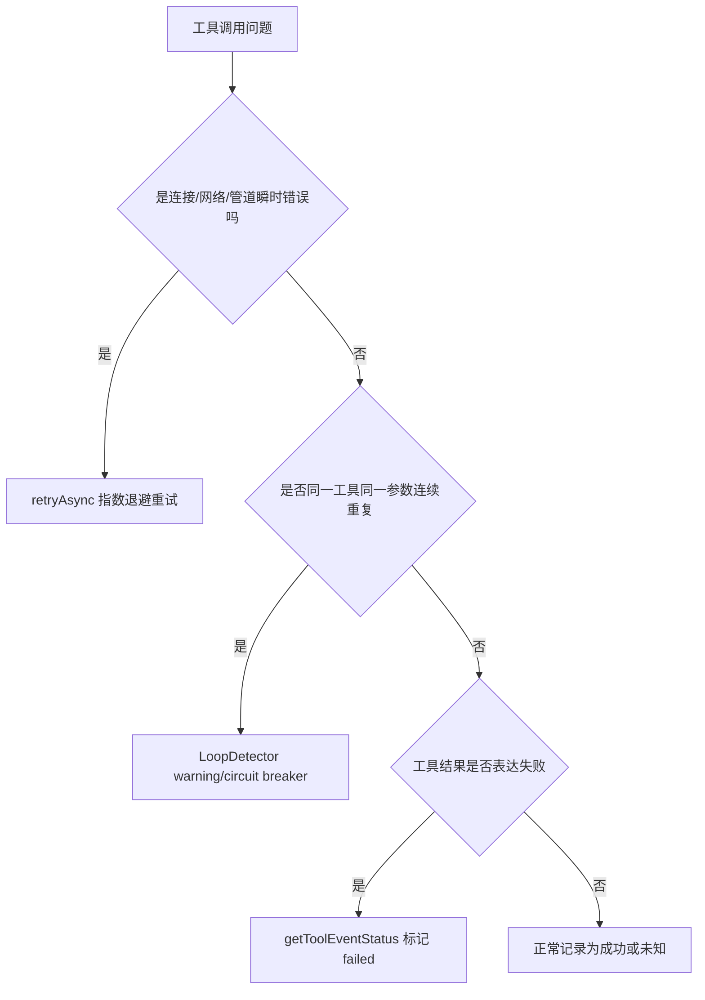

# E54：重试、循环保护和工具状态让工具调用可观测

工具一旦能执行，就会出现新的问题：网络瞬断要不要重试？模型反复调用同一个工具怎么办？工具返回的 `success:false` 怎样变成运行时可识别的失败？这些不是边角逻辑，而是 Agent 不失控的基础。

本节阅读 [packages/core/src/lib/integrations/pi-agent/tools/retry.ts](../../../../packages/core/src/lib/integrations/pi-agent/tools/retry.ts)、[packages/core/src/lib/integrations/pi-agent/tools/loop-detector.ts](../../../../packages/core/src/lib/integrations/pi-agent/tools/loop-detector.ts)、[packages/core/src/lib/integrations/pi-agent/core/tool-event-status.ts](../../../../packages/core/src/lib/integrations/pi-agent/core/tool-event-status.ts) 和 [packages/core/src/lib/integrations/pi-agent/core/agent.ts](../../../../packages/core/src/lib/integrations/pi-agent/core/agent.ts)。

## 1. 重试只针对瞬时错误

[packages/core/src/lib/integrations/pi-agent/tools/retry.ts 第 14—35 行](../../../../packages/core/src/lib/integrations/pi-agent/tools/retry.ts#L14)：

```ts
const TRANSIENT_ERROR_NAMES = new Set([
  'ClosedResourceError',
  'BrokenResourceError',
  'ConnectionResetError',
  'ECONNRESET',
  'ECONNREFUSED',
  'EPIPE',
]);

const TRANSIENT_ERROR_PATTERNS =
  /ECONNRESET|ECONNREFUSED|EPIPE|ETIMEDOUT|socket hang up|network timeout/i;
```

重试不是所有错误都重试。文件不存在、权限不足、参数错误这类业务错误，重试通常没有意义；网络断开、管道中断这类瞬时错误才适合重试。

## 2. retryAsync 使用指数退避

[packages/core/src/lib/integrations/pi-agent/tools/retry.ts 第 67—91 行](../../../../packages/core/src/lib/integrations/pi-agent/tools/retry.ts#L67)：

```ts
for (let attempt = 0; attempt <= maxRetries; attempt++) {
  try {
    return await fn();
  } catch (err) {
    if (attempt >= maxRetries || !shouldRetry(err, attempt)) {
      throw err;
    }
    const delay = Math.min(initialDelayMs * 2 ** attempt, maxDelayMs);
    await sleep(delay);
  }
}
```

默认最多重试 2 次，且延迟逐步增加。这样既给瞬时错误恢复机会，又避免无限循环。

## 3. LoopDetector 检测连续相同工具调用

[packages/core/src/lib/integrations/pi-agent/tools/loop-detector.ts 第 12—28 行](../../../../packages/core/src/lib/integrations/pi-agent/tools/loop-detector.ts#L12)：

```ts
const HISTORY_SIZE = 30;
const WARNING_THRESHOLD = 8;
const CIRCUIT_BREAKER = 20;

export type LoopDetectionResult =
  | { type: 'ok' }
  | { type: 'warning'; toolName: string; count: number; message: string }
  | { type: 'circuit_breaker'; toolName: string; count: number; message: string };
```

[packages/core/src/lib/integrations/pi-agent/tools/loop-detector.ts 第 42—70 行](../../../../packages/core/src/lib/integrations/pi-agent/tools/loop-detector.ts#L42) 会记录 `toolName + inputHash`，连续重复达到阈值时返回 warning 或 circuit breaker。

## 4. Agent 在 tool_start 时应用循环保护

[packages/core/src/lib/integrations/pi-agent/core/agent.ts 第 1026—1033 行](../../../../packages/core/src/lib/integrations/pi-agent/core/agent.ts#L1026)：

```ts
case "tool_execution_start":
  this.applyLoopProtection(event as any);
  this.state.uiState.activeTools.push({
    toolName: (event as any).toolName,
    startTime: Date.now(),
  });
  break;
```

[packages/core/src/lib/integrations/pi-agent/core/agent.ts 第 1168—1195 行](../../../../packages/core/src/lib/integrations/pi-agent/core/agent.ts#L1168) 会把循环检测结果变成 synthetic system message，提醒模型停止重复或换方法。

## 5. tool-event-status 从结果里识别失败

[packages/core/src/lib/integrations/pi-agent/core/tool-event-status.ts 第 83—111 行](../../../../packages/core/src/lib/integrations/pi-agent/core/tool-event-status.ts#L83)：

```ts
export function getToolEventStatus(event: { isError?: boolean; result?: unknown }): ToolEventStatus {
  for (const candidate of getStructuredResult(event.result)) {
    const exitCode = typeof candidate["exitCode"] === "number" ? candidate["exitCode"] : undefined;
    const failed = candidate["success"] === false
      || (exitCode !== undefined && exitCode !== 0)
      || (typeof candidate["error"] === "string" && candidate["error"].trim().length > 0);
    if (failed) {
      return { failed: true, exitCode, reason: getReason(candidate, exitCode) };
    }
  }
  if (event.isError) {
    return { failed: true, reason: getTextResult(event.result) || "SDK reported tool execution error" };
  }
  return { failed: false };
}
```

这段代码把不同工具的返回形态统一成“是否失败、退出码、原因”。这样日志、完成度保护和 UI 状态才能用同一套判断。



图中三条保护线分别处理不同问题：重试处理瞬时失败，循环检测处理重复无进展，状态解析处理结果可观测。

## 6. 失败边界

| 机制 | 能处理 | 不能处理 |
| --- | --- | --- |
| retry | 瞬时连接错误 | 参数错误、文件不存在 |
| LoopDetector | 连续相同工具和参数 | 不同参数但语义重复 |
| tool-event-status | 结构化失败结果 | 工具返回格式完全不规范时只能尽力解析 |

## 7. 测试证据与缺口

[packages/core/src/lib/integrations/pi-agent/tools/__tests__/loop-detector.test.ts](../../../../packages/core/src/lib/integrations/pi-agent/tools/__tests__/loop-detector.test.ts) 覆盖重复调用阈值；[packages/core/src/lib/integrations/pi-agent/core/__tests__/tool-event-status.test.ts](../../../../packages/core/src/lib/integrations/pi-agent/core/__tests__/tool-event-status.test.ts) 覆盖失败状态解析。`retry.ts` 的不同错误类型和真实网络中断仍需更细测试。

## 8. 源码深读：三种保护不要混为一谈

重试、循环检测、状态解析经常被混成“稳定性逻辑”，但它们处理的是不同问题。

| 机制 | 触发时机 | 处理对象 | 输出 |
| --- | --- | --- | --- |
| `retryAsync` | 工具内部包装异步操作 | 瞬时错误 | 重试或抛出 |
| `LoopDetector` | `tool_execution_start` | 连续相同工具和参数 | warning 或 circuit breaker |
| `getToolEventStatus` | `tool_execution_end` | 工具结果对象 | failed/exitCode/reason |

如果小林的 Agent 因网络断开读取 URL 失败，应该考虑重试；如果它连续 20 次读同一个不存在文件，重试没有意义，循环保护更关键；如果命令返回 `exitCode=1`，状态解析要把它识别为失败，供完成度保护或日志使用。

这里还要注意一个边界：`LoopDetector` 用 `JSON.stringify(value, Object.keys(value as any).sort())` 做稳定 hash。它擅长识别“完全相同参数”的重复调用，但不一定能识别语义相同、参数略变的循环。例如反复读 `output/a.md`、`./output/a.md`、`data/skills/x/output/a.md`，语义可能相同，但输入字符串不同。后续稳定性单元还会继续处理这类更复杂问题。

## 9. 源码链路补强与练习

### 9.1 retry、loop detector、status parser 是三种不同保护

E54 必须避免一个常见误解：只要工具失败了，就“重试一下”。源码实际把问题分成三类。第一类是瞬时错误，由 [packages/core/src/lib/integrations/pi-agent/tools/retry.ts 第 31 行](../../../../packages/core/src/lib/integrations/pi-agent/tools/retry.ts#L31) 的 `isTransientError` 判断，例如连接重置、管道中断、网络超时。第二类是重复循环，由 [packages/core/src/lib/integrations/pi-agent/tools/loop-detector.ts 第 34 行](../../../../packages/core/src/lib/integrations/pi-agent/tools/loop-detector.ts#L34) 的 `LoopDetector` 记录同一工具同一参数连续调用。第三类是结果状态识别，由 [packages/core/src/lib/integrations/pi-agent/core/tool-event-status.ts 第 83 行](../../../../packages/core/src/lib/integrations/pi-agent/core/tool-event-status.ts#L83) 从 `tool_execution_end` 事件里判断是否失败。

`retryAsync` 从 [packages/core/src/lib/integrations/pi-agent/tools/retry.ts 第 67 行](../../../../packages/core/src/lib/integrations/pi-agent/tools/retry.ts#L67) 开始。它先执行一次 `fn()`，失败后才判断是否应该重试。如果错误不是瞬时错误，立即抛出；如果是瞬时错误，就按指数退避等待。默认最多重试 2 次，初始延迟 300ms，最大 5000ms。它适合网络连接类问题，不适合“文件不存在”“参数错了”“权限不允许”这类业务错误。

`LoopDetector` 处理的是另一个问题：模型可能陷入“用同样参数反复调用同一个工具”的循环。它不是看工具成功失败，而是看调用模式。当连续次数达到 warning 阈值时提醒，达到 circuit breaker 阈值时要求停止重复调用。Agent 在 [packages/core/src/lib/integrations/pi-agent/core/agent.ts 第 1173 行](../../../../packages/core/src/lib/integrations/pi-agent/core/agent.ts#L1173) 处理 `tool_execution_start` 时会记录这种模式。

`getToolEventStatus` 则用于解释结束事件。工具返回可能有多种失败形态：`isError:true`、`success:false`、`ok:false`、`exitCode !== 0`、`error` 字段等。状态解析器把这些不同形态归一化，让后续完成度保护、UI 展示和日志分析能用同一套标准理解“这次工具调用失败了吗”。



| 机制 | 看什么 | 不看什么 | 错用后果 |
| --- | --- | --- | --- |
| `retryAsync` | 异常类型和消息 | 工具语义是否正确 | 把业务错误重复执行 |
| `LoopDetector` | 工具名 + 参数 hash + 连续次数 | 单次执行是否成功 | 无法修复网络瞬断 |
| `getToolEventStatus` | 结束事件结果字段 | 是否应该重试 | 只能识别状态，不能改变执行 |

小林的旅行 Agent 连续 20 次读取 `output/budget.csv`，每次都得到 File not found。此时正确机制是循环保护和错误状态展示，不是 retry。因为文件不存在不是瞬时连接错误。相反，如果网络读取旅行攻略 URL 时出现 `ECONNRESET`，可以 retry，但重试后仍失败就必须把失败返回给模型，而不是无限循环。

测试也应按三类机制分别验收。[packages/core/src/lib/integrations/pi-agent/tools/__tests__/loop-detector.test.ts 第 1 行](../../../../packages/core/src/lib/integrations/pi-agent/tools/__tests__/loop-detector.test.ts#L1) 证明连续调用会触发 warning/circuit breaker；[packages/core/src/lib/integrations/pi-agent/core/__tests__/tool-event-status.test.ts 第 1 行](../../../../packages/core/src/lib/integrations/pi-agent/core/__tests__/tool-event-status.test.ts#L1) 证明不同失败形态能被统一识别；retry 则应测瞬时错误重试、非瞬时错误不重试、达到最大次数后抛出。三者都通过，才能说工具系统“可观测、可恢复、可停止”。

纸面推演：模型连续 20 次用完全相同参数调用 `read_file`，系统应该沉默吗？不应该，`LoopDetector` 会触发 circuit breaker 级别提醒。

口头验收：读者应能解释为什么 `exitCode !== 0`、`success:false`、`error` 字段都可能表示工具失败。

## 10. 本节小结

工具调用必须可恢复、可停止、可解释。下一节把 E41-E54 合成一次完整验收。
