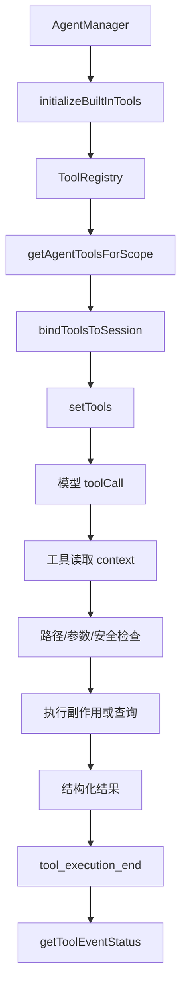
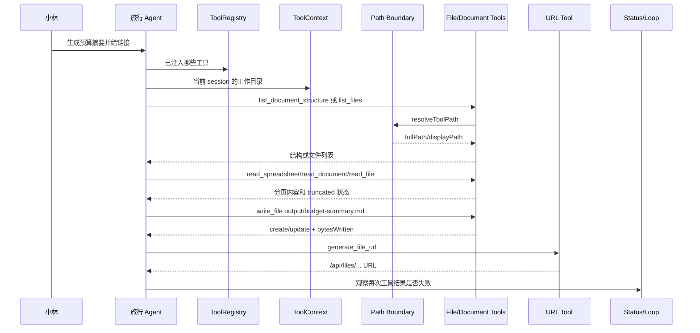

# E55：Tools 单元工作坊

本单元已经把工具注册、作用域、上下文、路径、文件、命令、URL、文档、本体、提问、调度、重试、循环保护和事件状态讲完。E55 不再引入新的大模块，而是把这些内容合成一次源码级验收：小林的旅行 Agent 要读取预算表、修改摘要、生成链接，并在不确定时向用户确认。

## 1. 一句话总图



这张图把 E41-E54 的主链串起来。读者要能指出每个节点解决什么问题：注册解决工具来源，scope 解决可见性，绑定解决会话隔离，路径和安全检查解决越权风险，结构化结果解决下一轮推理和日志可观测。

## 2. 源码覆盖验收表

| 课程 | 必须能解释的源码 | 合格判断 |
| --- | --- | --- |
| E41 | [packages/core/src/lib/integrations/pi-agent/tools/index.ts](../../../../packages/core/src/lib/integrations/pi-agent/tools/index.ts)、[packages/core/src/lib/integrations/pi-agent/tools/registry.ts](../../../../packages/core/src/lib/integrations/pi-agent/tools/registry.ts)、[packages/core/src/lib/integrations/pi-agent/agent-manager.ts](../../../../packages/core/src/lib/integrations/pi-agent/agent-manager.ts) | 能区分工具文件存在、注册、进入 Agent |
| E42 | [packages/core/src/lib/integrations/pi-agent/tools/registry.ts 第 95 行](../../../../packages/core/src/lib/integrations/pi-agent/tools/registry.ts#L95)、[packages/core/src/lib/integrations/pi-agent/tools/registry.ts 第 238 行](../../../../packages/core/src/lib/integrations/pi-agent/tools/registry.ts#L238) | 能说明 enabled、scopes、agentType 三道门 |
| E43 | [packages/core/src/lib/integrations/pi-agent/tools/context.ts](../../../../packages/core/src/lib/integrations/pi-agent/tools/context.ts)、[packages/core/src/lib/integrations/pi-agent/tools/bind-session.ts](../../../../packages/core/src/lib/integrations/pi-agent/tools/bind-session.ts) | 能解释 defaultContext 风险和 session 绑定 |
| E44 | [packages/core/src/lib/integrations/pi-agent/tools/path-utils.ts](../../../../packages/core/src/lib/integrations/pi-agent/tools/path-utils.ts) | 能说明 dataRoot、workingDirectory、绝对路径和越界检查 |
| E45 | [packages/core/src/lib/integrations/pi-agent/tools/file-tools.ts 第 160 行](../../../../packages/core/src/lib/integrations/pi-agent/tools/file-tools.ts#L160) | 能解释行号、分页和 `isPartialView` |
| E46 | [packages/core/src/lib/integrations/pi-agent/tools/file-tools.ts 第 276 行](../../../../packages/core/src/lib/integrations/pi-agent/tools/file-tools.ts#L276)、[packages/core/src/lib/integrations/pi-agent/tools/file-tools.ts 第 379 行](../../../../packages/core/src/lib/integrations/pi-agent/tools/file-tools.ts#L379) | 能解释完整覆盖、唯一匹配、replaceAll |
| E47 | [packages/core/src/lib/integrations/pi-agent/tools/file-tools.ts 第 527 行](../../../../packages/core/src/lib/integrations/pi-agent/tools/file-tools.ts#L527)、[packages/core/src/lib/integrations/pi-agent/tools/file-tools.ts 第 631 行](../../../../packages/core/src/lib/integrations/pi-agent/tools/file-tools.ts#L631) | 能解释 symlink 越界和递归删除风险 |
| E48 | [packages/core/src/lib/integrations/pi-agent/tools/bash-tools.ts](../../../../packages/core/src/lib/integrations/pi-agent/tools/bash-tools.ts) | 能解释 shell 选择、安全黑名单、timeout、输出截断 |
| E49 | [packages/core/src/lib/integrations/pi-agent/tools/url-tools.ts](../../../../packages/core/src/lib/integrations/pi-agent/tools/url-tools.ts)、[packages/core/src/lib/integrations/pi-agent/tools/system-tools.ts](../../../../packages/core/src/lib/integrations/pi-agent/tools/system-tools.ts) | 能解释 URL 只允许 dataRoot 内文件，时间来自工具 |
| E50 | [packages/core/src/lib/integrations/pi-agent/tools/document-tools.ts](../../../../packages/core/src/lib/integrations/pi-agent/tools/document-tools.ts) | 能解释结构探测、文档分页、表格抽取 |
| E51 | [packages/core/src/lib/integrations/pi-agent/tools/ontology-tools.ts](../../../../packages/core/src/lib/integrations/pi-agent/tools/ontology-tools.ts)、[packages/core/src/lib/integrations/pi-agent/tools/ontology-data-tools.ts](../../../../packages/core/src/lib/integrations/pi-agent/tools/ontology-data-tools.ts) | 能区分结构层和实例层 |
| E52 | [packages/core/src/lib/integrations/pi-agent/tools/ask-user-question-tools.ts](../../../../packages/core/src/lib/integrations/pi-agent/tools/ask-user-question-tools.ts) | 能解释 onUpdate 卡片数据和 YAML 返回 |
| E53 | [packages/core/src/lib/integrations/pi-agent/tools/schedule-tools.ts](../../../../packages/core/src/lib/integrations/pi-agent/tools/schedule-tools.ts) | 能解释 trigger、action 和不接受 raw shell |
| E54 | [packages/core/src/lib/integrations/pi-agent/tools/retry.ts](../../../../packages/core/src/lib/integrations/pi-agent/tools/retry.ts)、[packages/core/src/lib/integrations/pi-agent/tools/loop-detector.ts](../../../../packages/core/src/lib/integrations/pi-agent/tools/loop-detector.ts)、[packages/core/src/lib/integrations/pi-agent/core/tool-event-status.ts](../../../../packages/core/src/lib/integrations/pi-agent/core/tool-event-status.ts) | 能解释重试、循环保护和失败状态统一 |

## 3. 最小源码窗口：一次工具链路如何成立

[packages/core/src/lib/integrations/pi-agent/agent-manager.ts 第 159—170 行](../../../../packages/core/src/lib/integrations/pi-agent/agent-manager.ts#L159)：

```ts
initializeBuiltInTools();
const context: ToolExecutionContext = {
  sessionId,
  workingDirectory: options?.agentBaseDir,
};
setToolContext(sessionId, context);
getToolContextManager().setDefaultContext(context);
```

[packages/core/src/lib/integrations/pi-agent/agent-manager.ts 第 298—304 行](../../../../packages/core/src/lib/integrations/pi-agent/agent-manager.ts#L298)：

```ts
const scopeTools = getAgentToolsForScope(options?.agentType);
const tools = bindToolsToSession(
  filterDisallowedToolsForAgentType(scopeTools, options?.agentType),
  sessionId
);
agent.setTools(tools as AgentTool<any>[]);
```

这两段代码已经包含工具调用成立的四个前提：工具已注册、按类型过滤、有会话上下文、绑定到当前 session。缺一个，后面的 `read_file` 或 `execute_command` 都可能不可用或用错目录。

## 4. 三个纸面调试题

题目一：Agent 调用 `read_file('output/plan.md')` 返回越界错误。应该先查模型回答还是路径上下文？

合格答案：先查路径上下文。确认 `workingDirectory` 是否被 `setToolContext` 注入，再看 `resolveToolPath` 如何解析相对路径。

题目二：Agent 调用 `edit_file` 修改“预算待确认”失败，提示匹配多处。应该让模型再试同样参数吗？

合格答案：不应该。应补充更长 `oldString` 上下文，或明确 `replaceAll:true`。反复同参数调用会触发循环保护风险。

题目三：`execute_command` 返回 `success:false`，但 stdout 里有部分结果。能不能当成功？

合格答案：不能直接当成功。命令工具以 `exitCode === 0` 判断 `success`，stdout 只是输出内容，不等于业务成功。

## 5. 测试证据与缺口

| 测试文件 | 能证明什么 | 不能证明什么 |
| --- | --- | --- |
| [packages/core/src/lib/integrations/pi-agent/tools/__tests__/registry.test.ts](../../../../packages/core/src/lib/integrations/pi-agent/tools/__tests__/registry.test.ts) | 注册表、启停、scope 过滤 | 所有 UI 入口都传对 `agentType` |
| [packages/core/src/lib/integrations/pi-agent/tools/__tests__/working-directory.test.ts](../../../../packages/core/src/lib/integrations/pi-agent/tools/__tests__/working-directory.test.ts) | 工具上下文和路径边界 | 用户看到的错误提示足够清晰 |
| [packages/core/src/lib/integrations/pi-agent/tools/__tests__/bash-tools-shell.test.ts](../../../../packages/core/src/lib/integrations/pi-agent/tools/__tests__/bash-tools-shell.test.ts) | shell 选择和 helper 行为 | 任意 shell 命令都是安全的 |
| [packages/core/src/lib/integrations/pi-agent/tools/__tests__/url-tools.test.ts](../../../../packages/core/src/lib/integrations/pi-agent/tools/__tests__/url-tools.test.ts) | URL 生成和 dataRoot 边界 | `/api/files` 的完整浏览器下载体验 |
| [packages/core/src/lib/integrations/pi-agent/tools/__tests__/document-tools.test.ts](../../../../packages/core/src/lib/integrations/pi-agent/tools/__tests__/document-tools.test.ts) | 文档/表格读取核心路径 | 所有真实复杂 Office 文件都可解析 |
| [packages/core/src/lib/integrations/pi-agent/tools/__tests__/loop-detector.test.ts](../../../../packages/core/src/lib/integrations/pi-agent/tools/__tests__/loop-detector.test.ts) | 重复调用阈值 | 语义相同但参数不同的循环 |
| [packages/core/src/lib/integrations/pi-agent/core/__tests__/tool-event-status.test.ts](../../../../packages/core/src/lib/integrations/pi-agent/core/__tests__/tool-event-status.test.ts) | 工具失败状态解析 | 所有非规范工具返回都能完美识别 |

## 6. Given/When/Then 验收

| Given | When | Then |
| --- | --- | --- |
| 工具文件存在但未注册 | 创建 Agent | 该工具不会出现在可用工具集合 |
| 工具声明 scopes 不包含当前 agentType | 获取工具列表 | 当前 Agent 看不到它 |
| 工具上下文没有 workingDirectory | 文件工具解析路径 | 返回边界未配置错误 |
| 文件中 oldString 出现多次 | 调用 edit_file 且 replaceAll=false | 返回多匹配错误 |
| 命令输出超过截断阈值 | 调用 execute_command | 返回 `stdoutTruncated:true` 和 hash |
| 调度任务 action 传 raw shell | 调用 schedule_task | schema 不接受该 action 形态 |
| 工具返回 success:false | 处理 tool_execution_end | `getToolEventStatus` 识别为失败 |

## 7. 按三项标准自查

| 审查项 | 本单元应达到的状态 |
| --- | --- |
| 源码完全覆盖 | 所有 `tools/` 主文件、注册链路、Agent 注入链路、核心测试文件都有去向 |
| 讲解深度 | 每节不仅讲工具用途，还讲参数、执行分支、返回形态、失败边界 |
| 新手友好 | 每节用小林旅行场景进入，用图表和纸面调试题帮助读者复述 |

## 8. 综合链路补强与练习

### 8.1 一次完整工具任务应该怎样验收

这一节不能只让读者背出工具名，而要让读者能检查一条真实任务链是否成立。以“小林让 Agent 生成旅行预算摘要并给出可打开链接”为例，完整链路至少包含七步。



第一步，看工具是否存在。读者要能从 [packages/core/src/lib/integrations/pi-agent/tools/index.ts 第 43 行](../../../../packages/core/src/lib/integrations/pi-agent/tools/index.ts#L43) 说出 `initializeBuiltInTools()` 负责把工具加入注册表。没有这一步，后面所有调用都不会发生。

第二步，看当前 Agent 是否有资格使用工具。读者要能从 [packages/core/src/lib/integrations/pi-agent/tools/registry.ts 第 95 行](../../../../packages/core/src/lib/integrations/pi-agent/tools/registry.ts#L95) 解释 `enabled`、`scopes`、`agentType` 的关系。如果工具被 scope 过滤掉，模型不是“不想用”，而是运行时没有把这个工具交给它。

第三步，看工具上下文是否绑定正确。读者要能从 [packages/core/src/lib/integrations/pi-agent/tools/context.ts 第 32 行](../../../../packages/core/src/lib/integrations/pi-agent/tools/context.ts#L32) 解释 sessionId 和 workingDirectory 的关系。预算摘要写到哪里，不由模型随口决定，而由工具上下文决定。

第四步，看路径是否在边界内。读者要能从 [packages/core/src/lib/integrations/pi-agent/tools/path-utils.ts 第 54 行](../../../../packages/core/src/lib/integrations/pi-agent/tools/path-utils.ts#L54) 解释为什么 `../`、边界外绝对路径、Windows 绝对路径会被拒绝。路径解析不是拼接字符串，而是安全证明。

第五步，看读取策略是否匹配材料。普通文本可以 `read_file`；Word/Markdown 长文档可以 `read_document`；Excel/CSV 应先 `list_document_structure` 再 `read_spreadsheet`；只关心表格时用 `extract_document_tables`。如果 `truncated:true`，读者必须知道要继续用 cursor 或 offset 分页读取。

第六步，看写入是否可解释。`write_file` 返回 `create/update` 和 `bytesWritten`；`edit_file` 返回 `replacementCount`。这决定 Agent 应怎样向小林说明“我新建了摘要”还是“我更新了原摘要”。

第七步，看结果状态和循环保护。命令类工具要读 `exitCode`；一般工具要看 `success/ok/error`；连续重复调用要考虑 [packages/core/src/lib/integrations/pi-agent/tools/loop-detector.ts 第 34 行](../../../../packages/core/src/lib/integrations/pi-agent/tools/loop-detector.ts#L34)；结束事件要能被 [packages/core/src/lib/integrations/pi-agent/core/tool-event-status.ts 第 83 行](../../../../packages/core/src/lib/integrations/pi-agent/core/tool-event-status.ts#L83) 识别。

| 验收点 | 合格表现 | 不合格表现 |
| --- | --- | --- |
| 注册 | 能指出工具来自哪组内置工具 | 只说“Agent 自带工具” |
| scope | 能解释为什么某类 Agent 看不到某工具 | 把不可见都归因于 UI |
| context | 能说明工作目录来自 session | 认为路径由模型自由决定 |
| path | 能判断越界输入会失败 | 只会拼路径 |
| read | 能根据材料选择读取工具并处理分页 | 直接全文读取所有材料 |
| write/edit | 能区分覆盖和局部替换 | 修改前不读文件 |
| status | 能读懂 success、exitCode、truncated、error | 只看 stdout 或自然语言结论 |

如果读者能按这七步复述一条任务链，就说明他开始掌握工具系统；如果只能说“Agent 调用工具读文件写文件”，还停留在表层。

纸面推演 / 综合练习：请读者在纸上写出“小林让 Agent 生成旅行预算摘要”的完整工具计划，至少包含：

1. 先用 `list_files` 或 `list_document_structure` 找到预算材料。
2. 如果是普通 Markdown/Text，用 `read_file` 分段读取；如果是 Excel，用 `read_spreadsheet` 或 `extract_document_tables`。
3. 生成摘要后，用 `write_file` 写入 `output/budget-summary.md`。
4. 如果用户要求可打开链接，用 `generate_file_url` 生成 URL。
5. 如果住宿偏好不明确，用 `ask_user_question` 让用户选择。
6. 每一步都写明 `workingDirectory`、可能失败点和结果字段。

口头验收：读者应能用一分钟解释这条链路：工具不是模型的无限权限，而是注册表中经过作用域过滤、绑定会话上下文、受路径和参数约束的执行器。每次执行必须返回结构化结果，失败也要能被 `getToolEventStatus` 识别。

如果读者只能说“Agent 调工具读文件”，还不合格；必须说出注册、scope、context、path boundary、result status 五个关键词。

## 9. 本单元小结

Tools 单元的核心原则是：工具不是模型的无限权限，而是运行时交给 Agent 的受限执行器。它必须先注册，再按作用域过滤，再绑定会话上下文，最后在路径、安全、参数和结果状态的约束下执行。下一单元会继续追问：这些工具、流式事件和长会话同时运行时，系统如何保持稳定并留下可观测证据。
