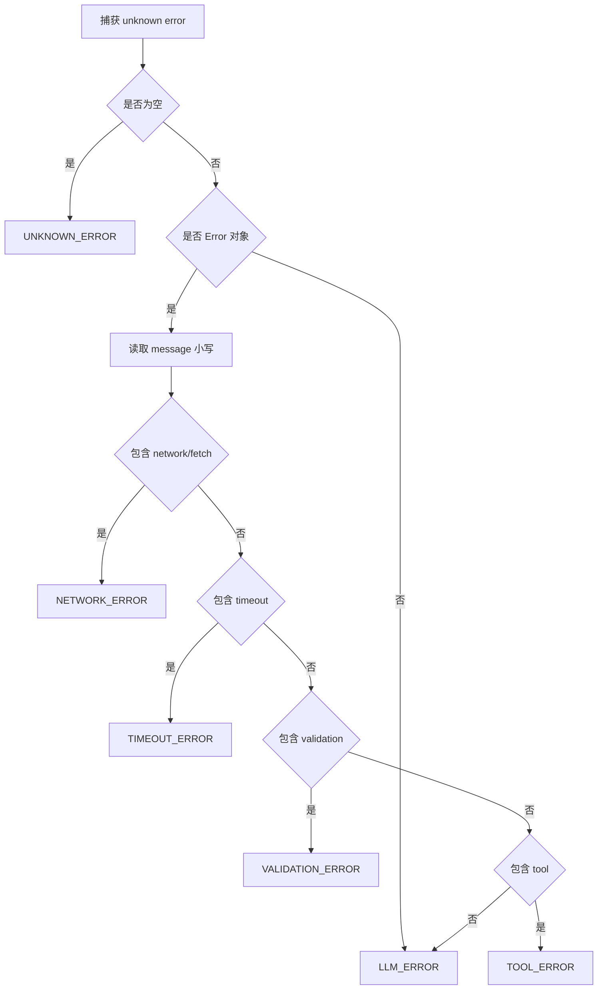
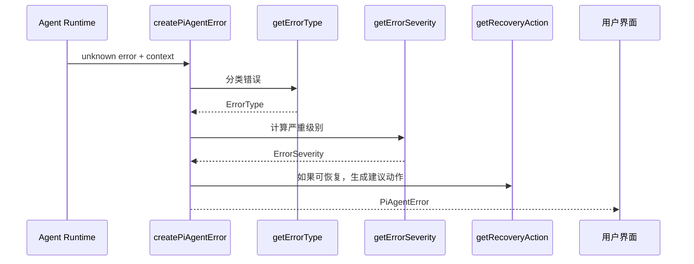

# E56：错误必须先分类，系统才知道怎样恢复

## 1. 这一节解决什么问题

小林让旅行 Agent 读取预算表时，可能遇到很多失败：网络断了、模型服务报错、工具读文件失败、参数不合法、请求超时。用户看到的都可能只是“失败了”，但运行时不能把它们混成一类。

稳定性的第一步不是“重试”，而是“分类”。只有先知道错误属于网络、工具、模型、校验、超时还是未知，系统才知道它是否可恢复、应该提示用户什么、是否建议重试。

## 2. 源码入口

本节核心源码是 [packages/core/src/lib/integrations/pi-agent/error-handler.ts 第 1 行](../../../../packages/core/src/lib/integrations/pi-agent/error-handler.ts#L1)。

它定义了三层对象：

| 对象 | 作用 |
| --- | --- |
| `ErrorType` | 错误类型：网络、工具、模型、校验、超时、未知 |
| `ErrorSeverity` | 严重级别：LOW、MEDIUM、HIGH、CRITICAL |
| `PiAgentError` | 统一错误对象，包含类型、级别、消息、是否可恢复和恢复建议 |

```ts
export interface PiAgentError {
  type: ErrorType;
  severity: ErrorSeverity;
  message: string;
  details?: unknown;
  recoverable: boolean;
  timestamp: number;
  recovery?: {
    type: 'retry' | 'continue' | 'abort' | 'manual';
    label: string;
    description?: string;
  };
}
```

这段类型说明：运行时不是只保存一段错误字符串。它要把错误变成结构化对象，后续 UI、日志、恢复逻辑才能读懂。

## 3. 错误分类的执行链路

[packages/core/src/lib/integrations/pi-agent/error-handler.ts 第 53 行](../../../../packages/core/src/lib/integrations/pi-agent/error-handler.ts#L53) 的 `getErrorType(error)` 通过错误消息做基础分类。包含 `network` 或 `fetch` 时归为网络错误；包含 `timeout` 时归为超时；包含 `validation` 时归为校验；包含 `tool` 时归为工具；其他 `Error` 默认归为 LLM 错误；空值归为未知。



这张图表达的是：分类规则目前是启发式的，不是完整异常体系。它能覆盖常见错误，但不能保证所有错误都被正确识别。准确地说，它只是运行时把混乱异常整理成统一错误对象的第一层，不是“可靠诊断 AI”。

## 4. 严重级别和恢复建议

错误类型确定后，[packages/core/src/lib/integrations/pi-agent/error-handler.ts 第 76 行](../../../../packages/core/src/lib/integrations/pi-agent/error-handler.ts#L76) 的 `getErrorSeverity` 决定严重级别：

| 错误类型 | 严重级别 | 为什么 |
| --- | --- | --- |
| NETWORK_ERROR | MEDIUM | 通常可以重试 |
| TIMEOUT_ERROR | MEDIUM | 可能是临时慢或阻塞 |
| TOOL_ERROR | LOW | 往往可换工具或改参数 |
| VALIDATION_ERROR | LOW | 用户或上游输入不合法 |
| LLM_ERROR | HIGH | 模型服务层失败，影响当前对话 |
| UNKNOWN_ERROR | MEDIUM | 无法判断，保守处理 |

[packages/core/src/lib/integrations/pi-agent/error-handler.ts 第 119 行](../../../../packages/core/src/lib/integrations/pi-agent/error-handler.ts#L119) 的 `isRecoverable` 再判断能否恢复。网络、超时、工具错误被认为可恢复；校验和 LLM 错误默认不可恢复。

这不是说工具错误一定能自动修好，而是说工具错误通常还有下一步空间。例如 `read_file` 文件不存在，可以换路径、先列目录或询问用户；网络错误可以重试；但校验错误表示请求数据本身不合法，盲目重试没有意义。

## 5. 小林案例：同样失败，恢复策略不同

| 小林看到的现象 | 运行时分类 | 合理下一步 |
| --- | --- | --- |
| “网络连接错误” | NETWORK_ERROR | 建议重试 |
| “请求超时” | TIMEOUT_ERROR | 稍后重试或缩小任务 |
| “read_file failed” | TOOL_ERROR | 换路径、列目录、继续对话 |
| “Validation failed” | VALIDATION_ERROR | 修正参数，不盲目重试 |
| “服务器错误” | LLM_ERROR | 报告失败，等待服务恢复 |

如果小林说“继续生成预算摘要”，Agent 上一次是网络错误，系统可以建议重试；如果上一次是预算文件路径不合法，正确动作不是重试，而是重新确认文件路径。

## 6. 测试证据与缺口

[packages/core/src/lib/integrations/pi-agent/__tests__/error-handler.test.ts 第 1 行](../../../../packages/core/src/lib/integrations/pi-agent/__tests__/error-handler.test.ts#L1) 覆盖了错误类型枚举、严重级别、友好消息、是否可恢复、恢复动作和 ErrorHandler 的历史记录。

测试能证明：

- `Network connection failed` 会被识别为 `NETWORK_ERROR`；
- `Request timeout` 会被识别为 `TIMEOUT_ERROR`；
- 工具错误会保留原始信息；
- 网络和超时会得到 retry 建议；
- LLM 和 validation 默认不可恢复。

测试没有证明：所有真实线上错误都能被准确分类。因为源码分类依赖 message 关键词，真实错误消息如果没有包含这些词，可能落到默认分支。后续要提升准确性，可以让底层模块抛出带 code 的结构化错误，而不是只靠字符串。

## 7. 源码链路补强：从 unknown error 到用户可见恢复动作

现在按执行顺序完整复述一次。运行时捕获到的是 `unknown`，这表示 TypeScript 不知道它一定是 `Error` 对象，也不知道里面有没有 `message`。`createPiAgentError(error, context)` 的第一步是调用 `getErrorType(error)`。如果直接假设 error 一定有 `message`，遇到字符串、null 或第三方异常对象时，错误处理本身也会崩掉。

第二步是根据 errorType 计算 severity。这里没有读取原始错误的堆栈，也没有根据 sessionId 做差异化判断，说明当前严重级别是类型驱动的。网络和超时是 MEDIUM，工具和校验是 LOW，LLM 是 HIGH。这个设计适合作为基础层，但不是最终告警系统。真正的生产告警还可能结合失败次数、影响用户数、是否发生在关键路径等信息。

第三步是生成用户友好的 message。注意 `TOOL_ERROR` 和 `VALIDATION_ERROR` 会带上原始信息，而 `LLM_ERROR` 返回更通用的“服务器错误，请稍后重试”。这是为了避免把底层模型服务细节暴露给用户。小林需要知道“旅行 Agent 暂时不能继续”，不一定需要看到 provider 的内部异常。

第四步是判断 recoverable。如果可恢复，才生成 recovery。这样 UI 可以根据 `recovery.type` 显示“重试”“继续”或“查看详情”等动作。



这张图说明：错误对象是逐步丰富出来的。每一步都增加一类信息：类型、级别、消息、是否可恢复、恢复动作。

## 8. 新手必须分清的两个层次

错误处理有两个层次：内部诊断和用户表达。

| 层次 | 面向谁 | 应包含什么 | 不应包含什么 |
| --- | --- | --- | --- |
| 内部诊断 | 开发者、日志、运行时 | 原始 error、context、toolName、sessionId | 不应丢失原始细节 |
| 用户表达 | 小林这样的最终用户 | 友好消息、能否重试、下一步建议 | 不应暴露敏感堆栈和内部密钥 |

`PiAgentError.details` 保存原始 error，`message` 则是用户友好描述。这种分层能避免两个极端：一种是只给用户“未知错误”，无法排查；另一种是把完整堆栈和内部路径直接展示给用户，造成安全和体验问题。

## 9. 调试时怎样使用 ErrorContext

`ErrorContext` 可以包含 `operation`、`sessionId`、`toolName`、`requestId`。目前源码主要在工具错误恢复建议里使用 `toolName`，但这个结构给后续扩展留下了位置。

例如小林的会话出现工具错误：

```ts
createPiAgentError(error, {
  operation: "sendMessage",
  sessionId: "trip-session-001",
  toolName: "read_file",
});
```

这能回答三个问题：

| 问题 | 来源 |
| --- | --- |
| 哪个会话失败 | `sessionId` |
| 哪个操作失败 | `operation` |
| 哪个工具失败 | `toolName` |

如果没有 context，错误仍然能分类，但排查会变慢。课程在这里要让读者理解：可观测性不是只靠 console.log，而是从错误对象创建时就把上下文放进去。

## 10. 本节最低源码阅读顺序

读者不需要一开始记住所有枚举，但必须能按顺序读懂下面这条链：

1. 先看 `ErrorType`，知道系统把失败分成哪几类。
2. 再看 `getErrorType`，知道分类依据目前主要来自错误消息。
3. 再看 `getErrorSeverity`，知道不同类型如何映射严重级别。
4. 再看 `getErrorMessage`，知道用户看到的消息和原始错误不同。
5. 再看 `isRecoverable`，知道哪些类型允许恢复。
6. 最后看 `ErrorHandler`，知道错误会被保存到内存历史里。

这条阅读顺序比从文件第一行机械读到最后更适合新手。它把一个错误对象的形成过程串起来，也能帮助读者以后排查“为什么这个错误没有重试”或“为什么这个错误显示成服务器错误”。

| 排查问题 | 应读函数 |
| --- | --- |
| 错误被归错类 | `getErrorType` |
| 级别看起来太高或太低 | `getErrorSeverity` |
| 用户提示不友好 | `getErrorMessage` |
| 没有重试按钮 | `isRecoverable`、`getRecoveryAction` |
| 最近错误查不到 | `ErrorHandler.getLastError` |

小林的案例中，如果工具真实错误是 `ENOENT: no such file`，但消息里没有 `tool`，当前 `getErrorType` 可能不会归为 `TOOL_ERROR`。这是一项必须正视的源码边界：错误分类依赖上游如何包装错误。更稳健的运行时应让工具层抛出更明确的工具错误。

## 11. 纸面推演 / 口头验收

纸面推演：小林让 Agent 读取 `budget.xlsx`，工具返回 `Tool 'read_file' failed: file not found`。这属于哪类错误？是否可恢复？合理下一步是什么？

合格答案：它会被归为 `TOOL_ERROR`，可恢复。下一步不应重复同一路径读取，而应先 `list_files` 或询问小林正确路径。

口头验收：读者应能解释“错误分类、严重级别、恢复建议”不是三段文案，而是运行时后续决策的输入。

## 12. 本节小结

错误处理的核心不是把异常翻译成中文，而是把异常变成可判断、可展示、可恢复的结构化对象。下一节进入流式输出：即使没有报错，重复流片段也会破坏阅读体验。
