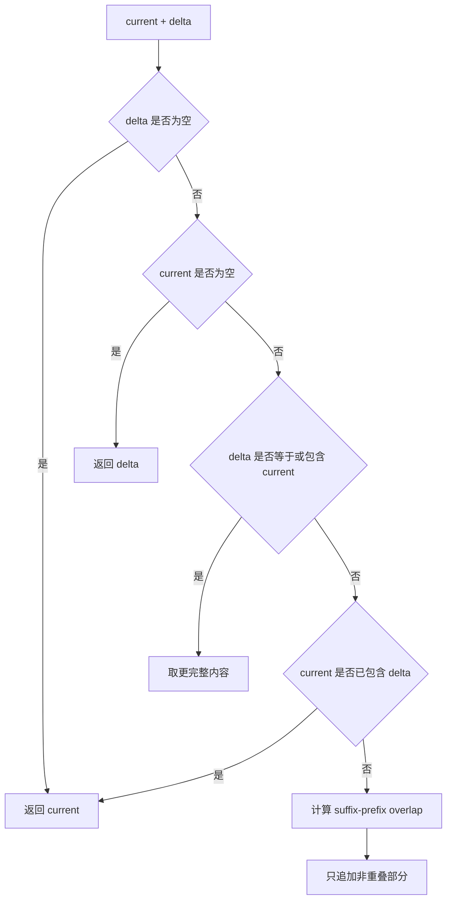
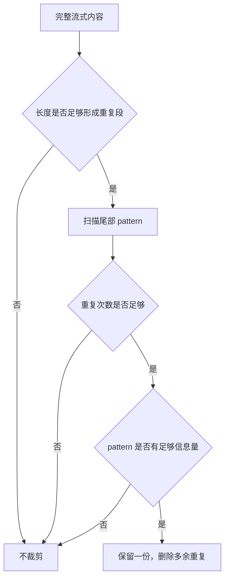

# E57：流式去重防止重复文本变成“事实”

## 1. 这一节解决什么问题

流式输出不是一次性 JSON。模型服务可能一段一段返回，也可能返回“累计全文”。如果运行时把每个 delta 都直接拼上去，小林可能看到同一句旅行建议重复两遍、三遍，甚至结尾不断循环。

稳定性不只是“服务不崩”。对聊天界面来说，重复文本会让用户误以为 Agent 反复强调某个结论，也会污染最终会话历史。因此流式输出需要去重、合并和最终对齐。

## 2. 源码入口

本节核心源码是 [packages/core/src/lib/integrations/pi-agent/stream-dedupe.ts 第 1 行](../../../../packages/core/src/lib/integrations/pi-agent/stream-dedupe.ts#L1)，关键函数有四个：

| 函数 | 作用 |
| --- | --- |
| `appendStreamDelta` | 把新 delta 合并进当前内容，同时去掉重复前缀或重叠部分 |
| `getVisibleStreamDelta` | 返回合并后的全文，以及真正应该显示的新 delta |
| `trimRepeatingTail` | 删除尾部重复生成段落，只保留一份 |
| `reconcileFinalStreamContent` | 流式内容和最终内容不一致时做最终对齐 |

## 3. delta 合并不是简单相加

`appendStreamDelta(current, delta)` 的判断顺序很关键：

| 判断 | 结果 | 例子 |
| --- | --- | --- |
| delta 为空 | 返回 current | 没有新内容 |
| current 为空 | 返回 delta | 第一段内容 |
| delta 等于 current | 返回 current | 服务重复发了全文 |
| delta 以 current 开头 | 返回 delta | 服务发的是累计全文 |
| current 以 delta 开头 | 返回 current | 服务发了较短重复前缀 |
| current 以 delta 结尾 | 返回 current | 重复尾巴 |
| 存在后缀/前缀重叠 | 拼接非重叠部分 | 防止半句重复 |



这张图说明：流式合并处理的是“提供商输出形态不稳定”的问题。运行时不能假设 delta 一定是纯增量。

## 4. 最终内容为什么还要 reconcile

流式过程中展示的内容可能和最终 message_end 里的内容不同。`reconcileFinalStreamContent(streamed, finalContent)` 处理三种情况：

- final 为空：保留 streamed；
- streamed 为空：使用 final；
- final 以 streamed 开头：追加 final 中的新尾巴；
- streamed 以 final 开头：保留更长内容；
- 两者差异较大：以 final 为准。

小林看到的旅行计划，最终应以模型最终消息为准，而不是以中间流片段为准。中间流是阅读体验，最终消息是会话记录。两者一致最好；不一致时要有明确规则。

## 5. 重复尾巴：比重复 delta 更隐蔽

`trimRepeatingTail` 处理的是另一类问题：模型可能在回答尾部重复生成同一段话。源码不是删除所有重复短词，而是要求 pattern 足够长、重复次数足够多，并且有足够信息量。

这能避免误伤普通语言。例如“好好好”不该触发复杂裁剪；但一整段“现在我将继续读取文件并生成报告”重复三四次，就应被裁掉。

| 保护点 | 作用 |
| --- | --- |
| `minPatternLength` | 避免短词误判 |
| `minRepetitions` | 避免正常引用被裁 |
| `hasEnoughSignal` | 要求重复段有足够信息 |
| fuzzy similarity | 处理近似重复 |

## 6. Agent 事件中如何使用

在 [packages/core/src/lib/integrations/pi-agent/core/agent.ts 第 1077 行](../../../../packages/core/src/lib/integrations/pi-agent/core/agent.ts#L1077) 附近，`message_update` 遇到 `text_delta` 时，会调用 `getVisibleStreamDelta`。它把 provider 发来的 delta 合并进 `assistantStreamContent`，并把真正可见的新片段写回事件。

这意味着前端收到的不是原始 provider delta，而是运行时清洗后的 delta。这样 UI 不必自己猜“这是重复帧还是新增帧”。

## 7. 测试证据与缺口

[packages/core/src/lib/integrations/pi-agent/__tests__/stream-dedupe.test.ts 第 1 行](../../../../packages/core/src/lib/integrations/pi-agent/__tests__/stream-dedupe.test.ts#L1) 覆盖了：

- 重复全文 delta 会被丢弃；
- provider 发送累计全文时只显示新增后缀；
- 长工具结果后的大前缀也能识别；
- 最终内容不会重复流式前缀；
- 重复尾巴和近似重复尾巴会被裁剪；
- 普通短词重复不会被误裁。

测试没有证明所有语言都能完美去重。尤其是高度相似但语义不同的段落，仍可能接近阈值。去重逻辑应保守，宁可漏掉少量重复，也不要删掉用户需要的真实内容。

## 8. 源码链路补强：为什么要同时处理“重复帧”和“重复尾巴”

流式重复有两种形态。第一种发生在传输层：provider 发送的 delta 不是纯新增，而是累计全文或带重叠前缀。`appendStreamDelta` 处理这一类。第二种发生在生成层：模型自己在答案末尾重复生成同一段话。`trimRepeatingTail` 处理这一类。

| 重复类型 | 发生位置 | 例子 | 处理函数 |
| --- | --- | --- | --- |
| 重复帧 | 流式事件合并 | current 是 `上海`，delta 又是 `上海` | `appendStreamDelta` |
| 累计全文 | provider 输出策略 | delta 是 `上海预算已整理` | `getVisibleStreamDelta` |
| 前后重叠 | 网络或桥接层 | current 末尾和 delta 开头重复 | `longestSuffixPrefixOverlap` |
| 重复尾巴 | 模型生成内容 | 同一长段落重复 3 次 | `trimRepeatingTail` |

如果只处理重复帧，模型尾部循环仍会保留下来；如果只处理重复尾巴，流式累计全文会在 UI 上重复出现。因此这两个机制必须同时存在。

## 9. 去重为什么要保守

`trimRepeatingTail` 不是看到重复就删除。它先检查内容长度是否达到 `minPatternLength * minRepetitions`，再扫描尾部 pattern。即使命中重复，也要通过 `hasEnoughSignal(pattern)`，要求 compact 后长度足够、字符种类足够、词类 token 足够，或者包含中文。

这样做的原因是：自然语言里存在正常重复。比如“好，好，好”可能是用户语气，不应该被裁成一个“好”。真正需要裁剪的是长段落重复，因为它会严重污染上下文。



这张图说明：去重目标是减少明显异常，而不是替模型重新写答案。

## 10. 最终对齐与用户信任

小林看到的过程内容和最终保存的消息必须尽量一致。`reconcileFinalStreamContent` 的存在就是为了解决“过程中显示过，最终结果又来一遍”的问题。

如果最终内容以 streamed 开头，说明 streamed 是前缀，补上尾巴即可；如果 streamed 以 final 开头，说明最终消息较短，保留更完整的 streamed；如果两者无法对齐，使用 finalContent。这是一个明确的权威规则：最终消息优先，但不制造重复。

| 情况 | 处理 | 用户体验 |
| --- | --- | --- |
| final 是 streamed 的延长 | 补尾巴 | 平滑完成 |
| streamed 比 final 更长 | 保留完整 streamed | 不丢已显示内容 |
| 两者差异大 | 使用 final | 以最终消息为准 |

调试流式问题时，读者应问三个问题：provider 发的是纯 delta 还是累计全文？运行时是否做了 visible delta？最终 message_end 是否又补发了一份完整内容？这三个问题能定位大多数“为什么重复显示”的问题。

## 11. 源码阅读顺序：先看正常合并，再看异常裁剪

建议按下面顺序读 [packages/core/src/lib/integrations/pi-agent/stream-dedupe.ts 第 1 行](../../../../packages/core/src/lib/integrations/pi-agent/stream-dedupe.ts#L1)：

1. 先读 `appendStreamDelta`，理解 current 和 delta 的基本合并。
2. 再读 `getVisibleStreamDelta`，理解为什么 UI 只需要显示新增部分。
3. 再读 `longestSuffixPrefixOverlap`，理解半句重叠如何被消掉。
4. 再读 `trimRepeatingTail`，理解模型尾部循环如何裁剪。
5. 最后读 `reconcileFinalStreamContent`，理解最终消息怎样覆盖或补齐流式内容。

这个顺序对应了真实问题的发生顺序：流式事件先到，UI 先显示；最后 message_end 到达，系统再做最终对齐。重复尾巴可以发生在中间，也可以发生在最终内容上。

## 12. 小林案例：同一句话为什么不能出现两次

假设旅行 Agent 输出：

```text
已整理上海三日游预算。
已整理上海三日游预算。
下面是明细……
```

用户可能会误以为第一句话被强调了两次，或者系统生成了两个预算版本。对聊天系统来说，显示内容就是用户理解的依据。重复文本如果进入历史，还会影响后续模型：模型可能以为这是用户或系统认可的重要结论。

因此流式去重保护的不只是“好看”，还包括后续推理上下文。

| 重复进入哪里 | 后果 |
| --- | --- |
| 只进入 UI | 用户阅读体验变差 |
| 进入 session history | 后续模型重复引用 |
| 进入日志 | 排查时误以为 provider 真的多次生成 |
| 进入最终文件 | 用户资产被污染 |

## 13. 边界：去重不能代替语义审查

去重只处理文本形态，不判断内容是否正确。小林的预算里如果“酒店 800 元”被模型错误写成“酒店 80 元”，去重不会发现。相反，如果同一段预算表因为格式需要重复出现，去重也不应该过度删除。

这就是为什么本节和 E60、E61 要连起来读：E57 保证流式文本不重复；E60 判断任务是否真的完成；E61 判断工具是否失败或重复调用。每个机制只解决一个维度。

## 14. 本节调试清单

当小林反馈“回答里重复了一大段”，读者应按下面顺序排查：

1. 查看 provider 原始事件：它发的是 delta 还是累计全文。
2. 查看 `message_update` 中 `text_delta` 是否经过 `getVisibleStreamDelta`。
3. 查看 `assistantStreamContent` 是否保存了合并后的完整内容。
4. 查看 `loggedStreamContent` 是否也做了去重，避免日志重复。
5. 查看最终 `message_end` 是否又带来一份完整 finalContent。
6. 查看是否需要 `reconcileFinalStreamContent` 对齐。
7. 如果重复发生在尾部，查看 `trimRepeatingTail` 是否达到触发阈值。

| 排查结果 | 说明 |
| --- | --- |
| 原始事件重复，但 visible delta 为空 | 去重生效 |
| visible delta 仍重复 | 合并规则未覆盖该形态 |
| UI 不重复但日志重复 | 日志流没有做相同处理 |
| 中间不重复，最终重复 | final reconcile 有问题 |
| 长段尾巴重复 | 需要检查 tail trimming |

这张清单能帮助读者把“重复了”拆成具体位置，而不是笼统怀疑模型。

## 15. 本节最低验收标准

读者学完本节，至少要能手写出三个例子：重复全文 delta、累计全文 delta、后缀前缀重叠 delta。还要能说明 `getVisibleStreamDelta` 为什么返回两个字段：`content` 是运行时保存的完整文本，`delta` 是 UI 本次真正新增显示的文本。只会说“去重就是删除重复字”还不合格。

## 16. 纸面推演 / 口头验收

纸面推演：当前显示为 `上海预算已整理`，下一帧 delta 是 `上海预算已整理，下面是明细`。最终显示应该是什么？可见新增 delta 是什么？

合格答案：最终内容是 `上海预算已整理，下面是明细`，可见新增 delta 是 `，下面是明细`。

口头验收：读者应能解释“流式 delta”不一定等于“只新增的字符”，运行时必须先合并去重再交给 UI。

## 17. 本节小结

流式去重保护的是用户看到的文本和最终会话历史。下一节继续看：即使 delta 正确，渲染太频繁也会拖垮页面。
