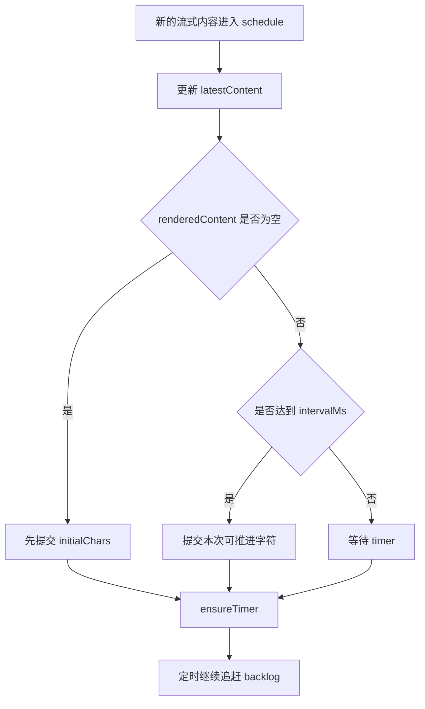
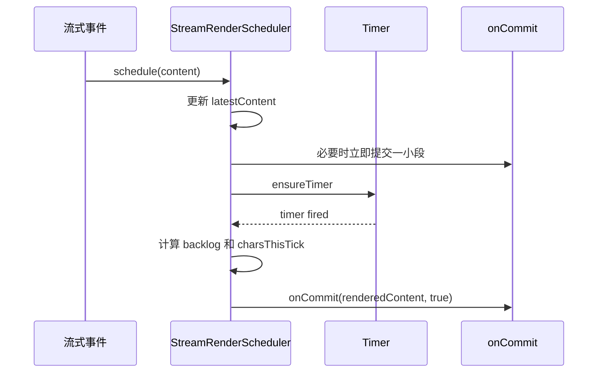

# E58：流式渲染需要调度器，而不是无限 setState

## 1. 这一节解决什么问题

模型流式输出时，后端可能快速发来大量文本片段。如果前端每收到一个字符都立刻更新状态，小林会看到界面卡顿，浏览器不断重排，长回答时甚至影响输入框响应。

所以稳定性不只在服务端。客户端也需要渲染调度：把最新内容保存下来，再按节奏提交给 UI。

## 2. 源码入口

核心源码是 [packages/core/src/lib/integrations/pi-agent/stream-render-scheduler.ts 第 1 行](../../../../packages/core/src/lib/integrations/pi-agent/stream-render-scheduler.ts#L1)。

`StreamRenderScheduler` 接收一个 `onCommit(content, isStreaming)` 回调。外部不断调用 `schedule(content)`，调度器决定什么时候把内容提交给 UI。

关键配置：

| 配置 | 默认含义 |
| --- | --- |
| `intervalMs` | 每次定时提交间隔，默认 32ms |
| `initialChars` | 第一屏先显示多少字符 |
| `minCharsPerTick` | 每次至少推进多少字符 |
| `maxCharsPerTick` | 每次最多推进多少字符 |
| `catchUpTicks` | backlog 较大时分几次追赶 |

## 3. 调度器内部保存两份内容

源码里有两个核心字段：

| 字段 | 含义 |
| --- | --- |
| `latestContent` | 目前收到的最新完整内容 |
| `renderedContent` | 已经提交给 UI 的内容 |

这两个字段不相等时，说明 UI 落后于输入流。调度器要逐步把 `renderedContent` 推进到 `latestContent`，但不能每个字符都提交。



这张图说明：输入事件和渲染提交不是一回事。输入可以很快，渲染必须有节奏。

## 4. finish 为什么必须立即交付最终内容

`finish(content)` 用于流结束。源码会把最终内容设置成 `latestContent`，如果剩余内容还没渲染完，会先提交剩余部分，再调用 `commitFinal()`。这样最终交付不依赖浏览器定时器。

这很重要。假设小林等待旅行计划生成，流式中已经显示了大半，但最后几句还在 timer 队列里。如果 message_end 到达后还等定时器，UI 可能短暂停在未完成状态。`finish` 的职责就是确保最终内容权威落地。

## 5. UTF-16 边界保护

源码里的 `safeUtf16Boundary` 防止把 emoji 等代理对字符切开。比如 `A😀B` 中的 😀 在 JS 字符串里占两个 code unit。如果调度器在中间切开，UI 可能显示乱码。这个细节说明：渲染调度不是只关心性能，也关心文本正确性。

## 6. cancel 和 flush 的区别

| 方法 | 作用 |
| --- | --- |
| `schedule` | 输入新内容，按节奏渲染 |
| `finish` | 流结束，提交最终内容 |
| `flush` | 立即把指定内容写到 UI |
| `cancel` | 取消后续 timer，不再接受更新 |

小林中途关闭窗口时，应调用类似 cancel 的逻辑停止渲染；如果服务端已经给出最终内容，应使用 finish 或 flush 让 UI 收敛到确定状态。

## 7. 测试证据与缺口

[packages/core/src/lib/integrations/pi-agent/__tests__/stream-render-scheduler.test.ts 第 1 行](../../../../packages/core/src/lib/integrations/pi-agent/__tests__/stream-render-scheduler.test.ts#L1) 覆盖了：

- 大量字符不会触发过多 commit；
- flush 会立即提交并取消 timer；
- finish 不依赖 renderer timer；
- 输入事件可以作为节流渲染时钟；
- 重复 finish 不会重复 final commit；
- cancel 后忽略后续更新；
- 不切断 UTF-16 surrogate pair。

测试能证明调度器本身可靠，但不能证明所有真实 UI 组件都正确使用它。真正的端到端验收还要看用户界面是否只渲染当前 session 的流、窗口关闭后是否停止更新、长文本是否仍能输入。

## 8. 源码链路补强：一次 schedule 到底发生了什么

现在按源码顺序拆开 `schedule(content)`。第一步，如果调度器已经 inactive，直接返回。这保护的是窗口关闭或流取消后的晚到事件。没有这一步，已关闭窗口仍可能继续 setState。

第二步，清空 `lastFinalizedContent`，说明新的流式输入意味着之前 final 状态不再适用。第三步，如果新内容不以已渲染内容开头，调度器会把 `renderedContent` 回退到两者公共前缀。这处理的是流式内容被修正或最终内容分叉的情况。

第四步，把 `latestContent` 更新成最新输入。第五步，如果当前还没有渲染内容，就先提交 `initialChars`；否则，如果已经超过 `intervalMs`，就提交当前积压内容的一部分。最后调用 `ensureTimer()` 安排后续追赶。



这张图要表达：调度器不是简单延迟，而是在输入事件和 timer 之间共同推进 UI。

## 9. backlog 怎样决定每次提交多少

timer 触发时，源码计算：

```ts
const backlog = this.latestContent.length - this.renderedContent.length;
const charsThisTick = Math.min(
  this.maxCharsPerTick,
  Math.max(this.minCharsPerTick, Math.ceil(backlog / this.catchUpTicks))
);
```

这段逻辑很适合教学。backlog 越大，每次推进越多；但不会少于 `minCharsPerTick`，也不会超过 `maxCharsPerTick`。这就是“自适应追赶”：小输出慢慢打字，大输出加速追赶，避免一直落后。

| backlog | 策略 |
| --- | --- |
| 很小 | 至少推进 `minCharsPerTick` |
| 中等 | 按 `backlog / catchUpTicks` 推进 |
| 很大 | 不超过 `maxCharsPerTick` |

小林让 Agent 生成完整旅行攻略时，前几句可以逐步出现，长段落不能卡半天。调度器的目标不是模拟人类打字，而是在“可读”和“不卡”之间取平衡。

## 10. finish、flush、cancel 的使用边界

这三个方法最容易混：

| 方法 | 典型场景 | 注意点 |
| --- | --- | --- |
| `finish(content)` | 服务端确认本条消息结束 | 最终会 `isStreaming=false` |
| `flush(content)` | 外部要立即同步完整内容 | 会清掉 pending timer |
| `cancel()` | 窗口关闭、请求中止、会话切换 | 后续 schedule/flush 不应生效 |

如果小林切换到另一个会话，旧会话的晚到 delta 不应该继续写到新会话 UI。`cancel` 和前面 E17 的 session identity 共同保护这个边界。渲染调度只解决“怎么提交内容”，不解决“内容属于哪个会话”；这两个问题要分层处理。

## 11. 为什么测试要关心 commit 次数

[packages/core/src/lib/integrations/pi-agent/__tests__/stream-render-scheduler.test.ts 第 1 行](../../../../packages/core/src/lib/integrations/pi-agent/__tests__/stream-render-scheduler.test.ts#L1) 里有一个关键断言：10000 个字符输入后，`onCommit` 调用次数要小于 100。这个测试不是性能洁癖，而是在证明调度器确实减少了 UI 更新频率。

如果没有调度器，10000 个字符可能触发几千次甚至上万次状态更新。React 状态更新、Markdown 渲染、代码高亮、滚动定位都会被重复触发。用户看到的不是“更实时”，而是卡顿。

| 没有调度器 | 有调度器 |
| --- | --- |
| 每个 delta 都 setState | 按 interval 和 backlog 批量提交 |
| 长文本拖慢 UI | 长文本分批追赶 |
| final 可能依赖 timer | finish 立即提交最终内容 |
| emoji 可能被切坏 | safe UTF-16 boundary |

## 12. 新手要避免的三个误解

第一，流式渲染不是越快越好。太快的提交会让浏览器忙于渲染，反而让用户感觉慢。

第二，调度器不是数据源。它不决定模型说什么，也不处理重复 delta；重复 delta 属于 E57，调度器只处理提交节奏。

第三，最终一致性比打字动画重要。用户最终看到和历史保存的内容必须正确，动画只是体验层。

## 13. 调试 UI 卡顿时的排查路线

| 问题 | 检查点 |
| --- | --- |
| 长回答卡顿 | `onCommit` 次数是否过多 |
| 结尾迟迟不出现 | `finish` 是否被调用 |
| 切换会话仍更新旧内容 | `cancel` 或 session identity 是否生效 |
| emoji 乱码 | 是否在 UTF-16 中间切开 |
| 流式重复 | 回到 E57 检查 dedupe |

小林的旅行计划可能包含表格、列表、Markdown 标题和链接。每次 commit 都可能触发 Markdown 重新解析。调度器的价值在这种长内容里才最明显。

## 14. 源码边界：调度器不拥有会话，也不拥有消息

`StreamRenderScheduler` 是一个纯调度对象。它不知道小林是谁，不知道 sessionId，也不知道这段内容属于哪个窗口。它只知道三件事：最新内容、已渲染内容、什么时候提交。

这带来一个重要边界：如果上层把错误 session 的内容传给它，它仍然会认真渲染。会话隔离必须在更上层完成；调度器只负责“传进来的内容如何平滑提交”。

| 职责 | 属于调度器吗 |
| --- | --- |
| 控制提交频率 | 是 |
| 避免切坏 emoji | 是 |
| 判断内容属于哪个 session | 否 |
| 判断文本是否重复 | 否，属于 stream-dedupe |
| 判断任务是否完成 | 否，属于 completion guard |

这能帮助读者形成工程边界意识。一个类做少量明确的事情，比把所有稳定性问题都塞进一个大函数更可靠。

## 15. 小林案例：为什么最终提交必须 `isStreaming=false`

前端通常会根据 `isStreaming` 显示光标、加载状态或“正在生成”。如果最终 commit 仍然标记为 streaming，用户会以为 Agent 还没说完；如果中间 commit 标记为非 streaming，用户又会以为答案提前结束。

所以 `finish` 先提交内容，再用 `commitFinal()` 发送 `isStreaming=false`。这个布尔值不是装饰，它是 UI 状态机的输入。

## 16. 本节最低验收标准

读者必须能解释四个字段：`latestContent`、`renderedContent`、`timer`、`finalizing`。其中 `latestContent` 代表输入端最新内容，`renderedContent` 代表 UI 已看到内容，`timer` 代表后续追赶任务，`finalizing` 代表当前正在收尾。能说清这四个字段，才算真正理解调度器。

还要能把字段和测试断言对应起来。`stream-render-scheduler.test.ts` 不是只测试“有没有调用 commit”，而是在确认三个工程性质：第一，分批提交时不能丢掉末尾内容；第二，正在收尾时不能再排入新的普通 timer；第三，包含 emoji 或组合字符的文本不能被截成非法片段。对新手来说，读测试时不要只看 expect 的数字，而要把数字翻译成用户体验：小林看到的是逐步增长的回答、完整的字符、明确结束的流式状态。

还有一个容易忽略的点：调度器每次比较的是完整字符串前缀，而不是“本轮新增 token”。这意味着上层如果传来的是累计内容，调度器可以用 `renderedContent.length` 判断还差多少；如果上层突然传来一段更短或不连续的内容，调度器无法自行修复语义错误。这个边界必须讲清楚，否则读者会误以为渲染调度器同时承担了去重、补齐、纠错和会话隔离。

## 17. 纸面推演 / 口头验收

纸面推演：`latestContent` 有 10000 个字符，`renderedContent` 只有 100 个字符。调度器应该一次性提交 9900 个字符，还是分批追赶？为什么？

合格答案：应按配置分批追赶，并在 finish 时提交最终内容。这样既保护渲染性能，又保证最终正确。

口头验收：读者应能解释 `latestContent` 和 `renderedContent` 的区别。

## 18. 本节小结

流式渲染调度保护的是页面性能和最终一致性。下一节看长会话：当历史越来越长，系统怎样保留最近失败和工具轨迹。
