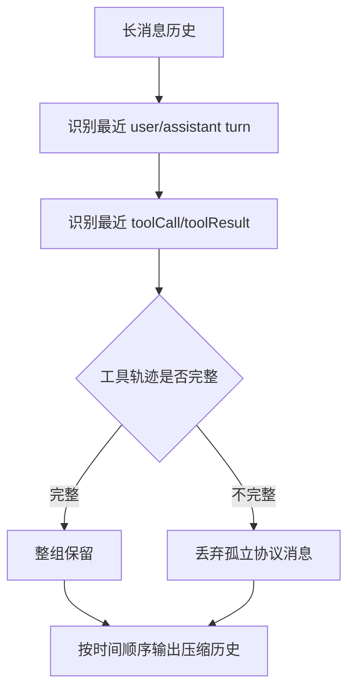
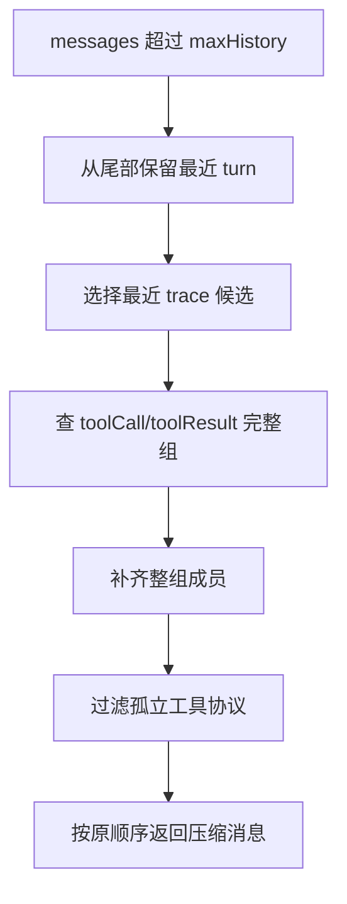

# E59：长会话压缩必须保留最近失败和工具轨迹

## 1. 这一节解决什么问题

小林反复让 Agent 修改毕业旅行计划，历史会越来越长。长会话不能无限塞进模型上下文，否则成本高、速度慢，也可能超出模型限制。但如果简单删掉旧消息，又可能删掉关键失败原因，让 Agent 重复同一个错误。

所以长会话压缩不是“只保留最后几条”，而是要保留最近任务、失败原因、用户纠正和完整工具调用协议。

## 2. 源码入口

核心源码是 [packages/core/src/lib/integrations/pi-agent/recent-trace-compression.ts 第 1 行](../../../../packages/core/src/lib/integrations/pi-agent/recent-trace-compression.ts#L1) 和 [packages/core/src/lib/integrations/pi-agent/runtime-working-summary.ts 第 1 行](../../../../packages/core/src/lib/integrations/pi-agent/runtime-working-summary.ts#L1)。

前者负责压缩消息列表；后者负责从最近消息中提取运行时工作摘要。

## 3. 压缩前先识别工具轨迹组

`compressRecentTrace(messages, options)` 会先调用内部逻辑收集工具轨迹组。一个完整工具轨迹包括：

- assistant 消息里有 `toolCall`；
- 后续有对应 `toolResult`；
- 每个 toolCall 恰好有一个结果；
- 工具结果紧邻且归属明确。

为什么要保留整组？因为工具调用和工具结果是一个协议单元。只保留 `toolResult`，模型会看到孤立结果，不知道谁调用的；只保留 `toolCall`，模型会以为工具还没返回。

这张图说明：压缩不是随机裁剪，而是先保护协议完整性。

## 4. 最近失败比旧计划更重要

源码默认保留最近若干消息和最近若干工具轨迹。它关注的不是“最早的计划”，而是“最近发生了什么”。在 Agent 长会话中，最近失败通常比旧计划更重要。

例如小林之前让 Agent 用 `read_file('old-plan.md')`，结果文件不存在。后来她说“如果旧计划不可用，就换一种方式”。压缩后必须保留这条失败和纠正，否则 Agent 可能又读取 `old-plan.md`。

| 信息 | 压缩时优先级 |
| --- | --- |
| 最近用户要求 | 高 |
| 最近失败原因 | 高 |
| 最近工具调用和结果 | 高 |
| 用户纠正“不要重复” | 高 |
| 很早以前的计划草稿 | 低 |

## 5. Working Summary 不是长期记忆

[packages/core/src/lib/integrations/pi-agent/runtime-working-summary.ts 第 55 行](../../../../packages/core/src/lib/integrations/pi-agent/runtime-working-summary.ts#L55) 的 `buildRuntimeWorkingSummary` 会提取三类短信息：

| 字段 | 作用 |
| --- | --- |
| `currentTask` | 最近用户任务 |
| `failureReason` | 最近失败原因 |
| `doNotRepeat` | 禁止重复动作或改用策略 |

这不是长期记忆。它是当前运行时的临时摘要，用来防止模型在同一任务里重复错误。小林的长期偏好，例如“喜欢慢旅行”，应该进入记忆；而“本轮 old-plan.md 不存在”只是当前任务状态。

## 6. 测试证据与缺口

[packages/core/src/lib/integrations/pi-agent/__tests__/recent-trace-compression.test.ts 第 1 行](../../../../packages/core/src/lib/integrations/pi-agent/__tests__/recent-trace-compression.test.ts#L1) 覆盖了：

- 短历史不压缩；
- 长历史压缩时保留最近 assistant 和工具轨迹；
- 保留最近 user-assistant 成对 turn；
- 工具调用和工具结果跨边界时整组保留；
- 孤立或不完整工具协议会被丢弃。

[packages/core/src/lib/integrations/pi-agent/__tests__/long-session-stability.test.ts 第 1 行](../../../../packages/core/src/lib/integrations/pi-agent/__tests__/long-session-stability.test.ts#L1) 进一步验证：压缩后仍保留 `old-plan.md` 不存在、不要重复 read_file、用户要求换方式等关键信息。

测试缺口是：这些测试使用构造消息，不等于真实模型长会话一定都能被摘要完美处理。真实场景中，失败原因可能写得不规范，`runtime-working-summary` 的关键词提取可能漏掉。后续可以增加更结构化的失败事件输入。

## 7. 源码链路补强：压缩为什么要先保留最近 turn

`compressRecentTrace` 先建立 `preservedIndexes` 和 `recentIndexes`。它从消息尾部向前扫描，优先保留最近消息。当遇到 assistant 消息时，还会尝试把前一条 user 消息一起保留。这样做是为了保留最近的“用户要求—助手响应”配对，而不是只保留 assistant 的尾巴。

如果只保留最后几条 assistant 消息，模型可能看到“准备继续旧计划”，却看不到用户刚说的“旧计划不可用就换一种方式”。这会让压缩后的上下文失去方向。

第二步，它从最近的 assistant 和 trace 消息中保留 `preserveTraceCount` 个候选。第三步，如果候选属于完整工具组，就把整组成员都加入 preserved。最后输出时仍按原消息顺序过滤，确保时间线不乱。

这张图要让读者看到：压缩的目标不是最短，而是保留足够继续工作的证据。

## 8. Runtime Working Summary 的提取规则

`runtime-working-summary.ts` 使用非常朴素的规则提取当前任务、失败原因和禁止重复动作。它从最近 user 消息提取 `currentTask`，从最近消息文本中寻找包含“失败原因”“Error:”“not found”“不存在”等关键词的行作为 `failureReason`，寻找“不要重复”“停止重复”“换一种方式”“改为”等关键词作为 `doNotRepeat`。

| 提取字段 | 关键词线索 | 示例 |
| --- | --- | --- |
| `currentTask` | 最近 user 文本 | “继续处理预算摘要” |
| `failureReason` | 失败、Error、not found、不存在 | “old-plan.md 不存在” |
| `doNotRepeat` | 不要重复、换一种方式、改为 | “不要重复 read_file” |

这类摘要有两个边界。第一，它是当前任务状态，不是长期记忆；第二，它依赖文本线索，不是强 schema。读者不能把它理解成完整记忆系统。它更像一张临时便签，贴在模型面前提醒“这次任务里不要再踩同一个坑”。

## 9. 什么时候不应该压缩

源码在消息数量没有超过 `maxHistory` 时直接返回原消息，并标记 `compressed:false`。这也是稳定性的一部分：没有必要压缩时不要压缩。任何压缩都可能丢信息，因此压缩应该只在历史过长时发生。

小林刚开始三轮对话，不需要压缩；连续修改几十轮后，才需要保留最近关键证据并裁掉较早历史。压缩策略越激进，越容易让 Agent 忘掉用户纠正；压缩策略越保守，越容易增加成本和上下文压力。

## 10. 工具协议完整性为什么比消息数量更重要

一个 toolCall 和一个 toolResult 是成对协议。压缩时如果为了凑数量强行裁掉其中一半，后续模型会面对不完整历史。

| 压缩结果 | 问题 |
| --- | --- |
| 只保留 toolCall | 模型可能以为工具还没返回 |
| 只保留 toolResult | 模型不知道结果对应哪次调用 |
| 保留不匹配 callId | 工具结果归属混乱 |
| 保留完整组 | 后续模型能理解调用和结果 |

这也是 `collectToolTraceGroups` 的意义。它不是为了保留更多消息，而是为了不破坏协议语义。

## 11. 小林案例：为什么“不要重复”必须被保留

长会话里最重要的信息往往不是最早的用户目标，而是最近的纠正。小林可能一开始说“帮我用旧预算生成摘要”，后来发现旧预算路径不存在，又补充“不要再读旧文件，先问我要新预算路径”。如果压缩只保留旧目标，Agent 就会重复失败。

`buildRuntimeWorkingSummary` 把“最近失败原因”和“禁止重复动作”提取出来，就是为了让模型在压缩后仍看到纠错方向。它不需要总结全部历史，只需要保留当前任务中最容易再次踩坑的信息。

## 12. 压缩后的验收问题

读者检查一次压缩是否合格，可以问：

1. 最近用户要求还在吗？
2. 最近失败原因还在吗？
3. 用户明确纠正还在吗？
4. 工具调用和工具结果是否成组保留？
5. 孤立 toolResult 是否被丢弃？
6. 输出消息顺序是否仍按时间排列？
7. 压缩是否只在超过阈值时发生？

这些问题比“压缩后还剩几条消息”更重要。

## 13. 源码边界：压缩不是总结全部知识

`compressRecentTrace` 返回的仍然是消息数组，不是自然语言摘要。它不会把旧历史总结成一段“过去发生过什么”，也不会提炼长期偏好。它只是选择哪些原始消息留下来。

这点很关键。小林长期喜欢“每天不要安排太满”，这类偏好应该进入长期记忆或用户偏好系统；而 `compressRecentTrace` 只关心当前会话尾部哪些消息不能丢。

| 能做 | 不能做 |
| --- | --- |
| 裁掉旧消息 | 总结用户长期偏好 |
| 保留最近工具轨迹 | 判断业务结论是否正确 |
| 保留最近失败和纠正 | 生成知识库 |
| 丢弃孤立工具结果 | 修复失败工具 |

## 14. 具体例子：压缩前后如何看

压缩前可能有这样的历史：

1. 小林最初说“帮我做毕业旅行计划”。
2. Agent 写了很多旧计划。
3. 小林上传了新的预算表。
4. Agent 读旧路径失败。
5. 小林纠正“不要读旧路径，改用我刚上传的表”。

压缩后，不一定保留第 1 条完整原文，但必须保留第 3—5 条附近的证据。因为当前继续工作最需要的是新预算表、旧路径失败、用户纠正。

如果压缩保留了旧计划，却删掉了用户纠正，Agent 就会表现得像“不听话”。这不是模型性格问题，而是上下文证据被压掉了。

## 15. 与 E06 的区别

E06 讲的是一次请求如何从历史构造模型上下文；E59 讲的是历史太长时如何裁剪。两者目标不同：

| 课程 | 核心问题 |
| --- | --- |
| E06 | 哪些历史进入当前模型上下文 |
| E59 | 历史过长时哪些证据必须保留 |

读者需要把它们连起来：上下文构造决定模型看见什么；长会话压缩决定在空间不足时先丢什么、先留什么。

## 16. 本节最低验收标准

读者学完本节，要能画出一条压缩边界：边界左边是较早历史，边界右边是最近任务。然后回答：如果工具调用在边界左边、工具结果在边界右边，是否可以只保留右边？答案是不可以，必须补齐完整工具组，或者丢弃不完整协议。

还要能解释 `preservedTraceCount` 的含义。它不是最终保留的总消息数，而是“最近 trace 候选数量”。由于完整工具组可能补入额外消息，最终压缩结果可能多于这个数字。这个细节能帮助读者理解为什么测试只要求长度大于等于某个值，而不是严格等于。

读者还必须理解“顺序”为什么不能被破坏。压缩后的消息仍然要按原始时间顺序排列，因为模型依赖这个顺序判断因果关系：先有用户需求，再有工具调用，再有工具结果，再有 Agent 结论。如果保留了同样的消息，却把工具结果放到调用之前，内容虽然没丢，语义已经错了。因此压缩算法最后不能只得到一个集合，还要把保留下来的索引按时间顺序重新输出。

源码里的 `compressedMessages` 本质上就是把 `preservedIndexes` 映射回原消息数组。这个写法看起来朴素，却有一个好处：它不会复制或重组消息对象的内部结构，也不会在压缩时发明新的消息。对运行时来说，压缩应该尽量少制造新事实；它只决定“哪些原始证据留下来”。这也是长会话压缩和摘要生成的区别：摘要会改写历史，压缩优先保留原始证据。

| 概念 | 正确理解 |
| --- | --- |
| `maxHistory` | 超过这个长度才考虑压缩 |
| `keepRecent` | 优先保留最近 turn |
| `preserveTraceCount` | 额外保留最近工具轨迹候选 |
| `preservedIndexes` | 最终决定留下的消息位置 |

如果读者能把这些选项和测试断言对应起来，就说明已经从“知道会压缩”进入“知道怎样压缩”。

## 17. 纸面推演 / 口头验收

纸面推演：压缩历史时，发现 assistant 有一个 `toolCall: read_file(call-1)`，但对应 `toolResult` 被删掉了。应保留这个 toolCall 吗？

合格答案：不应保留孤立 toolCall。工具调用和结果必须作为完整协议组出现，否则会误导后续模型。

口头验收：读者应能解释“压缩长会话”不是丢弃旧消息，而是保留最近任务、失败、纠正和完整工具轨迹。

## 18. 本节小结

长会话压缩保护的是上下文可用性。下一节看另一个稳定性问题：模型提前停在“我会继续处理”时，运行时怎样判断还没完成。
