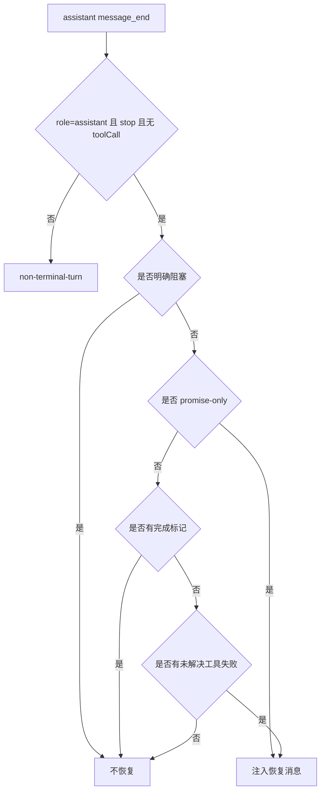
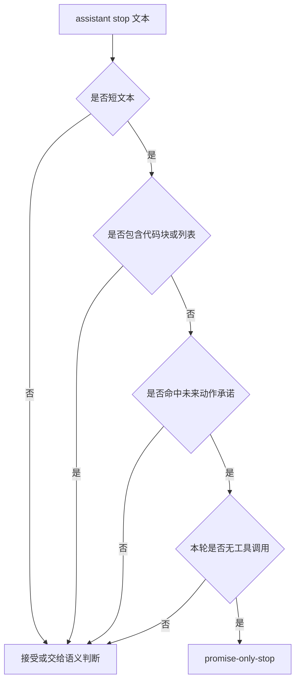
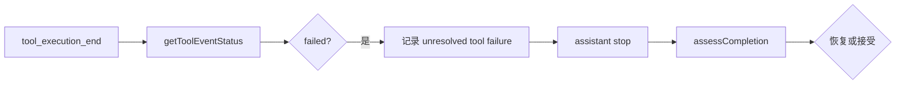

# E60：完成度保护要抓住“只承诺、未完成”的停止

## 1. 这一节解决什么问题

Agent 有时会提前结束，最后只说“我现在继续检查文件，然后生成报告”。这句话看起来像在工作，但如果这一轮已经 stop，且没有后续工具调用，小林实际没有拿到旅行计划。

完成度保护要解决的就是这种问题：API 层面的 stop 不等于任务完成。系统需要判断这次回答是完成、阻塞，还是只承诺未来会做。

## 2. 源码入口

核心源码是 [packages/core/src/lib/integrations/pi-agent/core/completion-guard.ts 第 1 行](../../../../packages/core/src/lib/integrations/pi-agent/core/completion-guard.ts#L1) 和 [packages/core/src/lib/integrations/pi-agent/core/completion-judge.ts 第 1 行](../../../../packages/core/src/lib/integrations/pi-agent/core/completion-judge.ts#L1)。

`completion-guard.ts` 负责规则判断和恢复消息；`completion-judge.ts` 提供更严格的语义判断提示词和 JSON 解析。

## 3. assessCompletion 的判断顺序

`assessCompletion(input)` 只处理 assistant、stop、且没有工具调用的终止。如果不是这种终止，返回 `non-terminal-turn`，不做恢复。

然后它按顺序检查：

| 顺序 | 判断 | 结果 |
| --- | --- | --- |
| 1 | 明确阻塞，如“需要你提供文件” | 不自动恢复 |
| 2 | 短文本、未来承诺、没有实际结果 | 自动恢复 |
| 3 | 有完成标记，如“已完成” | 接受完成 |
| 4 | 有未解决工具失败 | 自动恢复 |
| 5 | 其他情况 | 接受停止 |



这张图说明：完成度保护不是凡 stop 都拦截，也不是凡失败都重试。它只处理“看起来结束，但任务未完成”的情况。

## 4. 恢复消息不是给用户看的普通回复

`buildCompletionRecoveryMessage` 会生成一段内部恢复指令，包含恢复次数、失败工具、退出码、失败原因和运行环境提示。它明确要求：继续做下一个具体工具调用，或给出具体阻塞报告，不要重复进度承诺。

默认自动恢复次数由 `DEFAULT_COMPLETION_RECOVERY_LIMIT = 2` 控制。超过次数后，`buildCompletionFailureReport` 生成用户可见报告，说明最后失败工具、退出码、失败原因和所需操作。

这能避免无限恢复循环。小林不应该看到 Agent 一直说“我会继续”，也不应该看到系统无限重试同一个失败命令。

## 5. completion judge 做什么

[packages/core/src/lib/integrations/pi-agent/core/completion-judge.ts 第 1 行](../../../../packages/core/src/lib/integrations/pi-agent/core/completion-judge.ts#L1) 的系统提示词要求严格判断任务是否完成，并只返回 JSON：

```json
{"status":"complete|incomplete|blocked","reason":"brief reason"}
```

它强调：不要把“我会做”当完成；工具活动本身也不是完成；要比较用户请求、助手最终回复和工具轨迹。这比简单关键词更严格。

## 6. 测试证据与缺口

[packages/core/src/lib/integrations/pi-agent/core/__tests__/completion-guard.test.ts 第 1 行](../../../../packages/core/src/lib/integrations/pi-agent/core/__tests__/completion-guard.test.ts#L1) 覆盖：

- “我现在继续处理……”会被识别为 `promise-only-stop`；
- 已完成回答、工具 turn、明确阻塞不会误恢复；
- 未解决工具失败会触发恢复；
- 恢复消息包含失败工具和运行环境；
- 恢复次数耗尽后生成确定报告。

[packages/core/src/lib/integrations/pi-agent/core/__tests__/completion-judge.test.ts 第 1 行](../../../../packages/core/src/lib/integrations/pi-agent/core/__tests__/completion-judge.test.ts#L1) 覆盖 prompt 构造、JSON 解析、非法输出拒绝。

缺口是：语义完成度判断如果依赖模型裁判，仍可能有误判。规则 guard 和语义 judge 应互相补充，不能只靠其中一个。

## 7. 源码链路补强：promise-only 为什么能被规则识别

`assessCompletion` 识别 promise-only stop 时，不是只看有没有“我会”。它同时检查多个条件：

- 文本长度不超过 160；
- 句子数量不超过 2；
- 不包含代码块；
- 不包含明显列表；
- 命中 `PROMISE_PHRASES`；
- 当前是 assistant stop；
- 本轮没有工具调用。

这些条件共同减少误伤。比如“我会建议你优先核对预算”可能是一条建议，不一定是未完成任务；但“我现在继续读取文件，然后生成报告”在用户要求产物时，就是典型未完成承诺。

| 条件 | 保护目的 |
| --- | --- |
| 短文本 | 只抓明显空转承诺 |
| 无代码块 | 避免误伤已交付代码 |
| 无列表 | 避免误伤结构化回答 |
| promise phrase | 抓未来动作承诺 |
| 无 toolCall | 说明没有进入实际执行 |



这张图说明：规则不是为了理解所有语义，而是抓住最危险、最明确的一类提前停止。

## 8. unresolved tool failure 为什么也会触发恢复

如果上一轮工具失败，且后续没有成功工具调用修复它，`hasUnresolvedToolFailure` 会让 guard 触发恢复。原因是：工具失败后直接 stop，很可能意味着任务没有完成。

但源码也有例外：如果回复明确阻塞，例如“无法继续，需要你提供正确文件路径”，它不会自动恢复。因为这时继续执行没有意义，系统需要用户输入。

| 情况 | 是否恢复 | 原因 |
| --- | --- | --- |
| 工具失败后说“命令失败了” | 是 | 没有解决方案 |
| 工具失败后明确需要用户提供路径 | 否 | 真正阻塞 |
| 工具失败后说“处理完成” | 否 | 命中完成标记，但需要语义审查 |
| 工具失败后改用另一个成功工具 | 取决于最终结果 | 失败可能已被修复 |

小林的预算文件不存在时，如果 Agent 只是说“文件读取失败”，guard 应推动它继续尝试其他路径或给出具体阻塞报告。如果它明确说“需要你上传预算表”，就不该强行恢复。

## 9. failure report 为什么要具体

`buildCompletionFailureReport` 输出“最后失败工具、退出码、失败原因、所需操作”。这比一句“任务失败”有用得多。它告诉小林或者开发者下一步该做什么：路径不存在就提供正确路径；权限不足就检查权限；PowerShell heredoc 错误就改用兼容命令。

完成度保护的最终目标不是永远自动完成，而是在无法完成时给出可执行的阻塞报告。

## 10. 规则 guard 和语义 judge 的边界

规则 guard 适合抓确定模式，例如短文本承诺、未解决工具失败、明确阻塞。它速度快、可预测、容易测试。语义 judge 适合判断复杂任务是否真的满足用户要求，例如用户要“生成完整预算摘要”，助手给了几段建议但没有文件，这种情况可能需要结合用户请求、最终回答和工具轨迹判断。

| 机制 | 优点 | 边界 |
| --- | --- | --- |
| `assessCompletion` | 快、确定、可单测 | 只能覆盖规则能表达的模式 |
| `completion judge` | 能比较请求、回答、工具轨迹 | 依赖模型裁判，可能误判 |
| failure report | 用户可读、可执行 | 只在自动恢复耗尽后出现 |

这三者组合起来，才接近可用的完成度保护。只靠规则会漏掉复杂未完成；只靠语义 judge 会引入不稳定裁判；只给失败报告则太晚。

## 11. 小林案例：三种最终回复的判断

| 最终回复 | 是否完成 | 原因 |
| --- | --- | --- |
| “我现在继续读取预算表，然后生成摘要。” | 未完成 | 只有未来动作，没有交付 |
| “无法继续，需要你上传预算表。” | 阻塞 | 明确说明缺少用户输入 |
| “已生成预算摘要，保存到 output/budget-summary.md。” | 可能完成 | 有交付结果，但仍要看工具轨迹 |
| “预算表读取失败了。” | 未完成 | 报告失败但未给下一步 |

注意最后一行。如果只是说失败，没有明确阻塞，也没有换方案，guard 应该推动恢复。因为用户要的是预算摘要，不是失败描述。

## 12. 为什么“工具活动本身不是完成”

`completion-judge.ts` 的提示明确要求：工具活动本身不是完成。Agent 调用了 `read_file`、`read_spreadsheet`、`write_file`，仍可能没有满足用户要求。比如它读取了预算表，但没有生成摘要；或者写了文件，但写入的是空内容。

完成必须看最终交付：

| 用户请求 | 完成证据 |
| --- | --- |
| “总结预算” | 回复里有摘要内容，或生成了摘要文件 |
| “生成文件” | `write_file` 成功，且最终回复给出路径 |
| “检查错误” | 给出检查结论和证据范围 |
| “无法继续” | 明确缺少什么输入或权限 |

这也是为什么完成度保护属于稳定性：系统不能让用户误以为任务已经完成。

## 13. 与工具状态的连接

完成度保护需要知道有没有未解决工具失败，而工具失败来自 E61 的 `getToolEventStatus`。这说明 E60 并不是孤立规则，它依赖工具事件留下的证据。

如果工具返回 `{ success:false, error:"File not found" }`，状态解析器把它标为 failed；如果后续没有成功工具或明确阻塞，completion guard 就可以判断任务没有完成。



这张图说明：完成度保护不是只看最后一句话，还要看这一轮工具轨迹。

## 14. 自动恢复的风险

自动恢复很有用，但也危险。它可能让系统继续消耗资源，甚至重复错误。因此源码设置默认恢复次数，并在恢复耗尽后生成报告。

| 风险 | 保护 |
| --- | --- |
| 无限继续 | `DEFAULT_COMPLETION_RECOVERY_LIMIT` |
| 重复同一错误工具 | 恢复消息要求换方法 |
| 用户不知道发生什么 | 耗尽后生成 failure report |
| 把真阻塞当未完成 | explicit blocker 不恢复 |

小林如果没有上传预算表，系统不应无限恢复；它应明确告诉她需要上传文件。

## 15. 本节最低验收标准

读者要能判断下面三句话：

| 回复 | 判断 |
| --- | --- |
| “我会继续检查文件。” | 未完成承诺 |
| “无法继续，需要你提供预算表。” | 明确阻塞 |
| “已生成预算摘要，路径为 output/budget-summary.md。” | 有完成证据 |

同时要能说明：如果回复里有完成标记，也不代表绝对完成，还要结合工具轨迹和实际交付物。完成度保护是防线，不是形式化证明器。

更进一步，读者要能说明为什么 explicit blocker 不能被自动恢复覆盖。所谓明确阻塞，是 Agent 已经说出了继续执行所缺少的外部条件，例如“需要上传预算表”“需要授权访问目录”。这类情况下继续自动补一轮不会产生新证据，只会把同一个问题说得更长。完成度保护必须尊重这种阻塞，否则系统会从“防止过早结束”变成“拒绝停下来”。

还要能分辨 completion marker 的价值和局限。`completion-judge.ts` 可以识别“已完成”“文件已生成”“结果如下”这类完成信号，但这些信号仍然只是文本证据。真正可靠的判断来自文本、工具事件和产物状态的组合。小林要的是预算摘要，最强证据不是一句“我已经生成了”，而是确实出现了对应文件、工具调用成功、最终回复能指出结果位置。

## 16. 纸面推演 / 口头验收

纸面推演：小林要求“生成完整旅行预算摘要”，Agent 最终回复“好的，我会先读取预算表，然后生成摘要。”这一轮没有工具调用，也没有摘要文件。是否完成？

合格答案：没有完成，应识别为 promise-only stop，并触发恢复或继续执行。

口头验收：读者应能解释 stopReason 是协议状态，不是任务完成证明。

## 17. 本节小结

完成度保护防止 Agent 把承诺当成果。下一节看工具层的另一类失控：重复调用同一个工具却没有进展。
