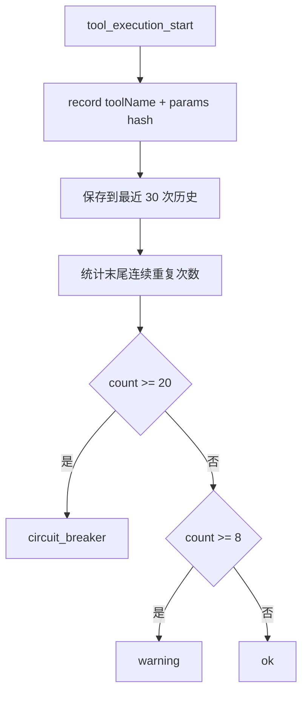

# E61：循环检测和工具状态把“重复无进展”变成证据

## 1. 这一节解决什么问题

Agent 可能连续多次调用同一个工具，用同样参数读取同一个不存在的文件。用户看到的是系统卡住；运行时看到的应该是“同一工具 + 同一输入 + 连续重复”。

循环检测的目标不是惩罚模型，而是把无进展模式变成证据，并在必要时注入停止提示。

## 2. 源码入口

本节核心源码：

- [packages/core/src/lib/integrations/pi-agent/tools/loop-detector.ts 第 1 行](../../../../packages/core/src/lib/integrations/pi-agent/tools/loop-detector.ts#L1)
- [packages/core/src/lib/integrations/pi-agent/core/tool-event-status.ts 第 1 行](../../../../packages/core/src/lib/integrations/pi-agent/core/tool-event-status.ts#L1)
- [packages/core/src/lib/integrations/pi-agent/core/agent.ts 第 1026 行](../../../../packages/core/src/lib/integrations/pi-agent/core/agent.ts#L1026)

`LoopDetector` 记录调用模式；`getToolEventStatus` 解释工具结果是否失败；`agent.ts` 把两者接进运行时事件。

## 3. LoopDetector 怎样判断重复

`LoopDetector` 保存最近 30 次工具调用。每次调用 `record(toolName, params)` 时，它会用稳定 hash 记录参数，然后统计末尾连续多少次都是同一个工具和同一个参数。

阈值：

| 阈值 | 次数 | 结果 |
| --- | --- | --- |
| warning | 8 | 提醒可能陷入循环 |
| circuit breaker | 20 | 触发断路提示 |



这张图强调：循环检测发生在工具开始时，不需要等工具再次失败。它看的是调用模式。

## 4. Agent 如何把循环提示注入上下文

在 [packages/core/src/lib/integrations/pi-agent/core/agent.ts 第 1173 行](../../../../packages/core/src/lib/integrations/pi-agent/core/agent.ts#L1173) 的 `applyLoopProtection` 中，Agent 会取当前 session 的 detector，记录本次工具调用。如果返回 warning 或 circuit breaker，就构造一条 synthetic system message 写入消息历史。

这条消息会包含 LoopDetector 的提示；如果能生成 working summary，还会附上当前任务、最近失败原因和禁止重复动作。这样下一步模型能看到“不要继续重复同一路径”。

## 5. 工具状态怎样识别失败

循环检测告诉我们“是否重复”；工具状态告诉我们“这次结果是否失败”。[packages/core/src/lib/integrations/pi-agent/core/tool-event-status.ts 第 83 行](../../../../packages/core/src/lib/integrations/pi-agent/core/tool-event-status.ts#L83) 会从工具结果里找结构化信息。

它识别这些失败形态：

| 形态 | 判断 |
| --- | --- |
| `success:false` | 失败 |
| `exitCode` 非 0 | 失败 |
| `error` 字段非空 | 失败 |
| SDK `isError:true` | 失败 |
| content 文本中嵌套 JSON | 解析后再判断 |

它也故意忽略普通文本里的“error”字样。比如文档里写着 “error examples”，不等于工具失败。

## 6. 小林案例

小林让 Agent 读取 `output/budget.csv`，但文件不存在。一次失败后，Agent 应该改用 `list_files` 或询问路径。如果它连续 8 次同样读取，系统应提示可能陷入循环；连续 20 次，应触发更强的断路提示。

| 现象 | 应由谁识别 |
| --- | --- |
| 文件不存在 | `getToolEventStatus` 从工具结果识别失败 |
| 同一路径重复读取 | `LoopDetector` 识别重复调用 |
| 最近任务和失败原因 | `runtime-working-summary` 提供摘要 |
| 下一步不要重复 | synthetic system message 注入 |

## 7. 测试证据与缺口

[packages/core/src/lib/integrations/pi-agent/tools/__tests__/loop-detector.test.ts 第 1 行](../../../../packages/core/src/lib/integrations/pi-agent/tools/__tests__/loop-detector.test.ts#L1) 验证：8 次触发 warning，20 次触发 circuit breaker。

[packages/core/src/lib/integrations/pi-agent/core/__tests__/tool-event-status.test.ts 第 1 行](../../../../packages/core/src/lib/integrations/pi-agent/core/__tests__/tool-event-status.test.ts#L1) 验证：结构化失败、SDK 错误、非零 exitCode、JSON 文本失败能被识别；普通文本里的 error 不会误判。

[packages/core/src/lib/integrations/pi-agent/__tests__/long-session-stability.test.ts 第 1 行](../../../../packages/core/src/lib/integrations/pi-agent/__tests__/long-session-stability.test.ts#L1) 验证长会话尾部重复工具失败能被发现。

缺口是：当前 hash 主要识别完全相同参数。`output/a.md` 和 `./output/a.md` 可能语义相同但字符串不同，未必被视为重复。路径规范化和语义级循环检测可以后续加强。

## 8. 源码链路补强：tool_start 和 tool_end 分别负责什么

在 [packages/core/src/lib/integrations/pi-agent/core/agent.ts 第 1026 行](../../../../packages/core/src/lib/integrations/pi-agent/core/agent.ts#L1026) 的事件处理中，`tool_execution_start` 和 `tool_execution_end` 分工明确。

`tool_execution_start` 做两件事：先调用 `applyLoopProtection`，再把工具加入 `uiState.activeTools`。这说明循环保护发生在工具开始时，UI 也能知道当前有哪些工具正在运行。

`tool_execution_end` 做另外三件事：从 `activeTools` 移除工具；把工具结果转换成文本预览；调用 `getToolEventStatus` 判断失败并写日志。这样 UI 状态和日志状态都能收敛。

```mermaid
sequenceDiagram
    participant Runtime as Agent Runtime
    participant Loop as LoopDetector
    participant UI as uiState.activeTools
    participant Status as getToolEventStatus
    participant Log as 日志

    Runtime->>Loop: tool_execution_start(toolName,args)
    Loop-->>Runtime: ok/warning/circuit_breaker
    Runtime->>UI: 添加 active tool
    Runtime->>Status: tool_execution_end(result)
    Status-->>Runtime: failed/exitCode/reason
    Runtime->>UI: 移除 active tool
    Runtime->>Log: 写入成功或失败日志
```

这张图说明：开始事件关注“是否重复、是否正在运行”，结束事件关注“是否失败、结果是什么”。

## 9. 为什么普通文本里的 error 不算失败

`getToolEventStatus` 会尝试从 `details`、`content.text` 中解析结构化 JSON。只有结构化字段表达失败时才认定失败。如果 content 只是普通文本 `"error examples in documentation"`，测试要求它返回 `{ failed:false }`。

这很重要。工具可能读取一份错误处理文档，文档里自然会出现 error、failed、timeout 等词。如果状态解析器只靠关键词，就会把正常读取误判为失败。

| 输入形态 | 是否失败 |
| --- | --- |
| `{ details:{ success:false, error:"x" } }` | 是 |
| `{ details:{ exitCode:127 } }` | 是 |
| `{ isError:true }` | 是 |
| 文本文档里包含 error 单词 | 否 |

这也是结构化返回的价值。工具应该尽量返回 `success/error/exitCode` 等字段，而不是只返回自然语言。

## 10. 循环保护不能替代完成度保护

循环检测只知道“是否重复调用同一工具”，不知道用户任务是否完成。完成度保护只知道“最终回复是否像完成”，不知道工具参数是否重复。两者必须配合。

小林的 Agent 如果没有调用工具，只说“我会继续生成摘要”，LoopDetector 完全看不到问题，应由 completion guard 处理。反过来，如果 Agent 连续调用同一工具但还没有最终 stop，应由 LoopDetector 先介入。

## 11. stableHash 的能力和缺口

`stableHash` 当前通过 `JSON.stringify(value, Object.keys(value as any).sort())` 得到参数签名。它能解决对象 key 顺序不同导致的误判，但不是完整语义归一化。

| 参数 A | 参数 B | 可能判断 |
| --- | --- | --- |
| `{ filePath:"a.md" }` | `{ filePath:"a.md" }` | 相同 |
| `{ b:2, a:1 }` | `{ a:1, b:2 }` | 倾向相同 |
| `{ filePath:"./a.md" }` | `{ filePath:"a.md" }` | 可能不同 |
| `{ query:"上海" }` | `{ query:" 上海 " }` | 可能不同 |

这不是 bug，而是当前实现的边界。循环检测先做“完全重复”的低风险识别，避免过度干预。更强的语义循环检测需要结合路径规范化、工具类型和结果状态。

## 12. activeTools 是用户体验证据

`agent.ts` 在 tool_start 时把工具加入 `uiState.activeTools`，tool_end 时移除。这能支持“正在读取文件”“正在执行命令”这类 UI 状态。没有 activeTools，用户只能看到 Agent 沉默，无法知道它是在思考、执行工具，还是卡住。

| 事件 | UI 状态变化 |
| --- | --- |
| `tool_execution_start` | activeTools 增加工具 |
| `tool_execution_end` | activeTools 移除工具 |
| 工具失败 | 日志记录 ERROR，状态解析失败原因 |
| 工具重复 | LoopDetector 注入警告 |

这说明可观测性不仅服务开发者，也服务用户体验。小林看到“正在读取预算表”，会比看到空白等待更容易理解系统状态。

## 13. 本节调试路线

遇到“Agent 卡住一直读文件”，按这个顺序排查：

1. 看 `tool_execution_start` 是否持续出现同一工具。
2. 看参数 hash 是否相同。
3. 看 `tool_execution_end` 是否返回失败。
4. 看 failure reason 是路径、权限、命令还是网络。
5. 看 LoopDetector 是否达到 warning 或 circuit breaker。
6. 看是否注入 working summary，提醒不要重复。

这条路线能把“卡住了”拆成可验证证据。

## 14. 为什么 warning 和 circuit breaker 要分两级

8 次 warning 表示“可能陷入循环”，但还不强制认为系统失控；20 次 circuit breaker 表示重复已经严重到需要停止或改策略。分两级可以避免过早打断正常流程。

例如某些工具可能需要轮询短暂状态，少量重复不一定是 bug。但连续 20 次同样参数读取同一缺失文件，就几乎不可能有进展。

| 级别 | 语义 |
| --- | --- |
| ok | 当前没有明显重复风险 |
| warning | 需要模型检查是否有进展 |
| circuit breaker | 必须停止重复，换方法或报告阻塞 |

## 15. 纸面推演 / 口头验收

纸面推演：Agent 连续 8 次调用 `read_file({ filePath:'missing.md' })`，每次都失败。系统应该继续沉默吗？

合格答案：不应沉默。第 8 次应触发 warning，提示可能陷入循环；继续到 20 次应触发断路级提示。

口头验收：读者应能区分“工具失败状态”和“重复调用模式”是两种不同证据。

## 16. 本节小结

循环检测让重复无进展变得可见。下一节看健康、通知和上传：运行时状态怎样被外部观察到。
