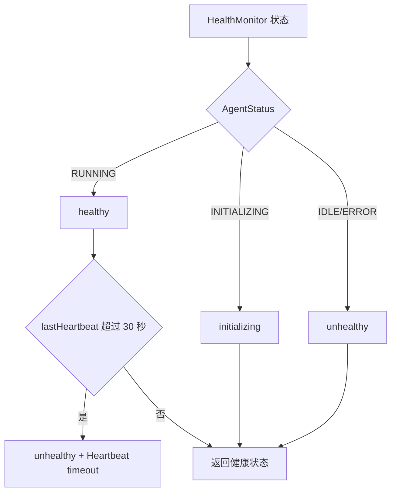
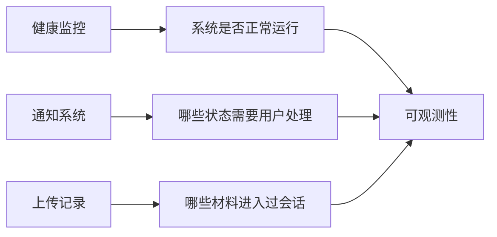
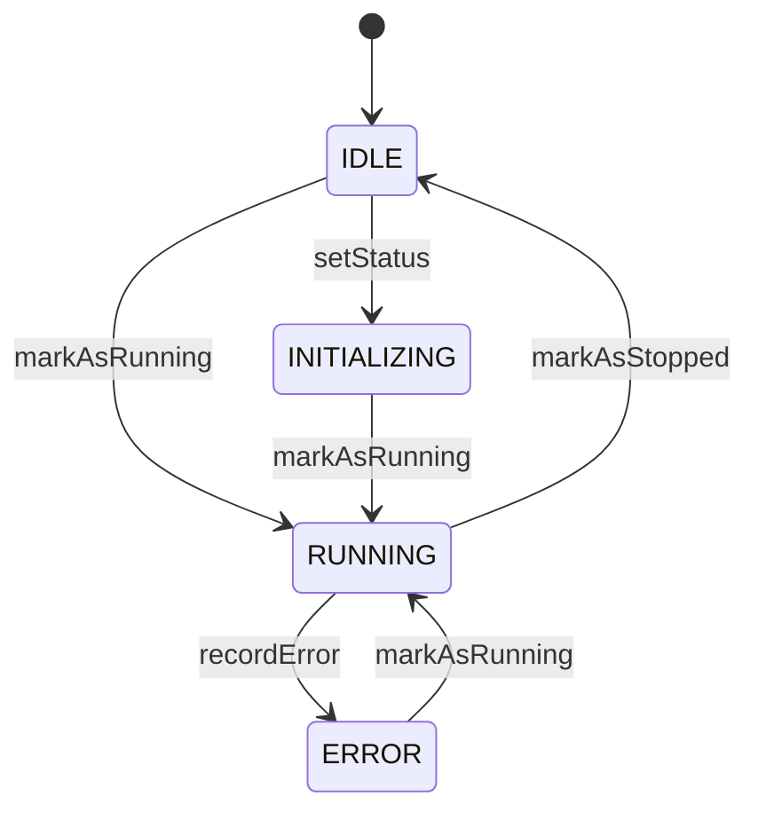
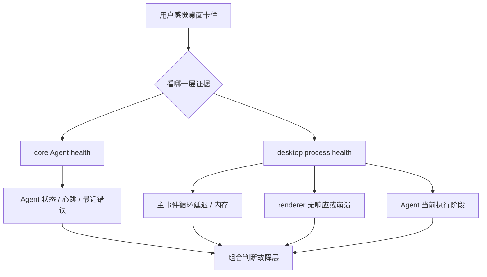

# E62：健康、通知和上传记录让运行时状态可见

## 1. 这一节解决什么问题

稳定系统不能只在报错时才有信息。小林使用旅行 Agent 时，系统还要知道：Agent 是否运行中、是否正在处理、处理了多少消息、最近心跳是否超时、是否有待审批通知、上传过哪些文件。

这些都属于可观测性。可观测性不是日志越多越好，而是关键状态能被查询、被展示、被追溯。

## 2. 健康监控源码

核心源码是 [packages/core/src/lib/integrations/pi-agent/health.ts 第 1 行](../../../../packages/core/src/lib/integrations/pi-agent/health.ts#L1)。

`AgentHealthStatus` 包含：

| 字段 | 含义 |
| --- | --- |
| `status` | healthy、unhealthy、initializing |
| `uptime` | 运行时长 |
| `memoryUsage` | 内存使用 |
| `messagesProcessed` | 已处理消息数 |
| `lastHeartbeat` | 最后心跳 |
| `sessionId` | 对应会话 |
| `isProcessing` | 是否正在处理 |
| `error` | 不健康原因 |

`HealthMonitor` 通过 `markAsRunning`、`markAsStopped`、`recordMessageHandled`、`recordError` 等方法更新这些状态。

## 3. 健康状态怎样计算

`getHealthStatus()` 先根据 AgentStatus 映射健康状态：

| AgentStatus | HealthStatus |
| --- | --- |
| RUNNING | healthy |
| INITIALIZING | initializing |
| IDLE / ERROR | unhealthy |

然后它检查心跳时间。如果 healthy 但超过 30 秒无心跳，也会转成 unhealthy，并记录 `Heartbeat timeout`。

这张图说明：健康不是一个手工标签，而是由运行状态和心跳共同决定。

## 4. 通知系统：把需要用户处理的状态落盘

通知源码在 [packages/core/src/lib/integrations/pi-agent/notification-system.ts 第 1 行](../../../../packages/core/src/lib/integrations/pi-agent/notification-system.ts#L1)。

它定义了通知类型和状态：

| 类型 | 用途 |
| --- | --- |
| `ONTOLOGY_CHANGE` | 本体变更审批 |
| `SYSTEM_ALERT` | 系统警告 |
| `TASK_COMPLETION` | 任务完成 |
| `SYSTEM_MESSAGE` | 系统消息 |

| 状态 | 含义 |
| --- | --- |
| `PENDING` | 等待处理 |
| `APPROVED` | 已批准 |
| `REJECTED` | 已拒绝 |
| `DISMISSED` | 已忽略 |
| `READ` | 已读 |

`NotificationManager` 会把每条通知保存成 `notifications/{id}.json`。这意味着通知不是一闪而过的 toast，而是可以查询和过滤的运行时记录。

## 5. 上传记录：文件进入会话也要留下痕迹

上传记录源码在 [packages/core/src/lib/integrations/pi-agent/upload-tracker.ts 第 1 行](../../../../packages/core/src/lib/integrations/pi-agent/upload-tracker.ts#L1)。

`recordUploads(agentDir, files)` 会把文件名、路径、大小、上传时间追加到 `MEMORY.md` 的 `Uploaded Files` 区块。这样后续 Agent 启动或恢复时，可以知道小林上传过哪些旅行材料。

这不是文件内容索引，也不是完整权限系统。它记录的是“用户上传过这些文件，路径在这里”。真正读取内容仍要走文件工具或文档工具。

## 6. 三者的关系

小林的场景里：

- Agent 卡住时，看健康状态和心跳；
- Agent 修改本体需要确认时，看通知；
- Agent 说找不到预算文件时，看上传记录和工作目录。

## 7. 测试证据与缺口

[packages/core/src/lib/integrations/pi-agent/__tests__/health.test.ts 第 1 行](../../../../packages/core/src/lib/integrations/pi-agent/__tests__/health.test.ts#L1) 覆盖：

- 初始状态 unhealthy；
- running 映射 healthy；
- initializing 映射 initializing；
- error 映射 unhealthy；
- 消息计数和 heartbeat 更新；
- 30 秒心跳超时；
- 健康检查性能小于 50ms。

通知和上传记录当前更偏基础文件存储逻辑，仍需要更完整的端到端测试来证明前端通知面板、审批动作、上传 UI 和 Agent 记忆加载之间完全打通。

## 8. 源码链路补强：HealthMonitor 是状态机，不是一次性检查函数

`HealthMonitor` 内部保存 `status`、`startTime`、`messagesProcessed`、`lastHeartbeat`、`lastError`、`isProcessing` 和 agent 引用。每一次状态变化都会更新这些字段。

例如 `markAsRunning()` 会把状态设为 RUNNING，记录启动时间，刷新心跳并清空错误；`recordError(error)` 会把状态设为 ERROR，保存错误并刷新心跳；`markAsStopped()` 会回到 IDLE，清空 startTime 和 processing。

| 方法 | 改变的状态 |
| --- | --- |
| `markAsRunning` | RUNNING、startTime、heartbeat、清空 error |
| `markAsStopped` | IDLE、startTime=null、processing=false |
| `recordMessageHandled` | messagesProcessed + 1、heartbeat |
| `markProcessingStart/End` | isProcessing true/false |
| `recordError` | ERROR、lastError、heartbeat |
| `reset` | 回到初始状态 |

这张状态图帮助读者理解：健康检查返回值不是凭空计算出来的，它来自一系列状态更新。

## 9. Core 健康状态与桌面进程健康不是同一个对象

前面的 `HealthMonitor` 观察单个 Agent 的逻辑状态。Electron 桌面端还需要观察另一层问题：主进程事件循环是否阻塞、renderer 是否无响应、某个 Agent 当前卡在等模型还是跑工具。这由 [packages/desktop/src/main/services/process-health-monitor.ts 第 3—200 行](../../../../packages/desktop/src/main/services/process-health-monitor.ts#L3) 的 `ProcessHealthMonitor` 负责。

| 监控器 | 观察对象 | 典型证据 | 不能替代什么 |
| --- | --- | --- | --- |
| core `HealthMonitor` | 单个 Agent 的逻辑生命周期 | RUNNING、heartbeat、messagesProcessed、lastError | 不能证明 Electron 主线程流畅 |
| desktop `ProcessHealthMonitor` | Electron 主进程、renderer 和活跃任务阶段 | event-loop lag、RSS、heap、unresponsive、render-process-gone、phase | 不能判断回答业务内容是否正确 |

`ProcessHealthMonitor` 把 Agent 活动分成 `prompt_start`、`model_wait`、`model_stream`、`tool_running`、`completion_check` 五个阶段。主进程流式 handler 会在 Agent 事件到来时更新阶段，并在 prompt 最终结束时清除活动记录。于是日志里的“卡住”可以进一步分成“等待模型”“正在流式输出”“工具长时间未返回”等不同情况。

图中的两条观测路径必须组合使用。Agent 仍然是 RUNNING，不代表 renderer 一定响应；renderer 无响应，也不证明模型调用本身失败。只有把逻辑运行时与宿主进程分开，排查才不会把所有“卡住”都归咎于模型。

`ProcessHealthMonitor` 默认每秒采样一次；实际 tick 比预期晚 500ms 以上时，会记录主事件循环延迟、RSS、heap 和当前 Agent 活动。它还监听 BrowserWindow 的 `unresponsive`、`responsive`、`render-process-gone` 与 `closed`。这些日志是诊断证据，不是自动恢复机制：记录 renderer 崩溃并不会自动重建窗口或重放本轮 prompt。

## 10. 通知为什么要落盘

`NotificationManager` 构造时会把通知目录设为 `baseDir/notifications`，并确保目录存在。创建通知时，它生成 uuid、设置 `PENDING`、写入 createdAt/updatedAt，再保存成 JSON 文件。列通知时，它读取所有 `.json` 文件，按 status、type、sessionId、projectId 过滤，最后按 createdAt 倒序返回。

这说明通知系统提供的是可追溯记录，而不是临时 UI 消息。小林没有立即处理“本体变更审批”，下次打开仍应能看到 pending 通知。

| 操作 | 源码行为 |
| --- | --- |
| 创建通知 | 生成 id，状态 PENDING，写入文件 |
| 读取通知 | 按 id 读取 JSON |
| 更新状态 | 改 status 和 updatedAt，再写回 |
| 列通知 | 读目录、过滤、倒序排序 |

## 11. 上传记录为什么写入 MEMORY.md

`recordUploads` 把上传文件追加到 `MEMORY.md`，而不是写到临时变量。这样 Agent 恢复时能在状态记忆里看到上传材料。每条记录包含文件名、路径、大小和上传时间。

但这里有边界：上传记录不是文件索引系统。文件是否还存在、是否可读、内容是什么，都需要后续工具验证。小林上传过 `budget.xlsx`，只说明曾经上传，不保证文件现在还在原路径。

## 12. 四种可观测性的边界

| 机制 | 看得见什么 | 看不见什么 |
| --- | --- | --- |
| 健康监控 | Agent 是否运行、心跳、错误、消息数 | 具体业务内容是否正确 |
| 桌面进程监控 | 主循环延迟、内存、窗口响应、Agent 执行阶段 | 不会自动恢复进程，也不能判断业务答案质量 |
| 通知系统 | 待处理事项和审批状态 | 用户是否理解通知含义 |
| 上传记录 | 文件进入会话的痕迹 | 文件内容是否有效 |

如果不区分这些边界，很容易误以为“有 health 就能知道任务成功”或“有上传记录就能读取文件”。可观测性提供证据，不替代业务判断。

## 13. 源码链接补充：前端通知如何承接

本节核心在 core，但通知最终要给用户看。前端相关入口包括 [packages/web/src/components/os/notification/NotificationBell.tsx 第 1 行](../../../../packages/web/src/components/os/notification/NotificationBell.tsx#L1)、[packages/web/src/components/os/notification/NotificationPanel.tsx 第 1 行](../../../../packages/web/src/components/os/notification/NotificationPanel.tsx#L1) 和 [packages/web/src/store/notificationStore.ts 第 1 行](../../../../packages/web/src/store/notificationStore.ts#L1)。

这说明通知链路至少有两段：core 负责生成和持久化通知，web 负责展示和交互状态。本节不展开通知 UI 的全部实现，但边界必须明确：可观测状态只有进入用户界面后才真正对用户可见；仅写在文件里仍不足以形成可用反馈。

## 14. 小林案例：一次完整可观测排查

小林说“我上传了预算表，为什么 Agent 还说找不到？”排查不应该只看聊天文本。

| 排查问题 | 应看证据 |
| --- | --- |
| 文件是否上传过 | `MEMORY.md` 的 Uploaded Files |
| Agent 是否仍在运行 | `HealthMonitor.getHealthStatus()` |
| 最近是否报错 | health error 或 ErrorHandler |
| 是 Agent 等待，还是桌面主线程阻塞 | ProcessHealthMonitor 的 phase 与 event-loop lag |
| renderer 是否崩溃或失去响应 | unresponsive / render-process-gone 日志 |
| 是否有待处理通知 | notification list |
| 文件路径是否仍有效 | 文件/文档工具读取 |

这条链路说明：可观测性是多个证据源的组合。上传记录说“曾经上传”，健康状态说“Agent 当前怎样”，工具读取说“现在能否访问文件”。

## 15. 健康检查的性能要求

[packages/core/src/lib/integrations/pi-agent/__tests__/health.test.ts 第 1 行](../../../../packages/core/src/lib/integrations/pi-agent/__tests__/health.test.ts#L1) 里检查健康状态需要小于 50ms。这是合理的，因为健康检查可能被频繁调用。如果健康检查本身很慢，就会变成新的性能问题。

健康检查只读取内存状态、时间和内存使用估算，不应做重 IO、不应调用模型、不应扫描大目录。这也是为什么通知列表和上传文件内容不应该塞进 health：它们是不同的观测入口。

## 16. 测试证据不能跨越监控层

[packages/desktop/src/main/services/__tests__/process-health-monitor.test.ts 第 1 行](../../../../packages/desktop/src/main/services/__tests__/process-health-monitor.test.ts#L1) 使用可控时钟和日志函数验证了启动幂等、事件循环延迟告警、Agent 阶段记录、窗口无响应/恢复以及 renderer gone 日志。它证明的是监控器如何形成诊断记录，不证明真实 Electron 在操作系统压力下必然及时调度采样，也不证明日志已经接入用户可见的诊断面板。

同理，core 的 `health.test.ts` 只证明 Agent 健康状态机。两个测试套件都通过，也不能推导“桌面会话端到端不会卡死”。端到端验收还需要真实窗口、IPC、模型/工具延迟和主进程负载共同参与。

## 17. 本节验收清单

读者学完本节，要能用下面清单审查一个运行时状态问题：

1. Agent 是否处于 running、initializing、idle 或 error。
2. 健康状态是否因心跳超时变成 unhealthy。
3. `messagesProcessed` 是否随消息处理增加。
4. `isProcessing` 是否能表示当前是否在处理。
5. 通知是否有 id、type、status、createdAt、updatedAt。
6. 通知是否可以按 status、type、sessionId、projectId 过滤。
7. 上传记录是否包含文件名、路径、大小、上传时间。
8. 上传记录是否被误当成文件内容本身。
9. 故障属于 Agent 逻辑状态，还是 Electron 进程与 renderer 状态。
10. `model_wait`、`model_stream`、`tool_running` 分别意味着什么。

这张清单让可观测性从概念落到检查项。小林遇到问题时，系统要能回答“现在状态如何、发生过什么、还缺什么证据”。

## 18. 纸面推演 / 口头验收

纸面推演：Agent 状态是 RUNNING，但 31 秒没有更新 heartbeat。健康状态应是什么？

合格答案：应返回 unhealthy，并记录 `Heartbeat timeout`。

口头验收：读者应能解释 Agent health、桌面 process health、通知、上传记录分别观察不同层面，不能互相替代。

## 19. 本节小结

可观测性要覆盖 Agent 逻辑状态、桌面宿主进程、用户待处理事项和输入材料痕迹。任何单一指标都不能独立证明任务成功。下一节把 E56-E62 串成一次完整稳定性验收。
