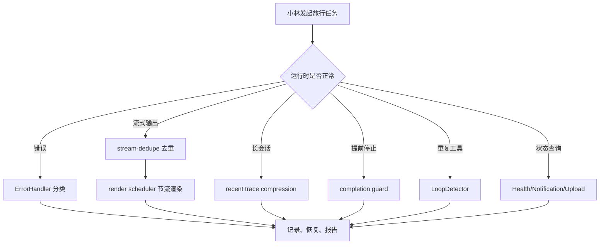
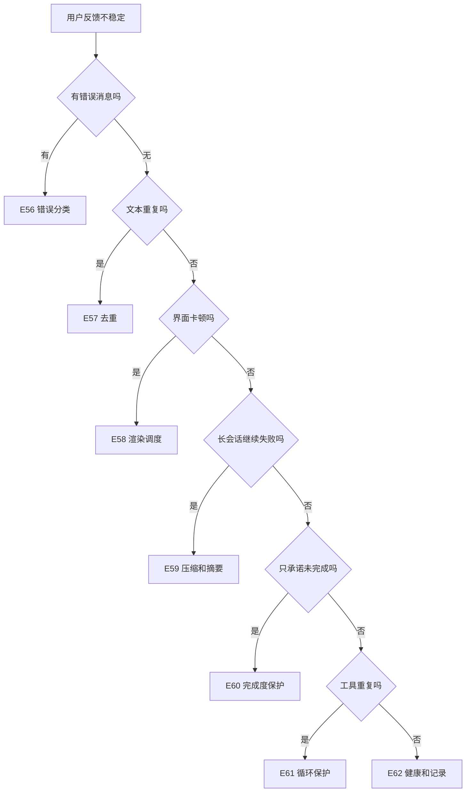

# E63：稳定性与可观测性工作坊

## 1. 一句话总图

稳定性与可观测性单元的核心是：当 Agent 出错、重复、过长、提前停止或状态异常时，系统不能沉默，也不能乱重试，而要留下证据并做受控反应。

这张图不是新架构，而是把 E56-E62 的保护点串起来。每个保护点只解决一类问题，不能互相替代。

## 2. 源码覆盖验收表

| 课号 | 主题 | 生产源码 | 测试证据 |
| --- | --- | --- | --- |
| E56 | 错误分类与恢复 | [packages/core/src/lib/integrations/pi-agent/error-handler.ts](../../../../packages/core/src/lib/integrations/pi-agent/error-handler.ts) | [packages/core/src/lib/integrations/pi-agent/__tests__/error-handler.test.ts](../../../../packages/core/src/lib/integrations/pi-agent/__tests__/error-handler.test.ts) |
| E57 | 流式去重 | [packages/core/src/lib/integrations/pi-agent/stream-dedupe.ts](../../../../packages/core/src/lib/integrations/pi-agent/stream-dedupe.ts) | [packages/core/src/lib/integrations/pi-agent/__tests__/stream-dedupe.test.ts](../../../../packages/core/src/lib/integrations/pi-agent/__tests__/stream-dedupe.test.ts) |
| E58 | 流式渲染调度 | [packages/core/src/lib/integrations/pi-agent/stream-render-scheduler.ts](../../../../packages/core/src/lib/integrations/pi-agent/stream-render-scheduler.ts) | [packages/core/src/lib/integrations/pi-agent/__tests__/stream-render-scheduler.test.ts](../../../../packages/core/src/lib/integrations/pi-agent/__tests__/stream-render-scheduler.test.ts) |
| E59 | 长会话压缩 | [packages/core/src/lib/integrations/pi-agent/recent-trace-compression.ts](../../../../packages/core/src/lib/integrations/pi-agent/recent-trace-compression.ts)、[packages/core/src/lib/integrations/pi-agent/runtime-working-summary.ts](../../../../packages/core/src/lib/integrations/pi-agent/runtime-working-summary.ts) | [packages/core/src/lib/integrations/pi-agent/__tests__/recent-trace-compression.test.ts](../../../../packages/core/src/lib/integrations/pi-agent/__tests__/recent-trace-compression.test.ts)、[packages/core/src/lib/integrations/pi-agent/__tests__/long-session-stability.test.ts](../../../../packages/core/src/lib/integrations/pi-agent/__tests__/long-session-stability.test.ts) |
| E60 | 完成度保护 | [packages/core/src/lib/integrations/pi-agent/core/completion-guard.ts](../../../../packages/core/src/lib/integrations/pi-agent/core/completion-guard.ts)、[packages/core/src/lib/integrations/pi-agent/core/completion-judge.ts](../../../../packages/core/src/lib/integrations/pi-agent/core/completion-judge.ts) | [packages/core/src/lib/integrations/pi-agent/core/__tests__/completion-guard.test.ts](../../../../packages/core/src/lib/integrations/pi-agent/core/__tests__/completion-guard.test.ts)、[packages/core/src/lib/integrations/pi-agent/core/__tests__/completion-judge.test.ts](../../../../packages/core/src/lib/integrations/pi-agent/core/__tests__/completion-judge.test.ts) |
| E61 | 循环保护与工具状态 | [packages/core/src/lib/integrations/pi-agent/tools/loop-detector.ts](../../../../packages/core/src/lib/integrations/pi-agent/tools/loop-detector.ts)、[packages/core/src/lib/integrations/pi-agent/core/tool-event-status.ts](../../../../packages/core/src/lib/integrations/pi-agent/core/tool-event-status.ts)、[packages/core/src/lib/integrations/pi-agent/core/agent.ts](../../../../packages/core/src/lib/integrations/pi-agent/core/agent.ts) | [packages/core/src/lib/integrations/pi-agent/tools/__tests__/loop-detector.test.ts](../../../../packages/core/src/lib/integrations/pi-agent/tools/__tests__/loop-detector.test.ts)、[packages/core/src/lib/integrations/pi-agent/core/__tests__/tool-event-status.test.ts](../../../../packages/core/src/lib/integrations/pi-agent/core/__tests__/tool-event-status.test.ts) |
| E62 | 健康、通知、上传 | [packages/core/src/lib/integrations/pi-agent/health.ts](../../../../packages/core/src/lib/integrations/pi-agent/health.ts)、[packages/core/src/lib/integrations/pi-agent/notification-system.ts](../../../../packages/core/src/lib/integrations/pi-agent/notification-system.ts)、[packages/core/src/lib/integrations/pi-agent/upload-tracker.ts](../../../../packages/core/src/lib/integrations/pi-agent/upload-tracker.ts) | [packages/core/src/lib/integrations/pi-agent/__tests__/health.test.ts](../../../../packages/core/src/lib/integrations/pi-agent/__tests__/health.test.ts) |

## 3. 三类常见误解

| 误解 | 正确认知 |
| --- | --- |
| 出错就重试 | 先分类，只有可恢复错误才适合重试 |
| 流式输出就是拼字符串 | delta 可能重复、累计或重叠，必须去重和最终对齐 |
| 压缩历史就是保留最后几条 | 要保留最近任务、失败、纠正和完整工具协议 |
| stop 就是完成 | stop 只是协议结束，完成还要看是否交付结果 |
| 日志越多越可观测 | 关键状态要结构化，能被查询和解释 |

## 4. 综合案例：预算摘要任务出问题

小林让 Agent 生成旅行预算摘要。运行过程中发生这些情况：

1. 第一次读取 `budget.xlsx` 超时。
2. 第二次流式输出重复了前半段文字。
3. 长会话压缩后仍要记住 `old-budget.xlsx` 不存在。
4. Agent 最终只说“我会继续生成摘要”，但没有文件。
5. 它又连续读取同一个不存在文件。

合格系统应这样处理：

| 问题 | 对应机制 | 合格反应 |
| --- | --- | --- |
| 超时 | ErrorHandler | 分类为 TIMEOUT_ERROR，建议重试 |
| 重复流 | stream-dedupe | 只显示新增内容 |
| 渲染压力 | StreamRenderScheduler | 分批提交 UI |
| 长历史 | compressRecentTrace | 保留最近失败和工具轨迹 |
| 只承诺未完成 | completion guard | 触发恢复 |
| 重复读同一文件 | LoopDetector | warning / circuit breaker |
| 文件上传证据 | upload-tracker | 从 MEMORY.md 查上传记录 |

## 5. 纸面推演 / 综合练习

请读者在纸上写出“小林的预算摘要任务异常排查表”，至少包含：

1. 错误类型是什么；
2. 是否可恢复；
3. 流式输出是否重复；
4. UI 是否被过度更新；
5. 长会话是否保留了最近失败；
6. 最终回复是否真的完成；
7. 是否出现重复工具调用；
8. 健康状态和上传记录是否可查。

口头验收：读者应能用一分钟说清楚：稳定性不是“不失败”，而是失败时能分类、能记录、能恢复或停止；可观测性不是“多打日志”，而是关键状态和证据能被后续系统读懂。

## 6. 三项学习验收自查

| 审查项 | 本单元应达到的状态 |
| --- | --- |
| 源码是否完全覆盖 | 每个稳定性机制都对应真实源码和测试文件，不用泛泛概念代替源码 |
| 讲解深度是否够 | 每节都讲清楚输入、处理链路、返回或状态变化、失败边界 |
| 是否新手友好 | 每节都能用小林旅行任务解释，并提供图表、纸面推演和口头验收 |

如果某一节只说“系统会处理错误”“系统会去重”“系统会监控健康”，但没有讲清楚具体函数、状态字段、触发条件和测试断言，就不合格。

## 7. 单元级调试路线

当一次 Agent 会话看起来“不稳定”时，不要直接猜模型坏了。按下面路线排查：

1. 是否有明确错误对象？先看 E56。
2. 是否是流式文本重复？看 E57。
3. 是否是 UI 卡顿或最终内容迟迟不落地？看 E58。
4. 是否是长历史压掉了最近失败？看 E59。
5. 是否只是承诺没有完成？看 E60。
6. 是否重复调用同一个工具？看 E61。
7. 是否健康状态、通知、上传记录能提供证据？看 E62。

这张调试图的价值在于把“感觉不稳定”拆成可定位问题。只有能定位，才谈得上修复。

## 8. 单元验收口径

本单元验收不能只看章节是否写完。真正合格的读者应能拿到一段失败对话，标出每个证据属于哪一类：错误对象、流式 delta、渲染 commit、压缩后历史、完成度判断、循环检测、健康状态、通知记录、上传记录。

| 证据 | 应归属 |
| --- | --- |
| `NETWORK_ERROR` | 错误分类 |
| `stdoutTruncated:true` | 工具结果状态 |
| `trimmed:true` | 重复尾巴裁剪 |
| `isStreaming:false` | 渲染最终提交 |
| `promise-only-stop` | 完成度保护 |
| `circuit_breaker` | 循环保护 |
| `Heartbeat timeout` | 健康监控 |

如果读者能完成这张归类表，就说明本单元不是只读懂概念，而是能用证据排查问题。

## 9. 本单元小结

E56-E63 建立的是 Agent 运行时的“安全网”。错误分类让失败可处理；流式去重和渲染调度让输出可读；长会话压缩让上下文不丢关键证据；完成度保护防止承诺冒充成果；循环检测防止重复无进展；健康、通知和上传记录让系统状态可观察。

下一单元进入 Part E 最后一组：测试与端到端验收。它要回答的问题是：怎样证明前面这些机制真的在完整用户链路里生效。
