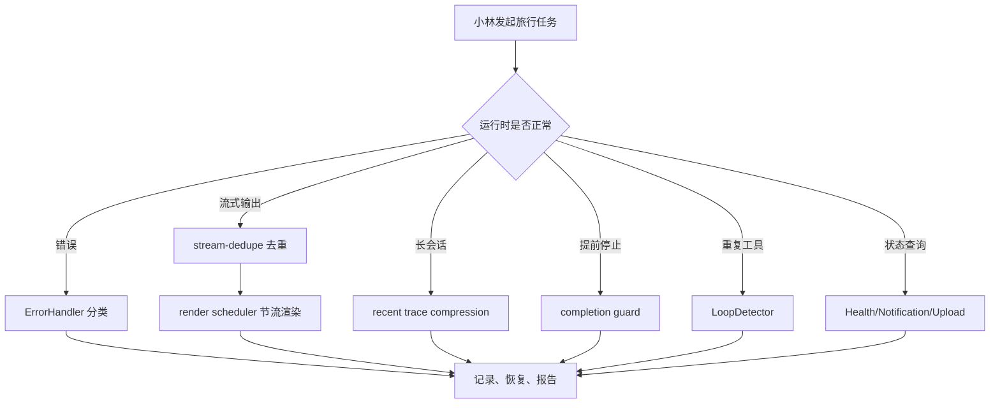
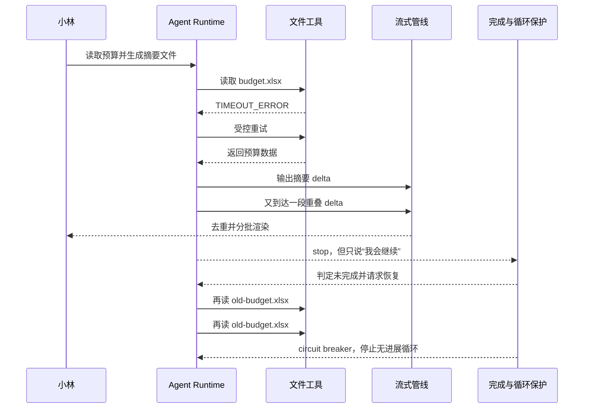
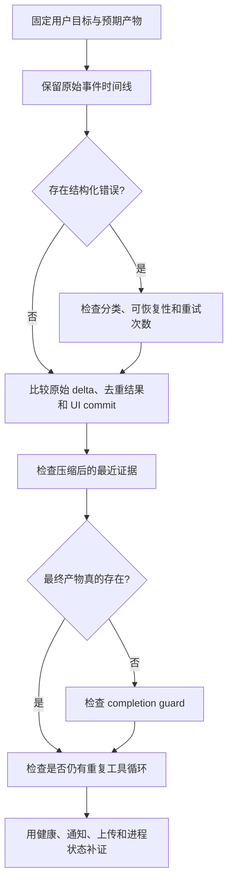

# E63：稳定性与可观测性工作坊

## 1. 一句话总图

稳定性与可观测性单元的核心是：当 Agent 出错、重复、过长、提前停止或状态异常时，系统不能沉默，也不能乱重试，而要留下证据并做受控反应。

这张图不是新架构，而是把 E56-E62 的保护点串起来。每个保护点只解决一类问题，不能互相替代。

对零基础读者而言，先要区分两个概念：

- **稳定性**不是“永远不失败”，而是失败、重复、超时或提前停止以后，系统仍能作出有界反应，不把状态越弄越乱。
- **可观测性**不是“多打印几行日志”，而是能够用结构化证据回答：刚才发生了什么、发生在哪一层、系统采取了什么动作、现在处于什么状态。

一次异常可以同时触发多个保护机制。例如网络超时由错误分类处理，超时后的重复读取由循环检测处理，恢复过程中重复到达的流式片段由去重处理。看到一个机制生效，不代表其他层一定正常。

## 2. 源码覆盖验收表

| 课号 | 主题 | 生产源码 | 测试证据 |
| --- | --- | --- | --- |
| E56 | 错误分类与恢复 | [packages/core/src/lib/integrations/pi-agent/error-handler.ts](../../../../packages/core/src/lib/integrations/pi-agent/error-handler.ts) | [packages/core/src/lib/integrations/pi-agent/__tests__/error-handler.test.ts](../../../../packages/core/src/lib/integrations/pi-agent/__tests__/error-handler.test.ts) |
| E57 | 流式去重 | [packages/core/src/lib/integrations/pi-agent/stream-dedupe.ts](../../../../packages/core/src/lib/integrations/pi-agent/stream-dedupe.ts) | [packages/core/src/lib/integrations/pi-agent/__tests__/stream-dedupe.test.ts](../../../../packages/core/src/lib/integrations/pi-agent/__tests__/stream-dedupe.test.ts) |
| E58 | 流式渲染调度 | [packages/core/src/lib/integrations/pi-agent/stream-render-scheduler.ts](../../../../packages/core/src/lib/integrations/pi-agent/stream-render-scheduler.ts) | [packages/core/src/lib/integrations/pi-agent/__tests__/stream-render-scheduler.test.ts](../../../../packages/core/src/lib/integrations/pi-agent/__tests__/stream-render-scheduler.test.ts) |
| E59 | 长会话压缩 | [packages/core/src/lib/integrations/pi-agent/recent-trace-compression.ts](../../../../packages/core/src/lib/integrations/pi-agent/recent-trace-compression.ts)、[packages/core/src/lib/integrations/pi-agent/runtime-working-summary.ts](../../../../packages/core/src/lib/integrations/pi-agent/runtime-working-summary.ts) | [packages/core/src/lib/integrations/pi-agent/__tests__/recent-trace-compression.test.ts](../../../../packages/core/src/lib/integrations/pi-agent/__tests__/recent-trace-compression.test.ts)、[packages/core/src/lib/integrations/pi-agent/__tests__/long-session-stability.test.ts](../../../../packages/core/src/lib/integrations/pi-agent/__tests__/long-session-stability.test.ts) |
| E60 | 完成度保护 | [packages/core/src/lib/integrations/pi-agent/core/completion-guard.ts](../../../../packages/core/src/lib/integrations/pi-agent/core/completion-guard.ts)、[packages/core/src/lib/integrations/pi-agent/core/completion-judge.ts](../../../../packages/core/src/lib/integrations/pi-agent/core/completion-judge.ts) | [packages/core/src/lib/integrations/pi-agent/core/__tests__/completion-guard.test.ts](../../../../packages/core/src/lib/integrations/pi-agent/core/__tests__/completion-guard.test.ts)、[packages/core/src/lib/integrations/pi-agent/core/__tests__/completion-judge.test.ts](../../../../packages/core/src/lib/integrations/pi-agent/core/__tests__/completion-judge.test.ts) |
| E61 | 循环保护与工具状态 | [packages/core/src/lib/integrations/pi-agent/tools/loop-detector.ts](../../../../packages/core/src/lib/integrations/pi-agent/tools/loop-detector.ts)、[packages/core/src/lib/integrations/pi-agent/core/tool-event-status.ts](../../../../packages/core/src/lib/integrations/pi-agent/core/tool-event-status.ts)、[packages/core/src/lib/integrations/pi-agent/core/agent.ts](../../../../packages/core/src/lib/integrations/pi-agent/core/agent.ts) | [packages/core/src/lib/integrations/pi-agent/tools/__tests__/loop-detector.test.ts](../../../../packages/core/src/lib/integrations/pi-agent/tools/__tests__/loop-detector.test.ts)、[packages/core/src/lib/integrations/pi-agent/core/__tests__/tool-event-status.test.ts](../../../../packages/core/src/lib/integrations/pi-agent/core/__tests__/tool-event-status.test.ts) |
| E62 | 健康、通知、上传 | [packages/core/src/lib/integrations/pi-agent/health.ts](../../../../packages/core/src/lib/integrations/pi-agent/health.ts)、[packages/core/src/lib/integrations/pi-agent/notification-system.ts](../../../../packages/core/src/lib/integrations/pi-agent/notification-system.ts)、[packages/core/src/lib/integrations/pi-agent/upload-tracker.ts](../../../../packages/core/src/lib/integrations/pi-agent/upload-tracker.ts) | [packages/core/src/lib/integrations/pi-agent/__tests__/health.test.ts](../../../../packages/core/src/lib/integrations/pi-agent/__tests__/health.test.ts) |

## 3. 先学会读一条故障证据链

排障时要把五种信息分开记录：

| 信息 | 它回答的问题 | 预算任务示例 |
| --- | --- | --- |
| 症状 | 用户看到了什么？ | 摘要重复了一段，最后也没有文件 |
| 观察 | 系统留下了什么事实？ | 两次相同工具调用、一个 timeout 错误码 |
| 机制 | 哪段运行时逻辑处理它？ | ErrorHandler、stream-dedupe、LoopDetector |
| 动作 | 系统实际做了什么？ | 建议重试、裁掉重叠文本、触发 circuit breaker |
| 结果 | 动作之后状态如何？ | 会话仍可继续，重复调用停止，成果仍未交付 |

症状和原因不能直接画等号。“界面没有新文字”可能是模型没有输出，也可能是渲染调度尚未提交；“任务停止”可能是成功完成，也可能只是协议收到 `stop`。必须找到中间证据。

## 4. 五类常见误解

| 误解 | 正确认知 |
| --- | --- |
| 出错就重试 | 先分类，只有可恢复错误才适合重试 |
| 流式输出就是拼字符串 | delta 可能重复、累计或重叠，必须去重和最终对齐 |
| 压缩历史就是保留最后几条 | 要保留最近任务、失败、纠正和完整工具协议 |
| stop 就是完成 | stop 只是协议结束，完成还要看是否交付结果 |
| 日志越多越可观测 | 关键状态要结构化，能被查询和解释 |

## 5. 综合案例：沿时间线诊断预算摘要任务

小林让 Agent 读取 `budget.xlsx`，生成预算摘要并保存为文件。运行过程中依次发生：

1. 第一次读取 `budget.xlsx` 超时。
2. 第二次流式输出重复了前半段文字。
3. 长会话压缩后仍要记住 `old-budget.xlsx` 不存在。
4. Agent 最终只说“我会继续生成摘要”，但没有文件。
5. 它又连续读取同一个不存在文件。

先不要直接给每个症状贴标签。把时间线展开以后，才能知道保护机制在哪一刻介入。

图中至少包含四种不同状态：工具失败、流内容重叠、协议停止但任务未完成、重复工具调用。它们不能用一个笼统的“重试”解决。

### 5.1 第一次读取超时：先分类，再决定是否恢复

ErrorHandler 把原始异常转换成稳定类别，例如 `TIMEOUT_ERROR`，再携带是否可恢复、建议动作等信息。分类的价值在于让上层按规则行动；如果只保留一段任意错误字符串，上层很难可靠判断能否重试。

一次超时可以重试，不意味着无限重试。重试仍要受尝试次数、任务进展和循环保护约束。

### 5.2 第二次输出重叠：去重与渲染调度分别处理

stream-dedupe 比较已有文本和新片段，裁掉重复或重叠部分；StreamRenderScheduler 决定何时把积累的内容提交到 UI。前者保证“写什么”，后者控制“多频繁地写”。

如果最终文本正确但页面频繁卡顿，应查渲染调度；如果页面流畅但文本出现重复，应查去重。两个问题表现接近，却属于不同层。

### 5.3 长会话压缩：必须保住最近失败

当历史过长，recent trace compression 不能只保留最后几条普通消息。`old-budget.xlsx` 不存在这类最近失败会影响下一步行动，如果压缩后丢失，Agent 可能再次走同一条错误路径。运行摘要与最近轨迹共同承担“缩短上下文但保留决策证据”的职责。

### 5.4 收到 stop：协议结束不等于用户目标完成

“我会继续生成摘要”只是承诺，没有交付文件。completion guard 要结合回复内容、工具结果和任务要求判断是否属于 promise-only stop，并决定是否触发一次受控恢复。它检查的是任务完成语义，不是网络流是否已经结束。

### 5.5 重复读取同一缺失文件：循环检测负责止损

同一工具以相同参数反复失败，说明重试没有带来新信息。LoopDetector 根据调用轨迹从 warning 升级到 circuit breaker，阻止无进展消耗。这里的关键不是“调用次数多”，而是“输入、结果和进展高度重复”。

### 5.6 最终还要查询运行状态

健康状态、通知和上传记录提供旁证：运行时是否存活、是否产生需要用户注意的事件、文件上传记录是否存在。桌面环境还要区分应用进程是否健康与 Agent 业务任务是否完成；进程存活不能证明摘要已经生成。

把整条时间线收敛成诊断表：

| 问题 | 对应机制 | 合格反应 |
| --- | --- | --- |
| 超时 | ErrorHandler | 分类为 TIMEOUT_ERROR，建议重试 |
| 重复流 | stream-dedupe | 只显示新增内容 |
| 渲染压力 | StreamRenderScheduler | 分批提交 UI |
| 长历史 | compressRecentTrace | 保留最近失败和工具轨迹 |
| 只承诺未完成 | completion guard | 触发恢复 |
| 重复读同一文件 | LoopDetector | warning / circuit breaker |
| 文件上传证据 | upload-tracker | 从 MEMORY.md 查上传记录 |

## 6. 一条可执行的单元级调试路线

面对“Agent 不稳定”这样的模糊反馈，按证据成本从低到高检查：

1. 固定任务目标和预期产物。例如预期是 `budget-summary.md`，不能只写“回答正常”。
2. 保存原始事件时间线，不先删掉重复片段。
3. 查结构化错误类别及恢复建议。
4. 对比原始 delta、去重结果和 UI commit，判断文本问题出现在哪一层。
5. 查看压缩后上下文是否仍保留最近任务、失败、纠正和完整工具协议。
6. 对照最终产物判断 completion guard 是否正确。
7. 比较连续工具名、参数、结果和进展，判断是否形成循环。
8. 最后用健康、通知、上传及桌面进程状态补足运行证据。

这条路线允许多个问题同时成立，不把故障强行归入单一分支。

## 7. 纸面推演：为一次异常建立证据表

请读者在纸上写出“小林的预算摘要任务异常排查表”，至少包含：

1. 错误类型是什么；
2. 是否可恢复；
3. 流式输出是否重复；
4. UI 是否被过度更新；
5. 长会话是否保留了最近失败；
6. 最终回复是否真的完成；
7. 是否出现重复工具调用；
8. 健康状态和上传记录是否可查。

口头验收：读者应能用一分钟说清楚：稳定性不是“不失败”，而是失败时能分类、能记录、能恢复或停止；可观测性不是“多打日志”，而是关键状态和证据能被后续系统读懂。

## 8. 单元验收口径

本单元验收不能只看章节是否写完。真正合格的读者应能拿到一段失败对话，标出每个证据属于哪一类：错误对象、流式 delta、渲染 commit、压缩后历史、完成度判断、循环检测、健康状态、通知记录、上传记录。

| 证据 | 应归属 |
| --- | --- |
| `NETWORK_ERROR` | 错误分类 |
| `stdoutTruncated:true` | 工具结果状态 |
| `trimmed:true` | 重复尾巴裁剪 |
| `isStreaming:false` | 渲染最终提交 |
| `promise-only-stop` | 完成度保护 |
| `circuit_breaker` | 循环保护 |
| `Heartbeat timeout` | 健康监控 |

如果读者能完成这张归类表，就说明本单元不是只读懂概念，而是能用证据排查问题。

读者还应能够解释三个反事实：如果关闭去重，重复文本会重新出现；如果关闭 completion guard，promise-only stop 会被当成完成；如果循环检测阈值过低，合法的分页读取也可能被误伤。能预测保护机制缺失或配置错误后的结果，才说明已经理解机制，而不是只会给术语分类。

## 9. 本单元小结

E56-E63 建立的是 Agent 运行时的“安全网”。错误分类让失败可处理；流式去重和渲染调度让输出可读；长会话压缩让上下文不丢关键证据；完成度保护防止承诺冒充成果；循环检测防止重复无进展；健康、通知和上传记录让系统状态可观察。

下一单元进入 Part E 最后一组：测试与端到端验收。它要回答的问题是：怎样证明前面这些机制真的在完整用户链路里生效。
