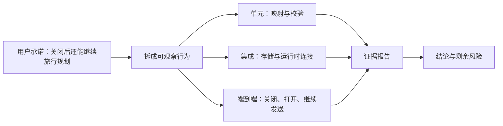

# E64：测试不是“通过”两个字，而是一份有边界的证据

> 本课的问题：小林的旅行助手在开发者电脑上成功生成过一次行程，能否据此宣布“Agent 会话可靠”？

小林输入“请规划杭州五日毕业旅行”，助手返回了一份行程。这个结果说明某一次操作曾经成功，却没有回答另外几件事：换一个会话会不会串线，恢复旧会话会不会加载错项目，工具写文件会不会越过工作目录，流中断后旧片段会不会混入新回复，真实模型配置是否仍然有效。

测试的价值不是制造一个绿色图标，而是把一句宽泛承诺拆成可重复观察的事实。本课先学习 Part E 最后一个单元的测试地基：测试运行器怎样装配环境，mock 怎样替代外部依赖，夹具怎样提供稳定输入，以及一条测试究竟能够证明到哪里。

本课不逐项验证会话恢复、Hook 并发和跨包契约；它们将在 E65-E69 分层展开。

## 1. 先分清四种不同强度的陈述

| 陈述 | 需要的证据 | 不能顺带推出什么 |
| --- | --- | --- |
| 源码存在一个分支 | 直接阅读实现 | 该分支能被触发、结果正确 |
| 单元测试通过 | 隔离输入下的函数或类断言 | 多模块连接、真实服务可用 |
| 集成测试通过 | 两个以上真实模块共同运行 | 浏览器到磁盘的完整用户链路 |
| 端到端验收通过 | 从用户动作到可观察结果的全链验证 | 所有未覆盖环境和故障都安全 |

“测试通过”必须带上主语。例如，严谨的说法是“会话恢复合同测试证明所有权不匹配时不会调用运行时 hydration”，而不是“恢复功能没有问题”。前一句可以定位到输入、动作和断言；后一句没有边界，无法审查。



图中第一根箭头表示把自然语言承诺改写成可测试行为；中间三条分支代表不同观察尺度；汇合到证据报告不表示三者等价，而是要求报告分别记录结果。最后一根箭头强调：验收结论必须同时写出已证明范围和剩余风险。

## 2. Vitest 配置决定测试生活在哪个世界

测试入口定义在 [packages/core/vitest.config.ts 第 1—24 行](../../../../packages/core/vitest.config.ts#L1)。关键配置如下：

```ts
export default defineConfig({
  resolve: { alias: { '@': path.resolve(__dirname, './src') } },
  test: {
    globals: true,
    environment: 'jsdom',
    setupFiles: [
      path.resolve(__dirname, './src/lib/integrations/pi-agent/__tests__/setup.ts'),
    ],
    include: ['src/**/*.{test,spec}.{ts,tsx}'],
    testTimeout: 30000,
    mockReset: true,
    restoreMocks: true,
  },
});
```

逐项理解这些配置，才能判断测试结果的含义。

- `environment: 'jsdom'` 提供近似浏览器的 DOM 环境，允许 React Hook 测试运行；它不是 Chromium，也不证明真实浏览器的网络、布局和进程行为。
- `setupFiles` 在测试文件加载前安装 Pi adapter 的全局 mock。被测模块导入 `Agent` 时，得到的是可控替身，而非真实模型适配器。
- `mockReset` 与 `restoreMocks` 减少测试间调用记录和替换实现的污染；它们不能自动清空模块级单例、文件系统或手工创建的事件监听器。
- `testTimeout: 30000` 只是单测超时上限，不是产品性能指标。一个测试在 30 秒内结束，不能证明 CUI 响应满足 500ms。

仓库根 `package.json` 的 `test` 当前指向 Web 包，并不等于 Core 的测试命令。对本单元应使用 Core 范围命令，例如：

```bash
pnpm --filter @originos/core exec vitest run \
  src/lib/integrations/pi-agent/core/__tests__/agent.test.ts
```

命令写进教材只表示可复现入口；只有实际执行成功并保留输出，才能写“本次运行通过”。

## 3. 全局 mock 模拟了什么

全局替身定义在 [packages/core/src/lib/integrations/pi-agent/__tests__/setup.ts 第 1—180 行](../../../../packages/core/src/lib/integrations/pi-agent/__tests__/setup.ts#L1)。`MockAgent` 保存 `systemPrompt`、`model`、`thinkingLevel`、`tools` 和 `messages`，并实现订阅、发事件、替换消息等最小行为。

```ts
subscribe(listener) {
  this._listeners.add(listener);
  return () => this._listeners.delete(listener);
}

prompt = vi.fn(async (message) => {
  const stream = this.streamFn(this.state.model, {
    systemPrompt: this.state.systemPrompt,
    messages: this.convertToLlm(this.state.messages),
    message,
  }, {});
  for await (const _event of stream) {
    // drain stream
  }
});
```

这段替身保留了两类关键结构：订阅者集合允许测试事件传播；`prompt` 会调用被注入的 `convertToLlm` 与 `streamFn`，使上下文转换和流桥接仍可被观察。它没有实现真实供应商 HTTP 请求、真实 token 计费、真实 SDK 全部状态机，也不会自然产生网络抖动。

同文件 [packages/core/src/lib/integrations/pi-agent/__tests__/setup.ts 第 109—166 行](../../../../packages/core/src/lib/integrations/pi-agent/__tests__/setup.ts#L109) 把 `streamSimple` 固定成一个可迭代流，最终返回“mock response”；`completeSimple` 则依据“我会、接下来、will、next”等词构造完成度判断结果。这使测试可预测，但也带来重要边界：它证明 OriginOS 如何消费这些结果，不证明真实模型一定按同样语义输出。

## 4. mock、stub、fixture 和 spy 不应混为一谈

| 测试材料 | 本单元中的例子 | 主要作用 | 典型误解 |
| --- | --- | --- | --- |
| mock | `vi.mock('@originos/pi-agent-adapter')` | 替换依赖并记录调用 | 以为替身通过等于真依赖可用 |
| stub | 固定返回 `{ provider, id }` 的 `getModel` | 给出最小可控行为 | 以为它验证了供应商模型存在 |
| fixture | 测试 Skill 的 `SKILL.md` | 提供稳定输入样本 | 以为单个样本覆盖所有格式 |
| spy | `vi.fn()`、`toHaveBeenCalledWith` | 观察是否以正确参数调用 | 以为调用发生就等于副作用成功 |

[packages/core/src/lib/integrations/pi-agent/__tests__/mocks.ts 第 1—104 行](../../../../packages/core/src/lib/integrations/pi-agent/__tests__/mocks.ts#L1) 还提供了另一套较小的适配器 mock。它具备 `destroy`，但没有 `setup.ts` 中完整的 `streamFn` 消费逻辑。两份替身能力不同，因此测试作者不能仅凭类名相似就假设行为相同。

## 5. 把一条测试读成 Given、When、Then

阅读测试时，不要从 `expect` 数量判断质量。先把它翻译成三个问题：

```ts
it('should create an agent instance with valid config', () => {
  agent = new OriginOSAgent(basicConfig);
  expect(agent).toBeDefined();
  expect(agent).toBeInstanceOf(OriginOSAgent);
});
```

这段测试位于 [packages/core/src/lib/integrations/pi-agent/core/__tests__/agent.test.ts 第 72—78 行](../../../../packages/core/src/lib/integrations/pi-agent/core/__tests__/agent.test.ts#L72)。

- Given：提供合法 `basicConfig`，外部 adapter 已被 mock。
- When：调用构造函数。
- Then：得到定义过且类型正确的包装器实例。

它没有调用 `initialize()`，没有发送消息，也没有连接模型。因此它只能证明“合法配置下构造不抛错并得到指定类”，不能证明 Agent 已经可以工作。若测试名称比断言范围更宽，应以实际动作和断言为准。

## 6. 测试目录 README 也是待核验材料

[packages/core/src/lib/integrations/pi-agent/__tests__/README.md 第 1—247 行](../../../../packages/core/src/lib/integrations/pi-agent/__tests__/README.md#L1) 描述了测试结构、运行命令和约 275 个案例。它提供导航价值，但表格中的数量使用 `~`，文件列表也未包含后来新增的恢复、流隔离与稳定性测试。

因此 README 属于“测试意图与历史说明”，不是实时覆盖率报告。可靠的台账应由当前 `rg --files`、实际测试收集结果和 coverage 产物共同生成。文档与源码不一致时，不能删除文档的历史价值，也不能把旧描述当作当前事实。

## 7. 失败路径：测试也会给出假安全感

常见的假安全感有四类：

1. **mock 过强。** 替身直接返回理想结果，被测代码从未面对真实格式差异。
2. **只断言“不抛错”。** 代码吞掉错误、什么也没做，同样可能通过。
3. **共享状态泄漏。** 单例、监听器或 fake timer 未清理，测试顺序改变结果。
4. **名称大于断言。** 名称写“安全防护”，实际只验证危险字符串被原样传递。

小林的案例中，“恶意路径字符串能传到 Hook”恰恰不表示路径遍历已经被阻止；安全责任属于真正解释和执行路径的工具边界。后续 E68 会专门分析这种“测试通过但安全结论相反”的情况。

## 8. 测试 Skill 夹具怎样提供最小差异

Skill 加载测试使用两个真实 Markdown 夹具。[packages/core/src/lib/integrations/pi-agent/__tests__/fixtures/skills/test-skill/SKILL.md 第 1—12 行](../../../../packages/core/src/lib/integrations/pi-agent/__tests__/fixtures/skills/test-skill/SKILL.md#L1) 提供最小 `name + description` frontmatter；[packages/core/src/lib/integrations/pi-agent/__tests__/fixtures/skills/another-skill/SKILL.md 第 1—9 行](../../../../packages/core/src/lib/integrations/pi-agent/__tests__/fixtures/skills/another-skill/SKILL.md#L1) 额外提供 `disable-model-invocation: true`。

这两个文件的差异非常小，因此加载测试若得到不同的可调用状态，可以把原因定位到该 frontmatter 字段。夹具同时保留 Markdown 正文，说明测试输入不是只伪造解析后的对象，而是让真实解析器面对接近生产形状的文件。

夹具仍有明确上限：它们只含英文 ASCII、合法 YAML 和简单正文，没有覆盖中文名称、引号、数组、缺少结束分隔符、软链接或路径权限。夹具是代表性样本，不是输入空间的全集。

## 9. 覆盖率数字必须追问分母和分支

假设报告显示 85% line coverage，仍需追问：

| 问题 | 为什么重要 |
| --- | --- |
| 分母包含哪些文件 | 排除复杂集成文件会让数字虚高 |
| branch coverage 是多少 | 行执行过不等于 if/else 两边都验证 |
| mock 后执行的是谁的代码 | 替身行被执行不能证明真实 adapter |
| 未覆盖行属于什么风险 | 错误与并发分支往往比普通 getter 更关键 |
| coverage 是否来自同一提交 | 旧报告不能证明当前源码 |

覆盖率用于寻找没有被执行的区域，不应成为“可靠性百分比”。两个测试都经过同一行，却可能只断言“有返回值”；一个高风险所有权分支即使只有十行，也可能比数百行普通映射更值得优先补测。

## 10. 本课的测试证据与缺口

本课直接读取的是测试基础设施，而不是运行一个产品功能。现有配置证明测试会在 jsdom 中加载全局替身，且匹配 `src` 下的 `.test/.spec` 文件。它没有证明：

- 所有列出的测试当前都能安装依赖并运行；
- Core 的覆盖率达到 AGENTS.md 要求的 80%；
- 真实 Anthropic 或 OpenAI-compatible 服务可达；
- Electron IPC、浏览器 SSE 和磁盘恢复形成了完整 E2E。

要补齐这些缺口，需要分别保存测试收集清单、coverage 报告、真实适配器的受控集成测试，以及跨进程端到端记录。

## 11. 小实验与口头验收

选择任意一条 Pi Agent 测试，写出四行证据卡：Given、When、Then、未证明。然后把其中一个 mock 换成真实依赖，说明测试会新增哪些不确定性，以及需要怎样隔离凭证和网络。

合上本页后，应能准确回答：

1. 为什么 jsdom 不等于真实浏览器。
2. 为什么 spy 记录到一次调用不等于副作用成功。
3. 为什么测试 README 不能代替当前测试收集结果。
4. 一条测试的结论为什么必须附带 Given、When、Then 和未证明范围。

下一课将把这套读法应用到 `OriginOSAgent` 与 Zustand store：同样是“初始化成功”，核心对象和 UI 状态容器分别证明了什么。
