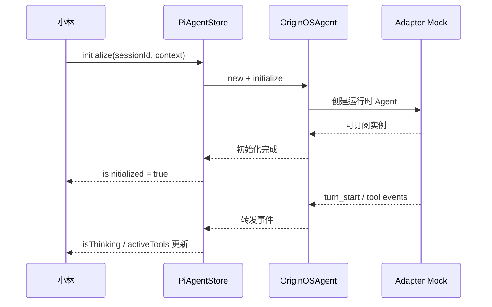
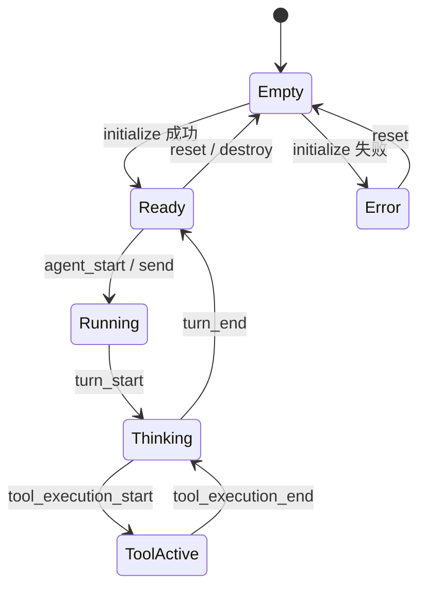
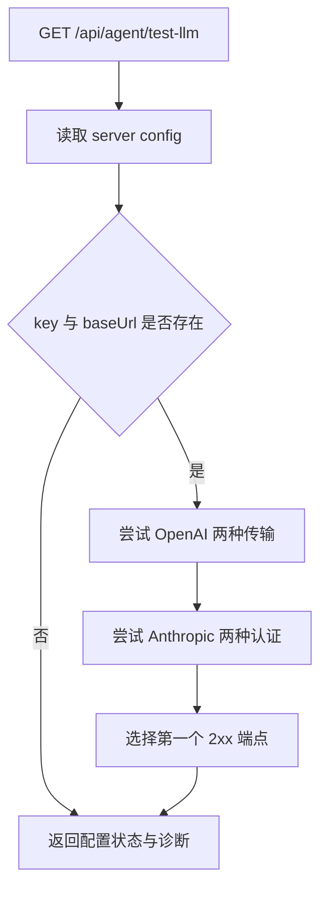

# E65：核心 Agent 与 UI Store 的生命周期，为什么必须分别验证

> 本课的问题：小林看到“旅行助手已初始化”，究竟是核心 Agent 已可运行，还是页面状态只是显示为已初始化？

`OriginOSAgent` 管理真实运行时包装、事件和消息；`PiAgentStore` 管理页面需要的状态与操作入口。两者都出现 `initialize`、`abort`、`destroy` 等词，却处在不同责任层。若只验证其中一层，就可能出现“底层已经失败但界面仍显示运行中”，或“底层正常但界面状态没有更新”。

本课精读核心类测试、Zustand store 测试和模型配置测试，学习怎样用相邻而不重复的合同覆盖一条生命周期。

## 1. 两套状态不是重复数据



图中 `S → O` 是 UI 状态层调用核心包装器；`O → A` 是核心集成层连接 adapter；返回箭头只表示对应调用完成，不表示真实模型已经回答。后半段的事件箭头说明 UI 状态应由运行时事实驱动。若 Store 自行猜测工具是否结束，就会与核心状态分叉。

### 1.1 先读生产 Store：它不只是几个布尔值

页面 Store 的生产实现位于 [packages/core/src/lib/integrations/pi-agent/store.ts 第 192—490 行](../../../../packages/core/src/lib/integrations/pi-agent/store.ts#L192)。`DEFAULT_STATE` 定义空闲起点；`initialize` 依次写入临时运行态、初始化内置工具、建立工具上下文、创建核心 Agent、注册工具、初始化 `SessionStore`、订阅事件，最后才提交 `agent` 与 `isInitialized: true`。

```ts
set({ isRunning: true, sessionId, projectContext });
initializeBuiltInTools();
setToolContext(sessionId, { sessionId });
const agent = await createOriginOSAgent(/* ... */);
agent.setTools(getAgentTools());
await sessionStore.saveSession(initialSession);
agent.subscribe(handleEvent);
set({ agent, isInitialized: true, isRunning: false });
```

这段压缩代码展示的是顺序，不是可直接替换源码的实现。它说明“页面显示已初始化”发生在一系列下层动作完成之后。中途任何一步失败，都应走 catch，保留错误并撤销 running；若提前写 `isInitialized: true`，页面会把半初始化状态误当成 Ready。

Store 在 `turn_end` 事件中异步读取 `currentAgent.getSessionState()` 并保存快照。这里存在两个需要理解的边界：事件回调不会等待内部自执行 Promise，保存失败只记录日志；同时它从 `get()` 读取**事件到达时的当前 Agent 和 sessionId**。会话快速切换时，必须用测试确认旧 Agent 的 turn_end 不会把状态保存到新 session 身份下。

### 1.2 核心配置、模型配置和运行环境是三份不同输入

核心 Agent 配置在 [packages/core/src/lib/integrations/pi-agent/system/config.ts 第 13—143 行](../../../../packages/core/src/lib/integrations/pi-agent/system/config.ts#L13)。`createOriginOSAgentConfig` 的合并优先级是默认值、system prompt variables、显式 overrides；`validateConfig` 只检查 sessionId、systemPrompt、model 和 projectId 是否存在，并不验证凭证可用或目录可写。

运行时模型工厂位于 [packages/core/src/lib/integrations/pi-agent/server-config.ts 第 392—479 行](../../../../packages/core/src/lib/integrations/pi-agent/server-config.ts#L392)。它先规范化 `RuntimeLLMConfig`，再按 provider 分派到 OpenAI-compatible、Azure、Google、Anthropic 或自动选择分支；Anthropic 还区分 bearer token 与 API key 的元数据落点。日志只输出 `hasCredential` 和脱敏 base URL，不直接打印凭证正文。

跨平台命令约束则来自 [packages/core/src/lib/integrations/pi-agent/system/runtime-environment.ts 第 43—133 行](../../../../packages/core/src/lib/integrations/pi-agent/system/runtime-environment.ts#L43)。它把平台、架构、默认 shell、路径分隔符和语法限制转成 prompt block；再次追加时先删除旧 block，保证同一系统提示词中只保留一份运行环境事实。

| 输入 | 回答的问题 | 不能替代 |
| --- | --- | --- |
| `OriginOSAgentConfig` | 本次 Agent 的身份、prompt、模型对象、项目与工具配置是什么 | 供应商凭证映射 |
| `RuntimeLLMConfig` / `createRuntimeModel` | provider、model、credential、base URL 怎样变成模型对象 | 会话和工作目录身份 |
| `RuntimeEnvironment` prompt | 模型生成命令时应遵守哪个 OS 与 shell 规则 | 工具层真实权限和安全校验 |

三者最终都会影响 Agent 行为，却属于不同来源和失败面。把它们统称为“配置”会让排错失去方向。

## 2. 核心测试先固定实例的起点

[packages/core/src/lib/integrations/pi-agent/core/__tests__/agent.test.ts 第 27—42 行](../../../../packages/core/src/lib/integrations/pi-agent/core/__tests__/agent.test.ts#L27) 定义了完整 `basicConfig`：会话 ID、system prompt、模型、项目上下文和 thinking level。随后 [packages/core/src/lib/integrations/pi-agent/core/__tests__/agent.test.ts 第 72—117 行](../../../../packages/core/src/lib/integrations/pi-agent/core/__tests__/agent.test.ts#L72) 分别验证构造、工厂函数和初始 state。

这里的关键不是断言数量，而是状态不变量：

| 字段 | 初始期望 | 原因 |
| --- | --- | --- |
| `sessionId` | 等于配置值 | 后续事件和持久化必须有身份 |
| `projectContext` | 保留同一业务上下文 | 工具路径和所有权依赖它 |
| `isThinking` | `false` | 尚未出现 `turn_start` |
| `activeTools` | 空集合 | 尚未出现工具开始事件 |

这些断言证明包装器正确接收配置，并不证明配置里的模型凭证可用。`basicConfig` 使用测试模型，adapter 又被全局替身接管。

## 3. 测试事件序列，而不是直接篡改最终状态

测试辅助函数 [packages/core/src/lib/integrations/pi-agent/core/__tests__/agent.test.ts 第 44—57 行](../../../../packages/core/src/lib/integrations/pi-agent/core/__tests__/agent.test.ts#L44) 构造一次助手停止序列：`message_start → message_end → turn_end → agent_end`。这比直接写 `isThinking = false` 更接近运行时，因为最终状态是事件归约的结果。

一条高价值生命周期测试应同时检查：

1. 输入事件是否到达订阅者；
2. 内部状态是否按顺序变化；
3. 最终消息是否只提交一次；
4. `abort` 或 `destroy` 后，迟到事件是否还能污染状态；
5. 重复操作是幂等、报错还是重新创建。

若只断言“最后为 false”，`turn_start` 从未生效、`turn_end` 正确清理和错误分支提前重置三种情况都可能得到同样结果。

## 4. Store 测试验证的是页面可消费合同

[packages/core/src/lib/integrations/pi-agent/store.test.ts 第 144—225 行](../../../../packages/core/src/lib/integrations/pi-agent/store.test.ts#L144) 检查默认 state、单例和初始化成功/失败。它通过 mock `OriginOSAgent` 观察 Store 是否以正确参数创建核心对象，以及失败时是否写入错误状态。

```ts
await store.initialize(mockSessionId, mockProjectContext, mockVariables);
expect(store.isInitialized).toBe(true);
expect(store.sessionId).toBe(mockSessionId);
```

这类断言的主语必须是 Store：它证明调用成功后 Store 对外暴露的状态改变。因为核心类被替换，不能用它证明真实 `OriginOSAgent.initialize()` 内部完成了模型、工具或流函数装配。

[packages/core/src/lib/integrations/pi-agent/store.test.ts 第 263—325 行](../../../../packages/core/src/lib/integrations/pi-agent/store.test.ts#L263) 验证发送失败与中止；[packages/core/src/lib/integrations/pi-agent/store.test.ts 第 352—460 行](../../../../packages/core/src/lib/integrations/pi-agent/store.test.ts#L352) 验证上下文合并及事件驱动状态；[packages/core/src/lib/integrations/pi-agent/store.test.ts 第 499—567 行](../../../../packages/core/src/lib/integrations/pi-agent/store.test.ts#L499) 验证重复 reset 和 destroy。

把这些测试串起来，可得到 Store 的状态机：



每条箭头对应一次公开操作或 Agent 事件。该图是测试意图的归纳，不意味着实现中存在同名枚举状态；真实 Store 由多个布尔值和集合组合状态，因此还要检查不可能组合，例如 `isInitialized=false` 却残留活动工具。

## 5. 部分更新为何要测试“保留旧值”

Store 的 `updateProjectContext` 接受部分字段。小林只修改旅行项目的 `currentPath` 时，`projectId`、`projectName` 和 `outputDir` 不应消失。[packages/core/src/lib/integrations/pi-agent/store.test.ts 第 352—376 行](../../../../packages/core/src/lib/integrations/pi-agent/store.test.ts#L352) 分别断言新字段被应用、原字段被保留。

这验证的是浅层合并合同。如果将来上下文出现嵌套对象，浅合并是否仍正确需要新的测试；现有断言不能自动覆盖未来结构。

## 6. 模型配置测试覆盖“凭证怎样映射”，不是“凭证能登录”

[packages/core/src/lib/integrations/pi-agent/__tests__/server-config.test.ts 第 40—170 行](../../../../packages/core/src/lib/integrations/pi-agent/__tests__/server-config.test.ts#L40) 隔离测试 `createRuntimeModel`。它覆盖：

- Anthropic bearer token 写入 `authToken`；
- Anthropic API key 保留在 `apiKey`；
- OpenAI-compatible 的最大输出字段映射；
- 结构化 key payload 先提取真实 credential；
- `Bearer ` 前缀在兼容供应商路径被剥离。

这些用例的 When 是构造运行时模型，Then 是检查传给 mock `getModel` 的参数。它们能防止“凭证种类映射错字段”，却不会向供应商发送请求，所以不能证明 token 有效、base URL 可达或模型 ID 存在。

## 7. 正常路径和失败路径必须成对

以初始化为例，至少需要下面这组对照：

| 场景 | 核心层应验证 | Store 层应验证 |
| --- | --- | --- |
| 合法配置 | runtime 被构造，初始状态正确 | `isInitialized=true`，身份进入 state |
| 缺少配置 | 核心抛出明确错误 | 错误被转成页面可读状态 |
| 重复初始化 | 行为幂等或明确替换 | 不残留旧订阅和旧消息 |
| 初始化中 destroy | 迟到完成不得复活实例 | 页面保持 Empty |
| 模型配置错误 | 失败保留内部原因 | 对外文案不得泄露敏感凭证 |

现有单测覆盖了其中多项基础行为，但“初始化与 destroy 竞态”和真实配置错误的脱敏跨层路径仍需要专门的并发集成测试。不能用各自单测拼出一个仓库里并不存在的结论。

## 8. 系统配置测试固定默认值、覆盖值与校验边界

[packages/core/src/lib/integrations/pi-agent/system/__tests__/config.test.ts 第 56—95 行](../../../../packages/core/src/lib/integrations/pi-agent/system/__tests__/config.test.ts#L56) 固定 `DEFAULT_CONFIG` 的模型、默认项目、thinking level 和空工具数组。[packages/core/src/lib/integrations/pi-agent/system/__tests__/config.test.ts 第 97—260 行](../../../../packages/core/src/lib/integrations/pi-agent/system/__tests__/config.test.ts#L97) 再验证 `createOriginOSAgentConfig` 怎样从变量构造 project context，并让显式 override 覆盖默认值。

这里有三层优先级：

```text
DEFAULT_CONFIG
  < system prompt variables 构造出的项目上下文
  < 调用方显式 overrides
```

箭头表示右侧具有更高覆盖优先级。小林若显式选择模型或 thinking level，不应被默认值覆盖；但只提供部分 project context 时，哪些字段保留、哪些成为 `undefined` 必须由实现和测试共同固定。

这组测试中多处使用 `as any` 构造缺字段变量。它便于触发运行时边界，却也绕过 TypeScript 静态检查。测试通过只能说明函数面对该对象的实际行为，不能证明公共类型允许调用者省略这些字段。

## 9. 运行环境 Prompt 测试固定跨平台差异

[packages/core/src/lib/integrations/pi-agent/system/__tests__/runtime-environment.test.ts 第 8—81 行](../../../../packages/core/src/lib/integrations/pi-agent/system/__tests__/runtime-environment.test.ts#L8) 分别构造 Windows PowerShell、Linux zsh 和 Windows cmd 环境。它断言路径分隔符、shell 指令和 heredoc 限制，并验证重复追加环境 block 时只保留一份。

这项合同与模型配置不同：模型配置决定“向谁请求”，运行环境 prompt 决定“工具命令应按哪个平台书写”。若 Windows prompt 错写 Bash heredoc，模型可能持续生成无法执行的命令；若重复追加环境块，system prompt 会膨胀并产生冲突。

测试只验证 prompt 文本包含正确约束，仍不证明模型遵守，更不证明生成命令在真实 PowerShell/cmd 中执行成功。真实 shell 行为应由命令工具集成测试承担。

## 10. 配置诊断 Route 会发真实请求，不能当成纯读取接口

仓库还提供 [packages/web/src/app/api/agent/test-llm/route.ts 第 14—334 行](../../../../packages/web/src/app/api/agent/test-llm/route.ts#L14) 诊断模型配置。它不是 `server-config.test.ts` 那样的 mock 单测，也不是简单返回环境变量：一次 GET 会根据当前配置依次尝试 OpenAI-compatible 原生 HTTP、OpenAI-compatible fetch、Anthropic `x-api-key` 和 Anthropic bearer 等端点，每次请求都有 15 秒超时。



图中的多个尝试是顺序 `await`，不是并行竞速。上游持续超时时，整个诊断请求可能等待多轮超时；因此不能把它当作频繁轮询的健康接口。GET 还产生真实外部网络副作用，从 HTTP 语义上也不是纯粹的只读缓存查询。

返回结果会包含脱敏后的 key、key 长度和前缀分析、base URL、modelId、每种端点的状态、推荐 provider 与诊断文本。源码不会返回完整 key，但“前 8 位 + 后 4 位”、token 格式和内部 base URL 仍属于敏感诊断信息。该 Route 是否受开发环境、权限或部署边界限制，需要额外检查；仅凭“已经 mask”不能推导它适合公开访问。

| 证据 | 能证明 | 不能证明 |
| --- | --- | --- |
| `server-config.test.ts` | 配置怎样映射成模型参数 | 真实端点可达 |
| `GET /test-llm` 某端点 2xx | 本次网络、凭证、URL 组合得到成功响应 | 正常 Agent runtime 使用完全相同协议与长期稳定 |
| 所有端点失败 | 本次诊断没有找到可用组合 | 一定是供应商故障；也可能是 URL、凭证、网络或协议配置错误 |

当前没有发现直接覆盖这条 Route 的测试。尤其需要测试缺失配置不发网络、不同认证头、URL `/v1` 拼接、超时清理、响应脱敏，以及未授权调用者不能获得诊断信息。在这些边界固定前，它应作为人工诊断工具谨慎使用，不能充当自动化验收的唯一证据。

## 11. 小林案例：一次看似成功的错误验收

假设测试只执行：

```ts
usePiAgentStore.setState({ isInitialized: true });
expect(usePiAgentStore.getState().isInitialized).toBe(true);
```

这只证明 Zustand 能保存布尔值。它绕过了 Agent 构造、配置映射、订阅建立和错误处理，不能作为“旅行助手初始化成功”的证据。更合格的 Store 测试应调用公开 `initialize`，mock 核心边界，并断言调用参数与状态迁移；更高一层集成测试则应减少 mock，让真实 `OriginOSAgent` 参与。

## 12. 测试证据与缺口

本课测试证明：核心包装器能用合法配置建立初始状态；Store 能管理初始化、发送、事件状态、上下文更新、reset 与 destroy；服务器模型配置能把多种凭证映射到运行时模型参数。

它们没有证明：真实模型可调用、React 组件正确渲染 Store、浏览器与服务端建立 SSE、会话落盘成功。`store.test.ts` 还依赖 mock 核心对象，必须避免把“调用 mock 成功”写成“核心运行成功”。

## 13. 小实验与口头验收

画出“小林初始化旅行助手”的双层状态表：左列写核心 Agent 状态，右列写 Store 状态。分别为初始化成功、模型配置失败、工具执行中、abort、destroy 填值，并圈出哪些状态组合不应出现。

合上本页后，应能回答：

1. 为什么 Agent state 与 Store state 不能由同一组测试替代。
2. 为什么模拟事件序列比直接设置最终布尔值更有证明力。
3. `createRuntimeModel` 的参数断言为何不证明供应商可用。
4. 部分上下文更新需要同时断言“新值写入”和“旧值保留”的原因。
5. 为什么 `/api/agent/test-llm` 的一次 2xx 不能替代正常会话端到端测试。

下一课进入最容易被“单测都绿了”掩盖的边界：磁盘中的旧会话必须先通过 schema 与所有权校验，再恢复运行时，最后才允许返回可显示消息。
