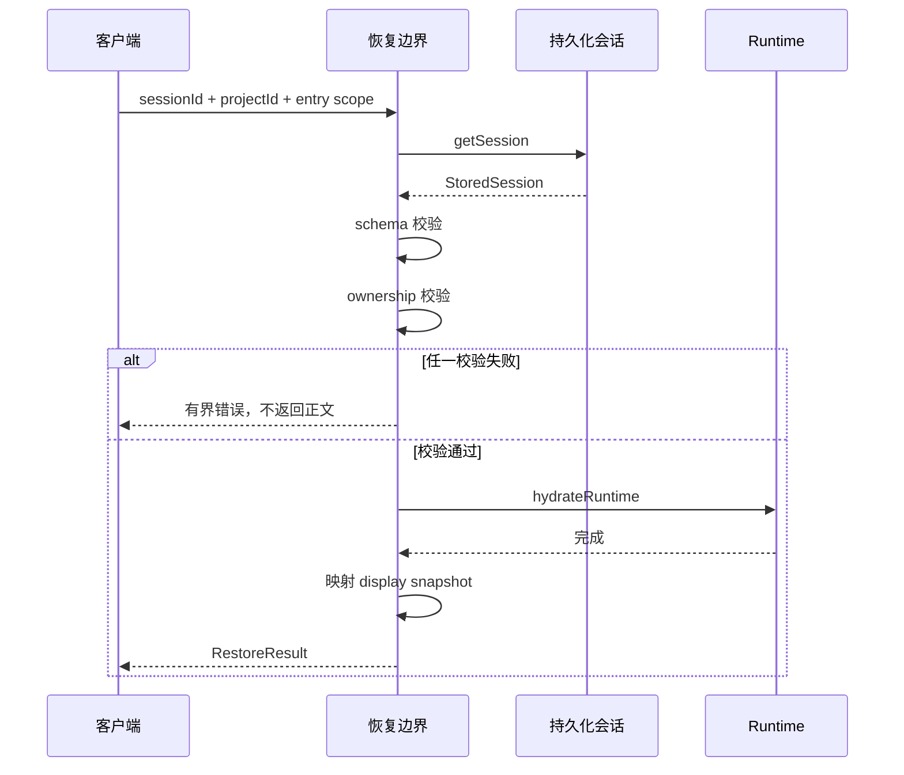

# E66：会话恢复测试必须证明顺序，不能只检查最后拿到了消息

> 本课的问题：小林重新打开毕业旅行项目后看见旧聊天，是否足以证明恢复流程正确？

如果系统先把消息正文返回浏览器，再检查它是否属于当前 Skill，即使最后报出“所有权不匹配”，数据也已经越界。如果系统先显示历史，再异步恢复运行时，用户可能在一个尚未可继续的会话里发送新消息。因此，恢复合同不仅关心最终对象长什么样，还必须证明校验、运行时 hydration 和内容返回的先后顺序。

本课精读 `session-restore.test.ts` 与运行时历史恢复测试，建立“输出断言、拒绝断言、未调用断言、异步顺序断言、性能断言”五类证据。

在进入源码前，先建立测试阅读词典：

| 术语 | 本课中的含义 |
| --- | --- |
| 测试夹具（fixture） | 为测试准备的一份合法基准会话 |
| mock | 可记录调用、也可人为控制结果的替身函数 |
| 断言（assertion） | 对执行结果或执行过程提出的可验证要求 |
| Promise | 一个未来才会完成或失败的异步结果 |
| hydration | 把磁盘中的会话数据装回可继续工作的运行时 |
| 负向断言 | 证明某个危险动作没有发生，例如运行时从未被恢复 |

测试不是“调用函数后看看有没有报错”。本课关注的是一个更严格的问题：在错误请求中，危险动作是否从未发生；在正确请求中，运行时是否先准备完毕，数据才交给客户端。

## 1. 恢复不是一次普通的读取



图中两次自调用分别代表纯校验；它们必须发生在 Runtime hydration 和正文返回之前。失败分支没有通向 Runtime，表示测试应明确断言 `hydrateRuntime` 未被调用。成功分支中 Runtime 的返回位于 display snapshot 之前，表示客户端拿到历史时会话已经具备继续运行的条件。

## 2. 基准夹具把所有权和内容放在同一个样本里

[packages/core/src/lib/integrations/pi-agent/__tests__/session-restore.test.ts 第 11—89 行](../../../../packages/core/src/lib/integrations/pi-agent/__tests__/session-restore.test.ts#L11) 构造 `StoredSession` 与 `restoreRequest`。样本包含：

- `sessionId`；
- `projectContext` 中的 `projectId`、目录和入口身份；
- `agentType`、LLM 配置；
- 用户、助手和工具结果消息；
- schema version。

夹具用 `overrides` 改动单个条件，使每条测试只改变一个变量。例如把 `schemaVersion` 改为 `999`，其他字段保持合法，就能把失败原因定位到 schema，而不是同时混入所有权错误。

这种“一个基准样本 + 最小差异”的方式比每条测试重新手写大对象更容易比较，但也有风险：如果基准样本本身遗漏必填字段，所有测试会共享同一盲区。因此夹具应与类型和真实存储样本定期对照。

## 3. 输出形状测试固定的是有界公开合同

[packages/core/src/lib/integrations/pi-agent/__tests__/session-restore.test.ts 第 91—137 行](../../../../packages/core/src/lib/integrations/pi-agent/__tests__/session-restore.test.ts#L91) 调用 `createRestoreAgentSessionResult`，断言 contract version、身份、目录、LLM 配置、runtime flags 和三条显示消息。

```ts
expect(result).toMatchObject({
  contractVersion: 1,
  sessionId: 'session-skill-a',
  agentType: 'skill',
  runtime: { restored: true, resumable: true },
});
expect(result.messages).toEqual([
  { role: 'user', content: '请继续分析', ... },
  { role: 'assistant', content: '分析完成', ... },
  { role: 'toolResult', content: 'report.md', ... },
]);
```

`toMatchObject` 允许结果存在其他字段，适合固定核心合同；`toEqual` 则严格固定消息数组内容和顺序。二者选择表达了不同兼容策略。若公开对象新增非破坏字段，前者通常不失败；显示消息意外多出内部块时，后者会立即报警。

[packages/core/src/lib/integrations/pi-agent/__tests__/session-restore.test.ts 第 139—146 行](../../../../packages/core/src/lib/integrations/pi-agent/__tests__/session-restore.test.ts#L139) 还验证空会话保持空数组，不合成欢迎消息。这条边界很重要：恢复层不应伪造从未发生的历史。

## 4. 错误码比错误字符串更适合作为合同

[packages/core/src/lib/integrations/pi-agent/__tests__/session-restore.test.ts 第 148—237 行](../../../../packages/core/src/lib/integrations/pi-agent/__tests__/session-restore.test.ts#L148) 覆盖两类拒绝：

- 未知 schema 或畸形消息得到 `CORRUPT_SESSION`；
- project、entry type 或 entry id 不匹配得到 `OWNERSHIP_MISMATCH`。

测试辅助函数检查结构化 `code`，而不是依赖一整段自然语言。错误文案可以为了可读性调整，错误类别仍能稳定驱动客户端行为。

兼容路径也被明确限制：旧会话没有持久化入口身份时，可以仅按 project 校验；一旦保存了 entry identity，就必须同时匹配。这个测试不是放宽所有权，而是把历史数据迁移边界固定下来。

## 5. `not.toHaveBeenCalled` 证明敏感动作没有发生

[packages/core/src/lib/integrations/pi-agent/__tests__/session-restore.test.ts 第 239—273 行](../../../../packages/core/src/lib/integrations/pi-agent/__tests__/session-restore.test.ts#L239) 对所有权错误和损坏历史分别执行边界恢复，并断言：

```ts
await expect(restoreSessionAtBoundary(...))
  .rejects.toMatchObject({ code: 'OWNERSHIP_MISMATCH' });
expect(hydrateRuntime).not.toHaveBeenCalled();
```

仅断言 Promise 拒绝还不够。一个错误实现可能已经调用 `hydrateRuntime`、读出正文，最后才发现不匹配；测试仍会看到拒绝。附加的“未调用”断言把安全顺序纳入合同。

同理，安全边界常需要负向证据：没有写磁盘、没有调用工具、没有订阅旧会话、没有返回敏感详情。测试不是只证明发生了什么，也要证明禁止动作没有发生。

## 6. 用可控 Promise 验证异步先后

[packages/core/src/lib/integrations/pi-agent/__tests__/session-restore.test.ts 第 275—300 行](../../../../packages/core/src/lib/integrations/pi-agent/__tests__/session-restore.test.ts#L275) 创建一个暂不 resolve 的 hydration Promise。调用恢复后先检查 `settled === false`，再手动释放 hydration，最终断言会话内容返回。

```ts
const hydration = new Promise<void>((resolve) => {
  releaseHydration = resolve;
});
const restore = restoreSessionAtBoundary(request, {
  getSession,
  hydrateRuntime: () => hydration,
});

await Promise.resolve();
expect(settled).toBe(false);
releaseHydration?.();
await restore;
expect(settled).toBe(true);
```

这里不是靠 `setTimeout(100)` 猜执行速度，而是用门闩控制关键阶段。无论机器快慢，只要 hydration 尚未释放，恢复就不得完成。这类测试比等待固定毫秒更稳定，也更准确地表达因果关系。

逐步展开这段测试：

1. 创建 `hydration` Promise，但暂时不调用它的 `resolve`，相当于把运行时恢复停在一道门前。
2. 调用 `restoreSessionAtBoundary`，得到尚未完成的 `restore` Promise。
3. `await Promise.resolve()` 只让当前已经排入微任务队列的代码获得一次执行机会，它不是在等待 hydration 完成。
4. 此时断言 `settled === false`，证明恢复没有绕过门闩提前返回。
5. 手动调用 `releaseHydration()`，运行时恢复才获准完成。
6. 等待 `restore`，最后断言 `settled === true`。

这里还要区分“没有调用”和“尚未完成”：`not.toHaveBeenCalled()` 适合证明错误分支根本没触发 hydration；门闩测试则允许 hydration 已被调用，但要求外层恢复必须等它完成。两种断言验证的是两个不同阶段。

一个弱测试可能只写：

```ts
const result = await restoreSessionAtBoundary(request, deps);
expect(result.messages).toHaveLength(3);
```

即使错误实现先返回消息、稍后才恢复 runtime，这个测试也可能通过。强测试把中间阶段变成可观察状态，因此能抓住“结果最终正确、顺序却危险”的实现。

## 7. 内部错误必须映射成有界外部错误

[packages/core/src/lib/integrations/pi-agent/__tests__/session-restore.test.ts 第 302—310 行](../../../../packages/core/src/lib/integrations/pi-agent/__tests__/session-restore.test.ts#L302) 让 hydration 抛出 `private runtime failure`，对外只期待：

```ts
{ code: 'RESTORE_FAILED', message: 'Session restore failed.' }
```

这证明恢复边界不把内部实现细节直接交给调用者。它没有证明日志系统已经安全记录原始原因；内部诊断是否保存、是否脱敏，需要另一层测试。

## 8. 性能断言必须说明测试环境

[packages/core/src/lib/integrations/pi-agent/__tests__/session-restore.test.ts 第 312—339 行](../../../../packages/core/src/lib/integrations/pi-agent/__tests__/session-restore.test.ts#L312) 构造 1,000 条可见消息，断言数量与首尾内容，并要求投影耗时低于 500ms。

这个测试能发现明显的算法退化，例如不必要的平方级遍历。它不是跨机器稳定的产品 SLA：测试运行器负载、CI 硬件和计时精度都会影响结果；它也不含磁盘读取、网络响应和 React 渲染。准确名称应是“纯投影预算测试”，不能据此声称“1,000 条历史端到端恢复低于 500ms”。

## 9. 运行时历史恢复还要检查模型身份来源

[packages/core/src/lib/integrations/pi-agent/core/__tests__/runtime-history-restore.test.ts 第 1—69 行](../../../../packages/core/src/lib/integrations/pi-agent/core/__tests__/runtime-history-restore.test.ts#L1) 验证恢复助手消息时，`api`、`provider` 和 `model` 从当前运行时模型派生，而不是盲信旧消息中可能过期的元数据。

这与 display snapshot 属于不同方向：前者构造可继续执行的内部历史，后者构造可安全展示的外部历史。两者都叫“恢复消息”，但字段责任不同，不能用一个数组直接替代另一个。

## 10. 五类断言怎样共同证明恢复合同

| 断言类型 | 典型写法 | 捕获的错误 | 单独使用的盲区 |
| --- | --- | --- | --- |
| 输出形状 | `toMatchObject` / `toEqual` | 字段丢失、角色错位、顺序变化 | 不知道敏感动作是否提前发生 |
| 结构化拒绝 | `rejects.toMatchObject({code})` | schema/ownership 错误未被拒绝 | 可能拒绝得太晚 |
| 未调用 | `hydrateRuntime.not.toHaveBeenCalled()` | 校验失败后仍触发运行时 | 不证明成功路径顺序 |
| 异步门闩 | hydration 未释放前 `settled=false` | 提前返回正文 | 不覆盖乱序客户端提交 |
| 性能预算 | `elapsedMs < 500` | 明显算法退化 | 不包含 I/O、网络、渲染 |

有效测试不是在一条用例里堆满所有断言，而是让每种断言对应一个可描述的故障模型。测试失败时，读者能知道究竟是合同形状、拒绝类别、副作用顺序还是性能退化。

## 11. 用反事实检查测试是否真的有抓错能力

可以在纸面上对实现做四个假改动：把 ownership 校验移动到 hydration 之后；遇到空历史时添加欢迎消息；把内部错误原文返回；把显示消息按角色分组而非时间排序。然后逐一指出哪条现有测试会失败。

如果某个危险改动没有任何测试失败，就发现了真实缺口。反事实分析比“测试很多”更接近 mutation testing 的思想：证据强度取决于它能否杀死错误实现，而不是文件行数。

还可以加入“消息体读取计数器”来增强所有权测试：将消息正文放在带 getter 的对象或延迟读取函数后，ownership 不匹配时断言 getter/函数从未触发。现有 `hydrateRuntime.not.toHaveBeenCalled()` 已证明运行时未恢复，但若 `getSession` 一次性返回完整对象，测试很难直接证明代码在校验前没有访问正文属性。对极高敏感度数据，可以把元数据读取与正文读取拆成两个存储接口，让调用顺序也成为可观察合同。

这种设计会增加存储接口复杂度，并非所有本地应用都必须采用；它展示的是一个判断原则：当“不得提前读取”本身是安全要求时，测试对象必须让读取动作可以被观察，不能只观察最终响应。

## 12. 测试证据与缺口

现有恢复合同测试明确证明了输出形状、空历史、schema 拒绝、所有权兼容与拒绝、校验先于 hydration、hydration 先于返回、错误映射及纯投影性能。运行时历史测试补充了模型元数据来源。

它们尚未证明真实 JSON 文件在进程重启后可读、API route 正确传递身份、客户端不会提交迟到恢复、页面恢复后能够继续发消息。下一课将把视角移动到 Hook 的竞态和事件隔离。

## 13. 小实验与口头验收

把成功恢复测试改成两个并发请求 A、B：B 后发先到，A 后到。先写一个只断言最终有消息的弱测试，再写一个断言最终身份必须是 B、A 内容不得出现、旧订阅被取消的强测试，比较两者能捕获的错误。

合上本页后，应能回答：

1. 为什么恢复成功不仅是“最后返回了消息”。
2. `not.toHaveBeenCalled` 在所有权错误中证明了什么。
3. 可控 Promise 为什么比固定延时更适合验证顺序。
4. 1,000 条消息低于 500ms 为什么不能写成端到端 SLA。
5. display snapshot 与 runtime history 的消息为什么不能混为一谈。

下一课将验证浏览器侧最棘手的时序：两个会话、两个流、两个恢复请求同时存在时，只有当前操作有资格修改当前页面。
