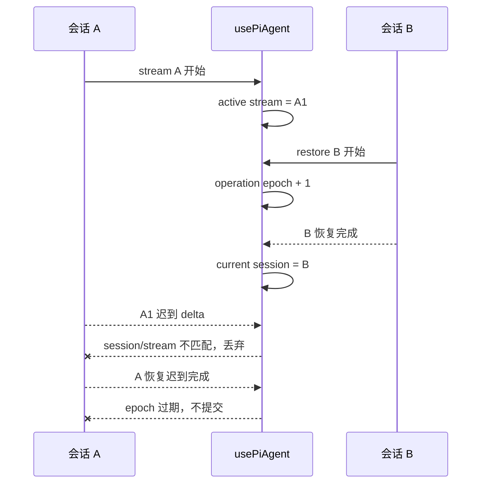

# E67：Hook 测试的难点不是渲染，而是并发操作的所有权

> 本课的问题：小林先打开旅行会话 A，又快速切到会话 B；A 的旧流和迟到恢复结果还能不能改写 B 的页面？

单会话、顺序执行时，很多错误不会出现。真实界面却允许用户中止流、切换会话、重新初始化和卸载组件；网络响应也可能乱序返回。Hook 测试的核心因此不是“能否得到一个 state”，而是证明每个异步结果只属于发起它的会话、流和操作世代。

本课精读 `use-pi-agent` 的基础、事件、异常、安全和会话隔离测试。重点是测试怎样制造竞态，以及哪些旧测试虽然通过，却不能证明如今的跨会话安全。

## 1. 三种身份共同决定事件归属

| 身份 | 回答的问题 | 只比较它会漏掉什么 |
| --- | --- | --- |
| `sessionId` | 事件属于哪段会话 | 同一会话中旧流与新流混淆 |
| `streamId` | 事件属于哪次流式请求 | 恢复或初始化并非流事件 |
| operation epoch | 异步结果属于哪次页面操作 | 后发请求先完成时旧结果覆盖新状态 |



两条带叉箭头分别由不同守卫拒绝：旧流事件靠 session/stream identity，旧恢复结果靠 operation epoch。二者不能互相替代。

## 2. 基础 Hook 测试固定公开 API 的最小行为

[packages/core/src/lib/integrations/pi-agent/hooks/__tests__/use-pi-agent.test.ts 第 73—143 行](../../../../packages/core/src/lib/integrations/pi-agent/hooks/__tests__/use-pi-agent.test.ts#L73) 检查初始值和 `initialize` 后的 `sessionId`、`projectContext`、`agent`。随后 [packages/core/src/lib/integrations/pi-agent/hooks/__tests__/use-pi-agent.test.ts 第 152—329 行](../../../../packages/core/src/lib/integrations/pi-agent/hooks/__tests__/use-pi-agent.test.ts#L152) 验证发送、reset、destroy 与订阅。

这些测试使用 mock Agent，适合回答“Hook 是否调用正确方法、是否暴露正确 state”。例如未初始化时 `sendMessage` 抛错，说明 Hook 拒绝无 Agent 的操作；却不证明服务端 session 不存在时 HTTP 层会返回什么。

[packages/core/src/lib/integrations/pi-agent/hooks/__tests__/use-pi-agent.test.ts 第 329—783 行](../../../../packages/core/src/lib/integrations/pi-agent/hooks/__tests__/use-pi-agent.test.ts#L329) 逐类发出 `turn_start`、`turn_end`、工具开始/结束和 `message_end`，验证 UI state。它还检查 10 个连续更新的顺序和组件卸载时取消订阅。这里的核心不变量是：事件归约后状态一致，卸载后不再接收事件。

## 3. 事件集成测试证明组合序列

[packages/core/src/lib/integrations/pi-agent/hooks/__tests__/events-integration.test.ts 第 70—531 行](../../../../packages/core/src/lib/integrations/pi-agent/hooks/__tests__/events-integration.test.ts#L70) 不只发一个事件，而是覆盖完整 turn、流式增量、单工具、并发工具和复杂事件序列。

以两个工具并行为例，合格断言不应只检查 `activeTools.length === 2`，还应在第一个工具结束后保留第二个、全部结束后清空。集合中间态能捕获“任一结束事件直接清空全部工具”的实现错误。

`agent.state.messages` 同步到 `hooks.messages` 的用例则验证数据来源，而非仅验证本地临时 delta。它仍运行在 mock 事件世界中，所以不证明 SSE 解析器发送了完全相同的事件序列。

## 4. 用 deferred Promise 人工制造乱序

[packages/core/src/lib/integrations/pi-agent/__tests__/client-hooks-session-isolation.test.ts 第 81—99 行](../../../../packages/core/src/lib/integrations/pi-agent/__tests__/client-hooks-session-isolation.test.ts#L81) 定义 `deferred<T>()`，把 Promise 的 `resolve/reject` 交给测试。这样测试可以先发 A，再发 B，先完成 B，最后完成 A。

[packages/core/src/lib/integrations/pi-agent/__tests__/client-hooks-session-isolation.test.ts 第 353—420 行](../../../../packages/core/src/lib/integrations/pi-agent/__tests__/client-hooks-session-isolation.test.ts#L353) 断言最终仍是 B：

- `sessionId === 'session-b'`；
- context 属于 `skill-b`；
- messages 只有 `B history`；
- A 的迟到结果完成后状态不变。

这比“快速调用两次 restore 并等待”更可靠，因为后者无法保证真实调度顺序，可能偶然一直按 A、B 完成，竞态分支从未被触发。

## 5. 同一操作世代必须覆盖 initialize 与 restore

[packages/core/src/lib/integrations/pi-agent/__tests__/client-hooks-session-isolation.test.ts 第 442—486 行](../../../../packages/core/src/lib/integrations/pi-agent/__tests__/client-hooks-session-isolation.test.ts#L442) 先挂起 initialize A，再完成 restore B，最后释放 A，断言 A 不能覆盖 B。

这条测试揭示一个常见设计错误：分别为 initialize 和 restore 设置各自的计数器。若两个计数器互不认识，“最新 initialize”和“最新 restore”都可能自认为有效。共享 operation epoch 才能表示“页面最后一次身份切换操作”。

[packages/core/src/lib/integrations/pi-agent/__tests__/client-hooks-session-isolation.test.ts 第 488—508 行](../../../../packages/core/src/lib/integrations/pi-agent/__tests__/client-hooks-session-isolation.test.ts#L488) 还规定恢复当前 session 是幂等操作：返回 `null`，不请求服务端。它减少不必要的状态抖动，但只在请求身份确实等于当前 session 时成立。

## 6. 流隔离必须验证负面内容

[packages/core/src/lib/integrations/pi-agent/__tests__/client-hooks-session-isolation.test.ts 第 176—262 行](../../../../packages/core/src/lib/integrations/pi-agent/__tests__/client-hooks-session-isolation.test.ts#L176) 同时创建 project Hook 与 skill Hook，向公共事件入口发送 project-only、project session 和 skill session 事件。断言不只是各自包含正确消息，还明确检查不包含另一会话内容。

```ts
expect(skillMessages.some(m => m.content.includes('project-session'))).toBe(false);
expect(projectMessages.some(m => m.content.includes('skill assistant'))).toBe(false);
```

正向断言只能证明正确消息进来了；若实现把所有消息都广播给所有窗口，正向断言仍会通过。负向断言才固定隔离边界。

[packages/core/src/lib/integrations/pi-agent/__tests__/client-hooks-session-isolation.test.ts 第 264—350 行](../../../../packages/core/src/lib/integrations/pi-agent/__tests__/client-hooks-session-isolation.test.ts#L264) 在同一 session 中先启动流 1、abort、再启动流 2，随后注入流 1 的迟到 delta 和 final。最终允许保留 abort 前已经提交的 `first partial`，但禁止出现 abort 后的 `stale old delta/final`。这准确区分“历史中已发生的内容”和“失效流迟到的内容”。

## 7. 切换会话必须撤销旧订阅

[packages/core/src/lib/integrations/pi-agent/__tests__/client-hooks-session-isolation.test.ts 第 592—695 行](../../../../packages/core/src/lib/integrations/pi-agent/__tests__/client-hooks-session-isolation.test.ts#L592) 是一条接近用户流程的 Hook 集成测试：

1. 初始化 A 并开始 A 流；
2. 恢复 B；
3. 断言 A 的 unsubscribe 被调用且监听集合为空；
4. 注入 A 的迟到事件，B 历史不变；
5. 从 B 发送新请求，断言请求身份是 B；
6. 注入 B 事件，最终只看到 B 内容。

它跨越了恢复、订阅、发送与事件消费，证据强于单个 reducer 测试；由于客户端 API 与事件总线仍被 mock，它仍不是浏览器—服务端—运行时的真实 E2E。

## 8. 异常测试中的“不崩溃”只是最低线

[packages/core/src/lib/integrations/pi-agent/hooks/__tests__/exceptions.test.ts 第 65—316 行](../../../../packages/core/src/lib/integrations/pi-agent/hooks/__tests__/exceptions.test.ts#L65) 覆盖错误状态、abort、未知事件、并发订阅、重复 destroy 和重新初始化。

`expect(...).not.toThrow()` 只能证明同步调用没有抛出到测试外层。它不能证明状态没被部分破坏、监听器没泄漏、错误被正确记录。因此每个“不崩溃”用例最好再附加状态与副作用断言。例如未知事件后 `isInitialized` 保持真、订阅数量不增长、活动工具集合不改变。

## 9. `act`、`waitFor` 与清理分别解决什么

React Hook 测试中的三个动作不能互换：

| 动作 | 作用 | 错用后果 |
| --- | --- | --- |
| `act(...)` | 把会触发 React state 更新的动作纳入一次提交 | 断言读取到未刷新的 state，出现警告 |
| `waitFor(...)` | 反复检查异步条件直到成功或超时 | 用固定 sleep 造成慢且偶发的测试 |
| `afterEach` 清理 | 清除监听器、mock、timer 和共享状态 | 后一条测试继承前一条事件 |

会话隔离测试在 [packages/core/src/lib/integrations/pi-agent/__tests__/client-hooks-session-isolation.test.ts 第 141—143 行](../../../../packages/core/src/lib/integrations/pi-agent/__tests__/client-hooks-session-isolation.test.ts#L141) 清空公共 listeners；测试 setup 又重置 mock。二者职责不同：mockReset 不知道测试自己创建的 `Set`，所以仍要显式清理。

`waitFor` 也不是让测试“多等一会儿”。它适用于不知道 React/Promise 何时提交但知道最终条件的场景；若要精确控制 A、B 谁先完成，应使用 deferred Promise，而不是期待 `waitFor` 制造特定顺序。

## 10. 失败恢复还要保证当前状态原子性

[packages/core/src/lib/integrations/pi-agent/__tests__/client-hooks-session-isolation.test.ts 第 550—590 行](../../../../packages/core/src/lib/integrations/pi-agent/__tests__/client-hooks-session-isolation.test.ts#L550) 先成功恢复 current session，保存 messages 和 context 引用，再让另一恢复返回 `OWNERSHIP_MISMATCH`。最终不仅身份仍是 current，messages 还必须保持同一引用，错误文案包含 code 但不包含服务端敏感详情。

这说明失败恢复不能“先清空再请求，失败后尽量重建”。旧状态应在新结果完全验证前保持原子可用。否则一次失败切换会让小林丢失当前正在阅读的旅行历史。

## 11. 测试证据与缺口

现有 Hook 测试已经固定基础 API、事件组合、中止后旧流隔离、跨会话隔离、恢复乱序、初始化与恢复共享世代、失败不覆盖当前状态以及切换订阅。它们没有运行真实 EventSource、HTTP route 或 React 页面组件，也没有证明浏览器刷新后的持久化恢复。

另一个缺口是部分旧 Hook 测试依赖结构较简单的 mock Agent；随着生产 Hook 增加 session/stream/epoch 守卫，应定期确认旧 mock 没有绕过新入口。

## 12. 小实验与口头验收

用六张纸分别写 A-session、A-stream-1、B-session、B-stream-1、operation-7、operation-8。模拟 A 流开始、B 恢复、A 迟到 delta、A 迟到恢复、B 新回复，逐张判断哪一个守卫接受或拒绝。

合上本页后，应能回答：

1. `sessionId`、`streamId`、operation epoch 各解决什么竞态。
2. 为什么隔离测试必须同时写“不包含另一会话内容”。
3. 为什么两个独立的最新请求计数器不如共享世代可靠。
4. `not.toThrow` 为什么不是完整的异常状态验证。
5. E67 的 Hook 集成测试为什么仍不能称为浏览器端到端测试。

下一课将处理另一类容易误判的测试：危险字符串、thinking 内容、消息格式和个性化 prompt。测试通过时，必须先确认它是在“过滤危险”，还是在“忠实传输并把责任交给下一层”。
