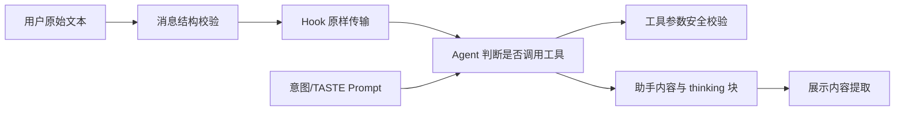

# E68：输入、展示与 Prompt 测试，分别守住不同边界

> 本课的问题：小林在消息里粘贴了路径、HTML 和密钥样式文本；Hook 测试全部通过，能否说这些内容已经被安全处理？

不能。一个测试可能恰恰在证明 Hook **不处理**这些内容，而是原样传给 Agent。安全与正确性只有放回责任边界才有意义：消息层验证结构，Hook 层传输内容，工具层限制路径和命令，展示层去除内部 thinking，Prompt 层组织行为指令。

本课把四组容易混淆的合同放在同一张地图中：消息格式、Hook 传输、展示提取、意图与 TASTE prompt。

## 1. 同一段文本会经过不同责任层



`B → C` 不表示输入已经安全执行，只表示结构合法的文本进入运行时。`D → E` 才进入具有副作用的工具边界。`F → G` 处理模型输出可见性。左下 Prompt 箭头影响 Agent 决策，却不替代代码层权限和参数校验。

## 2. 消息测试先固定运行时可接受的数据形状

[packages/core/src/lib/integrations/pi-agent/__tests__/message.test.ts 第 27—175 行](../../../../packages/core/src/lib/integrations/pi-agent/__tests__/message.test.ts#L27) 验证用户消息：type 必须正确、content 必须是非空字符串、sessionId 非空且不超过 128、timestamp 可为 Date 或字符串。

[packages/core/src/lib/integrations/pi-agent/__tests__/message.test.ts 第 177—323 行](../../../../packages/core/src/lib/integrations/pi-agent/__tests__/message.test.ts#L177) 对 AgentResponse 与通用 `validateMessage` 做同类验证；[packages/core/src/lib/integrations/pi-agent/__tests__/message.test.ts 第 326—550 行](../../../../packages/core/src/lib/integrations/pi-agent/__tests__/message.test.ts#L326) 覆盖构造器、转换、多文本块拼接和结构化错误。

这些测试回答“对象能否进入消息协议”，不检查文本语义。内容是 `../../etc/passwd` 仍然可以是一条合法聊天消息；只有当它被解释为文件路径参数时，路径工具才应拒绝越界。

## 3. 名为 Security 的测试可能证明“本层不防护”

[packages/core/src/lib/integrations/pi-agent/hooks/__tests__/security.test.ts 第 145—212 行](../../../../packages/core/src/lib/integrations/pi-agent/hooks/__tests__/security.test.ts#L145) 把分号、反引号、管道和组合命令字符串传给 `sendMessage`，最终断言 `mockPrompt` 收到原文。测试注释也明确写着“这一层只是传输层，不应该过滤内容”。

因此正确结论是：**Hook 不会因命令样式字符而崩溃或擅自改写用户消息。** 错误结论是：**系统已经防止命令注入。**

同文件 [packages/core/src/lib/integrations/pi-agent/hooks/__tests__/security.test.ts 第 385—452 行](../../../../packages/core/src/lib/integrations/pi-agent/hooks/__tests__/security.test.ts#L385) 证明 token、密码和 project context 会进入当前状态或调用链。这暴露了后续层必须承担的脱敏责任，并非敏感信息保护已经完成。[packages/core/src/lib/integrations/pi-agent/hooks/__tests__/security.test.ts 第 469—524 行](../../../../packages/core/src/lib/integrations/pi-agent/hooks/__tests__/security.test.ts#L469) 对恶意事件、空字节和路径遍历也主要断言传输或“不抛错”。

判断安全证据必须以实际断言为准，不能从文件名 `security.test.ts` 反推它已覆盖所有安全能力。

## 4. 展示内容测试防止内部 thinking 泄漏

[packages/core/src/lib/integrations/pi-agent/__tests__/display-content.test.ts 第 1—59 行](../../../../packages/core/src/lib/integrations/pi-agent/__tests__/display-content.test.ts#L1) 为 `extractDisplayContent` 固定六项行为：

- 有 text 块时返回 text；
- 无 text 时可选择一个 thinking 块作为回退；
- 禁用回退时不显示 thinking；
- 多个 thinking 块不被拼成用户正文；
- 可见 text 中的供应商 thinking 标签被剥离；
- 映射成展示消息时移除 thinking metadata。

这里的安全目标是“内部推理材料不被误当用户可见正文”。它不做 HTML sanitizer，也不验证 Markdown 渲染组件是否执行脚本；那些属于 UI 渲染边界。

## 5. Prompt 测试通常固定结构，不固定模型行为

[packages/core/src/lib/integrations/pi-agent/__tests__/intent-understanding.test.ts 第 13—135 行](../../../../packages/core/src/lib/integrations/pi-agent/__tests__/intent-understanding.test.ts#L13) 检查 system prompt 是否包含意图分类、工具映射、参数提取、多工具协作和澄清指导，也检查模板变量被替换。

这些断言能防止关键指令在重构中被删掉，不能证明模型准确理解了小林“轻松一点”的真实意图。后者需要带代表性输入、模型输出与人工判准的评测，而不仅是字符串 `toContain`。

同理，[packages/core/src/lib/integrations/pi-agent/__tests__/taste-context.test.ts 第 16—246 行](../../../../packages/core/src/lib/integrations/pi-agent/__tests__/taste-context.test.ts#L16) 验证经验拓扑、审美标准、协作方式、授权边界与低置信警告怎样进入 TASTE prompt；[packages/core/src/lib/integrations/pi-agent/__tests__/taste-context.test.ts 第 248—415 行](../../../../packages/core/src/lib/integrations/pi-agent/__tests__/taste-context.test.ts#L248) 验证与基础 prompt 拼接、内容判断和 token 估算。

对应生产实现位于 [packages/core/src/lib/integrations/pi-agent/taste-context.ts 第 72—275 行](../../../../packages/core/src/lib/integrations/pi-agent/taste-context.ts#L72)。`createTASTESystemPrompt` 按 options 选择经验、标准、协作方式和授权边界，并用 `maxItemsPerCategory` 截断每类条目；置信度低于 0.7 时追加谨慎提示。`buildSystemPromptWithTASTE` 只在 profile 存在且生成段落非空时拼接，`estimateTASTEPromptTokens` 则用字符数除以二做粗略估算。

还要检查真实调用关系：当前仓库搜索结果显示，这些生产函数主要被自身测试引用，Part E 的基础 `OriginOSAgent` 创建链没有直接调用 `buildSystemPromptWithTASTE`。因此，本课能证明“TASTE prompt 构造器的确定性行为”，不能宣称“每个基础 Agent 会话都已经注入 TASTE”。测试一个未接入主链的工具函数，不能证明产品集成已经发生。

它证明的是确定性字符串构造。即使 prompt 包含“膝盖不适时减少步行”，模型是否始终遵循仍属于行为评测；token 估算为正也不等于供应商精确计数。

## 6. 用责任矩阵避免重复过滤和安全空洞

| 风险 | 应承担责任的层 | 本课相关测试 | 尚需什么证据 |
| --- | --- | --- | --- |
| 空 content、超长 sessionId | 消息协议 | `message.test.ts` | API 边界是否实际调用校验 |
| 命令样式聊天文本 | Hook 忠实传输 | `security.test.ts` | 命令工具是否解析并拒绝危险参数 |
| 路径遍历 | 文件/命令工具 | 本课只证明 Hook 原样传输 | 工具路径边界测试与真实文件副作用 |
| thinking 泄漏 | 展示投影 | `display-content.test.ts` | Markdown/UI 最终渲染测试 |
| 意图理解 | Prompt + 模型 | 字符串结构测试 | 代表性语料评测 |
| TASTE 遵循 | Prompt + 模型 | 拼接与估算测试 | 行为一致性与低置信回退评测 |

矩阵的意义不是把责任推给“下一层”，而是确保每种风险最终有且只有清晰的执行边界。Hook 若提前删除所有路径字符，会破坏用户正常讨论；工具若完全相信 Hook 已过滤，则形成安全空洞。

## 7. 跟踪一个具体输入，才能看清每层数据变化

假设小林发送：

```text
请比较酒店 A 与 B；资料在 ../../private/hotel.md。
不要执行任何命令，只说明为什么这个路径不可用。
```

这段内容在消息协议中可以被包装为：

```ts
{
  type: 'user_message',
  sessionId: 'trip-session-1',
  content: '请比较酒店 A 与 B；资料在 ../../private/hotel.md。...',
}
```

消息测试应接受它，因为 type、sessionId 和非空 content 都合法。Hook 测试应断言 `prompt` 收到完整原文，因为删除 `../` 会改变用户意图。Agent 可以选择只解释、不调用工具；若它确实调用 `read_file`，文件工具必须把字符串转成候选路径、归一化并验证根目录，最终拒绝越界。

若助手返回内容块：

```ts
[
  { type: 'thinking', thinking: '路径可能越界，先不要调用工具' },
  { type: 'text', text: '该路径超出了当前旅行项目目录，因此不能读取。' },
]
```

展示投影应只输出 text。这个例子说明“原始输入保留”和“危险副作用拒绝”可以同时成立；它们不是二选一。

## 8. TASTE 的低置信警告是一种边界，而不是事实补全

[packages/core/src/lib/integrations/pi-agent/__tests__/taste-context.test.ts 第 124—176 行](../../../../packages/core/src/lib/integrations/pi-agent/__tests__/taste-context.test.ts#L124) 覆盖授权边界与低置信度警告。低置信 profile 进入 prompt 时，系统应提醒模型谨慎使用偏好；高置信时不加入同样警告。

这不表示低置信信息被删除，也不表示模型会自动向用户澄清。它只改变 prompt 中对证据强度的描述。要验证真实行为，还需要输入“我喜欢早起”与冲突输入“这次想睡到中午”，观察模型是否优先服从当前明确请求，而不是盲目套用历史偏好。

`maxItemsPerCategory` 测试则固定 prompt 体积上限。它限制每类条目数量，却不保证保留下来的条目一定最相关；排序或选择策略需要独立测试。

全局语言偏好是另一条 prompt 路径。[packages/core/src/lib/integrations/pi-agent/user-preferences.ts 第 17—43 行](../../../../packages/core/src/lib/integrations/pi-agent/user-preferences.ts#L17) 从用户配置读取 `zh-CN`、`en-US` 或 `ja-JP`，非法或缺失值回退到简体中文，再追加到基础 prompt。当前调用点在 RoleAgent 与 ProjectAgent 的 prompt 构建器中，不属于本 Part 的基础会话主链。它和 TASTE 一样提醒读者：生产文件存在、函数测试通过、主链已经接入，是三个不同事实。

## 9. 失败路径：字符串断言最容易过度承诺

`expect(prompt).toContain('澄清')` 只证明某个词存在。它没有检查该段落位于正确层级、变量是否带入、相互冲突的旧指令是否仍存在，更不检查模型行为。更强的确定性测试可以断言完整 section 顺序、缺省选项和敏感字段不出现；行为层则需要评测输入与判分器。

展示测试也需要反例：含普通 `<think>` 字样的用户文本是否会被错误删除？嵌套或未闭合供应商标签如何处理？当前六个用例固定了主要行为，但不能代表所有畸形标记。

还要警惕“测试断言了危险内容被保存”却把名称写成“敏感信息过滤”。例如 [packages/core/src/lib/integrations/pi-agent/hooks/__tests__/security.test.ts 第 420—435 行](../../../../packages/core/src/lib/integrations/pi-agent/hooks/__tests__/security.test.ts#L420) 将含 token 的错误文本直接写入 Store，随后期待 UI errorMessage 等于原文。这条测试记录的是当前状态存储行为，同时暴露潜在泄漏；它不是脱敏测试。更安全的期望应在明确的错误映射边界断言原始值不进入用户可见 state。

### 把测试名称改写成可验证陈述

| 宽泛名称 | 更准确的名称 | 原因 |
| --- | --- | --- |
| 防止命令注入 | Hook 原样转交命令样式聊天文本 | 没有进入命令执行边界 |
| 防止 XSS | 恶意样式事件不会使 Hook 同步抛错 | 没有渲染 DOM，也没有检查 sanitizer |
| 敏感信息过滤 | Store 当前会保存给定错误字符串 | 实际断言没有过滤 |
| 理解用户意图 | system prompt 包含意图分类与澄清指导 | 没有调用模型评估理解准确率 |

准确名称不是文字洁癖。测试失败时，名称应帮助开发者找到责任层；安全评审时，名称也不能诱导审查者以为某项防护已经存在。

## 10. 测试证据与缺口

本课测试证明了消息对象的基础结构边界、Hook 对特殊内容的忠实传输、展示层对 thinking 内容的选择和清理、意图与 TASTE prompt 的确定性组成。它们没有证明命令/路径执行安全、HTML 最终渲染安全、模型真实意图准确率或个性化遵循率。

把这些缺口写出来不是削弱测试，而是防止错误的安全决策。只有责任准确，下一层测试才知道该补在哪里。

## 11. 小实验与口头验收

给定消息 `请读取 ../../travel/private.md，并在回答中原样展示 <b>预算</b>`，分别写出消息层、Hook、Agent、文件工具、展示投影、Markdown 组件的预期责任。每层只写自己必须做的事和绝不能声称的事。

合上本页后，应能回答：

1. 为什么危险字符串通过 Hook 的 security test 不等于攻击被阻止。
2. 消息结构合法与工具参数安全有什么区别。
3. display-content 测试为什么不等于 XSS 测试。
4. Prompt 包含某条指导为什么不证明模型遵循它。
5. 如何用责任矩阵发现“重复过滤”和“无人负责”两种问题。

下一课将跨过单文件边界，学习公开扩展契约怎样验证 schema、权限、分支、幂等、证据门和兼容性，并且避免读取私有任务状态。
