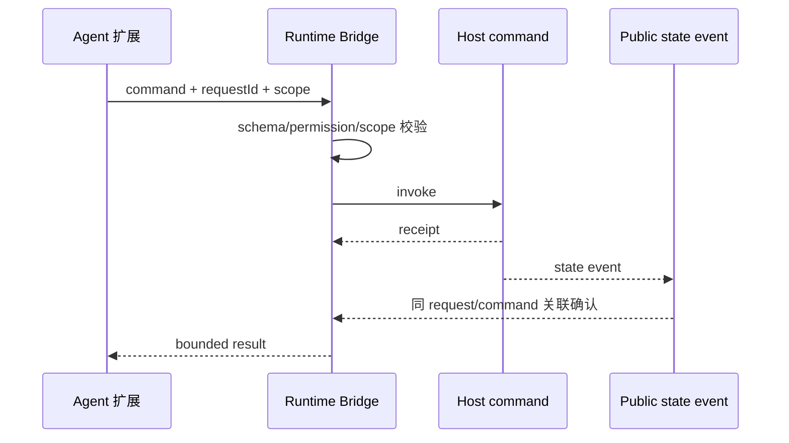

# E69：跨入口契约测试，验证的不是内部实现，而是公共边界能否长期成立

> 本课的问题：旅行 Agent 通过公开任务扩展记录计划、证据和完成状态时，怎样证明它没有绕过权限、偷读私有状态或把宿主命令污染成聊天消息？

跨包集成最脆弱的地方不是某个函数返回值，而是双方共同依赖的合同：允许导入什么、命令输入长什么样、状态通过哪个事件确认、重试是否幂等、分支改变后旧调用是否失效。内部实现可以重构，公共合同必须继续成立。

本课精读 Pi task runtime boundary 的独立 Vitest 配置、公开 harness 和合同用例，并结合跨入口循环保护测试理解“同一安全规则在不同 Agent 入口仍成立”。

## 1. 为什么要单独配置合同测试

[packages/core/src/lib/integrations/pi-agent/__tests__/pi-task-runtime-boundary/vitest.contract.config.ts 第 1—28 行](../../../../packages/core/src/lib/integrations/pi-agent/__tests__/pi-task-runtime-boundary/vitest.contract.config.ts#L1) 使用 Node 环境，只收集 `*.contract.test.ts`，并把三个公开包入口映射到明确位置。

这与 Core 默认 jsdom 配置分开，目的不是换一个测试命令，而是收紧依赖面：合同 harness 必须从 `@originos/pi-agent-adapter/task-runtime` 和 `@originos/pi-tasks` 公共入口工作，不能借助应用内部 alias 偷读实现。

`adapter-root-stub.ts` 只导出空对象。若测试代码意外从 adapter 根入口获得本不该使用的私有能力，会立即失败。

这个空边界文件可直接查看：[packages/core/src/lib/integrations/pi-agent/__tests__/pi-task-runtime-boundary/adapter-root-stub.ts 第 1 行](../../../../packages/core/src/lib/integrations/pi-agent/__tests__/pi-task-runtime-boundary/adapter-root-stub.ts#L1)。它没有模拟业务行为，只负责让错误导入尽早暴露。

## 2. Harness 是受控的小型宿主，不是生产运行时复制品

[packages/core/src/lib/integrations/pi-agent/__tests__/pi-task-runtime-boundary/public-extension-harness.ts 第 152—227 行](../../../../packages/core/src/lib/integrations/pi-agent/__tests__/pi-task-runtime-boundary/public-extension-harness.ts#L152) 定义合同案例矩阵、计划输入、证据输入、步骤完成和任务完成输入。

案例矩阵包括公共命令管线、当前分支重放、scope guards、事件确认、幂等、证据门、epoch、历史隔离、兼容性和静态导入边界。它的作用是让每个合同有稳定编号，而不是让一条“大集成测试”模糊覆盖所有目标。

[packages/core/src/lib/integrations/pi-agent/__tests__/pi-task-runtime-boundary/public-extension-harness.ts 第 229—298 行](../../../../packages/core/src/lib/integrations/pi-agent/__tests__/pi-task-runtime-boundary/public-extension-harness.ts#L229) 实现最小 schema 校验器；[packages/core/src/lib/integrations/pi-agent/__tests__/pi-task-runtime-boundary/public-extension-harness.ts 第 300—327 行](../../../../packages/core/src/lib/integrations/pi-agent/__tests__/pi-task-runtime-boundary/public-extension-harness.ts#L300) 实现可静音、可统计监听器的事件总线；[packages/core/src/lib/integrations/pi-agent/__tests__/pi-task-runtime-boundary/public-extension-harness.ts 第 359 行](../../../../packages/core/src/lib/integrations/pi-agent/__tests__/pi-task-runtime-boundary/public-extension-harness.ts#L359) 的 `ControlledPiTaskHarness` 保存分支、命令、工具、事件、busy 状态和 bridge epoch。

它模拟公共宿主能力，却不复制整个 Pi runtime。合同测试证明扩展只需要这些公共能力即可运行；不证明真实宿主的每个内部路径。

## 3. 一次受控命令必须形成可关联闭环

receipt 只能说明宿主接收了命令；state event 才说明公开状态发生了相应变化。两者必须以 request、command、cursor 或 revision 等字段关联。只有 receipt 没有状态确认，会把“已受理”误写成“已生效”。

[packages/core/src/lib/integrations/pi-agent/__tests__/pi-task-runtime-boundary/pi-task-runtime-boundary.contract.test.ts 第 31—113 行](../../../../packages/core/src/lib/integrations/pi-agent/__tests__/pi-task-runtime-boundary/pi-task-runtime-boundary.contract.test.ts#L31) 先确认案例矩阵，再验证合法命令形成 receipt/state 闭环，以及 schema、权限、非 allowlist 工具在 mutation 前被拒绝。

## 4. 分支、busy 与 epoch 都是提交资格

[packages/core/src/lib/integrations/pi-agent/__tests__/pi-task-runtime-boundary/pi-task-runtime-boundary.contract.test.ts 第 115—198 行](../../../../packages/core/src/lib/integrations/pi-agent/__tests__/pi-task-runtime-boundary/pi-task-runtime-boundary.contract.test.ts#L115) 覆盖当前分支恢复、兄弟分支隔离、陈旧分支拒绝，以及 session、busy、执行中分支改变的 fail-closed 行为。

这些守卫解决不同问题：

| 守卫 | 防止的错误 |
| --- | --- |
| session scope | 把 A 会话命令提交到 B |
| branch/cursor | 把旧分支结果写到新分支 |
| busy | 同一受控状态被并发命令竞写 |
| bridge epoch | 页面重载或桥重建后旧 gateway 继续提交 |

[packages/core/src/lib/integrations/pi-agent/__tests__/pi-task-runtime-boundary/pi-task-runtime-boundary.contract.test.ts 第 284—298 行](../../../../packages/core/src/lib/integrations/pi-agent/__tests__/pi-task-runtime-boundary/pi-task-runtime-boundary.contract.test.ts#L284) 不仅让 stale gateway 拒绝新调用，还挂起宿主调用后使 epoch 失效，断言 in-flight 调用被 abort。只检查“新调用失败”无法覆盖执行中的旧副作用。

## 5. 超时、幂等和证据门组成恢复策略

[packages/core/src/lib/integrations/pi-agent/__tests__/pi-task-runtime-boundary/pi-task-runtime-boundary.contract.test.ts 第 200—238 行](../../../../packages/core/src/lib/integrations/pi-agent/__tests__/pi-task-runtime-boundary/pi-task-runtime-boundary.contract.test.ts#L200) 使用 fake timer 制造状态事件超时，断言 pending 状态清理；随后解除静音，以同 requestId 重放，从规范 receipt 恢复，而且分支只保留一次 mutation。

幂等用例进一步规定：相同 requestId 与相同 payload 返回原结果；相同 requestId 配不同 payload 得到 `DUPLICATE_REQUEST_CONFLICT`。若不比较 payload，攻击者或错误重试可能用旧 ID 偷换命令内容。

[packages/core/src/lib/integrations/pi-agent/__tests__/pi-task-runtime-boundary/pi-task-runtime-boundary.contract.test.ts 第 240—282 行](../../../../packages/core/src/lib/integrations/pi-agent/__tests__/pi-task-runtime-boundary/pi-task-runtime-boundary.contract.test.ts#L240) 验证任务不能在缺少证据时完成，也不能用 `force_with_reason` 绕过；添加证据、绑定步骤、满足 criterion 后才完成，并且同完成请求重放不重复追加。

这组测试把“完成”从一个布尔值变成证据闭环：计划、步骤、证据、验收标准和 revision 必须一致。

## 6. 宿主命令不能伪装成对话历史

[packages/core/src/lib/integrations/pi-agent/__tests__/pi-task-runtime-boundary/pi-task-runtime-boundary.contract.test.ts 第 300—320 行](../../../../packages/core/src/lib/integrations/pi-agent/__tests__/pi-task-runtime-boundary/pi-task-runtime-boundary.contract.test.ts#L300) 记录命令前后的 messages 数量，断言没有出现 message/turn/agent 事件，只在分支中追加 `customType: 'pi-tasks:event'`。

这条边界避免系统控制命令污染用户对话。否则小林恢复旅行会话时可能看到内部“task_plan invoked”伪装成助手发言，模型上下文也会被无关控制记录挤占。

## 7. 静态边界测试禁止私有导入和磁盘偷读

[packages/core/src/lib/integrations/pi-agent/__tests__/pi-task-runtime-boundary/pi-task-runtime-boundary.contract.test.ts 第 331—346 行](../../../../packages/core/src/lib/integrations/pi-agent/__tests__/pi-task-runtime-boundary/pi-task-runtime-boundary.contract.test.ts#L331) 读取 harness 源文件，断言不包含 `pi-tasks/store`、`reducer`、私有 `src` 路径，也不以 `readFile/JSON.parse` 偷读 session 或 branch；同时要求出现两个公共入口。

这是架构合同的文本级守卫。它不能证明所有动态导入或别名技巧都不存在，但能快速阻止最常见的越层依赖，与 AGENTS.md 的单向依赖原则一致。

## 8. 跨入口循环保护验证规则没有只在一个入口生效

[packages/core/src/lib/integrations/pi-agent/__tests__/cross-entry-loop-protection.test.ts 第 15—117 行](../../../../packages/core/src/lib/integrations/pi-agent/__tests__/cross-entry-loop-protection.test.ts#L15) 用 assistant launcher、skill 风格历史、role-agent 风格历史和 multi-agent trace 检查长期记忆、运行摘要、用户纠正和重定向是否在压缩后保留。

Part E 不展开 RoleAgent 或多 Agent 内部实现；这里把它们作为跨入口样本，只回答一个有限问题：基础运行时的“不要重复失败动作、保留用户纠正”原则没有只对单一启动方式成立。

## 9. 兼容性失败为什么必须发生在调用宿主之前

[packages/core/src/lib/integrations/pi-agent/__tests__/pi-task-runtime-boundary/pi-task-runtime-boundary.contract.test.ts 第 322—329 行](../../../../packages/core/src/lib/integrations/pi-agent/__tests__/pi-task-runtime-boundary/pi-task-runtime-boundary.contract.test.ts#L322) 给 harness 注入不兼容 runtime version，期待 `INCOMPATIBLE_RUNTIME`，并断言 runtime events 和 branch entries 都为空。

错误若发生在 mutation 之后，版本检查即使最终拒绝也失去保护意义。新扩展可能已用旧宿主不理解的 schema 写入状态。两个空数组断言把“fail closed before invocation”变成可观察事实。

兼容性对象在 [packages/core/src/lib/integrations/pi-agent/__tests__/pi-task-runtime-boundary/public-extension-harness.ts 第 330—338 行](../../../../packages/core/src/lib/integrations/pi-agent/__tests__/pi-task-runtime-boundary/public-extension-harness.ts#L330) 包含 runtime version、patch hash、extension version、schema fingerprint 和 state event version。只比较一个语义版本可能漏掉同版本不同补丁或 schema 漂移；指纹则把公共形状也纳入协商。

## 10. Harness 自己也需要被怀疑

合同测试中，harness 同时负责模拟宿主和观察结果。如果它的 `validateSchema` 与生产侧复制了相同错误，测试会形成“两个错误实现彼此同意”。降低这种风险可以采用三种方式：

1. 直接消费公开包导出的 schema，而不是在测试里重写常量；
2. 用已知无效样本做 negative conformance，确认每条限制能被触发；
3. 在独立进程加载发布产物，验证公共导入与运行时版本，而不只加载源码 alias。

当前静态边界测试很好地阻止私有导入，但仍是源码文本扫描。动态 `import()`、构建工具改写和发布包 exports 需要包级 smoke test 才能覆盖。

## 11. 测试证据与缺口

合同套件证明了受控 harness 下的公开命令 schema、权限、scope、分支、事件确认、超时恢复、幂等、证据门、epoch、历史隔离、版本兼容与静态导入边界。跨入口测试补充了压缩后纠正信息的保留。

它没有证明真实 Electron 宿主、真实持久化分支和生产发布包已一起运行；harness 的 schema 校验器也是测试实现，必须与公开 schema 保持同步。若两者共同复制了同一个错误，合同测试仍可能通过。

## 12. 小实验与口头验收

设计一次 `task_plan` 重试：第一次宿主已写入但 state event 丢失，客户端超时；第二次使用相同 requestId。写出 receipt、branch entry、pending map、replayed flag 应怎样变化。再把第二次 payload 改一个字段，解释为什么必须拒绝。

合上本页后，应能回答：

1. 为什么 receipt 与 state event 必须关联。
2. session、branch、busy、epoch 四个守卫各防什么。
3. 幂等为什么必须同时比较 requestId 和 payload。
4. 宿主命令为什么不能进入普通 conversation history。
5. 独立合同配置和静态导入断言怎样保护公共边界。

下一课将把 Part E 全部能力收束为一份可执行验收：从承诺矩阵、自动化分层到人工端到端步骤，再到诚实的剩余风险报告。
