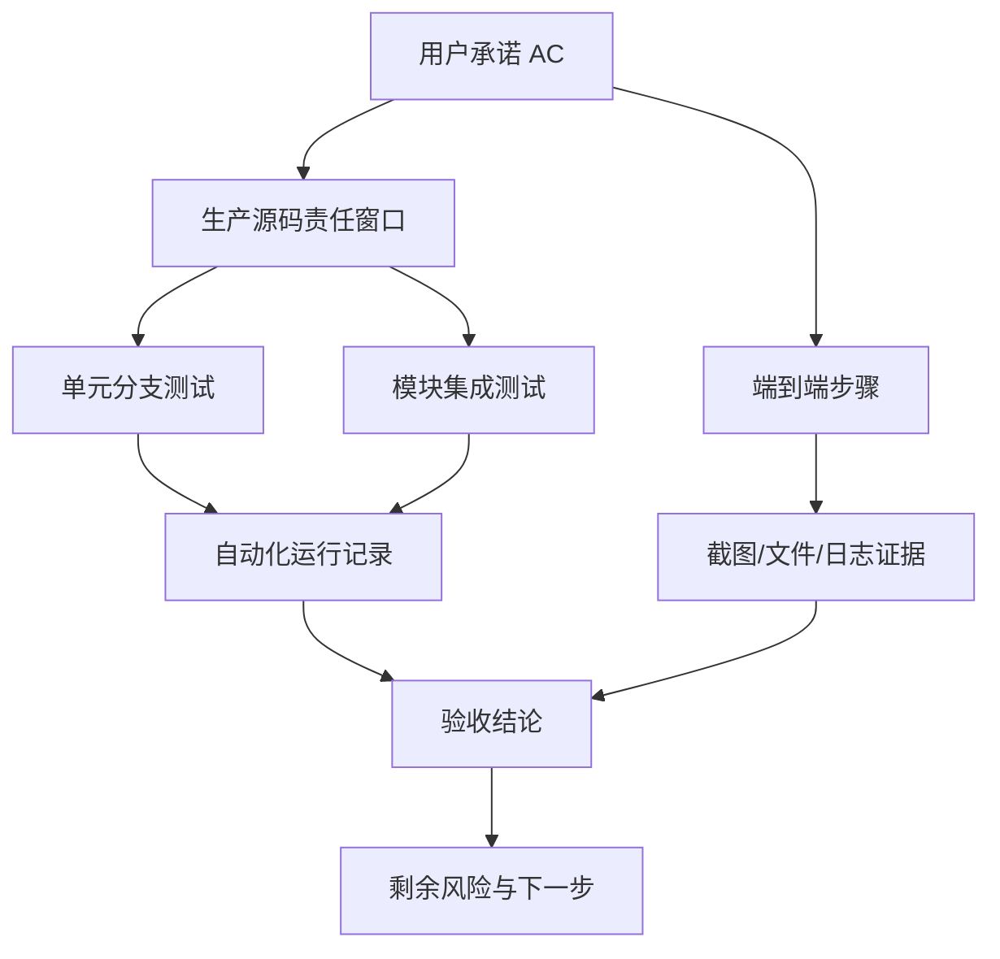

# E70：Pi Agent 基础运行时端到端验收工作坊

> 本课的问题：怎样把 E01-E69 的源码理解转化为一份任何人都能重复执行、不会夸大结论的验收报告？

小林的毕业旅行策划已经穿过窗口入口、会话创建、消息流、Skills、工具、保存恢复和异常保护。最后一课不再增加新的运行机制，而是建立证据闭环：先写用户承诺，再选择测试层级，执行自动化与人工步骤，保存观察结果，最后报告未覆盖风险。

## 1. 验收从用户承诺开始，不从测试文件开始

“把所有测试跑一遍”无法说明产品承诺是否被覆盖。先为小林写最小承诺矩阵：

| ID | 用户承诺 | 可观察结果 | 主要自动化证据 | 仍需人工/E2E |
| --- | --- | --- | --- | --- |
| AC-1 | 可从旅行 Skill 建立独立会话 | 获得 sessionId 与正确 entry scope | 配置、Hook scope 测试 | 首页真实入口 |
| AC-2 | 流式回答不串到其他会话 | B 不出现 A 的 delta/final | session/stream isolation | 两窗口并发观察 |
| AC-3 | 工具只在旅行工作目录行动 | 越界拒绝，合法文件落在 outputDir | path/tool tests | 检查真实磁盘 |
| AC-4 | 关闭后可恢复并继续 | 旧历史可见，新请求发往恢复会话 | restore contract + Hook race | 重启应用恢复 |
| AC-5 | 中止或异常不会污染下一轮 | 旧流迟到内容被丢弃，错误有界 | abort/isolation/error tests | 网络中断演练 |
| AC-6 | 不会用空承诺冒充完成 | promise-only 回答被 guard 识别 | completion tests | 真实模型样例 |

每个承诺必须有观察对象。若结果只写“系统正常”，测试人员无法判断通过与否。

## 2. 建立源码—测试—承诺追踪链



`AC → 源码` 使承诺有实现落点；源码分叉到单元与集成表示不同尺度；端到端直接从用户承诺出发，防止只验证内部实现。两类证据汇入结论后仍必须通向剩余风险，因为没有任何测试集合覆盖无限环境。

## 3. 自动化执行应按失败定位成本分组

先跑小而确定的合同，再跑组合范围大的套件。推荐次序如下：

```bash
pnpm --filter @originos/core exec vitest run \
  src/lib/integrations/pi-agent/__tests__/message.test.ts \
  src/lib/integrations/pi-agent/__tests__/display-content.test.ts \
  src/lib/integrations/pi-agent/__tests__/server-config.test.ts

pnpm --filter @originos/core exec vitest run \
  src/lib/integrations/pi-agent/core/__tests__/agent.test.ts \
  src/lib/integrations/pi-agent/store.test.ts

pnpm --filter @originos/core exec vitest run \
  src/lib/integrations/pi-agent/__tests__/session-restore.test.ts \
  src/lib/integrations/pi-agent/__tests__/client-hooks-session-isolation.test.ts
```

公开 task runtime 合同使用独立配置，应单独执行：

```bash
pnpm --filter @originos/core exec vitest run \
  --config src/lib/integrations/pi-agent/__tests__/pi-task-runtime-boundary/vitest.contract.config.ts
```

若第一组失败，先定位纯函数或配置；若第二组失败，定位核心/Store 生命周期；若第三组失败，定位跨模块时序。一次塞入所有文件虽然节省命令行长度，却会让全局 setup、单例污染和首个失败更难判断。

运行记录至少保存：提交 SHA、Node/pnpm 版本、操作系统、命令、开始时间、通过/失败/跳过数、失败堆栈。没有环境与命令的“截图全绿”难以复现。

自动化分组对应的真实入口不能省略。[packages/core/vitest.config.ts 第 13—23 行](../../../../packages/core/vitest.config.ts#L13) 决定默认 Core 测试使用 jsdom、全局 setup、30 秒超时与 mock 清理；[packages/core/src/lib/integrations/pi-agent/__tests__/pi-task-runtime-boundary/vitest.contract.config.ts 第 7—27 行](../../../../packages/core/src/lib/integrations/pi-agent/__tests__/pi-task-runtime-boundary/vitest.contract.config.ts#L7) 则把公开任务合同切换到 Node 环境和专用 alias。若合同套件误用默认配置，可能加载到错误入口或被 jsdom/global mock 掩盖。

测试命令还要记录退出码。终端中出现若干 `PASS`，但进程最后因未处理 Promise、coverage 阈值或其他文件失败而以非零退出，整次命令仍应记为 Failed。

## 4. 人工端到端场景：一次完整旅行会话

### Given：准备可追踪的独立环境

1. 使用测试项目“小林的毕业旅行策划”，确认工作目录与 outputDir。
2. 记录将使用的 Skill、模型供应商和会话入口。
3. 清点已有会话与输出文件，避免把旧产物当成本次结果。
4. 打开浏览器开发工具或桌面日志，只记录必要诊断，避免泄露凭证。

### When：执行用户链路

1. 从首页 Skill 入口打开旅行助手。
2. 发送：“规划杭州五日毕业旅行，预算 8 000 元，同行人膝盖不适；把方案写入 `output/trip-plan.md`。”
3. 观察流式文本、thinking 指示与工具状态；同时打开另一个会话 B。
4. 在 A 未结束时向 B 发送不同请求，确认两边内容不串流。
5. 中止 A，再立即发送修订请求，观察旧流迟到内容是否进入新回复。
6. 确认文件只出现在 A 的 outputDir，内容包含预算与低步行约束。
7. 关闭窗口，重新打开会话；再重启应用并恢复同一 session。
8. 发送“把第三天改成雨天轻松方案”，确认恢复后的上下文和新输出正确。

### Then：逐项收集证据

| 观察点 | 通过条件 | 证据形式 |
| --- | --- | --- |
| 身份 | A、B sessionId/streamId 不同 | 网络/事件记录 |
| 流隔离 | A 内容不出现在 B，反之亦然 | 两窗口截图与事件摘要 |
| 工具边界 | 目标文件在 A outputDir，无越界副作用 | 文件路径与内容哈希 |
| 中止 | abort 后旧流不追加迟到内容 | 中止前后消息快照 |
| 恢复 | 历史顺序、项目身份正确 | 恢复响应与页面观察 |
| 继续工作 | 新请求写入恢复会话而非旧入口 | 请求身份与新文件版本 |

截图只能证明可见状态；磁盘路径、请求身份和事件顺序需要结构化记录。多种证据互相校验，避免页面恰好显示正确但后台写错位置。

## 5. 故障注入不能省略

正常流程成功一次还不足以验收稳定性。至少执行四个可恢复故障：

1. **错误 ownership：** 用 B 的 entry scope 请求 A，期待 `OWNERSHIP_MISMATCH`，且 A 正文不返回。
2. **流中断：** 在流式输出中断开网络或触发 abort，恢复网络后新流不接收旧事件。
3. **工具失败：** 提供越界路径或不存在目标，期待结构化失败、活动工具最终清空。
4. **长会话压力：** 产生足够历史触发压缩，确认最近失败、用户纠正和当前目标仍保留。

故障注入要使用安全测试目录和可恢复操作。不要为了验证拒绝路径执行真实破坏命令。

### 一次故障注入的完整记录

以“恢复 ownership 不匹配”为例：

```text
Given  当前页面持有 skill-trip 的 session A；请求使用 skill-other 的 entryId
When   GET/restore A，并携带错误 entry scope
Then   返回 code=OWNERSHIP_MISMATCH
And    响应不含 A 的 message body
And    Runtime hydration 调用数为 0
And    页面仍保留原 current session 与消息
```

前两个 `And` 对应服务端安全顺序，最后一个对应客户端原子状态。只观察错误弹窗不足以证明正文没有泄漏，也不足以证明当前页面未被清空。

## 6. 自动化测试与人工 E2E 怎样互相定位

| 现象 | 自动化状态 | 人工状态 | 优先判断 |
| --- | --- | --- | --- |
| 单测失败、E2E 失败 | 红 | 红 | 先修局部合同，E2E 多半是下游表现 |
| 单测通过、E2E 失败 | 绿 | 红 | 检查未 mock 的连接、配置、进程与 UI |
| 单测失败、E2E 偶然成功 | 红 | 绿 | E2E 输入未触发分支，不能忽略单测 |
| 单测通过、E2E 通过 | 绿 | 绿 | 仅对本次范围有证据，继续报告未覆盖项 |

这张表防止用较高层的偶然成功覆盖较低层的确定失败，也防止用大量单测替代真实链路。

## 7. 失败报告要区分四种状态

| 状态 | 含义 | 报告方式 |
| --- | --- | --- |
| Passed | 按指定环境执行且断言/观察满足 | 附证据引用 |
| Failed | 已执行且观察不满足 | 附最小复现和实际结果 |
| Blocked | 缺依赖、凭证或环境，未能执行 | 写阻塞原因，不算失败或通过 |
| Not covered | 验收计划没有跨过该边界 | 写风险与补测方案 |

“命令不存在”属于 Blocked，不应改写为“静态检查通过，因此测试通过”。“没有真实供应商凭证”也不代表 server-config 单测失败；它表示真实供应商集成未覆盖。

## 8. Part E 源码覆盖怎样收口

本单元不是重新讲一遍所有生产源码，而是为前六单元的责任窗口配测试证据。验收台账至少逐项确认：

- 会话类型、配置、消息转换有单元合同；
- 客户端、服务端和 SSE 有边界与隔离证据；
- 保存、所有权、恢复顺序有拒绝与竞态测试；
- Skill 来源、工作目录和 outputDir 有配对测试；
- 工具 registry、scope、路径、执行、取消和状态有配对测试；
- 去重、调度、压缩、完成度、循环、健康有稳定性测试；
- 未自动化的真实入口、真实模型、进程重启和磁盘副作用进入人工 E2E。

文件名被引用不等于覆盖。台账中的每项必须能指向源码窗口、测试动作、断言和未覆盖边界。

可从 [packages/core/src/lib/integrations/pi-agent/__tests__/README.md 第 21—47 行](../../../../packages/core/src/lib/integrations/pi-agent/__tests__/README.md#L21) 获取早期测试意图和示例命令，但不能直接采用其中约数作为当前结果；E64 已说明必须以实际收集和运行输出为准。

## 9. 公共入口与未接入文件也必须收口

源码范围审查不能只看长业务文件。短小的再导出文件决定调用方从哪里取得能力；尚无调用者的实现则决定教材能否把它写成现有功能。

### 9.1 再导出文件说明接口面，不产生第二套算法

| 入口 | 当前导出责任 | 阅读时的边界 |
| --- | --- | --- |
| [packages/core/src/lib/integrations/pi-agent/core/index.ts 第 1—11 行](../../../../packages/core/src/lib/integrations/pi-agent/core/index.ts#L1) | 核心 Agent 与 Skill framework | 算法仍在 `agent.ts`、`skills.ts` 等源文件中 |
| [packages/core/src/lib/integrations/pi-agent/system/index.ts 第 1—6 行](../../../../packages/core/src/lib/integrations/pi-agent/system/index.ts#L1) | 提示词与配置工厂 | 不会自动让核心类采用配置工厂 |
| [packages/core/src/lib/integrations/pi-agent/client.ts 第 1—32 行](../../../../packages/core/src/lib/integrations/pi-agent/client.ts#L1) | LLM 归一化、persistent Hook、恢复合同的客户端入口 | `usePersistentAgent` 属于另一条长驻路径，不是本 Part 的 `usePiAgent` 主线 |
| [packages/core/src/lib/integrations/pi-agent/server.ts 第 1—14 行](../../../../packages/core/src/lib/integrations/pi-agent/server.ts#L1) | skill evolution 与服务端 LLM 类型 | skill evolution 不属于普通会话必经流程 |
| [packages/core/src/lib/integrations/pi-agent/index.ts 第 1—114 行](../../../../packages/core/src/lib/integrations/pi-agent/index.ts#L1) | 工具、system、session、manager、消息、健康和 Skill 等聚合出口 | 文件注释同时出现“客户端安全”和若干“服务端”导出说明，调用方不能只凭根入口名称推断浏览器安全 |

最后一行尤其值得审查：根 `index.ts` 顶部称其为客户端安全 API，但它又导出工具系统、`session-store`、`agentManager` 和 Skill middleware，并在注释中标为服务端能力。这个文档与导出面的张力不能靠教程自行消除。真实项目应通过构建边界测试和明确的 `client` / `server` subpath 限制导入；本课只把当前事实和风险记录清楚。

### 9.2 文件存在不等于功能已经接入

[packages/core/src/lib/integrations/pi-agent/goal-extension.ts 第 1—10 行](../../../../packages/core/src/lib/integrations/pi-agent/goal-extension.ts#L1) 提供 `registerGoalExtension`，注释明确写着产品入口仍处于 disabled 状态。 [packages/core/src/lib/integrations/pi-agent/tool-config-loader.ts 第 1—124 行](../../../../packages/core/src/lib/integrations/pi-agent/tool-config-loader.ts#L1) 能解析 `Tool.md`、读取 `disabledTools` 和 `customTools`，但当前全仓库生产调用检索没有找到消费者。

因此，Part E 不能声称“普通 Agent 已启用 Goal extension”或“Tool.md 已控制工具注册”。准确状态是：实现文件存在，基础主链尚未接入。若未来启用，至少应补三类证据：生产入口调用；配置对工具可见性的实际影响；无效或恶意自定义命令的拒绝策略。

这一步防止最后一种源码遗漏：不是忘了文件名，而是看见文件后错误地把待接线能力写成现有能力。

## 10. 一份诚实的验收结论模板

```text
结论：有条件通过 / 不通过 / 被阻塞
范围：本次验证的包、入口、会话类型和环境
自动化：实际命令；通过、失败、跳过数量
端到端：实际执行的 Given/When/Then 与证据引用
已证明：逐条映射 AC 编号
未证明：真实供应商、平台、负载或故障边界
剩余风险：影响、发生条件、临时措施
下一步：负责人、补测入口、完成条件
```

不要写“整体没问题”“基本稳定”。这些措辞既不能复现，也不能指导修复。

报告中的“已证明”必须使用完成时且附范围，例如“在 Node 20、当前提交和受控 harness 中，相同 requestId/same payload 重放未产生第二条分支记录”。“预期可用”“代码看起来支持”应放在未验证说明中，不能混入 Passed。若测试在本机因 `vitest` 不存在而没有启动，应保留原始命令与错误，把相关项标为 Blocked；Markdown 链接、表格和静态源码审查即使全部正确，也不能替代运行证据。

## 11. 综合练习

为“小林关闭并恢复旅行会话后继续修改第三天”制作一张完整追踪表。至少包含：用户承诺、生产源码窗口、单元测试、集成测试、人工步骤、失败注入、证据位置、未覆盖风险。然后故意删掉一项所有权断言，说明哪种数据越界仍可能被误判为通过。

## 12. Part E 口头总验收

不查看教材，完整讲述：

1. 窗口、项目、会话、流和 operation epoch 的身份差异。
2. 一条消息怎样从客户端跨过服务端进入运行时，再以 SSE 事件返回。
3. Skill 定义、system prompt、工具 registry、scope 与工作目录怎样共同决定能力边界。
4. 会话怎样保存、校验所有权、hydrate runtime、投影显示并继续运行。
5. 去重、调度、压缩、完成度、循环和健康监控分别处理什么风险。
6. 单元、集成、合同和端到端证据各能证明什么、不能证明什么。
7. 若自动化测试因依赖缺失无法运行，报告为什么必须写 Blocked 而不是 Passed。

能够把每个判断落到真实源码、数据、事件和测试证据，并主动说出剩余风险，才算完成 Part E。下一 Part 将进入更专门的 Agent 类型与认知体系；届时仍沿用本课的证据方法，但不会把 Part E 的基础运行时合同重新混写一遍。
