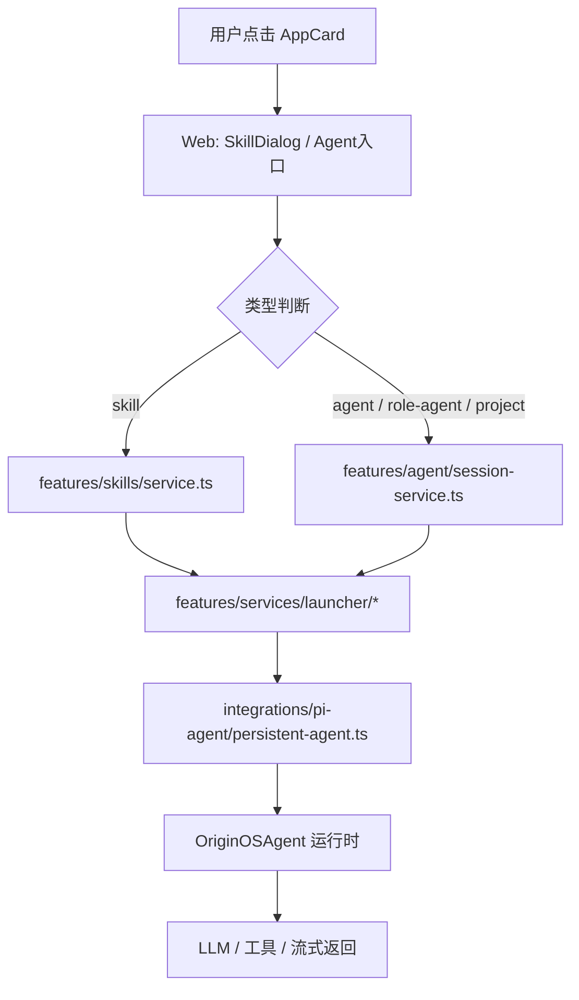

# F01：从首页入口到 Agent/Skill 会话的分层调用链

## 开篇场景

你打开 OriginOS，首页出现几个卡片：

- “创建 Agent” —— 一个 Skill
- “角色市场” —— 一个 Skill
- 某个已安装的 RoleAgent —— 一个 Agent 入口
- 某个项目 —— 一个 Project 入口

你点击其中一个。几秒钟后，屏幕底部弹出对话窗，系统已经知道：

- 你是谁；
- 这个入口对应哪个 Skill 或 Agent；
- 工作目录在哪里；
- 产物应该写到哪个目录；
- 系统 Prompt 是什么。

这节课要回答：**从点击到会话就绪，系统到底走了哪几层？每一层的职责边界在哪里？**

## 核心问题

Part E 已经讲过 `OriginOSAgent` 如何运行一次会话。但一次会话不会凭空出现。Web 层、功能层、启动层、运行时层之间必须有一份清晰的合同，否则：

- Web 直接调用 `OriginOSAgent`，就会被流式事件、工具调用、状态管理拖垮；
- Skill 和 Agent 用同一套会话模型，却走不同的初始化路径，容易混淆；
- 用户关闭窗口后再打开，系统需要恢复的是“会话”而不是“Agent 实例”。

所以本节课的核心问题是：**系统如何把一次用户点击，转换成一份 `AgentSession` 合同，再交给运行时去执行？**

## 概念阶梯

**AppCard**：首页卡片，可能是 `skill` 类型或 `action` 类型。`skill` 类型会打开 `SkillDialog`。

**SkillDialog**：Web 组件，负责加载 Skill 内容、准备上下文、创建会话、进入流式对话。

**Feature Layer**：`features/agent` 和 `features/skills`，给 Web/Desktop 提供稳定的公共 API，隐藏 `pi-agent` 运行时细节。

**Launcher**：`features/services/launcher`，根据入口类型（`agent` / `role-agent` / `project` / `skill`）准备 workspace、系统 Prompt 和工具集。

**Runtime**：`integrations/pi-agent`，真正与 LLM 交互、调用工具、流式返回。

**Session**：`AgentSession`，跨层共享的合同，包含 `sessionId`、消息历史、项目上下文、状态等。

## 图解：从点击到会话的四层跳转



**图后解释**：

- 第 1 层（Web）只负责把用户意图翻译成“我要启动某个 Agent/Skill”。
- 第 2 层（Feature）负责创建或复用 `AgentSession`，解析工作目录和产物目录。
- 第 3 层（Launcher）负责根据入口类型构建不同的系统 Prompt 和上下文。
- 第 4 层（Runtime）负责长期运行、流式交互、工具调用、认知钩子。

本节课停在第 2 层和第 3 层的边界；后续课程会逐层深入。

## 源码精读

### 1. 首页入口：AppCard 与 SkillDialog

首页卡片类型定义在：

[packages/web/src/config/homeApps.ts 第 8—91 行](../../../../packages/web/src/config/homeApps.ts#L8)

```typescript
export type AppCardType = 'skill' | 'action';

export interface HomeAppConfig {
  id: string;
  type: AppCardType;
  skillName?: string;
  // ...
}
```

`skill` 类型卡片会携带 `skillName`，例如 `agent-creator`、`role-agent-creator`。点击后，`AppCard` 会打开 `SkillDialog`，并把 `skillName` 传进去。

### 2. Skill 的功能层入口：features/skills/service.ts

`SkillDialog` 最终会通过 API 或 Hook 调用到 `features/skills/service.ts`。这里我们看三个关键函数：

- [packages/core/src/lib/features/skills/service.ts 第 455—486 行](../../../../packages/core/src/lib/features/skills/service.ts#L455)：发现 Skill，返回列表和诊断信息。
- [packages/core/src/lib/features/skills/service.ts 第 488—540 行](../../../../packages/core/src/lib/features/skills/service.ts#L488)：读取 Skill 内容与目录（`workingDir`、`outputDir`）。
- [packages/core/src/lib/features/skills/service.ts 第 561—696 行](../../../../packages/core/src/lib/features/skills/service.ts#L561)：启动一次 Skill 执行，创建会话、调用 handler、追加消息。

`startSkillExecution` 的核心逻辑：

1. 根据 `skillName` 找到 Skill；
2. 解析 `workingDirectory` 和 `outputDirectory`；
3. 调用 `agentSessionService.createSession` 创建 `AgentSession`；
4. 如果有输入数据，调用对应的 bundled handler；
5. 把 handler 结果追加到会话消息中。

注意：**Skill 本身不直接调用 LLM**。它只是准备上下文和执行同步逻辑；真正需要 LLM 的对话流由 `sendSkillExecutionMessage` 或 `streamSkillExecutionMessage` 交给 `agentManager.getOrCreateAgent` 处理。

### 3. Agent 的功能层入口：features/agent/session-service.ts

对于 Agent 入口（包括 RoleAgent、ProjectAgent），Web 会直接调用 `agentSessionService.createSession`：

[packages/core/src/lib/features/agent/session-service.ts 第 48—105 行](../../../../packages/core/src/lib/features/agent/session-service.ts#L48)

```typescript
export class AgentSessionService {
  async createSession(request: CreateSessionRequest): Promise<AgentSession> {
    // 生成 sessionId、写入 sessions 目录、返回 AgentSession
  }

  async getSession(sessionId: string, projectId?: string): Promise<AgentSession | null> {
    // 从磁盘读取会话
  }

  async addMessage(sessionId: string, message: AgentMessage): Promise<AgentSession> {
    // 追加消息并落盘
  }
}
```

[packages/core/src/lib/features/agent/session-service.ts 第 357 行](../../../../packages/core/src/lib/features/agent/session-service.ts#L357) 导出了单例：

```typescript
export const agentSessionService = new AgentSessionService();
```

这是功能层的核心：Web 不需要知道 `OriginOSAgent` 存在，只需要知道 `agentSessionService` 能创建和管理会话。

### 4. Web API 边界

Web 通过 Next.js Route Handler 调用 `agentSessionService`：

[packages/web/src/app/api/agent/sessions/route.ts 第 54—121 行](../../../../packages/web/src/app/api/agent/sessions/route.ts#L54)

```typescript
export async function POST(request: NextRequest) {
  const body = await request.json();
  const createRequest = /* ... 校验和转换 ... */;
  const session = await agentSessionService.createSession(createRequest);
  return NextResponse.json(session);
}
```

这里 Web 层只做了 HTTP 解析和 DTO 转换，所有业务逻辑下沉到 `features/agent/session-service.ts`。

### 5. Launcher：从功能层到运行时的桥

功能层创建好 `AgentSession` 后，运行时还需要：

- 系统 Prompt；
- 工作目录；
- 工具集；
- Agent 类型判断。

这些由 `features/services/launcher/base.ts` 统一处理：

[packages/core/src/lib/features/services/launcher/base.ts 第 23—141 行](../../../../packages/core/src/lib/features/services/launcher/base.ts#L23)

```typescript
export type EntryType = 'project' | 'agent' | 'role-agent' | 'skill';

export interface LaunchContext {
  entryType: EntryType;
  projectContext: ProjectContext;
  systemPrompt?: string;
  allowedTools?: string[];
  // ...
}
```

Launcher 会根据 `entryType` 分发到 `agent.ts`、`project.ts`、`role-agent.ts` 或 `skill.ts`。这节课只建立“有这么一层”的认知，具体分发逻辑在 F.2 展开。

### 6. 运行时：persistent-agent

最终，`launcher` 会创建或复用一个 `PersistentAgent`：

[packages/core/src/lib/integrations/pi-agent/persistent-agent.ts 第 250—266 行](../../../../packages/core/src/lib/integrations/pi-agent/persistent-agent.ts#L250)

```typescript
constructor(config: PersistentAgentConfig) {
  // 保存配置、初始化状态
}

async initialize(llmConfig?: ...) {
  // 创建 OriginOSAgent 实例
}
```

[packages/core/src/lib/integrations/pi-agent/persistent-agent.ts 第 322—380 行](../../../../packages/core/src/lib/integrations/pi-agent/persistent-agent.ts#L322) 处理运行时事件，并在合适的时机触发认知钩子。

## 真实调用链

以用户点击“创建 Agent” Skill 为例：

1. Web `AppCard` 检测到 `type: 'skill'`，打开 `SkillDialog`，传入 `skillName: 'agent-creator'`。
2. `SkillDialog` 调用 API 读取 Skill 内容（`features/skills/service.ts#getSkillContent`）。
3. 用户确认后，调用 `features/skills/service.ts#startSkillExecution`。
4. `startSkillExecution` 解析 `workingDir` / `outputDir`，调用 `agentSessionService.createSession`。
5. 如果有输入，调用 bundled handler 执行同步逻辑。
6. 后续对话由 `sendSkillExecutionMessage` 调用 `agentManager.getOrCreateAgent`，最终进入 `launcher` 和 `persistent-agent`。

如果是点击一个 RoleAgent 入口：

1. Web 调用 `api/agent/sessions` 直接创建会话。
2. `agentSessionService.createSession` 落盘会话文件。
3. 打开对话窗口后，前端通过 `usePersistentAgent` 请求启动。
4. `launcher/role-agent.ts` 加载 `Agent.md`、`Role.md` 等角色文件，构建 7 层 Prompt。
5. `persistent-agent` 接管运行。

## 关键类型与数据示例

### AgentSession（共享合同）

```typescript
interface AgentSession {
  sessionId: string;
  projectId: string;
  projectName: string;
  status: 'active' | 'completed' | 'cancelled';
  messages: AgentMessage[];
  projectContext: ProjectContext;
  createdAt: number;
  updatedAt: number;
}
```

### CreateSessionRequest

```typescript
interface CreateSessionRequest {
  projectId: string;
  projectName: string;
  systemPrompt?: string;
  agentType?: string;
  projectContext?: ProjectContext;
}
```

### SkillExecutionStartResponse

```typescript
interface SkillExecutionStartResponse {
  executionId: string;
  skillName: string;
  status: 'initializing' | 'running' | 'completed' | 'failed';
  startedAt: string;
  sessionId: string;
}
```

## 失败路径与边界

| 场景 | 会发生什么 | 谁负责处理 |
|---|---|---|
| Skill 不存在 | `SkillServiceError('NOT_FOUND', ...)` | `features/skills/service.ts#findSkill` |
| `skillName` 为空 | `SkillServiceError('INVALID_REQUEST', ...)` | `features/skills/service.ts#startSkillExecution` |
| 会话创建失败 | 抛出或返回 500 | `features/agent/session-service.ts` |
| Skill handler 抛错 | 消息以 `metadata.error` 落盘，不中断会话 | `features/skills/service.ts#startSkillExecution` |
| 工作目录无法创建 | `mkdirSync` 抛错，向上传播 | `features/skills/service.ts#resolveSkillWorkingDirectory` |

**一个关键边界**：`features/skills/service.ts` 中的 `sendSkillExecutionMessage` 会调用 `agentManager.getOrCreateAgent`。这意味着 Skill 的对话流和普通 Agent 共享同一套运行时，但初始化路径不同。

## 测试证据

- `features/skills/service.ts` 有对应测试：[packages/core/src/lib/features/skills/__tests__/service.test.ts](../../../../packages/core/src/lib/features/skills/__tests__/service.test.ts)。
- `features/agent/session-service.ts` 当前无直接单元测试。缺口说明：可通过 Web API `POST /api/agent/sessions` 做集成验证。
- `launcher/*` 当前只有 `skill-launcher.test.ts` 覆盖 Skill 启动路径，其他入口需本地运行验证。

## 练习与验收

1. **定位调用链**：从 `homeApps.ts` 中任选一个 `skill` 类型入口，追踪它经过 `SkillDialog` 到达 `features/skills/service.ts` 的路径。
2. **对比两种入口**：对比 Skill 入口和 Agent 入口在创建会话时的差异：都调用 `agentSessionService.createSession`，但参数来源有何不同？
3. **观察会话文件**：在本地运行后，找到 `data/web/sessions/` 目录，查看创建的会话 JSON 文件，确认 `projectContext.currentPath` 和 `outputDir` 字段。
4. **模拟失败**：临时把 `homeApps.ts` 中某个 `skillName` 改成不存在的名字，观察前端错误和 `SkillServiceError` 的 code/status。

**验收标准**：能不看稿解释从首页点击到 `AgentSession` 创建的完整四层跳转，并指出 `features/skills/service.ts` 与 `features/agent/session-service.ts` 的分工边界。

## 章节收束

本节课建立了 Part F 的主线：用户点击 → Web 层 → 功能层（`features/agent`、`features/skills`）→ 启动层（`launcher`）→ 运行时（`persistent-agent`）。

下一节课（F02）会退一步，先看 `shared/agent/types.ts`：为什么 modules 层不能直接 import `features/agent`，而需要通过 Layer 0 类型解耦？这是理解 OriginOS 模块依赖规约的关键。
