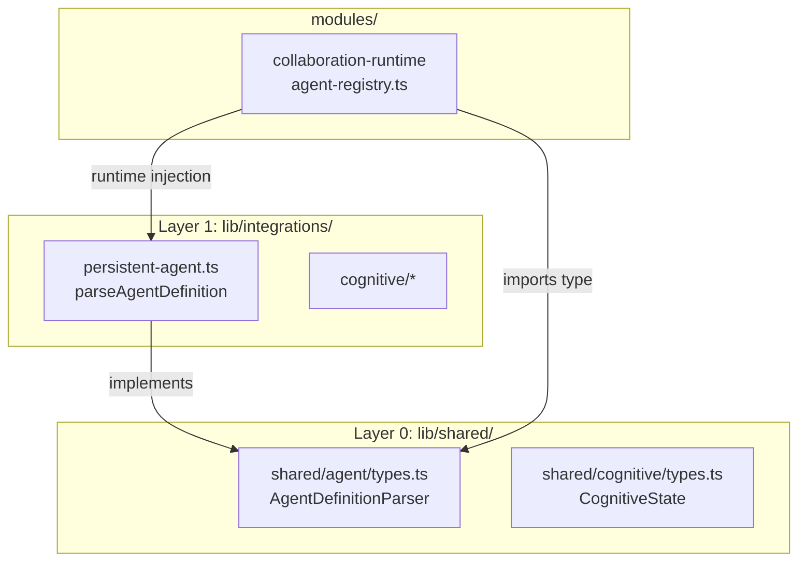

# F02：`shared/agent/types.ts` —— Layer 0 Agent 解析合同

## 开篇场景

假设你正在实现 `modules/collaboration-runtime`（多 Agent 协作运行时）。它需要读取一组 Agent 定义文件（`Agent.md`），提取每个 Agent 的名字、角色描述、能力列表，然后把它们注册到协作会话中。

你自然会想到：直接 `import { parseAgentDefinition } from '@/lib/integrations/pi-agent/persistent-agent'` 不就行了？

但这样做会违反 AGENTS.md 的模块依赖规约。`modules/` 属于独立模块，不能直接依赖 `lib/integrations/`（Layer 1）。那它怎么拿到解析能力？

答案就是 `packages/core/src/lib/shared/agent/types.ts`：一个只有接口、没有实现的 Layer 0 文件。

## 核心问题

**为什么 OriginOS 需要把“Agent 解析能力”抽象成 Layer 0 接口？ modules 如何使用这个接口而不破坏依赖方向？**

这个问题背后是整个项目的架构约束：

- `lib/shared/` 是 Layer 0，可以被任何上层引用；
- `lib/features/` 和 `lib/integrations/` 是 Layer 1/2，不能被 `modules/` 直接引用；
- `modules/` 需要某些 Layer 1/2 的能力时，通过接口注入或动态导入获取。

## 概念阶梯

**Layer 0（`lib/shared/`）**：只放类型、接口、纯数据结构。任何层都可以依赖它，但它不依赖任何业务层。

**Layer 1（`lib/storage/`、`lib/integrations/`、`lib/utils/`）**：基础设施和集成层。可以被 `lib/features/` 和 `modules/` 通过抽象使用，但不能反向依赖业务层。

**Layer 2（`lib/features/`）**：业务功能层。通过 `index.ts` 导出公共 API。

**Layer 3/4（`components/`、`app/`）**：服务和应用层。

**Dependency Injection（依赖注入）**：上层不直接创建下层实现，而是通过构造函数或函数参数传入实现。这样 `modules/collaboration-runtime` 可以拿到 `parseAgentDefinition` 的具体实现，而编译期不依赖 `lib/integrations/pi-agent`。

## 图解：Layer 0 如何解耦 modules 与 integrations



**图后解释**：

- `shared/agent/types.ts` 定义接口，但不依赖任何实现。
- `persistent-agent.ts` 实现接口（`parseAgentDefinition` / `parseToolDefinition`）。
- `modules/collaboration-runtime` 只导入 `shared/agent/types.ts` 的类型，运行时通过依赖注入拿到具体实现。
- 这样编译期依赖方向保持正确：modules → shared，而不出现 modules → integrations。

## 源码精读

### 1. Layer 0 接口：shared/agent/types.ts

[packages/core/src/lib/shared/agent/types.ts 第 1—26 行](../../../../packages/core/src/lib/shared/agent/types.ts#L1)

```typescript
export interface AgentDefinition {
  name: string;
  description?: string;
  role?: string;
  capabilities?: string[];
  [key: string]: unknown;
}

export interface ToolDefinition {
  name: string;
  description?: string;
  parameters?: Record<string, unknown>;
  [key: string]: unknown;
}

export interface AgentDefinitionParser {
  parseAgentDefinition(content: string): AgentDefinition;
  parseToolDefinition(content: string): ToolDefinition;
}
```

这个文件只有 **三个接口、零运行时逻辑**。它的职责非常明确：

1. 定义“Agent 定义文件解析后长什么样”；
2. 定义“Tool 定义文件解析后长什么样”；
3. 定义“一个解析器应该提供哪两个方法”。

注意 `[key: string]: unknown` 的设计：它允许解析器保留 frontmatter 中的额外字段，而不把合同锁死。

### 2. 实现：persistent-agent.ts

真正的解析实现在 `lib/integrations/pi-agent/persistent-agent.ts`：

[packages/core/src/lib/integrations/pi-agent/persistent-agent.ts 第 722—759 行](../../../../packages/core/src/lib/integrations/pi-agent/persistent-agent.ts#L722)

```typescript
export function parseAgentDefinition(content: string): AgentDefinition {
  const { frontmatter } = parseFrontmatter(content);
  return {
    name: frontmatter.name ?? frontmatter.title ?? 'unnamed-agent',
    description: frontmatter.description,
    role: frontmatter.role,
    capabilities: frontmatter.capabilities ?? [],
    ...frontmatter,
  };
}

export function parseToolDefinition(content: string): ToolDefinition {
  const { frontmatter } = parseFrontmatter(content);
  return {
    name: frontmatter.name ?? frontmatter.title ?? 'unnamed-tool',
    description: frontmatter.description,
    parameters: frontmatter.parameters,
    ...frontmatter,
  };
}
```

这里实现了 `AgentDefinitionParser` 的两个方法。它们从 Markdown 文件的 frontmatter 中提取字段，并给缺失字段提供默认值。

### 3. 谁来组装实现与接口？

`persistent-agent-manager.ts` 把这两个函数和持久 Agent 一起管理：

[packages/core/src/lib/integrations/pi-agent/persistent-agent-manager.ts 第 13—14 行](../../../../packages/core/src/lib/integrations/pi-agent/persistent-agent-manager.ts#L13)

```typescript
import {
  parseAgentDefinition,
  parseToolDefinition,
} from './persistent-agent';
```

[packages/core/src/lib/integrations/pi-agent/persistent-agent-manager.ts 第 347—370 行](../../../../packages/core/src/lib/integrations/pi-agent/persistent-agent-manager.ts#L347)

```typescript
parseAgentDefinition(content) {
  return parseAgentDefinition(content);
}

parseToolDefinition(content) {
  return parseToolDefinition(content);
}
```

`persistent-agent-manager` 是 `pi-agent` 集成层的入口之一，它把解析能力暴露给需要注入的上层。

### 4. modules 如何使用：collaboration-runtime

`modules/collaboration-runtime/integrations/agent-registry.ts` 是典型消费者：

[packages/core/src/modules/collaboration-runtime/integrations/agent-registry.ts 第 93 行](../../../../packages/core/src/modules/collaboration-runtime/integrations/agent-registry.ts#L93)

```typescript
const parsed = this.parser.parseAgentDefinition(agentMdContent) as { content?: string; name?: string } | undefined;
```

[packages/core/src/modules/collaboration-runtime/integrations/agent-registry.ts 第 113 行](../../../../packages/core/src/modules/collaboration-runtime/integrations/agent-registry.ts#L113)

```typescript
const toolDef = this.parser.parseToolDefinition(toolMdContent) as { allowedTools?: string[] } | undefined;
```

这个文件只依赖 `this.parser` 的接口，不依赖 `persistent-agent.ts`。它的构造函数大概长这样：

```typescript
constructor(parser: AgentDefinitionParser) {
  this.parser = parser;
}
```

这就是依赖注入：运行时传入实现，编译期只认接口。

### 5. 动态导入的另一种用法

`modules/collaboration-runtime/facade/index.ts` 用了动态导入：

[packages/core/src/modules/collaboration-runtime/facade/index.ts 第 48—49 行](../../../../packages/core/src/modules/collaboration-runtime/facade/index.ts#L48)

```typescript
const { parseAgentDefinition, parseToolDefinition } = await import("../../../lib/integrations/pi-agent/persistent-agent");
return _createSession(input, eventEmitter, { parseAgentDefinition, parseToolDefinition });
```

动态导入和依赖注入达到同一个目的：让 `modules/` 在运行时使用 `integrations/` 的能力，同时保持静态依赖图干净。

### 6. 对比：shared/cognitive/types.ts

`shared/cognitive/types.ts` 是类似的 Layer 0 设计：

[packages/core/src/lib/shared/cognitive/types.ts 第 1—48 行](../../../../packages/core/src/lib/shared/cognitive/types.ts#L1)

它被 `modules/collaboration-runtime/index.ts` 和 `cognitive/pattern-provider.ts` 同时引用。这说明 **cognitive 相关的状态合同也需要跨 modules 和 integrations 共享**。

## 真实调用链

以 `collaboration-runtime` 注册 Agent 为例：

1. `collaboration-runtime` 启动时，外部注入一个 `AgentDefinitionParser` 实现（通常来自 `persistent-agent-manager`）。
2. `agent-registry.ts` 扫描工作目录中的 `Agent.md` 文件。
3. 对每个文件调用 `this.parser.parseAgentDefinition(content)`，得到 `AgentDefinition`。
4. 根据 `AgentDefinition.name`、`role`、`capabilities` 构建 `AgentCard`。
5. 当协作会话需要创建 Agent 实例时，再用这些元数据去调用 `persistent-agent-manager`。

控制流：

```text
modules/collaboration-runtime/integrations/agent-registry.ts
  → 通过 this.parser（注入的 AgentDefinitionParser）
  → lib/integrations/pi-agent/persistent-agent.ts#parseAgentDefinition
  → 返回 shared/agent/types.ts#AgentDefinition
```

## 关键类型与数据示例

### Agent.md 示例

```markdown
---
name: code-reviewer
description: 专门审查代码的 Agent
role: senior-engineer
capabilities: ["code-review", "refactoring-suggestion"]
color: "#3b82f6"
---

你是一个经验丰富的代码审查者...
```

### 解析结果

```typescript
{
  name: 'code-reviewer',
  description: '专门审查代码的 Agent',
  role: 'senior-engineer',
  capabilities: ['code-review', 'refactoring-suggestion'],
  color: '#3b82f6',
  content: '你是一个经验丰富的代码审查者...'
}
```

注意 `content` 字段：虽然 `AgentDefinition` 接口没有显式声明 `content`，但 `...frontmatter` 和额外字段会被保留。

## 失败路径与边界

| 场景 | 会发生什么 | 原因 |
|---|---|---|
| Agent.md 缺少 `name` | 默认值为 `'unnamed-agent'` | `parseAgentDefinition` 提供 fallback |
| frontmatter 解析失败 | `parseFrontmatter` 可能抛出或返回空对象 | 依赖具体 frontmatter parser 行为 |
| modules 直接 import persistent-agent | ESLint / 架构检查报错 | 违反单向依赖原则 |
| 注入的 parser 未实现方法 | 运行时 TypeError | 注入方责任，合同只在 TypeScript 编译期约束 |

**一个关键边界**：`shared/agent/types.ts` 只保证“形状”，不保证“语义”。例如 `capabilities` 是字符串数组，但具体支持哪些 capability 由运行时决定。

## 测试证据

- `shared/agent/types.ts` 本身无测试（纯类型接口）。
- 实现测试覆盖：`persistent-agent.ts` 的解析函数目前无独立测试，但 `persistent-agent-manager` 的行为会间接验证它们。
- 消费者测试：`modules/collaboration-runtime/__tests__` 中的测试如果存在，会验证 `agent-registry` 的注入逻辑。当前需确认是否存在。
- 缺口说明：建议为 `parseAgentDefinition` / `parseToolDefinition` 补一组最小单元测试，覆盖 frontmatter 缺失、额外字段、空内容等边界。

## 练习与验收

1. **依赖方向验证**：在 `packages/core/src/modules/collaboration-runtime/integrations/agent-registry.ts` 中搜索 `import`，确认它是否直接 import `lib/integrations/pi-agent` 下的任何文件。如果有，说明违反了哪条规约。
2. **实现一个 mock parser**：写一个满足 `AgentDefinitionParser` 接口的对象，让 `agent-registry` 可以用它运行，但不依赖 `persistent-agent`。
3. **对比静态 import 与动态 import**：说明 `modules/collaboration-runtime/facade/index.ts` 第 48 行动态导入的优势和风险。
4. **扩展接口**：如果要让 `AgentDefinition` 支持 `icon` 字段，应该改哪些文件？为什么不应该只在 `persistent-agent.ts` 里改？

**验收标准**：能解释“Layer 0 接口 + 依赖注入”如何让 `modules/` 使用 `integrations/` 的能力而不破坏单向依赖，并能独立修改 `AgentDefinition` 的字段合同。

## 章节收束

本节课讲了一个看似很小的文件 `shared/agent/types.ts`，但它体现了 OriginOS 架构规约的核心：**通过 Layer 0 类型解耦 modules 与 integrations**。

下节课（F03）会回到 `features/agent`，看 `AgentSessionService` 如何利用这些 Layer 0 合同，给 Web 和 Desktop 提供稳定的会话服务。
