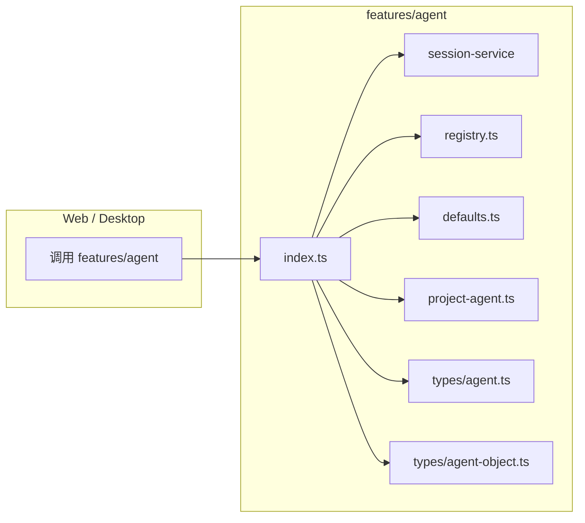

# F03：`features/agent` 公共 API 与默认 Agent

## 开篇场景

OriginOS 启动时，首页 Dock 上会出现几个默认角色：产品经理、架构师、UX 设计师、开发者、QA 工程师、项目初始化。这些不是用户自己创建的，而是系统预置的。

同时，Web 或 Desktop 代码里如果想操作 Agent，通常会这样写：

```typescript
import { agentSessionService } from '@originos/core/features/agent';
```

或者：

```typescript
import { initializeDefaultAgents, agentsToDockApps } from '@originos/core/features/agent';
```

这一节课看 `features/agent/index.ts` 和 `defaults.ts`：Agent Feature 的公共 API 长什么样？默认 Agent 从哪里来的？

## 核心问题

**`features/agent` 作为业务功能层，它向外部暴露什么、隐藏什么？默认 Agent 的数据结构如何影响 Dock 渲染和后续会话？**

## 概念阶梯

**Feature Module**：`packages/core/src/lib/features/<name>/` 目录，封装一个业务能力。外部只通过 `index.ts` 使用它。

**Public API Surface**：一个 feature 对外暴露的类型、函数、常量。外部不应该绕过 `index.ts` 直接导入内部文件。

**Default Agents**：系统首次加载时出现在 Dock 上的预置 Agent。它们有固定 `id`、`type`、`capabilities`，但不会自动创建会话。

**AgentObject**：Agent 的元数据合同，包含 `id`、`name`、`displayName`、`type`、`status`、`icon`、`color`、`capabilities` 等。

## 图解：features/agent 的 API 边界



**图后解释**：

- 外部只认识 `index.ts`。
- `index.ts` 把类型（`types/agent`、`types/agent-object`）、会话服务、注册表工具、默认 Agent、项目 Agent 统一导出。
- 这是 AGENTS.md 中“功能模块必须独立，通过 index.ts 导出公共 API”的实例。

## 源码精读

### 1. index.ts：公共 API 的统一出口

[packages/core/src/lib/features/agent/index.ts 第 1—13 行](../../../../packages/core/src/lib/features/agent/index.ts#L1)

```typescript
export * from '../../../types/agent';
export * from '../../../types/agent-object';
export * from './session-service';
export * from './defaults';
export * from './registry';
export * from './project-agent';
```

这个文件只有 5 行导出，没有运行时逻辑。但它非常重要：

1. **类型导出**：`types/agent.ts` 和 `types/agent-object.ts` 是全局类型定义，被 feature 重新导出，方便上层只 import 一个路径。
2. **服务导出**：`session-service` 是 feature 的核心运行时能力。
3. **工具导出**：`registry`、`defaults`、`project-agent` 是上层可能用到的辅助功能。

**设计原因**：Web/Desktop 不应该分别 import `@originos/core/types/agent` 和 `@originos/core/lib/features/agent/session-service`。通过 `features/agent` 统一入口，减少上层对目录结构的依赖。

### 2. defaults.ts：默认 Agent 定义

[packages/core/src/lib/features/agent/defaults.ts 第 21—94 行](../../../../packages/core/src/lib/features/agent/defaults.ts#L21)

```typescript
export const DEFAULT_AGENTS: AgentObject[] = [
  {
    id: 'agent-pm-1',
    name: 'pm-1',
    displayName: '产品经理',
    type: AgentType.PM,
    status: AgentStatus.IDLE,
    icon: '📋',
    color: '#EC4899',
    capabilities: ['planning', 'requirements', 'coordination'],
    createdAt: Date.now(),
    lastActivatedAt: Date.now(),
  },
  // ... 架构师、UX 设计师、开发者、QA
  {
    id: 'agent-project-init-1',
    name: 'project-initializer',
    displayName: '项目初始化',
    type: AgentType.PROJECT_INITIALIZER,
    status: AgentStatus.IDLE,
    icon: '🚀',
    color: '#6366F1',
    capabilities: ['project_create', 'ontology_build', 'team_coordination', 'interview'],
    createdAt: Date.now(),
    lastActivatedAt: Date.now(),
  },
];
```

这里定义了 6 个默认 Agent。注意几个设计点：

- `id` 是稳定的标识符，不会随语言或显示名称变化。
- `name` 是代码内使用的短名，`displayName` 是展示给用户的中文名。
- `type` 使用 `AgentType` 枚举，而不是自由字符串。
- `status` 初始为 `IDLE`，表示尚未运行。
- `capabilities` 是字符串数组，供 launcher 和 prompt 构建时使用。

[packages/core/src/lib/features/agent/defaults.ts 第 100—102 行](../../../../packages/core/src/lib/features/agent/defaults.ts#L100)

```typescript
export function initializeDefaultAgents(): AgentObject[] {
  return DEFAULT_AGENTS;
}
```

这个函数目前只是返回数组，但它提供了一个扩展点：未来可以在这里加入去重、持久化或用户自定义覆盖逻辑。

### 3. AgentObject 类型合同

默认 Agent 的类型是 `AgentObject`，定义在：

[packages/core/src/types/agent.ts 第 111—162 行](../../../../packages/core/src/types/agent.ts#L111)

```typescript
export interface AgentObject {
  id: string;
  name: string;
  displayName: string;
  type: AgentType;
  status: AgentStatus;
  icon: string;
  color: string;
  capabilities: string[];
  createdAt: number;
  lastActivatedAt: number;
}
```

而 `AgentType` 和 `AgentStatus` 是枚举：

[packages/core/src/types/agent.ts 第 7—18 行](../../../../packages/core/src/types/agent.ts#L7)

```typescript
export enum AgentType {
  PM = 'pm',
  ARCHITECT = 'architect',
  UX_DESIGNER = 'ux_designer',
  DEVELOPER = 'developer',
  QA_ENGINEER = 'qa_engineer',
  PROJECT_INITIALIZER = 'project_initializer',
}

export enum AgentStatus {
  IDLE = 'idle',
  INITIALIZING = 'initializing',
  RUNNING = 'running',
  STOPPED = 'stopped',
}
```

## 真实调用链

默认 Agent 进入 Dock 的过程：

1. 应用启动时，某处调用 `initializeDefaultAgents()` 获取 `DEFAULT_AGENTS`。
2. 这些 `AgentObject[]` 可能存入 Zustand store 或本地注册表。
3. UI 调用 `agentsToDockApps(agents)`（`features/agent/registry.ts`）转换成 `DockApp[]`。
4. Dock 渲染图标和名称。
5. 用户点击某个 Dock App 时，根据 `id` 或 `name` 找到对应 Agent，创建会话。

## 关键类型与数据示例

### DEFAULT_AGENTS 中的项目初始化 Agent

```typescript
{
  id: 'agent-project-init-1',
  name: 'project-initializer',
  displayName: '项目初始化',
  type: AgentType.PROJECT_INITIALIZER,
  status: AgentStatus.IDLE,
  icon: '🚀',
  color: '#6366F1',
  capabilities: ['project_create', 'ontology_build', 'team_coordination', 'interview'],
  createdAt: Date.now(),
  lastActivatedAt: Date.now(),
}
```

这个 Agent 的 `capabilities` 预告了它的职责：创建项目、构建本体、协调团队、执行访谈。后续 `features/agent/project-agent.ts` 会具体实现这些能力。

## 失败路径与边界

| 场景 | 会发生什么 | 原因 |
|---|---|---|
| 默认 Agent 的 `id` 重复 | 注册表去重逻辑会覆盖或报错 | `id` 是主键 |
| `capabilities` 为空 | 某些 launcher 可能拒绝启动 | 能力列表影响工具集选择 |
| `AgentType` 使用字符串而非枚举 | TypeScript 编译报错 | 严格类型约束 |
| `lastActivatedAt` 为 0 | Dock 排序可能异常 | 需要有效时间戳 |

**一个关键边界**：`DEFAULT_AGENTS` 只定义“有哪些 Agent”，不定义“它们的工作目录在哪里”。工作目录由启动时根据 `id` 或 `name` 动态解析。

## 测试证据

- `defaults.ts` 当前无直接单元测试。
- 缺口说明：建议补一个测试，验证 `initializeDefaultAgents()` 返回 6 个 Agent，且每个 Agent 的字段满足 `isValidAgent`。
- `isValidAgent` 函数在 `features/agent/registry.ts` 中定义，下节课分析。

## 练习与验收

1. **修改默认 Agent**：在 `defaults.ts` 中新增一个默认 Agent，确保类型正确，然后检查 `features/agent/index.ts` 是否会自动导出它。
2. **验证 API 边界**：在 `packages/web/src` 中搜索 `from '@originos/core/features/agent'`，确认上层实际使用了哪些导出。
3. **capabilities 设计**：思考为什么 `capabilities` 是字符串数组而不是 `AgentType` 数组？这种设计有什么优缺点？
4. **类型追踪**：从 `defaults.ts` 中的 `AgentObject` 出发，追踪到 `types/agent.ts` 和 `types/agent-object.ts`，画出它们之间的导出关系。

**验收标准**：能解释 `features/agent/index.ts` 的导出设计，能独立新增一个默认 Agent 并让它出现在公共 API 中。

## 章节收束

本节课看了 Agent Feature 的“门面”和“默认值”。`index.ts` 告诉我们这个 feature 对外承诺什么；`defaults.ts` 告诉我们系统启动时有哪些预置角色。

下节课（F04）进入 `registry.ts`，看系统如何验证这些 Agent 对象，以及如何把 Agent 同步到 Dock。
