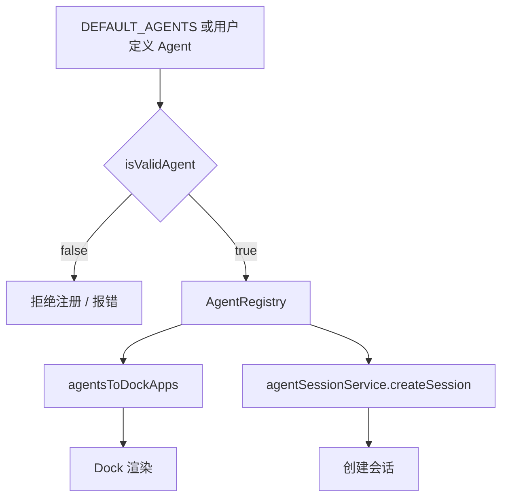

# F04：Agent 注册表 —— 从 AgentObject 到 Dock

## 开篇场景

默认 Agent 定义好了，但 Dock 上并不会自动显示它们。中间还差一步：**把 `AgentObject[]` 转换成 `DockApp[]`**，并且在运行过程中根据 Agent 的 `status` 更新“是否正在运行”。

同时，数据可能来自本地文件、用户自定义配置或网络。在把这些 Agent 注册到系统之前，OriginOS 必须先验证它们是否满足最小字段要求，否则 Dock 可能渲染出错，或者后续会话创建失败。

这一节课看 `features/agent/registry.ts`：注册表辅助函数如何连接 Agent 元数据与 OS 的 Dock 组件。

## 核心问题

**Agent 注册表不做“存储”，只做“转换和校验”。这种设计有什么好处？`isValidAgent` 为什么是运行时类型守卫（type guard）而不是 JSON Schema？**

## 概念阶梯

**Agent Registry**：Agent 的注册管理机构。在 `features/agent` 中，它不承担持久化职责，只提供把 `AgentObject` 转成 Dock 可用格式、校验 Agent 合法性的工具函数。

**DockApp**：Dock 上的应用图标数据，包含 `id`、`name`、`icon`、`iconType`、`isRunning`、`isPinned`、`index`。

**Type Guard**：TypeScript 中的一种函数，返回布尔值，签名形如 `x is Type`，用于在分支中收窄类型。`isValidAgent` 就是一个典型 type guard。

**运行时校验 vs 编译期类型**：TypeScript 编译期类型在运行时会被擦除，所以从磁盘或网络读到的数据必须用运行时校验确认类型。

## 图解：Registry 在 Agent 生命周期中的位置



**图后解释**：

- `registry.ts` 位于“输入数据”和“系统消费”之间。
- 它先用 `isValidAgent` 过滤非法数据；
- 再用 `agentsToDockApps` 把 Agent 元数据转成 Dock 能渲染的格式；
- 后续创建会话时，仍依赖 `AgentObject` 中的字段。

## 源码精读

### 1. agentsToDockApps：Agent 到 Dock 的映射

[packages/core/src/lib/features/agent/registry.ts 第 13—23 行](../../../../packages/core/src/lib/features/agent/registry.ts#L13)

```typescript
export function agentsToDockApps(agents: AgentObject[]): DockApp[] {
  return agents.map((agent, index) => ({
    id: agent.id,
    name: agent.displayName,
    icon: agent.icon,
    iconType: 'emoji' as const,
    isRunning: agent.status === AgentStatus.RUNNING,
    isPinned: true,
    index,
  }));
}
```

这个函数非常直接，但有几个设计决策值得注意：

1. **`name` 用 `displayName`**：Dock 展示给用户的是中文名，内部 `name` 不展示。
2. **`iconType` 固定为 `'emoji'`**：当前默认 Agent 的 icon 都是 emoji。如果未来支持图片 icon，这里需要扩展。
3. **`isRunning` 从 `status` 派生**：运行状态由 Agent 对象的状态决定，而不是 Dock 自己维护。
4. **`isPinned: true`**：默认 Agent 都是固定 pinned，不会因为不常用而自动移除。
5. **`index` 保留原始顺序**：Dock 上的顺序与输入数组一致。

**为什么不直接让 Dock 组件读取 `AgentObject`？** 因为 Dock 是通用组件，不应该依赖 `AgentObject` 的具体字段。`DockApp` 是更通用、更薄的接口。

### 2. isValidAgent：运行时类型守卫

[packages/core/src/lib/features/agent/registry.ts 第 28—49 行](../../../../packages/core/src/lib/features/agent/registry.ts#L28)

```typescript
export function isValidAgent(agent: unknown): agent is AgentObject {
  if (
    typeof agent !== 'object' ||
    agent === null
  ) {
    return false;
  }

  const obj = agent as Record<string, unknown>;

  return (
    typeof obj['id'] === 'string' &&
    typeof obj['name'] === 'string' &&
    typeof obj['displayName'] === 'string' &&
    typeof obj['status'] === 'string' &&
    typeof obj['icon'] === 'string' &&
    typeof obj['color'] === 'string' &&
    Array.isArray(obj['capabilities']) &&
    typeof obj['createdAt'] === 'number' &&
    typeof obj['lastActivatedAt'] === 'number'
  );
}
```

这个 type guard 做了几件事：

1. 确认输入是对象且非 null。
2. 把对象当作 `Record<string, unknown>` 读取字段。
3. 逐个字段检查类型。

**注意**：它没有校验 `type` 字段！F03 讲过 `AgentObject` 接口包含 `type: AgentType`，但 `isValidAgent` 没有检查它。这是一个有意还是无意的省略？需要结合调用方来看。

**为什么用 type guard 而不是 JSON Schema？**

- 结构简单，字段数量少；
- 运行时不需要引入额外依赖；
- 类型守卫在 `if (isValidAgent(x))` 分支内自动收窄 `x` 的类型，调用方可以直接使用 `AgentObject` 的方法或字段。

### 3. 错误类型与错误码

[packages/core/src/lib/features/agent/registry.ts 第 54—74 行](../../../../packages/core/src/lib/features/agent/registry.ts#L54)

```typescript
export class AgentRegistryError extends Error {
  constructor(
    message: string,
    public code: string,
    public agentId?: string
  ) {
    super(message);
    this.name = 'AgentRegistryError';
  }
}

export const AgentErrorCodes = {
  AGENT_NOT_FOUND: 'AGENT_NOT_FOUND',
  INVALID_AGENT: 'INVALID_AGENT',
  INVALID_STATUS_TRANSITION: 'INVALID_STATUS_TRANSITION',
  DUPLICATE_AGENT: 'DUPLICATE_AGENT',
  REGISTRY_ERROR: 'REGISTRY_ERROR',
} as const;
```

这里定义了注册表的错误合同。虽然目前 `registry.ts` 中没有主动抛出这些错误，但它们被导出供上层使用：

- `AGENT_NOT_FOUND`：按 id 查找 Agent 失败。
- `INVALID_AGENT`：`isValidAgent` 返回 false。
- `INVALID_STATUS_TRANSITION`：状态机非法跳转。
- `DUPLICATE_AGENT`：注册重复 Agent。
- `REGISTRY_ERROR`：其他注册表错误。

## 真实调用链

默认 Agent 出现在 Dock 上需要几步：

1. `initializeDefaultAgents()` 返回 `AgentObject[]`。
2. 某处（通常是 Web/Desktop 启动逻辑）调用 `agentsToDockApps(agents)`。
3. Dock Store 接收 `DockApp[]`，渲染图标。
4. 当 Agent 启动时，它的 `status` 被更新为 `RUNNING`。
5. `agentsToDockApps` 再次映射，`isRunning` 变为 `true`，Dock 图标显示运行指示。

这个过程中 `registry.ts` 本身不保存状态，它只提供“转换”和“校验”函数。状态由调用方（如 Zustand store）保存。

## 关键类型与数据示例

### AgentObject 转 DockApp

输入：

```typescript
{
  id: 'agent-pm-1',
  name: 'pm-1',
  displayName: '产品经理',
  type: AgentType.PM,
  status: AgentStatus.RUNNING,
  icon: '📋',
  color: '#EC4899',
  capabilities: ['planning', 'requirements', 'coordination'],
  createdAt: 1725000000000,
  lastActivatedAt: 1725000000000,
}
```

输出：

```typescript
{
  id: 'agent-pm-1',
  name: '产品经理',
  icon: '📋',
  iconType: 'emoji',
  isRunning: true,
  isPinned: true,
  index: 0,
}
```

### isValidAgent 的 false 示例

以下对象会被判为非法，因为缺少 `color`：

```typescript
{
  id: 'agent-x',
  name: 'x',
  displayName: 'X',
  status: 'idle',
  icon: '🤖',
  capabilities: [],
  createdAt: 0,
  lastActivatedAt: 0,
}
```

## 失败路径与边界

| 场景 | 会发生什么 | 原因 |
|---|---|---|
| `isValidAgent` 传入 `null` | 返回 `false` | 首行检查 `typeof agent !== 'object' \|\| agent === null` |
| `capabilities` 不是数组 | 返回 `false` | 用 `Array.isArray` 校验 |
| `type` 字段缺失 | 仍返回 `true`（当前实现） | `isValidAgent` 未检查 `type` |
| `status` 是任意字符串 | 返回 `true` | 未校验是否属于 `AgentStatus` 枚举 |
| Dock 渲染时 `icon` 缺失 | 可能显示空白或 fallback | `isValidAgent` 已拦截，但调用方可能绕过校验 |

**一个关键边界**：`isValidAgent` 是“最小字段校验”，不是“严格语义校验”。它确保对象“看起来像” `AgentObject`，但不保证 `status` 是合法枚举值、`type` 是合法枚举值、`capabilities` 元素都是字符串。上层如果需要更严格的校验，需要额外处理。

## 测试证据

- `registry.ts` 当前无直接单元测试。
- 缺口说明：建议补一组测试覆盖 `agentsToDockApps` 的字段映射、`isValidAgent` 的 true/false 分支、`AgentRegistryError` 的构造。
- 上层调用测试：如果 Dock 或启动逻辑有测试，会间接验证 `agentsToDockApps` 的行为。

## 练习与验收

1. **补全校验**：修改 `isValidAgent`，让它同时校验 `type` 字段是否是 `AgentType` 枚举值。需要使用 `Object.values(AgentType).includes(...)`。
2. **映射函数扩展**：修改 `agentsToDockApps`，当 `icon` 以 `http` 开头时把 `iconType` 设为 `'url'`。
3. **错误码使用**：在 `packages/core/src/lib/features/agent` 目录中搜索 `AgentRegistryError` 和 `AgentErrorCodes`，确认它们是否被实际抛出。
4. **类型收窄实验**：写一个小 TypeScript 片段，展示 `if (isValidAgent(x)) { console.log(x.name) }` 中 `x` 的类型如何从 `unknown` 变成 `AgentObject`。

**验收标准**：能解释 `registry.ts` 的“无状态转换器”设计，能独立扩展 `isValidAgent` 或 `agentsToDockApps`。

## 章节收束

本节课看到，`features/agent/registry.ts` 是一个轻量但关键的“守门人”和“转换器”：

- 它把 `AgentObject` 转成 Dock 能消费的 `DockApp`；
- 它用 `isValidAgent` 在运行时做最小校验；
- 它定义了注册表的错误合同，供上层使用。

但它不保存状态、不启动会话。真正的状态管理在下一节课：`features/agent/session-service.ts`。
