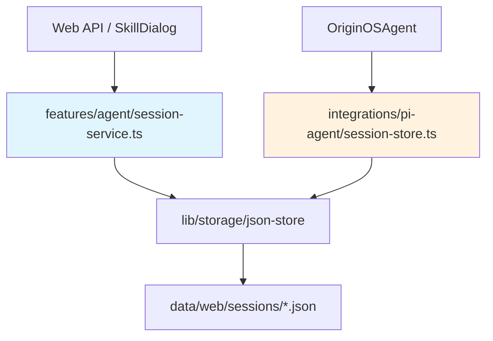

# F05：Agent 会话服务 —— CRUD 与持久化

## 开篇场景

用户在首页点击一个 Agent 入口，前端调用 `POST /api/agent/sessions`，几秒后得到一个 `sessionId`。这个 `sessionId` 是后续所有对话、恢复、关闭的钥匙。

但会话不是只存在内存里的。用户关闭浏览器后再打开，应该能看到历史会话列表，点击后能恢复之前的对话。这意味着会话必须持久化到磁盘。

`features/agent/session-service.ts` 就是承担这个职责的功能层服务。它向上层提供 `createSession`、`getSession`、`updateSession`、`deleteSession`、`listSessions` 等 CRUD 操作，同时处理项目相关会话的目录组织。

## 核心问题

**`features/agent/session-service.ts` 与 `integrations/pi-agent/session-store.ts` 都保存会话，它们的分工是什么？为什么功能层要再封装一层，而不是直接让 Web 调用 `session-store`？**

## 概念阶梯

**AgentSession**：跨层共享的会话合同，包含 `sessionId`、`projectContext`、`messages`、`status`、`systemPrompt`、`agentType` 等。

**功能层 Session Service**：面向 Web/Desktop 的会话 CRUD 服务，处理请求转换、目录解析、数据校验、统计汇总。

**集成层 Session Store**：`integrations/pi-agent/session-store.ts`，面向 `OriginOSAgent` 运行时，处理消息追加、流式事件落盘等。

**jsonStore**：`lib/storage/json-store` 提供的统一 JSON 文件读写接口，自动包装 `DataFile` 结构。

## 图解：会话服务的分层位置



**图后解释**：

- `session-service.ts` 在功能层，面向“创建和管理会话”这个产品能力。
- `session-store.ts` 在集成层，面向“运行时消息持久化”这个技术细节。
- 两者都使用 `jsonStore` 读写文件，但服务范围和调用方不同。

## 源码精读

### 1. 目录与路径策略

[packages/core/src/lib/features/agent/session-service.ts 第 19—29 行](../../../../packages/core/src/lib/features/agent/session-service.ts#L19)

```typescript
const SESSIONS_DIR = 'sessions';

function getProjectSessionsDir(projectId: string): string {
  return `projects/${projectId}/sessions`;
}
```

[packages/core/src/lib/features/agent/session-service.ts 第 346—351 行](../../../../packages/core/src/lib/features/agent/session-service.ts#L346)

```typescript
private getSessionPath(sessionId: string, projectId?: string): string {
  if (projectId) {
    return `${getProjectSessionsDir(projectId)}/${sessionId}.json`;
  }
  return `${SESSIONS_DIR}/${sessionId}.json`;
}
```

路径设计遵循 AGENTS.md 的数据存储规约：

- 全局会话：`data/web/sessions/{sessionId}.json`
- 项目会话：`data/web/projects/{projectId}/sessions/{sessionId}.json`

`projectId` 是可选参数，因为有些会话是全局的（例如某些 Skill 入口创建的会话），有些会话绑定到项目。

### 2. createSession：创建会话合同

[packages/core/src/lib/features/agent/session-service.ts 第 54—83 行](../../../../packages/core/src/lib/features/agent/session-service.ts#L54)

```typescript
async createSession(request: CreateSessionRequest): Promise<AgentSession> {
  const sessionId = request.sessionId || uuidv4();
  const now = Date.now();

  const session: AgentSession = {
    sessionId,
    createdAt: now,
    updatedAt: now,
    status: 'active',
    messages: [],
    projectContext: {
      projectId: request.projectId,
      projectName: request.projectName,
      ...request.projectContext,
    },
    systemPrompt: request.systemPrompt || '',
    agentType: request.agentType || 'generic',
    config: {
      sessionId,
      systemPrompt: request.systemPrompt,
      agentType: request.agentType,
    },
    ...(request.llmConfig ? { llmConfig: request.llmConfig } : {}),
  };

  await this.saveSession(session);
  return session;
}
```

关键设计点：

1. **sessionId 可外部指定**：如果调用方传了 `sessionId`，就用它；否则生成 UUID。这在 Skill 启动时很有用，因为 Skill 可能需要把 `executionId` 和 `sessionId` 对齐。
2. **初始状态为 `active`**：新会话默认是活跃的。
3. **messages 初始为空数组**：后续由 `addMessage` 追加。
4. **projectContext 合并**：先用 `projectId` 和 `projectName` 打底，再合并调用方传入的额外 context。
5. **config 字段冗余存储**：`config` 里保存了 `sessionId`、`systemPrompt`、`agentType`，方便运行时快速读取核心配置。
6. **llmConfig 可选**：只在调用方提供时才写入。

### 3. saveSession：统一落盘

[packages/core/src/lib/features/agent/session-service.ts 第 88—100 行](../../../../packages/core/src/lib/features/agent/session-service.ts#L88)

```typescript
async saveSession(session: AgentSession): Promise<void> {
  session.updatedAt = Date.now();

  const projectId = session.projectContext?.projectId;

  await this.store.write(
    this.getSessionPath(session.sessionId, projectId),
    session as any,
  );
}
```

注意：

- 每次保存都会更新 `updatedAt`。
- `jsonStore.write` 会自动把对象包装成 `DataFile` 结构（包含 `version`、`createdAt`、`updatedAt`、`data`）。所以 `session.updatedAt` 和文件元数据的 `updatedAt` 不是同一个东西。
- `session as any`：这里用 `any` 是因为 `jsonStore.write` 的签名可能与 `AgentSession` 不完全匹配。这是架构规约中“禁止 any”的例外吗？需要后续审视。

### 4. getSession：按 ID 读取

[packages/core/src/lib/features/agent/session-service.ts 第 105—113 行](../../../../packages/core/src/lib/features/agent/session-service.ts#L105)

```typescript
async getSession(sessionId: string, projectId?: string): Promise<AgentSession | null> {
  const sessionPath = this.getSessionPath(sessionId, projectId);
  console.error(`[DEBUG] getSession: sessionId=${sessionId}, projectId=${projectId}, path=${sessionPath}`);

  const sessionData = await this.store.read<AgentSession>(sessionPath);
  console.error(`[DEBUG] getSession: sessionData=${sessionData ? 'found' : 'null'}`);

  return sessionData?.data ?? null;
}
```

这里有两个细节：

1. **console.error 调试日志**：当前代码中保留了 `[DEBUG]` 日志，使用 `console.error`。这通常是为了在服务器端更明显，但生产环境应该清理或改用日志框架。
2. **`sessionData?.data`**：`jsonStore.read` 返回的是 `DataFile<T>`，所以实际会话对象在 `.data` 字段中。

### 5. updateSession：部分更新

[packages/core/src/lib/features/agent/session-service.ts 第 118—151 行](../../../../packages/core/src/lib/features/agent/session-service.ts#L118)

```typescript
async updateSession(
  sessionId: string,
  updates: UpdateSessionRequest,
  projectId?: string,
): Promise<AgentSession | null> {
  const session = await this.getSession(sessionId, projectId);
  if (!session) {
    return null;
  }

  if (updates.messages) {
    session.messages = updates.messages;
  }
  if (updates.status) {
    session.status = updates.status;
  }
  if (updates.projectContext) {
    session.projectContext = {
      ...session.projectContext,
      ...updates.projectContext,
    };
  }
  if (updates.summary !== undefined) {
    session.summary = updates.summary;
  }
  if (updates.llmConfig !== undefined) {
    session.llmConfig = updates.llmConfig;
  }

  await this.saveSession(session);
  return session;
}
```

`UpdateSessionRequest` 支持更新 `messages`、`status`、`projectContext`、`summary`、`llmConfig`。注意这里没有更新 `agentType` 或 `systemPrompt` 的字段，因为这两个字段通常在创建时确定，不应该被轻易修改。

### 6. deleteSession 与 listSessions

[packages/core/src/lib/features/agent/session-service.ts 第 183—185 行](../../../../packages/core/src/lib/features/agent/session-service.ts#L183)

```typescript
async deleteSession(sessionId: string, projectId?: string): Promise<boolean> {
  return this.store.delete(this.getSessionPath(sessionId, projectId));
}
```

[packages/core/src/lib/features/agent/session-service.ts 第 190—229 行](../../../../packages/core/src/lib/features/agent/session-service.ts#L190)

```typescript
async listSessions(projectId?: string): Promise<SessionListItem[]> {
  const sessionsDir = projectId
    ? `${getProjectSessionsDir(projectId)}/`
    : `${SESSIONS_DIR}/`;

  const files = await this.store.listFiles(sessionsDir);
  const sessions: SessionListItem[] = [];

  for (const file of files) {
    const sessionId = file.replace('.json', '');

    if (!isValidSessionId(sessionId)) {
      continue;
    }

    const session = await this.getSession(sessionId, projectId);

    if (session) {
      if (!session.projectContext) {
        console.warn(`[AgentSessionService] Session ${sessionId} missing projectContext, skipping`);
        continue;
      }

      if (projectId && session.projectContext.projectId !== projectId) {
        continue;
      }

      sessions.push(this.toSessionListItem(session));
    }
  }

  return sessions.sort((a, b) => b.updatedAt - a.updatedAt);
}
```

`listSessions` 有几个防御性设计：

1. **只处理 `.json` 文件，并去掉扩展名作为 `sessionId`**。
2. **用 `isValidSessionId` 过滤非法文件名**。
3. **跳过缺少 `projectContext` 的会话**。
4. **如果传了 `projectId`，再按 `projectContext.projectId` 过滤一次**（双重保险）。
5. **按 `updatedAt` 倒序排列，最新的在最前面**。

## 关键类型与数据示例

### CreateSessionRequest

[packages/core/src/types/agent.ts 第 245—268 行](../../../../packages/core/src/types/agent.ts#L245)

```typescript
export interface CreateSessionRequest {
  projectId: string;
  projectName: string;
  systemPrompt?: string;
  agentType?: string;
  projectContext?: Partial<ProjectContext>;
  sessionId?: string;
  llmConfig?: LLMConfig;
}
```

### AgentSession

[packages/core/src/types/agent.ts 第 207—244 行](../../../../packages/core/src/types/agent.ts#L207)

```typescript
export interface AgentSession {
  sessionId: string;
  createdAt: number;
  updatedAt: number;
  status: 'active' | 'completed' | 'cancelled';
  messages: AgentMessage[];
  projectContext: ProjectContext;
  systemPrompt: string;
  agentType: string;
  summary?: string;
  llmConfig?: LLMConfig;
  config: SessionConfig;
}
```

## 失败路径与边界

| 场景 | 会发生什么 | 原因 |
|---|---|---|
| 调用 `getSession` 传入不存在的 sessionId | 返回 `null` | `jsonStore.read` 找不到文件 |
| 调用 `updateSession` 时 session 不存在 | 返回 `null` | 先 `getSession` 再更新 |
| `projectId` 不匹配 | `listSessions` 会过滤掉 | 双重过滤保护 |
| 文件扩展名不是 `.json` | 被 `isValidSessionId` 过滤或忽略 | 只认 JSON 文件 |
| `saveSession` 时 `projectContext` 缺失 | 回退到全局 `sessions/` 目录 | `getSessionPath` 的 projectId 为 undefined |

**一个关键边界**：`saveSession` 使用 `session as any`。虽然架构规约禁止 `any`，但这里可能是与 `jsonStore.write` 签名不兼容导致的临时处理。更好的做法是更新 `jsonStore.write` 的泛型签名，或定义一个 `Serializable` 类型。

## 测试证据

- `session-service.ts` 当前无直接单元测试。
- 缺口说明：建议补一组集成测试，覆盖 `createSession` → `getSession` → `updateSession` → `addMessage` → `deleteSession` 的完整生命周期，以及项目相关会话的路径解析。
- 间接验证：Web API `POST /api/agent/sessions` 和 `GET /api/agent/sessions` 会间接调用 `session-service`，如果 Web 有测试，可覆盖部分路径。

## 练习与验收

1. **创建并读取会话**：用 `agentSessionService.createSession` 创建一个会话，再用 `getSession` 读取，确认文件出现在 `data/web/sessions/` 还是 `data/web/projects/{projectId}/sessions/`。
2. **更新状态**：调用 `updateSession` 把 `status` 改为 `'completed'`，确认磁盘文件中的 `status` 和 `updatedAt` 变化。
3. **列表过滤**：在全局目录和项目目录各创建几个会话，调用 `listSessions` 并传入/不传入 `projectId`，观察结果。
4. **移除 `any`**：查看 `jsonStore.write` 的签名，尝试把 `session as any` 改成类型安全的写法。

**验收标准**：能解释 `session-service.ts` 与会话运行时 `session-store.ts` 的分工，能独立完成会话的 CRUD 操作并验证落盘结果。

## 章节收束

本节课看了 `AgentSessionService` 的 CRUD 核心。它是功能层的“会话仓库”，向上提供稳定的 Promise-based API，向下用 `jsonStore` 做持久化。

下节课（F06）会继续看 `session-service.ts` 的另外一半：消息追加、会话摘要、项目统计，以及它们如何支撑 UI 的会话列表和历史恢复。
