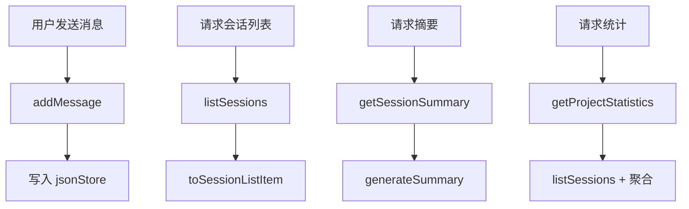

# F06：Agent 会话服务 —— 消息追加、摘要与统计

## 开篇场景

会话创建之后，真正的交互才开始。用户发送一条消息，系统需要：

1. 把这条消息追加到会话的 `messages` 数组；
2. 给消息生成唯一 `id` 和时间戳；
3. 更新会话的 `updatedAt`；
4. 重新落盘。

当会话积累了很多消息，用户想快速了解这个会话讲了什么，系统需要生成摘要。当项目管理者想看某个项目有多少活跃会话、总共多少消息，系统需要提供统计。

这些功能都在 `AgentSessionService` 的后半部分。这节课看：消息如何被追加、摘要如何被生成、统计如何被汇总。

## 核心问题

**消息追加、摘要生成、统计汇总都是“会话数据”的衍生操作，为什么它们被放在同一个 `AgentSessionService` 里，而不是拆成多个 service？这种设计的代价是什么？**

## 概念阶梯

**AgentMessage**：会话中的单条消息，包含 `id`、`role`、`content`、`timestamp`，以及可选的 `toolCalls`、`toolResults`、`metadata`。

**会话摘要（SessionSummary）**：对一次会话的统计视图，包括总消息数、用户/助手消息数、工具调用次数、首条/末条消息预览。

**项目统计（SessionStatistics）**：对一个项目的聚合统计，包括总会话数、活跃会话数、已完成会话数、总消息数、平均每会话消息数。

**List Item（SessionListItem）**：会话列表项，比完整 `AgentSession` 更轻量，用于渲染列表。

## 图解：消息与衍生数据流



**图后解释**：

- `addMessage` 是写路径，负责消息追加和落盘。
- `listSessions`、`getSessionSummary`、`getProjectStatistics` 是读路径，负责把原始会话数据转换成不同的视图。
- 所有衍生数据都来自同一份会话文件，不需要额外的数据库或缓存。

## 源码精读

### 1. addMessage：消息追加

[packages/core/src/lib/features/agent/session-service.ts 第 156—178 行](../../../../packages/core/src/lib/features/agent/session-service.ts#L156)

```typescript
async addMessage(
  sessionId: string,
  message: Omit<AgentMessage, 'id' | 'timestamp'>,
  projectId?: string,
): Promise<AgentSession | null> {
  const session = await this.getSession(sessionId, projectId);
  if (!session) {
    return null;
  }

  const newMessage: AgentMessage = {
    ...message,
    id: uuidv4(),
    timestamp: Date.now(),
  };

  session.messages.push(newMessage);
  session.updatedAt = Date.now();

  await this.saveSession(session);

  return session;
}
```

设计要点：

1. **调用方只传必要字段**：`message` 参数省略了 `id` 和 `timestamp`，由 service 自动生成。
2. **UUID 作为消息 id**：保证消息在会话内唯一。
3. **更新 `updatedAt`**：让 `listSessions` 的排序反映最新消息时间。
4. **直接落盘**：没有缓存或批量写入，简单但高频调用时可能有性能开销。

**与 `integrations/pi-agent/session-store.ts` 的对比**：

- `features/agent/session-service.ts#addMessage` 是面向 Web API 的粗粒度追加，通常一次追加一条完整消息。
- `integrations/pi-agent/session-store.ts` 更面向运行时，可能在流式过程中频繁追加片段或更新消息状态。

### 2. toSessionListItem：会话列表项

[packages/core/src/lib/features/agent/session-service.ts 第 293—311 行](../../../../packages/core/src/lib/features/agent/session-service.ts#L293)

```typescript
private toSessionListItem(session: AgentSession): SessionListItem {
  const projectContext = session.projectContext ?? {
    projectId: 'unknown',
    projectName: 'Unknown Project',
  };

  return {
    sessionId: session.sessionId,
    projectId: projectContext.projectId,
    projectName: projectContext.projectName,
    status: session.status,
    createdAt: session.createdAt,
    updatedAt: session.updatedAt,
    messageCount: session.messages?.length ?? 0,
    summary: session.summary,
    agentType: session.agentType,
  };
}
}
```

这个私有方法把完整 `AgentSession` 转成轻量的 `SessionListItem`。关键字段：

- `messageCount`：消息总数。
- `summary`：用户或系统生成的摘要。
- `agentType`：用于列表渲染图标或过滤。

**防御性设计**：如果 `projectContext` 缺失，使用 `'unknown'` 占位，避免 `listSessions` 崩溃。

### 3. generateSummary：生成会话摘要

[packages/core/src/lib/features/agent/session-service.ts 第 316—340 行](../../../../packages/core/src/lib/features/agent/session-service.ts#L316)

```typescript
private generateSummary(session: AgentSession): SessionSummary {
  const totalMessages = session.messages.length;
  const userMessages = session.messages.filter((m: AgentMessage) => m.role === 'user').length;
  const assistantMessages = session.messages.filter(
    (m: AgentMessage) => m.role === 'assistant',
  ).length;
  const toolCalls = session.messages.reduce(
    (sum: number, m: AgentMessage) => sum + (m.toolResults?.length ?? 0),
    0,
  );
  const firstMessage = session.messages[0]?.content?.substring(0, 100);
  const lastMessage = session.messages[session.messages.length - 1]?.content?.substring(
    0,
    100,
  );

  return {
    totalMessages,
    userMessages,
    assistantMessages,
    toolCalls,
    firstMessage,
    lastMessage,
  };
}
```

这里统计：

- 总消息数
- 用户消息数
- 助手消息数
- 工具结果总数（注意是 `toolResults?.length`，不是 `toolCalls?.length`）
- 首条消息前 100 字符
- 末条消息前 100 字符

**注意**：`toolCalls` 字段名虽然叫 toolCalls，但实际统计的是 `toolResults` 的长度。这是一个命名与语义不完全一致的地方，后续如果要精确统计工具调用次数，可能需要同时考虑 `toolCalls` 和 `toolResults`。

### 4. getSessionSummary：公开摘要接口

[packages/core/src/lib/features/agent/session-service.ts 第 234—241 行](../../../../packages/core/src/lib/features/agent/session-service.ts#L234)

```typescript
async getSessionSummary(sessionId: string, projectId?: string): Promise<SessionSummary | null> {
  const session = await this.getSession(sessionId, projectId);
  if (!session) {
    return null;
  }

  return this.generateSummary(session);
}
```

简单封装：读取会话，调用私有 `generateSummary`。

### 5. autoGenerateSummary：自动生成摘要文本

[packages/core/src/lib/features/agent/session-service.ts 第 270—288 行](../../../../packages/core/src/lib/features/agent/session-service.ts#L270)

```typescript
async autoGenerateSummary(sessionId: string, projectId?: string): Promise<string> {
  const session = await this.getSession(sessionId, projectId);
  if (!session || session.messages.length === 0) {
    return 'Empty session';
  }

  const summary = this.generateSummary(session);

  const userMessages = session.messages.filter((m: AgentMessage) => m.role === 'user');
  const firstUserMessage =
    userMessages[0]?.content?.substring(0, 50) || 'No content';
  const topic =
    userMessages.length > 0
      ? firstUserMessage
      : 'System initialization';

  return `${topic}... (${summary.totalMessages} messages)`;
}
```

这个函数生成一个人类可读的摘要字符串：

- 取第一条用户消息的前 50 字符作为主题；
- 如果没有用户消息，显示 `'System initialization'`；
- 最后加上总消息数。

这个字符串可以被 UI 用作会话列表的副标题。

### 6. getProjectStatistics：项目级统计

[packages/core/src/lib/features/agent/session-service.ts 第 246—265 行](../../../../packages/core/src/lib/features/agent/session-service.ts#L246)

```typescript
async getProjectStatistics(projectId: string): Promise<SessionStatistics> {
  const sessions = await this.listSessions(projectId);

  const totalSessions = sessions.length;
  const activeSessions = sessions.filter(s => s.status === 'active').length;
  const completedSessions = sessions.filter(
    s => s.status === 'completed',
  ).length;
  const totalMessages = sessions.reduce((sum, s) => sum + s.messageCount, 0);
  const averageMessagesPerSession =
    totalSessions > 0 ? totalMessages / totalSessions : 0;

  return {
    totalSessions,
    activeSessions,
    completedSessions,
    totalMessages,
    averageMessagesPerSession: Math.round(averageMessagesPerSession),
  };
}
```

设计要点：

1. 复用 `listSessions(projectId)` 获取项目下的所有会话列表项。
2. 统计活跃/完成会话数。
3. 用 `messageCount` 累加总消息数。
4. 计算平均值并四舍五入。

## 真实调用链

用户发送一条消息后的完整数据流：

1. Web `usePiAgent` 或 Route Handler 调用 `agentSessionService.addMessage(sessionId, message, projectId)`。
2. `addMessage` 读取完整会话，追加消息，更新 `updatedAt`。
3. `saveSession` 写入磁盘。
4. 前端刷新会话列表时，调用 `listSessions`，获得按 `updatedAt` 排序的 `SessionListItem[]`。
5. 如果 UI 需要显示摘要，调用 `autoGenerateSummary` 或读取 `session.summary`。

## 关键类型与数据示例

### AgentMessage

[packages/core/src/types/agent.ts 第 163—206 行](../../../../packages/core/src/types/agent.ts#L163)

```typescript
export interface AgentMessage {
  id: string;
  role: 'system' | 'user' | 'assistant' | 'tool';
  content: string;
  timestamp: number;
  toolCalls?: ToolCall[];
  toolResults?: ToolResult[];
  metadata?: Record<string, unknown>;
}
```

### SessionSummary

[packages/core/src/types/agent.ts 第 301—312 行](../../../../packages/core/src/types/agent.ts#L301)

```typescript
export interface SessionSummary {
  totalMessages: number;
  userMessages: number;
  assistantMessages: number;
  toolCalls: number;
  firstMessage?: string;
  lastMessage?: string;
}
```

### SessionStatistics

[packages/core/src/types/agent.ts 第 313—321 行](../../../../packages/core/src/types/agent.ts#L313)

```typescript
export interface SessionStatistics {
  totalSessions: number;
  activeSessions: number;
  completedSessions: number;
  totalMessages: number;
  averageMessagesPerSession: number;
}
```

## 失败路径与边界

| 场景 | 会发生什么 | 原因 |
|---|---|---|
| 向不存在的 session 追加消息 | 返回 `null` | 先 `getSession` 再追加 |
| 消息 `content` 为空字符串 | 仍追加成功 | `AgentMessage` 不校验内容非空 |
| 空会话请求摘要 | `autoGenerateSummary` 返回 `'Empty session'` | 显式判断 |
| 项目下无会话 | `getProjectStatistics` 返回全 0 | `totalSessions > 0` 条件 |
| `toolResults` 与 `toolCalls` 不一致 | `toolCalls` 统计可能偏小 | 只统计 `toolResults?.length` |

**一个关键边界**：`addMessage` 每次追加都立即落盘。在流式交互中，如果消息生成速度很快，频繁写盘可能成为瓶颈。后续可以考虑批量写入或内存缓冲，但 MVP 阶段简单优先。

## 测试证据

- `session-service.ts` 后半部分当前无直接单元测试。
- 缺口说明：建议补测试覆盖 `addMessage` 的消息 id/timestamp 生成、`generateSummary` 的统计正确性、`getProjectStatistics` 的聚合逻辑、`autoGenerateSummary` 的空会话和正常会话分支。
- 间接验证：如果 Web 或 Skill 的集成测试会真实发送消息并检查会话文件，可部分覆盖 `addMessage`。

## 练习与验收

1. **追加消息实验**：调用 `agentSessionService.addMessage`，传入一条 `user` 消息，读取磁盘文件确认 `messages` 数组长度、`id`、`timestamp` 都正确。
2. **摘要验证**：构造一个包含多条消息的会话，调用 `getSessionSummary` 和 `autoGenerateSummary`，检查统计是否正确。
3. **统计聚合**：在同一个项目下创建多个会话并追加不同数量消息，调用 `getProjectStatistics` 验证总数、活跃数、平均数。
4. **工具调用统计**：构造一条带 `toolResults` 的消息，确认 `generateSummary` 的 `toolCalls` 字段变化；再构造一条带 `toolCalls` 但无 `toolResults` 的消息，观察统计是否变化，并思考原因。

**验收标准**：能解释 `AgentSessionService` 的写路径和读路径分工，能独立生成会话摘要和项目统计。

## 章节收束

本节课完成了 `AgentSessionService` 的全貌：

- F05 讲了 CRUD 和持久化路径；
- F06 讲了消息追加、摘要生成、统计汇总。

这个服务是 Web 和运行时之间的“会话合同管理员”。下节课（F07）开始进入 `features/agent/project-agent.ts`，看项目 Agent 如何初始化并生成本体。
