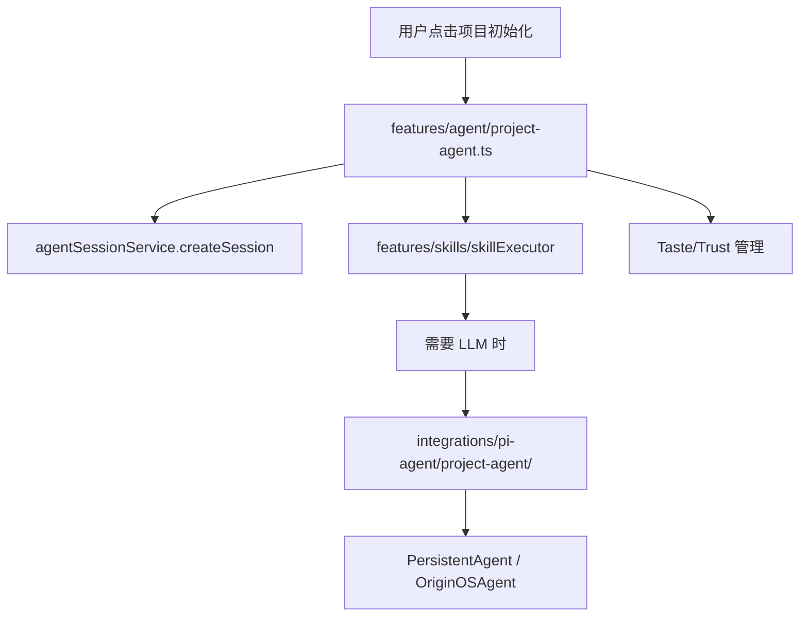

# F07：ProjectAgent 接口与 startProject

## 开篇场景

用户在首页点击“项目初始化”这个 Agent。系统弹出一个对话窗，Agent 说：

> Hello! I'm your Project Agent. I'd love to help you create a new project called "xxx". To get started, could you tell me a bit about what you're working on?

这个欢迎语、这个项目 Agent 的身份、以及背后创建项目会话的逻辑，都来自 `features/agent/project-agent.ts`。

与 RoleAgent 不同，ProjectAgent 不是“一个长期运行的角色”，而是一个**专门用于项目初始化的工作流代理**。它通过对话收集项目信息，调用 Skill（如 `project-initialization`）推进阶段，最终生成本体结构。

## 核心问题

**`features/agent/project-agent.ts` 和 `integrations/pi-agent/project-agent/` 有什么区别？为什么项目初始化需要两层实现？**

## 概念阶梯

**ProjectAgent（功能层）**：`features/agent/project-agent.ts`，面向“项目初始化”这个产品场景，管理 `AgentSession`、调用 Skill 执行器、处理 Taste/Trust 等 Epic 扩展。

**ProjectAgent（集成层）**：`integrations/pi-agent/project-agent/`，面向 `PersistentAgent` 运行时，构建 7 层 System Prompt、加载项目上下文文件。

**项目访谈（Project Interview）**：通过 3 个问题收集工作领域、工作模式、主要任务，为后续本体生成做准备。

**Taste Engineering（Epic C）**：收集用户/项目的品味偏好，让 Agent 的回复风格与决策更符合用户习惯。

**Accumulation System（Epic T）**：通过信任模型和信号读取，让 Agent 在多次交互中调整自主级别。

## 图解：两层 ProjectAgent 的关系



**图后解释**：

- `features/agent/project-agent.ts` 是产品入口，负责会话生命周期和 Skill 编排。
- `integrations/pi-agent/project-agent/` 是运行时提示词构建器，在需要 LLM 时被调用。
- 本节课讲功能层 ProjectAgent 的接口和启动逻辑。

## 源码精读

### 1. ProjectAgent 接口合同

[packages/core/src/lib/features/agent/project-agent.ts 第 175—216 行](../../../../packages/core/src/lib/features/agent/project-agent.ts#L175)

```typescript
export interface ProjectAgent {
  startProject(projectName: string): Promise<AgentSession>;
  sendMessage(sessionId: string, message: string): Promise<ProjectAgentResponse>;
  cancel(sessionId: string): Promise<void>;
  complete(sessionId: string): Promise<void>;

  // Taste Engineering (Epic C)
  loadTasteProfile(userId: string, projectId?: string): Promise<TASTEProfile | null>;
  collectProjectTASTE(sessionId: string, userMessage: string): Promise<void>;
  mergeTASTEProfiles(userTASTE: TASTEProfile, projectTASTE: TASTEProfile): TASTEProfile;

  // Accumulation System (Epic T)
  readTasteSignals(sessionId: string, interaction: string): Promise<TasteSignal[]>;
  addObservation(observation: any): Promise<void>;
  processTrustEvent(event: TrustEvent): Promise<void>;
  getAutonomyLevel(domain?: string): AutonomyLevel;
}
```

这个接口分为三个部分：

1. **会话生命周期**：`startProject`、`sendMessage`、`cancel`、`complete`。
2. **Taste Engineering**：加载/收集/合并用户与项目的品味档案。
3. **Accumulation System**：读取信号、添加观察、处理信任事件、获取自主级别。

**为什么 Taste 和 Accumulation 会出现在 ProjectAgent 里？** 因为项目初始化是最早需要收集用户偏好的场景。用户在描述项目时，Agent 可以“隐形”地提取品味信号，为后续所有 Agent 服务。

### 2. startProject：创建项目会话

[packages/core/src/lib/features/agent/project-agent.ts 第 287—317 行](../../../../packages/core/src/lib/features/agent/project-agent.ts#L287)

```typescript
async startProject(projectName: string): Promise<AgentSession> {
  const createRequest: CreateSessionRequest = {
    projectId: `proj_${uuidv4()}()`,
    projectName,
    agentType: 'project-initialization',
    systemPrompt: await this.getSystemPrompt(),
    projectContext: {
      phase: 'foundation',
    },
  };

  const session = await agentSessionService.createSession(createRequest);

  await agentSessionService.addMessage(session.sessionId, {
    role: 'system',
    content: 'Project initialization started',
    toolResults: [],
  });

  const welcomeMessage = this.getWelcomeMessage(projectName);
  await agentSessionService.addMessage(session.sessionId, {
    role: 'assistant',
    content: welcomeMessage,
    toolResults: [],
  });

  return session;
}
```

关键设计点：

1. **生成 `projectId`**：用 `proj_${uuidv4()}` 格式，与 `sessionId` 区分开。
2. **`agentType` 为 `'project-initialization'`**：这个字符串会被 launcher 识别，选择对应的启动路径。
3. **初始 `phase: 'foundation'`**：项目初始化从基础阶段开始，后续 Skill 执行可能推进到 `'interview'`、`'ontology'`、`'complete'` 等阶段。
4. **先写 system message**：标记项目初始化开始。
5. **再写 assistant welcome message**：用户打开对话窗后第一眼看到的内容。

### 3. ProjectAgentResponse 响应合同

[packages/core/src/lib/features/agent/project-agent.ts 第 218—259 行](../../../../packages/core/src/lib/features/agent/project-agent.ts#L218)

```typescript
export interface ProjectAgentResponse {
  message: string;
  phase?: string;
  complete?: boolean;
  intent?: Intent;
  confidence?: number;
  entitiesCreated?: number;
  skillUsed?: string;
  tasteSignals?: TasteSignal[];
  tasteProfile?: TASTEProfile;
  trustLevel?: number;
  autonomyLevel?: AutonomyLevel;
}
```

这个响应很“厚”：

- `message`：给用户看的文本。
- `phase` / `complete`：工作流状态。
- `intent` / `confidence` / `skillUsed`：决策调试信息。
- `entitiesCreated`：本体生成数量。
- `tasteSignals` / `tasteProfile` / `trustLevel` / `autonomyLevel`：Epic C/T 扩展字段。

**为什么一次响应要携带这么多字段？** 因为 UI 可能需要同时显示：回复文本、当前阶段、信任级别、品味信号。这些字段让 ProjectAgent 成为一个“状态丰富的响应”。

### 4. cancel 与 complete

[packages/core/src/lib/features/agent/project-agent.ts 第 450—481 行](../../../../packages/core/src/lib/features/agent/project-agent.ts#L450)

```typescript
async cancel(sessionId: string): Promise<void> {
  await agentSessionService.updateSession(sessionId, {
    status: 'cancelled',
  });
}

async complete(sessionId: string): Promise<void> {
  const session = await agentSessionService.getSession(sessionId);
  if (!session) {
    throw new Error(`Session not found: ${sessionId}`);
  }

  const projectEntityId = session.projectContext?.projectEntityId as string | undefined;
  if (projectEntityId) {
    console.log(`[ProjectAgent] Completing project ${projectEntityId}`);
  }

  const collection = this.projectTASTECollection.get(sessionId);
  if (collection) {
    await this.buildProjectTASTE(collection);
    console.log(`[ProjectAgent] Persisting Project TASTE for ${session.projectContext?.projectId}`);
  }

  await agentSessionService.updateSession(sessionId, {
    status: 'completed',
  });
}
```

- `cancel` 只是把状态改成 `'cancelled'`。
- `complete` 更复杂：如果会话上下文里有 `projectEntityId`，理论上要更新项目实体；如果收集了 Project TASTE，要把它构建成持久档案。

注意这里的 TODO：`complete` 目前没有真正调用 ontology API 或保存 TASTE 文件，只是打印日志。这是 MVP 阶段的占位实现。

## 真实调用链

用户点击“项目初始化”后的启动流程：

1. Web 调用 `projectAgent.startProject(projectName)`。
2. `startProject` 生成 `projectId`，创建 `AgentSession`。
3. 写入 system message 和 welcome message。
4. 返回 `AgentSession` 给 Web，Web 打开对话窗。
5. 用户输入第一条消息后，调用 `projectAgent.sendMessage(sessionId, message)`。
6. `sendMessage` 进入决策-执行-响应循环（下节课）。

## 关键类型与数据示例

### CreateSessionRequest 在项目初始化场景

```typescript
{
  projectId: 'proj_550e8400-e29b-41d4-a716-446655440000',
  projectName: '我的电商后台',
  agentType: 'project-initialization',
  systemPrompt: 'You are a Project Agent for OriginOS...',
  projectContext: {
    phase: 'foundation',
  },
}
```

### 启动后的会话消息

```json
[
  {
    "role": "system",
    "content": "Project initialization started",
    "toolResults": []
  },
  {
    "role": "assistant",
    "content": "Hello! I'm your Project Agent...",
    "toolResults": []
  }
]
```

## 失败路径与边界

| 场景 | 会发生什么 | 原因 |
|---|---|---|
| `startProject` 时 `projectName` 为空 | 仍会创建会话，但 welcome 消息显示 `""` | 没有非空校验 |
| `complete` 时 session 不存在 | 抛出 `Session not found` | 先 `getSession` 再更新 |
| `complete` 时没有 `projectEntityId` | 只保存 TASTE，不更新项目实体 | `projectEntityId` 可能由 Skill 写入 |
| 同时启动多个项目 | 每个项目有独立 session 和 projectId | `uuidv4()` 保证唯一 |

**一个关键边界**：`startProject` 的 `agentType` 字符串 `'project-initialization'` 必须与 launcher 中的识别逻辑对齐。如果两边不一致，运行时可能无法正确选择启动路径。

## 测试证据

- `project-agent.ts` 当前无直接单元测试。
- 缺口说明：建议补一个集成测试，验证 `startProject` 创建会话后，`messages` 包含 system 和 assistant 两条消息，且 `projectContext.phase === 'foundation'`。
- 间接验证：如果 Web 的“创建项目”流程有 E2E 测试，会覆盖 `startProject` 的调用。

## 练习与验收

1. **启动一个项目**：在本地运行后，通过首页“项目初始化”创建一个项目，查看 `data/web/projects/{projectId}/sessions/{sessionId}.json` 的内容。
2. **验证 agentType**：确认会话文件中的 `agentType` 是否为 `'project-initialization'`。
3. **追踪调用**：从 `projectAgent.startProject` 出发，追踪它调用了 `agentSessionService` 的哪些方法。
4. **对比 RoleAgent 启动**：思考 RoleAgent 的启动路径是否会调用 `features/agent/project-agent.ts`？为什么不会？

**验收标准**：能解释功能层 ProjectAgent 与集成层 project-agent 的区别，能独立完成 `startProject` 并验证会话文件内容。

## 章节收束

本节课看了 `ProjectAgent` 的接口合同和 `startProject` 实现。它是项目初始化的功能层入口，负责创建会话、写入初始消息、管理项目生命周期。

下节课（F08）进入 `sendMessage`，看 ProjectAgent 如何处理用户消息、做意图决策、执行 Skill、更新阶段。
