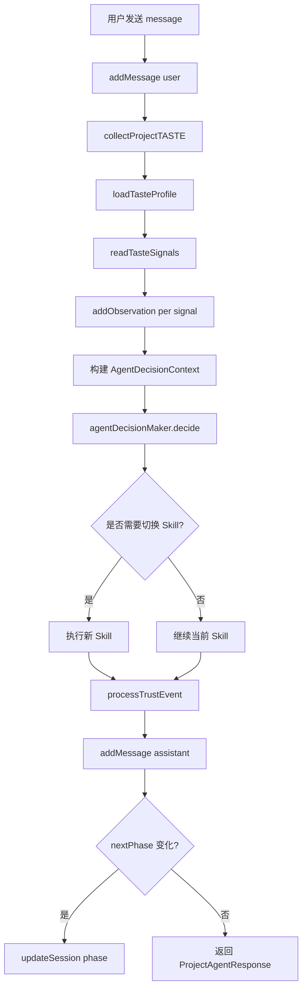

# F08：ProjectAgent 的消息处理 —— 决策、Skill 执行与阶段推进

## 开篇场景

用户向 Project Agent 发送了一条消息：

> 我想做一个电商后台，主要做商品管理和订单处理。

Project Agent 需要：

1. 把这句话追加到会话；
2. 读取用户的 Taste 信号；
3. 判断当前意图；
4. 决定调用哪个 Skill；
5. 执行 Skill；
6. 把 Skill 结果转成 assistant 回复；
7. 如果 Skill 推进了阶段，更新会话的 `phase`。

这些都在 `project-agent.ts#sendMessage` 中完成。这节课看这个核心函数。

## 核心问题

**Project Agent 为什么不直接调用 LLM，而是先经过 `agentDecisionMaker` 和 `skillExecutor`？这种“决策-执行”分离有什么好处？**

## 概念阶梯

**AgentDecisionMaker**：`features/skills/decision.ts`，根据用户输入和对话历史决定调用哪个 Skill。

**SkillExecutor**：`features/skills/executor.ts`，执行具体 Skill，管理 handler 调用和上下文注入。

**Intent**：用户意图，如 `create_project`、`answer_interview`、`generate_ontology`。

**SkillResult**：Skill 执行结果，包含 `message`、`nextPhase`、`complete`、`data`、`entitiesCreated` 等。

**阶段推进（Phase Transition）**：项目初始化是一个多阶段工作流，`phase` 字段记录当前阶段，Skill 执行可能改变它。

## 图解：sendMessage 的控制流



**图后解释**：

- `sendMessage` 不是直接聊天，而是“意图识别 + Skill 执行 + 状态更新”的组合。
- Taste/Trust 逻辑穿插其中，但核心控制流是决策-执行。

## 源码精读

### 1. 用户消息落盘

[packages/core/src/lib/features/agent/project-agent.ts 第 319—332 行](../../../../packages/core/src/lib/features/agent/project-agent.ts#L319)

```typescript
async sendMessage(sessionId: string, message: string): Promise<ProjectAgentResponse> {
  const session = await agentSessionService.getSession(sessionId);
  if (!session) {
    throw new Error(`Session not found: ${sessionId}`);
  }

  await agentSessionService.addMessage(sessionId, {
    role: 'user',
    content: message,
    toolResults: [],
  });
```

首先检查 session 存在，然后追加用户消息。`toolResults: []` 是占位，因为 `AgentMessage` 的 `toolResults` 字段可能是必填的。

### 2. Taste 与 Trust 信号收集

[packages/core/src/lib/features/agent/project-agent.ts 第 334—359 行](../../../../packages/core/src/lib/features/agent/project-agent.ts#L334)

```typescript
await this.collectProjectTASTE(sessionId, message);
const tasteProfile = await this.loadTasteProfile('user', session.projectContext?.projectId);
const tasteSignals = await this.readTasteSignals(sessionId, message);

for (const signal of tasteSignals) {
  await this.addObservation({
    pattern_hint: signal.type,
    signal,
    timestamp: Date.now(),
    decay_factor: 0.9,
    evidence: {
      interaction_id: sessionId,
      context_snippet: message,
      user_reaction: message,
    },
  });
}
```

这里做了三件事：

1. **collectProjectTASTE**：从用户消息中提取品味模式，存入 `projectTASTECollection`。
2. **loadTasteProfile**：加载合并后的 User + Project TASTE。
3. **readTasteSignals + addObservation**：读取信号并加入 ARIA 观察队列。

注意：当前 `addObservation` 只是 `console.log`，没有真正入队。这是 Epic T 的占位实现。

### 3. 构建决策上下文

[packages/core/src/lib/features/agent/project-agent.ts 第 361—369 行](../../../../packages/core/src/lib/features/agent/project-agent.ts#L361)

```typescript
const context: AgentDecisionContext = {
  conversationHistory: session.messages.slice(-10).map((m: AgentMessage) => ({
    role: m.role,
    content: m.content,
  })),
  currentPhase: session.projectContext?.phase as string | undefined,
  activeSkill: session.agentType,
};
```

决策上下文包含：

- 最近 10 条消息（role + content）。
- 当前阶段。
- 当前激活的 Skill（用 `agentType` 表示）。

**为什么只取最近 10 条？** 控制 prompt 长度，避免决策成本过高。对于项目初始化，通常最近几轮对话已足够判断意图。

### 4. 决策与 Skill 执行

[packages/core/src/lib/features/agent/project-agent.ts 第 371—401 行](../../../../packages/core/src/lib/features/agent/project-agent.ts#L371)

```typescript
const decision = await agentDecisionMaker.decide(message, context);

let skillResult: SkillResult | null = null;

if (decision.skill && context.activeSkill !== decision.skill.metadata.name) {
  skillResult = await skillExecutor.execute(decision.skill, {
    sessionId,
    session: session as unknown as SkillContext['session'],
    input: { message, data: { tasteProfile } },
    tools: {},
    config: {},
    skillData: {
      previousPhase: context.currentPhase,
    },
  });
} else if (decision.skill) {
  skillResult = await skillExecutor.execute(decision.skill, {
    sessionId,
    session: session as unknown as SkillContext['session'],
    input: { message, data: { tasteProfile } },
    tools: {},
    config: {},
    skillData: {
      phase: context.currentPhase,
    },
  });
}
```

关键点：

1. **`agentDecisionMaker.decide`** 返回一个 decision，包含 `skill`、`intent`、`reasoning`。
2. **判断是否需要切换 Skill**：如果 decision 决定的 skill 名称与当前 `activeSkill` 不同，传 `previousPhase`；否则传 `phase`。
3. **`session as unknown as SkillContext['session']`**：类型转换，因为 `AgentSession` 和 `SkillContext['session']` 的合同略有差异。
4. **`tools: {}`**：由 executor 注入实际工具，这里只是占位。
5. **`input.data.tasteProfile`**：把 Taste 档案传给 Skill，让 Skill 也能感知用户偏好。

### 5. 信任更新与响应落盘

[packages/core/src/lib/features/agent/project-agent.ts 第 403—417 行](../../../../packages/core/src/lib/features/agent/project-agent.ts#L403)

```typescript
if (skillResult?.success) {
  await this.processTrustEvent({ type: 'successful_suggestion' });
}

const responseMessage = skillResult?.message || this.getDefaultResponse(message);
await agentSessionService.addMessage(sessionId, {
  role: 'assistant',
  content: responseMessage,
  toolResults: skillResult?.data ? [{
    toolCallId: uuidv4(),
    result: skillResult.data,
  }] : [],
});
```

- Skill 成功时，信任值增加。
- 如果 Skill 没有返回 message，使用默认回复。
- Skill 的 `data` 被包装成 `toolResults` 落盘。这是一种把 Skill 执行结果记录到消息历史的方式。

### 6. 阶段推进

[packages/core/src/lib/features/agent/project-agent.ts 第 419—427 行](../../../../packages/core/src/lib/features/agent/project-agent.ts#L419)

```typescript
if (skillResult?.nextPhase && skillResult.nextPhase !== context.currentPhase) {
  await agentSessionService.updateSession(sessionId, {
    projectContext: {
      ...session.projectContext,
      phase: skillResult.nextPhase,
    },
  });
}
```

如果 Skill 返回了新的 phase，并且与当前 phase 不同，更新会话上下文。这让 Project Agent 可以在多阶段工作流中推进。

### 7. 返回响应

[packages/core/src/lib/features/agent/project-agent.ts 第 429—448 行](../../../../packages/core/src/lib/features/agent/project-agent.ts#L429)

```typescript
return {
  message: responseMessage,
  phase: skillResult?.nextPhase || context.currentPhase,
  complete: skillResult?.complete || false,
  intent: decision.intent,
  confidence: decision.reasoning ? this.extractConfidence(decision.reasoning) : undefined,
  entitiesCreated: skillResult?.entitiesCreated?.length || 0,
  skillUsed: decision.skill?.metadata.name,
  tasteSignals,
  tasteProfile: tasteProfile || undefined,
  trustLevel: this.trustModel.overallTrust,
  autonomyLevel: this.getAutonomyLevel(),
};
```

响应汇集了决策、执行、Taste、Trust 的信息。

## 真实调用链

一条用户消息的处理过程：

1. Web 调用 `projectAgent.sendMessage(sessionId, message)`。
2. 用户消息追加到 `AgentSession`。
3. `collectProjectTASTE` 收集品味模式。
4. `agentDecisionMaker.decide` 判断意图和应调 Skill。
5. `skillExecutor.execute` 调用具体 Skill（如 `project-initialization`）。
6. Skill 返回 `message`、`nextPhase`、`complete`。
7. Project Agent 把 assistant 回复落盘，必要时更新 `phase`。
8. 返回 `ProjectAgentResponse` 给 Web。

## 关键类型与数据示例

### AgentDecisionContext

```typescript
interface AgentDecisionContext {
  conversationHistory: { role: string; content: string }[];
  currentPhase?: string;
  activeSkill?: string;
}
```

### SkillResult

```typescript
interface SkillResult {
  success: boolean;
  message: string;
  data?: Record<string, unknown>;
  nextPhase?: string;
  complete?: boolean;
  entitiesCreated?: unknown[];
}
```

### 决策后的响应示例

```typescript
{
  message: '明白了，电商后台。我会先通过几个问题了解你的项目...',
  phase: 'interview',
  complete: false,
  intent: 'start_project_interview',
  confidence: 0.9,
  entitiesCreated: 0,
  skillUsed: 'project-initialization',
  tasteSignals: [],
  trustLevel: 0.55,
  autonomyLevel: 'guided',
}
```

## 失败路径与边界

| 场景 | 会发生什么 | 原因 |
|---|---|---|
| Session 不存在 | 抛出 `Session not found` | 先 `getSession` |
| `decision.skill` 为空 | `skillResult` 保持 `null`，返回默认回复 | 未匹配到 Skill |
| Skill 执行失败 | `skillResult.success` 为 false，`processTrustEvent` 不触发 | success 字段控制 |
| `session as unknown as SkillContext['session']` 转换错误 | 运行时可能访问不存在字段 | 类型合同不完全一致 |
| `nextPhase` 与当前相同 | 不调用 `updateSession` | 有显式判断 |

**一个关键边界**：`sendMessage` 中每个步骤都涉及 I/O（读 session、写 session、执行 Skill），任何一个失败都会影响最终响应。当前实现没有统一的 try/catch 包裹，后续可以增强错误恢复。

## 测试证据

- `project-agent.ts#sendMessage` 当前无直接测试。
- 缺口说明：建议补一个集成测试，用 mock 的 `agentDecisionMaker` 和 `skillExecutor` 验证 `sendMessage` 的消息追加、Skill 调用、阶段更新。
- 相关测试：`features/skills/decision.test.ts` 和 `features/skills/executor.test.ts`（如果存在）可验证决策器和执行器。

## 练习与验收

1. **决策上下文构造**：打印 `AgentDecisionContext`，确认 `conversationHistory` 只包含最近 10 条消息。
2. **Skill 切换实验**：构造一个 decision，让 `decision.skill.metadata.name` 与 `session.agentType` 不同，观察传入 `skillExecutor.execute` 的 `skillData.previousPhase`。
3. **阶段推进验证**：构造一个返回 `nextPhase: 'ontology'` 的 mock Skill，调用 `sendMessage` 后检查会话文件的 `projectContext.phase`。
4. **错误处理**：临时让 `agentDecisionMaker.decide` 返回没有 `skill` 的 decision，观察 `sendMessage` 返回的 `ProjectAgentResponse`。

**验收标准**：能解释 Project Agent 的“决策-执行-响应”循环，能 mock 决策器和执行器测试 `sendMessage`。

## 章节收束

本节课看了 `sendMessage` 的完整控制流。Project Agent 的核心不是聊天，而是**根据意图调度 Skill 并推进工作流阶段**。

下节课（F09）会深入 Taste Engineering：TASTEProfile 的结构、如何收集和合并、如何生成 Taste Guidance。
