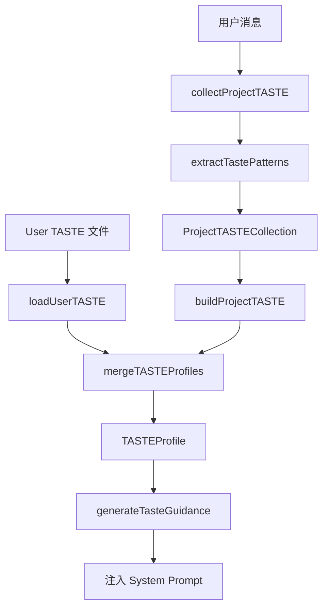

# F09：ProjectAgent 的 Taste Engineering

## 开篇场景

同样是“创建一个电商后台”：

- 用户 A 说：“简单直接，不要过度设计。”
- 用户 B 说：“要稳定可靠，分层清晰。”
- 用户 C 说：“灵活迭代，快速上线。”

如果 Project Agent 对三个用户给出完全一样的回复，体验会很差。Taste Engineering 的目标就是让 Agent 感知并适应不同用户的品味偏好。

`features/agent/project-agent.ts` 中实现了 Taste 的收集、合并、应用。这节课看这部分代码。

## 核心问题

**Taste Engineering 不是让 LLM 自己去“感觉”用户风格，而是显式地定义了一套 `TASTEProfile` 结构。为什么要把品味偏好结构化？这种结构如何被注入系统 Prompt？**

## 概念阶梯

**TASTEProfile**：用户或项目的品味档案，包含四个维度：体验拓扑、品味标准、张力位置、共生边界。

**User TASTE**：用户全局的品味偏好，跨项目共享。

**Project TASTE**：单个项目的品味偏好，从项目初始化访谈中隐形收集。

**Merged TASTE**：User TASTE 和 Project TASTE 的合并结果，用于当前项目上下文。

**Taste Guidance**：根据 TASTEProfile 生成的自然语言指令，追加到系统 Prompt 中。

## 图解：Taste 数据流



**图后解释**：

- Taste 信号从用户消息中提取；
- 项目级 Taste 在会话中累积；
- 用户级 Taste 从文件加载；
- 两者合并后生成 Taste Guidance；
- Guidance 追加到 System Prompt，影响 LLM 回复风格。

## 源码精读

### 1. TASTEProfile 结构

[packages/core/src/lib/features/agent/project-agent.ts 第 32—69 行](../../../../packages/core/src/lib/features/agent/project-agent.ts#L32)

```typescript
export interface TASTEProfile {
  version: string;
  createdAt: string;
  updatedAt: string;

  experience_topology: string[];

  taste_standards: {
    [domain: string]: {
      positive_vibes: string[];
      negative_vibes: string[];
    };
  };

  tension_position: {
    control_level: number;
    trust_level: number;
    intervention_threshold: number;
  };

  symbiosis_boundary: {
    delegated_domains: string[];
    reserved_domains: string[];
    contextual_triggers: string[];
  };

  metadata: {
    source: 'user' | 'project' | 'merged';
    confidence: number;
    evolution_count: number;
    projectId?: string;
  };
}
```

四个维度：

1. **experience_topology**：用户熟悉的领域/场景，如 `['e-commerce', 'backend']`。
2. **taste_standards**：每个领域下的“喜欢什么”和“讨厌什么”。
3. **tension_position**：控制欲、信任度、干预阈值，0-1 之间的数值。
4. **symbiosis_boundary**：哪些领域可以委托给 Agent，哪些必须保留给用户。

### 2. 收集项目 Taste

[packages/core/src/lib/features/agent/project-agent.ts 第 524—559 行](../../../../packages/core/src/lib/features/agent/project-agent.ts#L524)

```typescript
async collectProjectTASTE(sessionId: string, userMessage: string): Promise<void> {
  const session = await agentSessionService.getSession(sessionId);
  if (!session) {
    return;
  }

  let collection = this.projectTASTECollection.get(sessionId);
  if (!collection) {
    collection = {
      sessionId,
      projectName: session.projectContext?.projectName || 'Unknown',
      collectedPatterns: [],
      extractedSignals: [],
      ontologyContext: {
        domains: [],
        entities: [],
        relations: [],
      },
    };
    this.projectTASTECollection.set(sessionId, collection);
  }

  const signals = await this.readTasteSignals(sessionId, userMessage);
  collection.extractedSignals.push(...signals);

  const patterns = this.extractTastePatterns(userMessage);
  collection.collectedPatterns.push(...patterns);

  if (session.projectContext?.ontologyId) {
    const newDomains = this.extractOntologyDomains(userMessage);
    collection.ontologyContext!.domains.push(...newDomains);
  }
}
```

收集逻辑：

1. 获取或创建 `ProjectTASTECollection`。
2. 读取 Taste 信号并追加。
3. 提取文本中的品味模式（如“简单直接”→ `preference_for_simplicity`）。
4. 如果项目已有 ontologyId，提取领域关键词。

**注意**：这个过程对用户是“隐形”的，不需要用户显式回答品味问题。

### 3. 合并 Taste 档案

[packages/core/src/lib/features/agent/project-agent.ts 第 561—616 行](../../../../packages/core/src/lib/features/agent/project-agent.ts#L561)

```typescript
mergeTASTEProfiles(userTASTE: TASTEProfile, projectTASTE: TASTEProfile): TASTEProfile {
  return {
    ...projectTASTE,

    experience_topology: [
      ...userTASTE.experience_topology,
      ...projectTASTE.experience_topology,
    ].filter((value, index, self) => self.indexOf(value) === index),

    taste_standards: {
      ...userTASTE.taste_standards,
      ...projectTASTE.taste_standards,
    },

    tension_position: {
      control_level: this.weightedAverage(..., 0.7),
      trust_level: this.weightedAverage(..., 0.7),
      intervention_threshold: projectTASTE.tension_position.intervention_threshold,
    },

    symbiosis_boundary: {
      delegated_domains: [...user..., ...project...].filter(dedup),
      reserved_domains: [...user..., ...project...].filter(dedup),
      contextual_triggers: [...user..., ...project...].filter(dedup),
    },

    metadata: {
      source: 'merged',
      confidence: Math.max(userTASTE.metadata.confidence, projectTASTE.metadata.confidence),
      evolution_count: userTASTE.metadata.evolution_count + projectTASTE.metadata.evolution_count,
      projectId: projectTASTE.metadata.projectId,
    },
  };
}
```

合并策略：

- **experience_topology**：并集去重。
- **taste_standards**：Project 覆盖 User 的同 domain。
- **tension_position**：加权平均，Project 权重 0.7。
- **symbiosis_boundary**：并集去重。
- **metadata**：source 标记为 merged，confidence 取最大，evolution_count 相加。

### 4. 从收集结果构建 Project TASTE

[packages/core/src/lib/features/agent/project-agent.ts 第 618—655 行](../../../../packages/core/src/lib/features/agent/project-agent.ts#L618)

```typescript
private async buildProjectTASTE(collection: ProjectTASTECollection): Promise<TASTEProfile> {
  const now = new Date().toISOString();

  return {
    version: '1.0.0',
    createdAt: now,
    updatedAt: now,
    experience_topology: [
      ...collection.ontologyContext?.domains || [],
      ...this.extractExperienceFromSignals(collection.extractedSignals),
    ],
    taste_standards: this.extractTasteStandards(collection.extractedSignals, collection.collectedPatterns),
    tension_position: { control_level: 0.5, trust_level: 0.5, intervention_threshold: 0.8 },
    symbiosis_boundary: { delegated_domains: [], reserved_domains: [], contextual_triggers: [] },
    metadata: { source: 'project', confidence: 0.3, evolution_count: 0 },
  };
}
```

初始 Project TASTE：

- confidence 只有 0.3，因为是“隐形收集”，可靠性不高；
- tension_position 使用默认值；
- symbiosis_boundary 初始为空，等待用户显式反馈。

### 5. 生成 Taste Guidance

[packages/core/src/lib/features/agent/project-agent.ts 第 750—780 行](../../../../packages/core/src/lib/features/agent/project-agent.ts#L750)

```typescript
private generateTasteGuidance(tasteProfile: TASTEProfile): string {
  const guidance: string[] = [];

  if (tasteProfile.experience_topology.length > 0) {
    guidance.push(`User's Experience Domains: ${tasteProfile.experience_topology.join(', ')}.`);
  }

  const standards = tasteProfile.taste_standards;
  if (Object.keys(standards).length > 0) {
    guidance.push("User's Taste Standards:");
    Object.entries(standards).forEach(([domain, prefs]) => {
      guidance.push(`- ${domain}: Prefers ${prefs.positive_vibes.join(', ')}; Avoids ${prefs.negative_vibes.join(', ')}`);
    });
  }

  const tension = tasteProfile.tension_position;
  guidance.push(`Interaction Style: ${tension.control_level > 0.7 ? 'User prefers more control' : 'User is comfortable delegating'}. Trust level: ${(tension.trust_level * 100).toFixed(0)}%.`);

  if (tasteProfile.symbiosis_boundary.reserved_domains.length > 0) {
    guidance.push(`Reserved Domains (do not make decisions here): ${tasteProfile.symbiosis_boundary.reserved_domains.join(', ')}.`);
  }

  return guidance.join('\n');
}
```

Taste Guidance 被拼接进 System Prompt，让 LLM 在回复时参考用户的品味。

### 6. Taste Pattern 提取（简化规则）

[packages/core/src/lib/features/agent/project-agent.ts 第 813—831 行](../../../../packages/core/src/lib/features/agent/project-agent.ts#L813)

```typescript
private extractTastePatterns(message: string): string[] {
  const patterns: string[] = [];

  if (message.includes('简单') || message.includes('清晰') || message.includes('直接')) {
    patterns.push('preference_for_simplicity');
  }
  if (message.includes('灵活') || message.includes('快速') || message.includes('迭代')) {
    patterns.push('agile_preference');
  }
  if (message.includes('稳定') || message.includes('安全') || message.includes('可靠')) {
    patterns.push('conservative_preference');
  }
  if (message.includes('创新') || message.includes('探索') || message.includes('实验')) {
    patterns.push('innovation_preference');
  }

  return patterns;
}
```

当前使用中文关键词匹配，是 MVP 阶段的简化实现。未来可能替换为 LLM-based 提取。

## 真实调用链

Taste Engineering 在项目初始化中的使用：

1. `sendMessage` 调用 `collectProjectTASTE(sessionId, message)`。
2. `collectProjectTASTE` 提取 patterns 和 signals。
3. 后续 `loadTasteProfile` 尝试加载 User TASTE 和 Project TASTE，合并。
4. 合并后的 `TASTEProfile` 传给 `getSystemPrompt(tasteProfile)`。
5. `getSystemPrompt` 调用 `generateTasteGuidance`，把 guidance 追加到 system prompt。
6. system prompt 被用于 `startProject` 的会话创建。

## 关键类型与数据示例

### 合并后的 TASTEProfile

```typescript
{
  version: '1.0.0',
  createdAt: '2026-09-02T10:00:00.000Z',
  updatedAt: '2026-09-02T10:00:00.000Z',
  experience_topology: ['e-commerce', 'backend'],
  taste_standards: {
    code: {
      positive_vibes: ['简洁清晰', '可读性强', '易于维护'],
      negative_vibes: ['过度抽象', '复杂装饰', '过早优化'],
    },
  },
  tension_position: { control_level: 0.5, trust_level: 0.5, intervention_threshold: 0.8 },
  symbiosis_boundary: { delegated_domains: [], reserved_domains: [], contextual_triggers: [] },
  metadata: { source: 'merged', confidence: 0.5, evolution_count: 1, projectId: 'proj_xxx' },
}
```

### 生成的 Taste Guidance

```text
User's Experience Domains: e-commerce, backend.
User's Taste Standards:
- code: Prefers 简洁清晰, 可读性强, 易于维护; Avoids 过度抽象, 复杂装饰, 过早优化
Interaction Style: User is comfortable delegating. Trust level: 50%.
```

## 失败路径与边界

| 场景 | 会发生什么 | 原因 |
|---|---|---|
| User TASTE 文件不存在 | 返回 null，只使用 Project TASTE | `loadUserTASTE` 当前返回 null |
| Project TASTE 未收集 | 返回 null，只使用 User TASTE | collection 为空 |
| 两者都不存在 | `loadTasteProfile` 返回 null，system prompt 无 guidance | `return projectTASTE \|\| userTASTE` |
| 合并时字段缺失 | 可能访问 undefined 属性 | 未做完整防御 |
| 中文关键词未命中 | 提取不到 pattern | 基于规则的局限性 |

**一个关键边界**：当前 Taste 提取完全基于规则，confidence 只有 0.3。这是一个明确的 MVP 简化点，未来应该用 LLM 做更细粒度的提取和验证。

## 测试证据

- Taste 相关方法当前无直接测试。
- 缺口说明：建议补测试覆盖 `mergeTASTEProfiles` 的加权平均、去重、`generateTasteGuidance` 的文本拼接、`extractTastePatterns` 的关键词匹配。

## 练习与验收

1. **构造 TASTEProfile**：手动构造 User TASTE 和 Project TASTE，调用 `mergeTASTEProfiles`，验证合并结果。
2. **Taste Guidance 输出**：把合并结果传入 `getSystemPrompt`，检查生成的 guidance 是否包含 domains 和 standards。
3. **Pattern 提取**：用包含“简单”“稳定”“创新”的句子调用 `extractTastePatterns`，验证返回的 patterns。
4. **边界测试**：构造两个完全相同的 domain standards，验证合并后 Project 是否覆盖 User。

**验收标准**：能解释 TASTEProfile 的四个维度，能独立合并两个 Taste 档案并生成 Guidance。

## 章节收束

本节课看了 ProjectAgent 中的 Taste Engineering。它把“用户品味”从模糊的感觉变成了结构化的 `TASTEProfile`，并通过 System Prompt 影响 LLM 行为。

下节课（F10）看 Accumulation System：信任模型、信号读取、自主级别如何与 Taste 协同。
