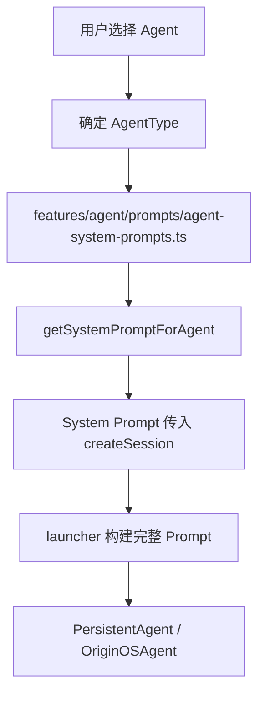

# F11：Agent Prompts —— 通用角色 Prompt 与项目访谈 Prompt

## 开篇场景

默认 Agent（产品经理、架构师、开发者等）一开口就知道自己该扮演什么角色；项目初始化 Agent 会按固定流程问 3 个问题。这些行为不是 LLM 自己“悟”出来的，而是由**系统 Prompt** 预先定义的。

`features/agent/prompts/` 目录下有两个文件：

- `agent-system-prompts.ts`：为每个默认 `AgentType` 定义角色 Prompt。
- `project-interview.ts`：定义项目访谈 Agent 的系统 Prompt 和元数据解析器。

这节课看 Prompt 如何被组织、如何被选择、如何与 Agent 类型绑定。

## 核心问题

**Prompt 为什么要放在 `features/agent/prompts/` 而不是直接写在 `pi-agent` 集成层？Prompt 与 Agent 类型的映射关系是什么？**

## 概念阶梯

**System Prompt**：给 LLM 的顶层指令，定义角色、行为、约束、输出格式。

**AgentType**：Agent 的分类枚举，如 `PM`、`ARCHITECT`、`DEVELOPER`、`PROJECT_INITIALIZER`。

**Prompt Registry**：把 AgentType 映射到对应 Prompt 的数据结构，如 `AGENT_SYSTEM_PROMPTS`。

**Interview Metadata**：项目访谈中 LLM 返回的结构化标记，用于前端更新进度和收集答案。

## 图解：Prompt 在 Agent 启动中的位置



**图后解释**：

- Prompt 在功能层定义，与产品角色对应；
- Launcher 会根据 AgentType 选择是否使用这些 Prompt，或加载角色目录下的 `Agent.md`；
- 对于简单默认 Agent，直接用 `AGENT_SYSTEM_PROMPTS`；对于 RoleAgent/ProjectAgent，可能用更复杂的 7 层 Prompt。

## 源码精读

### 1. AGENT_SYSTEM_PROMPTS：角色 Prompt 映射表

[packages/core/src/lib/features/agent/prompts/agent-system-prompts.ts 第 8—56 行](../../../../packages/core/src/lib/features/agent/prompts/agent-system-prompts.ts#L8)

```typescript
export const AGENT_SYSTEM_PROMPTS: Record<AgentType, string> = {
  [AgentType.PM]: `你是一位专业的产品经理...`,
  [AgentType.ARCHITECT]: `你是一位资深的系统架构师...`,
  [AgentType.UX_DESIGNER]: `你是一位专业的 UX 设计师...`,
  [AgentType.DEVELOPER]: `你是一位经验丰富的开发工程师...`,
  [AgentType.QA_ENGINEER]: `你是一位专业的 QA 测试工程师...`,
  [AgentType.PROJECT_INITIALIZER]: `你是一位项目初始化助手...`,
};
```

每个 `AgentType` 对应一段中文角色描述，包含职责和行为要求。

### 2. getSystemPromptForAgent：类型适配器

[packages/core/src/lib/features/agent/prompts/agent-system-prompts.ts 第 62—76 行](../../../../packages/core/src/lib/features/agent/prompts/agent-system-prompts.ts#L62)

```typescript
export function getSystemPromptForAgent(agentType: string | AgentType): string {
  if (typeof agentType === 'string') {
    const normalizedType = agentType.toLowerCase();
    const matchedType = (Object.values(AgentType) as string[]).find(
      (type) => type.toLowerCase() === normalizedType
    );
    if (matchedType) {
      return AGENT_SYSTEM_PROMPTS[matchedType as AgentType] || AGENT_SYSTEM_PROMPTS[AgentType.DEVELOPER];
    }
  }

  return AGENT_SYSTEM_PROMPTS[agentType as AgentType] || AGENT_SYSTEM_PROMPTS[AgentType.DEVELOPER];
}
```

这个函数做了两件事：

1. **字符串归一化**：允许传入 `'pm'`、`'PM'`、`'pm-1'` 等字符串，通过小写匹配找到对应 `AgentType`。
2. **fallback 到 DEVELOPER**：如果找不到对应 Prompt，默认返回开发者 Prompt，避免空 Prompt。

**为什么需要字符串匹配？** 因为上层可能传的是 `AgentObject.name` 或 `agentType` 字符串，而不是严格枚举。

### 3. PROJECT_INTERVIEW_SYSTEM_PROMPT：项目访谈 Prompt

[packages/core/src/lib/features/agent/prompts/project-interview.ts 第 8—138 行](../../../../packages/core/src/lib/features/agent/prompts/project-interview.ts#L8)

```typescript
export const PROJECT_INTERVIEW_SYSTEM_PROMPT = `你是一个专业的项目访谈助手...

## 访谈目标
通过3个核心问题收集项目信息...

### 问题 1/3: 工作领域
...

### 问题 2/3: 工作模式
...

### 问题 3/3: 主要任务
...

## 响应格式
你的每次回复必须包含以下元数据（通过特殊标记）：

\`\`\`
[METADATA]
currentStep: <当前问题索引，0-2>
answers: { ... }
shouldGenerate: <true/false>
interviewComplete: <true/false>
[/METADATA]
\`\`\`
`;
```

这个 Prompt 的特殊之处在于：

1. **强制结构化输出**：要求 LLM 在每次回复后追加 `[METADATA]` 块。
2. **定义访谈流程**：3 个问题，循序渐进。
3. **提供示例对话**：让 LLM 理解预期的输出格式。
4. **进度提示**：要求 LLM 标注“问题 1/3”。

### 4. parseInterviewMetadata：解析元数据

[packages/core/src/lib/features/agent/prompts/project-interview.ts 第 143—190 行](../../../../packages/core/src/lib/features/agent/prompts/project-interview.ts#L143)

```typescript
export function parseInterviewMetadata(content: string): {
  currentStep?: number;
  answers?: Record<string, string>;
  shouldGenerate?: boolean;
  interviewComplete?: boolean;
} | null {
  const metadataMatch = content.match(/\[METADATA\]([\s\S]*?)\[\/METADATA\]/);
  if (!metadataMatch) return null;

  const metadataText = metadataMatch[1];
  const metadata: any = {};

  const stepMatch = metadataText.match(/currentStep:\s*(\d+)/);
  if (stepMatch) metadata.currentStep = parseInt(stepMatch[1], 10);

  const answersMatch = metadataText.match(/answers:\s*\{([^}]*)\}/s);
  if (answersMatch) {
    // 解析 work_domain, work_mode, main_tasks
  }

  const generateMatch = metadataText.match(/shouldGenerate:\s*(true|false)/);
  if (generateMatch) metadata.shouldGenerate = generateMatch[1] === 'true';

  const completeMatch = metadataText.match(/interviewComplete:\s*(true|false)/);
  if (completeMatch) metadata.interviewComplete = completeMatch[1] === 'true';

  return metadata;
}
```

这个解析器从 LLM 回复中提取：

- `currentStep`：当前问题索引（0-2，完成时为 3）。
- `answers`：用户给出的三个答案。
- `shouldGenerate`：是否可以生成本体。
- `interviewComplete`：访谈是否完成。

### 5. cleanInterviewContent：清理显示内容

[packages/core/src/lib/features/agent/prompts/project-interview.ts 第 195—197 行](../../../../packages/core/src/lib/features/agent/prompts/project-interview.ts#L195)

```typescript
export function cleanInterviewContent(content: string): string {
  return content.replace(/\[METADATA\][\s\S]*?\[\/METADATA\]/g, '').trim();
}
```

UI 显示时，需要把 `[METADATA]` 块去掉，只保留自然语言回复。

## 真实调用链

项目访谈 Prompt 的使用流程：

1. 用户点击“项目初始化”或某个项目访谈入口。
2. 系统选择 `PROJECT_INTERVIEW_SYSTEM_PROMPT` 作为 system prompt。
3. LLM 按 Prompt 要求逐问 3 个问题，每次回复附带 `[METADATA]`。
4. 前端或中间层调用 `parseInterviewMetadata` 提取进度和答案。
5. 当 `shouldGenerate === true` 时，触发本体生成逻辑。
6. UI 调用 `cleanInterviewContent` 显示干净的对话文本。

## 关键类型与数据示例

### LLM 回复示例

```text
明白了，电商领域。

问题 2/3：你的工作模式是怎样的？比如：团队协作、个人开发、远程办公等

[METADATA]
currentStep: 1
answers: {
  work_domain: "电商"
}
shouldGenerate: false
interviewComplete: false
[/METADATA]
```

### 解析结果

```typescript
{
  currentStep: 1,
  answers: { work_domain: '电商' },
  shouldGenerate: false,
  interviewComplete: false,
}
```

### 清理后的显示内容

```text
明白了，电商领域。

问题 2/3：你的工作模式是怎样的？比如：团队协作、个人开发、远程办公等
```

## 失败路径与边界

| 场景 | 会发生什么 | 原因 |
|---|---|---|
| LLM 未输出 `[METADATA]` | `parseInterviewMetadata` 返回 null | 正则匹配失败 |
| `currentStep` 格式错误 | 返回 undefined | 正则未命中 |
| `answers` 包含大括号嵌套 | 解析可能不完整 | 正则 `([^}]*)` 不支持嵌套 |
| `agentType` 字符串无法匹配 | fallback 到 DEVELOPER Prompt | `getSystemPromptForAgent` 的兜底 |
| `PROJECT_INITIALIZER` Prompt 未命中 | 用通用开发者 Prompt | 回退逻辑 |

**一个关键边界**：`parseInterviewMetadata` 用正则解析伪 YAML/JSON，对 LLM 输出格式要求较高。如果 LLM 不遵循格式，整个访谈进度会失效。生产环境中应考虑用 function calling 或更严格的输出 schema。

## 测试证据

- `agent-system-prompts.ts` 和 `project-interview.ts` 当前无直接测试。
- 缺口说明：建议补测试覆盖 `getSystemPromptForAgent` 的字符串匹配和 fallback、`parseInterviewMetadata` 的正常解析和缺失 metadata、`cleanInterviewContent` 的清理效果。

## 练习与验收

1. **Prompt 映射**：传入 `'architect'`、`'ARCHITECT'`、`AgentType.ARCHITECT`，验证 `getSystemPromptForAgent` 返回相同 Prompt。
2. **未知类型 fallback**：传入 `'unknown'`，验证返回 DEVELOPER Prompt。
3. **Metadata 解析**：用上面示例文本调用 `parseInterviewMetadata`，确认字段正确。
4. **清理内容**：用带 METADATA 的文本调用 `cleanInterviewContent`，确认 METADATA 块被完全移除。
5. **边界测试**：构造 LLM 输出缺少 `shouldGenerate` 的文本，验证 `parseInterviewMetadata` 返回的对象不包含该字段。

**验收标准**：能解释 Prompt 与 AgentType 的映射关系，能独立解析项目访谈的 METADATA 并清理显示内容。

## 章节收束

本节课看了 `features/agent/prompts/` 下的两个 Prompt 文件。它们定义了默认 Agent 的角色行为和项目访谈的结构化流程。

到这里，`features/agent` 的内容讲完了。F.1 单元的核心脉络是：

1. `index.ts` 暴露公共 API；
2. `defaults.ts` 定义默认 Agent；
3. `registry.ts` 验证 Agent 并同步到 Dock；
4. `session-service.ts` 管理会话 CRUD 和消息；
5. `project-agent.ts` 实现项目初始化工作流，包含 Taste 和 Accumulation；
6. `prompts/*` 定义角色 Prompt 和项目访谈 Prompt。

下节课（F12）开始 F.1 单元的另一部分：`features/skills` 框架。
