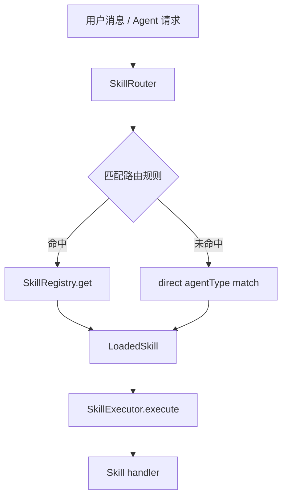

# F12：Skill Registry 与 Router

## 开篇场景

OriginOS 里有很多种 Skill：创建 Agent、角色市场、任务管理、知识图谱编辑、项目初始化……用户在首页点击不同入口，系统怎么知道应该调用哪个 Skill？

答案是 `features/skills/registry.ts`。它维护一个 Skill 注册表，并提供路由规则：根据用户消息或 Agent 类型，决定把请求交给哪个 Skill 处理。

## 核心问题

**为什么 Skill 需要独立的 Registry 和 Router，而不是像 Agent 那样直接通过函数调用？Registry、Router、Service、Executor 之间是什么关系？**

## 概念阶梯

**SkillRegistry**：Skill 的注册表，保存 `name → LoadedSkill` 的映射。支持 register、unregister、get、list、has。

**SkillRouter**：根据 `SkillRoutingRequest` 和路由规则，选择匹配的 Skill。支持按优先级排序的规则。

**LoadedSkill**：已加载的 Skill，包含 `metadata`（元数据）和 `handler`（执行函数）。

**SkillRoutingRule**：路由规则，包含 `condition`、`skillName`、`priority`。

## 图解：Skill 框架组件关系



**图后解释**：

- `SkillRouter` 负责“选哪个 Skill”；
- `SkillRegistry` 负责“有没有这个 Skill”；
- `SkillExecutor` 负责“怎么执行”；
- `Service` 负责“对外 API 和会话管理”。

## 源码精读

### 1. DefaultSkillRegistry：Skill 注册表

[packages/core/src/lib/features/skills/registry.ts 第 19—41 行](../../../../packages/core/src/lib/features/skills/registry.ts#L19)

```typescript
class DefaultSkillRegistry implements SkillRegistry {
  private skills = new Map<string, LoadedSkill>();

  register(skill: LoadedSkill): void {
    this.skills.set(skill.metadata.name, skill);
  }

  unregister(skillName: string): void {
    this.skills.delete(skillName);
  }

  get(skillName: string): LoadedSkill | undefined {
    return this.skills.get(skillName);
  }

  list(): LoadedSkill[] {
    return Array.from(this.skills.values());
  }

  has(skillName: string): boolean {
    return this.skills.has(skillName);
  }
}
```

这是一个典型的内存注册表，用 `Map` 存储。Skill 通过 `register` 方法注册，通常在模块加载时自动完成（如 `project-initialization/loader.ts`）。

### 2. DefaultSkillRouter：Skill 路由器

[packages/core/src/lib/features/skills/registry.ts 第 47—83 行](../../../../packages/core/src/lib/features/skills/registry.ts#L47)

```typescript
class DefaultSkillRouter implements SkillRouter {
  private rules: Array<{ rule: SkillRoutingRule; priority: number }> = [];

  constructor(private registry: SkillRegistry) {}

  async route(request: SkillRoutingRequest): Promise<LoadedSkill | null> {
    const sortedRules = [...this.rules].sort((a, b) => b.priority - a.priority);

    for (const { rule } of sortedRules) {
      if (rule.condition(request)) {
        const skill = this.registry.get(rule.skillName);
        if (skill) {
          return skill;
        }
      }
    }

    if (request.agentType) {
      const skill = this.registry.get(request.agentType);
      if (skill) {
        return skill;
      }
    }

    return null;
  }

  registerRule(rule: SkillRoutingRule): void {
    this.rules.push({ rule, priority: rule.priority || 0 });
  }
}
```

路由逻辑：

1. 按优先级从高到低排序规则。
2. 依次执行 `condition(request)`，第一个返回 true 的规则命中。
3. 如果规则命中但 registry 中没有对应 Skill，继续尝试下一条规则。
4. 如果没有规则命中，直接按 `request.agentType` 查找 Skill。
5. 还找不到，返回 null。

### 3. 默认路由规则

[packages/core/src/lib/features/skills/registry.ts 第 93—122 行](../../../../packages/core/src/lib/features/skills/registry.ts#L93)

```typescript
skillRouter.registerRule({
  condition: (request) => {
    return !!(request.agentType === 'project-initialization' ||
           request.message?.toLowerCase().includes('create project') ||
           request.message?.toLowerCase().includes('new project'));
  },
  skillName: 'project-initialization',
  priority: 10,
});

skillRouter.registerRule({
  condition: (request) => {
    return !!(request.agentType === 'ontology' ||
           request.message?.toLowerCase().includes('ontology') ||
           request.message?.toLowerCase().includes('entity'));
  },
  skillName: 'ontology',
  priority: 5,
});

skillRouter.registerRule({
  condition: () => true,
  skillName: 'generic',
  priority: 0,
});
```

三条规则：

1. `project-initialization`：优先级 10，匹配项目初始化相关请求。
2. `ontology`：优先级 5，匹配本体相关请求。
3. `generic`：优先级 0，兜底通用聊天。

**注意**：这里的规则条件使用英文关键词匹配，而 Project Agent 可能收到中文消息。`agentDecisionMaker.decide` 有自己的意图检测，不一定依赖这里的 router。

## 真实调用链

Skill Router 被谁调用？

1. `features/skills/decision.ts#decideSkill` 构造 `SkillRoutingRequest` 调用 `skillRouter.route`。
2. `features/skills/executor.ts#createToolContext#callSkill` 动态 import router，实现 Skill 之间的嵌套调用。
3. 某些 launcher 可能直接根据 `agentType` 查 registry，不走 router。

## 关键类型与数据示例

### SkillRoutingRequest

```typescript
interface SkillRoutingRequest {
  message?: string;
  intent?: string;
  agentType?: string;
  context?: {
    sessionId?: string;
    currentPhase?: string;
  };
}
```

### LoadedSkill

```typescript
interface LoadedSkill {
  metadata: SkillMetadata;
  handler: (context: SkillContext) => Promise<SkillResult>;
}
```

## 失败路径与边界

| 场景 | 会发生什么 | 原因 |
|---|---|---|
| 注册了同名 Skill | 后注册的覆盖先注册的 | `Map.set` 行为 |
| 规则命中但 Skill 未注册 | 继续尝试下一条规则 | `if (skill) return skill` |
| 多条规则都命中 | 只执行优先级最高的 | 按 priority 排序 |
| `agentType` 为空且规则未命中 | 返回 null | fallback 也失败 |

**一个关键边界**：Registry 是内存中的，应用重启后需要重新注册 Skill。`project-initialization/loader.ts` 在模块 import 时自动注册，但其他 Skill 可能有不同的注册机制。

## 测试证据

- `registry.ts` 当前无直接单元测试。
- 缺口说明：建议补测试覆盖 `register`/`get`/`has`、`route` 的优先级和 fallback、`registerRule` 的规则排序。

## 练习与验收

1. **注册一个 mock Skill**：创建一个 `LoadedSkill`，调用 `skillRegistry.register`，再用 `skillRegistry.get` 读取。
2. **路由优先级**：注册两条不同 priority 的规则，让它们同时命中一个请求，验证返回的是高优先级 Skill。
3. **agentType fallback**：不注册任何规则，只注册一个 Skill，然后调用 `skillRouter.route({ agentType: 'xxx' })`，验证是否返回该 Skill。
4. **循环依赖检查**：在 `executor.ts` 中搜索 `import('./registry')`，说明为什么用动态导入而不是静态导入。

**验收标准**：能解释 Registry 和 Router 的分工，能独立注册 Skill 和路由规则并验证匹配结果。

## 章节收束

本节课看了 Skill 框架的基础设施：Registry 负责存储，Router 负责选择。它们是 Skill 可以被动态发现和调度的前提。

下节课（F13）进入 `features/skills/service.ts`，看 Skill 服务的对外 API 和启动执行流程。
