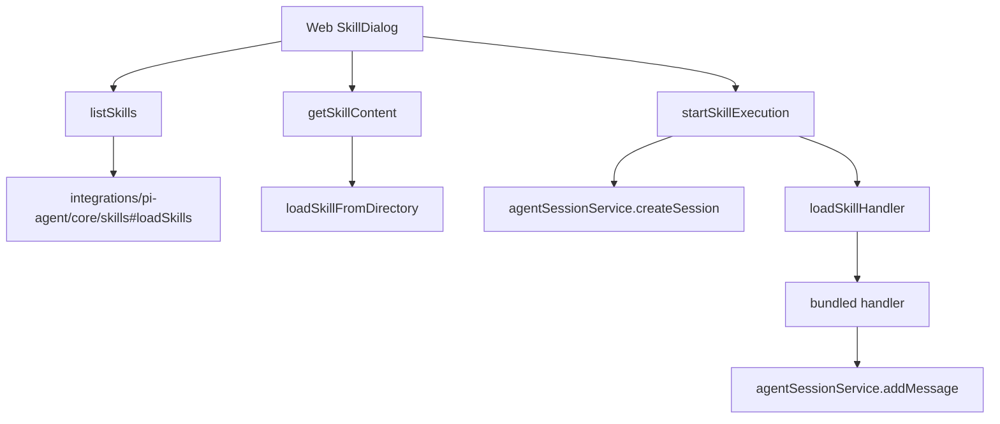

# F13：Skill Service —— 发现、内容读取与启动执行

## 开篇场景

用户在首页点击一个 Skill 卡片，前端需要先：

1. 获取这个 Skill 的列表信息（名字、描述、来源）；
2. 读取 Skill 的 Markdown 内容，展示给用户确认；
3. 确认后启动一次 Skill 执行，创建会话，调用 handler。

这些操作都在 `features/skills/service.ts` 中。这节课看前半部分：`listSkills`、`getSkillContent`、`getSkillDetail` 和 `startSkillExecution`。

## 核心问题

**`features/skills/service.ts` 和 `integrations/pi-agent/core/skills.ts`（Part E 讲过）都涉及 Skill 加载，它们的分工是什么？为什么 service 层还要再封装一次？**

## 概念阶梯

**Skill Discovery**：扫描并返回系统中可用的 Skill 列表，可能来自 bundled、project、user 等多种来源。

**SkillContentResponse**：Skill 内容响应，包含 Markdown 内容、`baseDir`、`workingDir`、`outputDir`、`systemManaged` 等。

**Skill Execution**：启动一次 Skill 运行，创建 `AgentSession`，调用 handler，把结果追加到会话。

**Working Directory**：Skill 运行时的工作目录，用于 bash 工具执行和认知文件写入。

**Output Directory**：Skill 产物输出目录，例如创建 Agent 时生成的文件放在这里。

## 图解：Skill Service 在调用链中的位置



**图后解释**：

- `service.ts` 是 Web 的直接调用层；
- 它委托 `core/skills.ts` 做真正的 Skill 加载；
- 它使用 `agentSessionService` 管理会话；
- bundled handler 被硬编码在 `loadSkillHandler` 中。

## 源码精读

### 1. listSkills：Skill 发现

[packages/core/src/lib/features/skills/service.ts 第 455—477 行](../../../../packages/core/src/lib/features/skills/service.ts#L455)

```typescript
export function listSkills(request: SkillListRequest = {}): SkillListResponse {
  const {
    source,
    includeInvisible = false,
    includeDiagnostics = true,
  } = request;

  const result = loadSkills({ includeDefaults: true });
  let skills = result.skills;

  if (source) {
    skills = skills.filter((skill) => skill.source === source);
  }

  if (!includeInvisible) {
    skills = skills.filter((skill) => !skill.disableModelInvocation);
  }

  return {
    skills: skills.map(toListItem),
    diagnostics: includeDiagnostics ? result.diagnostics : [],
  };
}
```

关键点：

1. 调用 `loadSkills({ includeDefaults: true })` 获取所有 Skill（来自 `core/skills.ts`）。
2. 可按 `source` 过滤（bundled / project / user）。
3. `includeInvisible` 控制是否返回 `disableModelInvocation` 的 Skill。
4. 返回诊断信息，帮助排查 Skill 加载问题。

### 2. getSkillContent：读取 Skill 内容

[packages/core/src/lib/features/skills/service.ts 第 488—511 行](../../../../packages/core/src/lib/features/skills/service.ts#L488)

```typescript
export function getSkillContent(request: SkillContentRequest): SkillContentResponse {
  const skill = findSkillForContent(request.name);

  if (!skill) {
    throw new SkillServiceError('NOT_FOUND', `Skill "${request.name}" not found`, 404);
  }

  const content = readFileSync(skill.filePath, 'utf-8');
  const workingDir = resolveSkillWorkingDirectory(skill);
  const outputDir = resolveSkillOutputDir(skill);

  const response: SkillContentResponse = {
    content,
    baseDir: skill.baseDir,
    workingDir,
    outputDir,
    systemManaged: skill.systemManaged === true,
  };

  if (request.includeFrontmatter) {
    response.frontmatter = parseFrontmatter(content).frontmatter;
  }

  return response;
}
```

这个方法返回 Skill 的完整内容，同时解析出工作目录和产物目录。

**`findSkillForContent`** 的查找顺序：

1. 先从 `data/skills/{name}` 查找用户自定义 Skill；
2. 再从 bundled Skill 中查找；
3. 最后尝试 `materializeBundledSkill` 物化系统内置 Skill。

### 3. 工作目录与产物目录解析

[packages/core/src/lib/features/skills/service.ts 第 171—210 行](../../../../packages/core/src/lib/features/skills/service.ts#L171)

```typescript
function resolveSkillWorkingDirectory(skill: Skill): string {
  const skillCode = skill.code ?? skill.name;
  const dir = skill.source === 'bundled'
    ? path.join(getDataRoot(), 'skills', skillCode)
    : skill.baseDir;
  if (!existsSync(dir)) {
    mkdirSync(dir, { recursive: true });
  }
  return dir;
}

function resolveSkillOutputDir(skill: Skill): string {
  const workingDir = resolveSkillWorkingDirectory(skill);
  if (skill.outputDir) {
    return resolveOutputDirFromFrontmatter(skill.outputDir);
  }
  return workingDir;
}
```

- bundled Skill 的工作目录在 `data/web/skills/{skillCode}`；
- project/user Skill 的工作目录是 `skill.baseDir`；
- 如果 frontmatter 指定了 `outputDir`，基于数据根目录解析；
- 否则产物目录等于工作目录。

### 4. startSkillExecution：启动 Skill 执行

[packages/core/src/lib/features/skills/service.ts 第 561—696 行](../../../../packages/core/src/lib/features/skills/service.ts#L561)

```typescript
export async function startSkillExecution(
  request: SkillExecutionStartRequest,
): Promise<{ status: number; data: SkillExecutionStartResponse }> {
  const skillName = request.skillName;
  if (!skillName) {
    throw new SkillServiceError('INVALID_REQUEST', 'skillName is required', 400);
  }

  const skill = findSkill(skillName);
  if (!skill) {
    throw new SkillServiceError('NOT_FOUND', `Skill "${skillName}" not found`, 404);
  }

  const loadedSkill = loadSkillHandler(skillName);
  if (!loadedSkill) {
    throw new SkillServiceError('NOT_FOUND', `Skill "${skillName}" not found`, 404);
  }
  // ...
}
```

启动流程：

1. 校验 `skillName`。
2. `findSkill` 找到 Skill 元数据。
3. `loadSkillHandler` 加载 bundled handler。
4. 如果没有传 `sessionId`，创建一个新的 `AgentSession`。
5. 构造 `SkillContext`。
6. 写入 system message 标记 Skill 启动。
7. 如果有输入数据，调用 handler。
8. 根据 handler 结果决定返回 `completed` 还是 `running`。

### 5. Skill Context 构造

[packages/core/src/lib/features/skills/service.ts 第 609—631 行](../../../../packages/core/src/lib/features/skills/service.ts#L609)

```typescript
const skillContext: SkillContext = {
  sessionId,
  session: {
    projectContext: {
      projectId: session.projectContext.projectId || `skill-${skillName}`,
      projectName: session.projectContext.projectName || `Skill: ${skillName}`,
      ontologyId: session.projectContext.ontologyId,
      currentPath: session.projectContext.currentPath,
      userId: session.projectContext.userId,
    },
    messages: session.messages,
  },
  input: {
    message: typeof inputData === 'string' ? inputData : undefined,
    data: typeof inputData === 'object' && inputData !== null
      ? inputData as Record<string, unknown>
      : undefined,
  },
  tools: createSkillContextTools(),
  config: typeof request.config === 'object' && request.config !== null
    ? request.config as Record<string, unknown>
    : undefined,
};
```

`SkillContext` 是 handler 的输入，包含：

- `sessionId` 和精简后的 `session`；
- `input`：字符串消息或对象数据；
- `tools`：Skill 可使用的本体操作工具；
- `config`：额外配置。

### 6. bundled handler 的硬编码加载

[packages/core/src/lib/features/skills/service.ts 第 337—360 行](../../../../packages/core/src/lib/features/skills/service.ts#L337)

```typescript
function loadSkillHandler(skillName: string): { handler: ...; displayName: string } | null {
  switch (skillName) {
    case 'task-manager':
      return { handler: taskManagerHandler, displayName: '任务助手' };
    case 'info-query':
      return { handler: infoQueryHandler, displayName: '信息查询' };
    case 'ontology-editor':
      return { handler: ontologyEditorHandler, displayName: '知识图谱编辑' };
    default:
      return null;
  }
}
```

目前只有三个 bundled handler 被硬编码加载。`project-initialization` 不是通过这里加载，而是通过 `project-initialization/loader.ts` 注册到 `skillRegistry`，再由 `skillExecutor` 执行。

## 关键类型与数据示例

### SkillExecutionStartRequest

```typescript
interface SkillExecutionStartRequest {
  skillName?: string;
  sessionId?: string;
  data?: unknown;
  args?: unknown;
  config?: unknown;
  input?: unknown;
}
```

### SkillContentResponse

```typescript
interface SkillContentResponse {
  content: string;
  baseDir: string;
  workingDir: string;
  outputDir: string;
  systemManaged: boolean;
  frontmatter?: SkillFrontmatter;
}
```

## 失败路径与边界

| 场景 | 会发生什么 | 原因 |
|---|---|---|
| `skillName` 为空 | 400 INVALID_REQUEST | 显式校验 |
| Skill 不存在 | 404 NOT_FOUND | `findSkill` 失败 |
| 有 Skill 元数据但无 handler | 404 NOT_FOUND | `loadSkillHandler` 返回 null |
| 传入的 `sessionId` 不存在 | 404 INVALID_REQUEST | 先 `getSession` 检查 |
| bundled Skill 工作目录不存在 | 自动创建 | `mkdirSync` recursive |

**一个关键边界**：`loadSkillHandler` 只支持三个特定 bundled handler。如果新增了一个 bundled Skill 但没有在这里注册，调用 `startSkillExecution` 会 404，即使 `listSkills` 能看到它。

## 测试证据

- `features/skills/__tests__/service.test.ts` 存在，覆盖了部分 service 行为。
- 建议验证：测试是否覆盖 `startSkillExecution` 的创建会话路径、handler 成功/失败路径、`getSkillContent` 的目录解析。

## 练习与验收

1. **Skill 发现**：调用 `listSkills()`，观察返回的 Skill 数量和来源分布。
2. **内容读取**：调用 `getSkillContent({ name: 'agent-creator', includeFrontmatter: true })`，检查 `workingDir`、`outputDir`、`frontmatter`。
3. **启动执行**：调用 `startSkillExecution({ skillName: 'task-manager', data: '...' })`，观察会话文件中的消息。
4. **handler 缺口**：尝试调用一个 `listSkills` 返回但 `loadSkillHandler` 不支持的 Skill，观察错误。

**验收标准**：能解释 Skill Service 与 core Skill 加载的分工，能独立启动一次 Skill 执行并验证会话和目录。

## 章节收束

本节课看了 Skill Service 的发现、读取和启动能力。它是 Web 与 Skill 框架之间的主要接口。

下节课（F14）会继续看 Skill Service 的对话流：同步消息发送、流式消息发送、timeline、完成。
