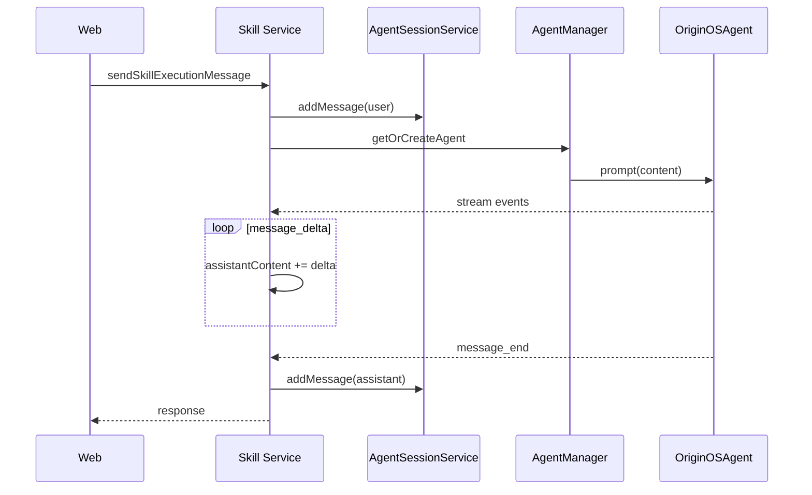

# F14：Skill Service —— 对话、流式输出与执行生命周期

## 开篇场景

Skill 启动后，用户通常会继续对话。比如“创建 Agent” Skill 启动后，Agent 会问用户想要什么样的 Agent，用户回复后需要：

1. 把用户消息追加到会话；
2. 调用 LLM 生成回复；
3. 流式返回给前端；
4. 把最终 assistant 消息落盘。

`features/skills/service.ts#sendSkillExecutionMessage` 和 `streamSkillExecutionMessage` 就是处理这个对话流的。这节课看它们，以及 `completeSkillExecution` 和 `getSkillExecutionTimeline`。

## 核心问题

**Skill 的对话流为什么要复用 `agentManager.getOrCreateAgent`，而不是每个 Skill 自己创建 OriginOSAgent？流式返回是如何被处理和去重的？**

## 概念阶梯

**SkillExecutionMessageRequest**：继续 Skill 对话的请求，包含 `executionId`、`sessionId`、`content`、`role`、`metadata`。

**AgentStreamEvent**：`OriginOSAgent` 产生的事件，如 `message_delta`、`message_end`、`agent_error`。

**Stream Dedupe**：流式返回中，增量文本可能重复或需要合并，`getVisibleStreamDelta` 和 `reconcileFinalStreamContent` 处理这个问题。

**Execution Timeline**：把会话消息转换成时间线事件（start、message、tool、error、end）。

## 图解：Skill 对话流



## 源码精读

### 1. sendSkillExecutionMessage：同步封装流式

[packages/core/src/lib/features/skills/service.ts 第 771—909 行](../../../../packages/core/src/lib/features/skills/service.ts#L771)

```typescript
export async function sendSkillExecutionMessage(
  request: SkillExecutionMessageRequest,
): Promise<{ status: number; data: SkillExecutionMessageResponse; error?: { code: string; message: string } }> {
  // 校验 request...
  const updatedSession = await agentSessionService.addMessage(request.sessionId, {
    role: request.role || 'user',
    content: request.content,
    metadata: {
      ...request.metadata,
      executionId: request.executionId,
    },
  });

  const skillName = getMessageSkillName(session);
  const agent = await agentManager.getOrCreateAgent(
    request.sessionId,
    session.projectContext.projectId,
    {
      systemPrompt: `You are executing skill: ${skillName}\n\nProcess user input and respond appropriately for the skill context.`,
      agentType: 'skill',
      agentBaseDir: session.projectContext.currentPath,
      outputDir: session.projectContext.outputDir,
    },
  );

  // subscribe to events, accumulate assistantContent
  await agent.prompt(request.content);

  // add assistant message to session
  if (assistantContent) {
    await agentSessionService.addMessage(request.sessionId, {
      role: 'assistant',
      content: assistantContent,
      metadata: { skillName, executionId: request.executionId },
    });
  }

  return { status, data, error };
}
```

关键点：

1. 先追加用户消息。
2. 根据 session 中第一条 system message 的 `metadata.skillName` 获取 Skill 名。
3. 用 `agentManager.getOrCreateAgent` 获取或创建 Agent 实例。
4. 订阅流式事件，累加 `assistantContent`。
5. 流结束后把 assistant 消息落盘。

### 2. 流式事件处理

[packages/core/src/lib/features/skills/service.ts 第 817—845 行](../../../../packages/core/src/lib/features/skills/service.ts#L817)

```typescript
const unsubscribe = agent.subscribe((event: unknown) => {
  const eventData = event as {
    type?: string;
    delta?: { text?: string };
    message?: { content?: unknown };
    error?: { message?: string };
  };

  switch (eventData?.type) {
    case 'message_delta':
      if (eventData.delta?.text) {
        assistantContent = getVisibleStreamDelta(assistantContent, eventData.delta.text).content;
      }
      break;
    case 'message_end': {
      if (eventData.message?.content) {
        const content = extractTextContent(eventData.message.content);
        if (content) {
          assistantContent = reconcileFinalStreamContent(assistantContent, content);
        }
      }
      break;
    }
    case 'agent_error':
      hasError = true;
      errorMessage = eventData.error?.message || 'Unknown error';
      break;
  }
});
```

这里处理了三种事件：

- `message_delta`：增量文本，用 `getVisibleStreamDelta` 合并。
- `message_end`：消息结束，用 `reconcileFinalStreamContent` 与最终内容对齐。
- `agent_error`：标记错误。

### 3. streamSkillExecutionMessage：直接流式输出

[packages/core/src/lib/features/skills/service.ts 第 911—1046 行](../../../../packages/core/src/lib/features/skills/service.ts#L911)

```typescript
export async function streamSkillExecutionMessage(
  request: SkillExecutionStreamRequest,
  emit: (event: SkillExecutionStreamEvent) => void | Promise<void>,
): Promise<void> {
  // ... 校验和 addMessage ...

  const unsubscribe = agent.subscribe((event: unknown) => {
    const eventData = event as AgentStreamEvent;

    switch (eventData?.type) {
      case 'message_delta':
        // emit assistant_message with delta
        break;
      case 'message_end':
        // add assistant message to session, emit final
        break;
      case 'agent_error':
        // emit error
        break;
    }
  });

  await agent.prompt(request.content);
  await Promise.all(pendingEmits);
  await emit({ type: 'done', data: null });
}
```

这个函数把流式事件通过 `emit` 回调直接推送给调用方（通常是 Web API 的 SSE Response）。

**`pendingEmits` 队列**：因为 `emit` 可能是异步的，用一个队列保存所有 `emit` Promise，最后 `Promise.all` 确保全部发送完成。

### 4. completeSkillExecution 与 Timeline

[packages/core/src/lib/features/skills/service.ts 第 698—740 行](../../../../packages/core/src/lib/features/skills/service.ts#L698)

```typescript
export async function completeSkillExecution(
  request: SkillExecutionCompleteRequest,
): Promise<SkillExecutionCompleteResponse> {
  // 校验 ...
  await agentSessionService.updateSession(request.sessionId, { status });
  await agentSessionService.addMessage(request.sessionId, {
    role: 'system',
    content: `[Skill] Execution ${status}: ${skillName}`,
    metadata: { skillName, executionId: request.executionId, status, endedAt },
  });

  return {
    success: !request.cancelled,
    status,
    endedAt,
    summary: { totalMessages: session.messages.length, duration },
  };
}
```

完成时：更新会话状态、追加 system message、返回摘要。

[packages/core/src/lib/features/skills/service.ts 第 742—769 行](../../../../packages/core/src/lib/features/skills/service.ts#L742)

```typescript
export async function getSkillExecutionTimeline(
  request: SkillExecutionTimelineRequest,
): Promise<SkillExecutionTimelineResponse> {
  const session = await agentSessionService.getSession(request.sessionId);
  // ...
  return {
    executionId: request.executionId,
    skillName: getMessageSkillName(session),
    startedAt: new Date(session.createdAt).toISOString(),
    status,
    endedAt,
    timeline: messagesToTimeline(session.messages),
  };
}
```

Timeline 把会话消息转成可视化事件流。

## 关键类型与数据示例

### SkillExecutionStreamEvent

```typescript
interface SkillExecutionStreamEvent {
  executionId: string;
  type: 'user_message' | 'assistant_message' | 'error' | 'done';
  data: unknown;
}
```

### Timeline 事件示例

```typescript
[
  { type: 'start', timestamp: '...', data: { status: 'running' } },
  { type: 'message', timestamp: '...', data: { role: 'user', content: '...' } },
  { type: 'message', timestamp: '...', data: { role: 'assistant', content: '...' } },
  { type: 'end', timestamp: '...', data: { status: 'completed' } },
]
```

## 失败路径与边界

| 场景 | 会发生什么 | 原因 |
|---|---|---|
| `sessionId` 为空 | 400 INVALID_REQUEST | 显式校验 |
| Agent 订阅过程中出错 | `hasError` 标记，返回 500 | `agent_error` 事件 |
| `prompt()` 抛错 | 返回 LLM_ERROR | try/catch |
| 流式 emit 失败 | 可能丢失事件 | 调用方负责处理 |

**一个关键边界**：`sendSkillExecutionMessage` 虽然内部是流式的，但对外是同步返回完整内容。Web API 如果要真正流式推送给浏览器，应该调用 `streamSkillExecutionMessage`。

## 测试证据

- `service.test.ts` 可能覆盖了 `sendSkillExecutionMessage` 和 `streamSkillExecutionMessage`。
- 缺口说明：如果没有覆盖流式事件处理，建议补 mock Agent 事件的测试。

## 练习与验收

1. **同步消息**：调用 `sendSkillExecutionMessage`，验证返回的 assistant 消息是否落盘。
2. **流式模拟**：用 mock `emit` 函数调用 `streamSkillExecutionMessage`，验证收到 `user_message`、`assistant_message`、`done` 事件。
3. **Timeline 查看**：启动一次 Skill 对话后，调用 `getSkillExecutionTimeline`，检查事件顺序。
4. **完成执行**：调用 `completeSkillExecution`，验证会话状态变为 `completed`。

**验收标准**：能解释 Skill 对话流的同步与流式两种模式，能独立完成一次 Skill 对话并查看 timeline。

## 章节收束

本节课看了 Skill Service 的对话能力。Skill 启动后，真正的 LLM 交互由 `agentManager.getOrCreateAgent` 复用 Part E 的运行时，但会话管理、流式封装、生命周期收尾由 Skill Service 负责。

下节课（F15）进入 Skill Executor 和 Decision Maker。
