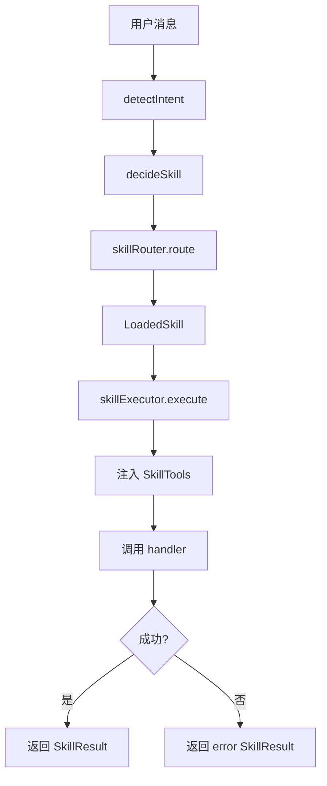

# F15：Skill Executor 与 Decision Maker

## 开篇场景

`SkillRouter` 已经选好了 Skill，接下来要执行它。执行时需要：

1. 给 Skill handler 注入可用的工具（如创建本体实体、查询实体、调用其他 Skill）；
2. 捕获 handler 中的异常，包装成统一的 `SkillResult`；
3. 如果 Skill 内部想调用另一个 Skill，提供 `callSkill` 工具。

同时，在调用 Router 之前，系统需要先判断用户意图。`decision.ts` 就是做这个意图检测和决策的。

这节课看 `features/skills/executor.ts` 和 `decision.ts`。

## 核心问题

**`decideSkill` 用基于规则的关键词匹配，`SkillExecutor` 用注入工具执行 handler。这种“规则决策 + handler 执行”的组合有什么优势？又有什么局限？**

## 概念阶梯

**SkillExecutor**：执行已加载 Skill 的组件，负责工具注入、异常捕获、结果包装。

**SkillTools**：Skill handler 可调用的工具集，包括 `createEntity`、`updateEntity`、`queryEntities`、`getRelated`、`callSkill`。

**Intent Detection**：从用户消息中提取意图，如 `CREATE_PROJECT`、`EDIT_ONTOLOGY`、`MANAGE_TASKS`。

**AgentDecisionMaker**：维护决策历史，支持在复合 Skill 中保持上下文，避免频繁切换。

## 图解：决策与执行的分层



## 源码精读

### 1. SkillExecutor.execute

[packages/core/src/lib/features/skills/executor.ts 第 19—43 行](../../../../packages/core/src/lib/features/skills/executor.ts#L19)

```typescript
class SkillExecutor {
  async execute(skill: LoadedSkill, context: SkillContext): Promise<SkillResult> {
    const enhancedContext: SkillContext = {
      ...context,
      tools: this.createToolContext(context.sessionId),
    };

    try {
      const result = await skill.handler(enhancedContext);
      return result;
    } catch (error) {
      return {
        success: false,
        error: {
          code: 'SKILL_EXECUTION_ERROR',
          message: error instanceof Error ? error.message : 'Unknown error',
          details: error,
        },
      };
    }
  }
}
```

执行逻辑：

1. 复制 context，注入 `tools`。
2. 调用 `skill.handler(enhancedContext)`。
3. 如果 handler 抛错，返回 `success: false` 的 `SkillResult`，而不是让异常向上传播。

### 2. 工具上下文

[packages/core/src/lib/features/skills/executor.ts 第 48—119 行](../../../../packages/core/src/lib/features/skills/executor.ts#L48)

```typescript
private createToolContext(_sessionId: string): SkillTools {
  return {
    createEntity: async (type, properties) => {
      return await ontologyClient.createEntity(type, properties);
    },
    updateEntity: async (entityId, properties) => {
      return await ontologyClient.updateEntity(entityId, properties);
    },
    createRelation: async (fromId, relType, toId, properties) => {
      return await ontologyClient.createRelation(fromId, relType, toId, properties);
    },
    queryEntities: async (type, where) => {
      return await ontologyClient.queryEntities(type, where);
    },
    getRelated: async (entityId, relType, direction) => {
      return await ontologyClient.getRelated(entityId, relType, direction);
    },
    callSkill: async (skillName, input) => {
      const { skillRouter } = await import('./registry');
      const skill = await skillRouter.route({ agentType: skillName, message: ... });
      if (skill) {
        return await this.execute(skill, context);
      }
      return { success: false, error: { code: 'SKILL_NOT_FOUND', message: ... } };
    },
  };
}
```

工具集分两类：

1. **本体操作**：CRUD 实体和关系，由 `ontologyClient` 实现。
2. **Skill 互调**：`callSkill` 让 handler 可以调用其他 Skill。

**`callSkill` 使用动态导入 `import('./registry')`**：避免 `executor.ts` 和 `registry.ts` 之间的循环依赖。

### 3. detectIntent：意图检测

[packages/core/src/lib/features/skills/decision.ts 第 41—118 行](../../../../packages/core/src/lib/features/skills/decision.ts#L41)

```typescript
export function detectIntent(message: string, _context?: {
  currentPhase?: string;
  sessionId?: string;
}): IntentMatch {
  const lowerMessage = message.toLowerCase();

  if (
    lowerMessage.includes('create project') ||
    lowerMessage.includes('new project') ||
    lowerMessage.includes('start a project') ||
    lowerMessage.includes('initialize project')
  ) {
    return {
      intent: Intent.CREATE_PROJECT,
      confidence: 0.9,
      suggestedSkill: 'project-initialization',
      reasoning: 'User explicitly mentions creating or starting a project',
    };
  }

  // ... ontology, task, query, fallback
}
```

基于英文关键词匹配。返回：

- `intent`：意图枚举值；
- `confidence`：置信度；
- `suggestedSkill`：建议的 Skill；
- `reasoning`：理由。

### 4. AgentDecisionMaker.decide

[packages/core/src/lib/features/skills/decision.ts 第 198—246 行](../../../../packages/core/src/lib/features/skills/decision.ts#L198)

```typescript
async decide(
  message: string,
  context: AgentDecisionContext = {},
): Promise<{
  skill: LoadedSkill | null;
  intent: Intent;
  reasoning: string;
  shouldSwitchSkill: boolean;
}> {
  // 如果当前在复合 Skill 中，保持上下文
  if (context.activeSkill && context.currentPhase) {
    const currentSkill = skillRegistry.get(context.activeSkill);
    if (currentSkill && currentSkill.metadata.type === SkillType.COMPOSITE) {
      const exitIndicators = ['stop', 'cancel', 'done', 'complete', 'finish'];
      const wantsToExit = exitIndicators.some(
        indicator => message.toLowerCase().includes(indicator),
      );

      if (!wantsToExit) {
        return {
          skill: currentSkill,
          intent: Intent.CHAT_GENERAL,
          reasoning: `Continuing in ${context.activeSkill} skill...`,
          shouldSwitchSkill: false,
        };
      }
    }
  }

  const decision = await decideSkill(message, context);
  this.recordDecision(message, decision);

  const shouldSwitchSkill = !context.activeSkill ||
    decision.intent.confidence > 0.8 ||
    decision.skill?.metadata.name !== context.activeSkill;

  return {
    skill: decision.skill,
    intent: decision.intent.intent,
    reasoning: decision.reasoning,
    shouldSwitchSkill,
  };
}
```

决策逻辑：

1. **复合 Skill 保持**：如果当前在复合 Skill 中，用户没有说退出词，就继续当前 Skill。
2. **意图检测**：否则调用 `decideSkill`。
3. **切换判断**：没有当前 Skill、置信度 > 0.8、或 decision 的 Skill 与当前不同，则切换。
4. **记录决策**：保存到 `decisionHistory`，用于后续 pattern 分析。

### 5. 决策历史与分析

[packages/core/src/lib/features/skills/decision.ts 第 251—279 行](../../../../packages/core/src/lib/features/skills/decision.ts#L251)

```typescript
private recordDecision(message: string, decision: ...): void {
  this.decisionHistory.push({
    timestamp: Date.now(),
    message,
    decision: decision.skill?.metadata.name || 'none',
    intent: decision.intent.intent as Intent,
    confidence: decision.intent.confidence,
  });

  if (this.decisionHistory.length > 100) {
    this.decisionHistory = this.decisionHistory.slice(-50);
  }
}

getDecisionHistory() { ... }

analyzePatterns() { ... }
```

维护最近 100 条决策，超过时保留后 50 条。提供 `analyzePatterns` 统计最常用 Skill、典型意图、平均置信度。

## 真实调用链

Project Agent 的 `sendMessage` 调用 `agentDecisionMaker.decide(message, context)`：

1. `decide` 检查是否在复合 Skill 中；
2. 调用 `decideSkill` → `detectIntent` + `skillRouter.route`；
3. 返回 `skill`、`intent`、`shouldSwitchSkill`；
4. Project Agent 根据结果调用 `skillExecutor.execute(skill, context)`；
5. `execute` 注入 tools，调用 handler；
6. handler 返回 `SkillResult`。

## 关键类型与数据示例

### IntentMatch

```typescript
interface IntentMatch {
  intent: Intent;
  confidence: number;
  suggestedSkill: string;
  reasoning: string;
}
```

### AgentDecisionContext

```typescript
interface AgentDecisionContext {
  conversationHistory?: Array<{ role: string; content: string }>;
  currentPhase?: string;
  activeSkill?: string;
  skillHistory?: string[];
  preferences?: Record<string, unknown>;
}
```

## 失败路径与边界

| 场景 | 会发生什么 | 原因 |
|---|---|---|
| 用户消息未命中任何意图 | fallback 到 `CHAT_GENERAL`，建议 `generic` Skill | 关键词未匹配 |
| 意图命中但 Skill 未注册 | `decideSkill` 返回 `skill: null` | router 找不到 |
| handler 抛错 | `SkillResult.success = false` | executor catch |
| 复合 Skill 中用户说 stop | 允许切换 | exit indicator 命中 |
| 中文消息 | 可能无法准确检测意图 | 关键词是英文 |

**一个关键边界**：当前意图检测只支持英文关键词，对中文用户不够友好。这是已知限制，MVP 阶段通过 `agentType` 或 `currentPhase` 优先匹配来弥补。

## 测试证据

- `decision.test.ts` 和 `executor.test.ts` 如果存在，会覆盖核心逻辑。
- 缺口说明：如果没有覆盖中文意图、复合 Skill 保持、handler 异常，建议补充。

## 练习与验收

1. **意图检测**：用英文消息测试 `detectIntent`，验证不同意图的返回。
2. **复合 Skill 保持**：构造 `activeSkill: 'project-initialization'`，`currentPhase: 'team'`，发送不包含退出词的消息，验证返回 `shouldSwitchSkill: false`。
3. **Skill 执行**：mock 一个 `LoadedSkill`，调用 `skillExecutor.execute`，验证 tools 被注入且 handler 收到它们。
4. **工具调用**：在 mock handler 中调用 `tools.createEntity`，验证 `ontologyClient.createEntity` 被调用。

**验收标准**：能解释 Skill Executor 的工具注入和 Decision Maker 的保持/切换逻辑，能独立 mock 测试执行流程。

## 章节收束

本节课看了 Skill 的决策与执行层。Decision Maker 决定调用哪个 Skill，Executor 负责安全地执行它并注入工具。

下节课（F16）看一个具体的复合 Skill：`project-initialization`。
