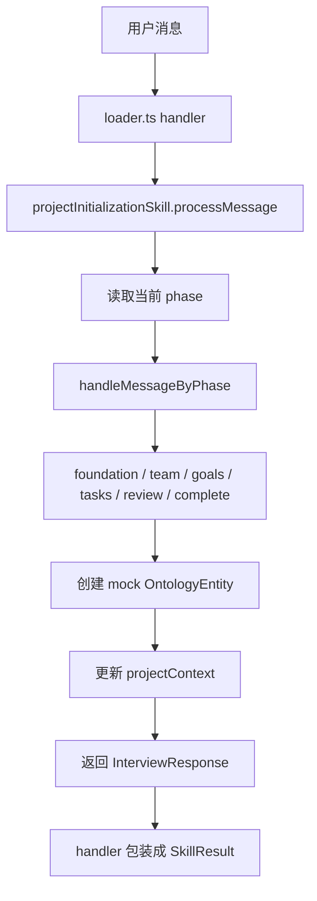

# F16：project-initialization Skill —— 从访谈到本体

## 开篇场景

用户说：“我想做一个电商后台。”

`project-initialization` Skill 会引导对话经历几个阶段：

1. **foundation**：收集项目基本信息，创建 Project 实体；
2. **team**：收集团队成员，创建 Person 实体；
3. **goals**：收集项目目标，创建 Goal 实体；
4. **tasks**：收集初始任务，创建 Task 实体；
5. **review**：展示总结，询问是否完成；
6. **complete**：完成项目初始化。

每个阶段根据用户输入创建对应的本体实体，并推进 `phase`。这节课看 `features/skills/project-initialization/index.ts` 和 `loader.ts`。

## 核心问题

**`project-initialization` 是一个复合 Skill，它的 handler 写在 TypeScript 里而不是 Markdown 里。这种“TS 实现的 Skill”与 bundled Markdown Skill 有什么不同？它如何利用 Skill 框架？**

## 概念阶梯

**Composite Skill**：由多个阶段组成、需要维护状态的 Skill，通常用代码实现复杂控制流。

**Interview Phase**：项目初始化中的阶段，如 `foundation`、`team`、`goals`、`tasks`、`review`、`complete`。

**Ontology Entity**：本体中的实体，如 Project、Person、Goal、Task。

**Loader**：在模块 import 时把 Skill 注册到 `skillRegistry` 的文件。

## 图解：project-initialization 的数据流



## 源码精读

### 1. loader.ts：把 TS Skill 注册到 Registry

[packages/core/src/lib/features/skills/project-initialization/loader.ts 第 13—77 行](../../../../packages/core/src/lib/features/skills/project-initialization/loader.ts#L13)

```typescript
const projectInitializationLoadedSkill: LoadedSkill = {
  metadata: {
    name: 'project-initialization',
    displayName: 'Project Initialization',
    description: 'Composite skill for project initialization...',
    type: SkillType.COMPOSITE,
    version: '1.0.0',
    priority: 'critical',
    dependencies: ['ontology'],
    reads: ['Project', 'Person', 'Task', 'Goal', 'Organization'],
    writes: ['Project', 'Person', 'Task', 'Goal', 'Action'],
    preconditions: ['User wants to create a new project'],
    postconditions: [
      'Created Project entity',
      'Created Person entities for team members',
      'Created Task entities from interview',
      'Relations established between entities',
    ],
  },

  handler: async (context: SkillContext): Promise<SkillResult> => {
    const { sessionId, input } = context;

    if (input.message) {
      const phase = context.skillData?.phase as string || 'foundation';
      const response = await projectInitializationSkill.processMessage(sessionId, input.message as string);

      return {
        success: true,
        message: response.message,
        nextPhase: response.phase,
        complete: response.complete,
        data: { response, phase: response.phase },
      };
    }

    const projectName = context.session.projectContext.projectName;
    const projectId = context.session.projectContext.projectId;
    const session = await projectInitializationSkill.initialize({ projectId, projectName });

    return {
      success: true,
      message: `Project initialization started for "${projectName}"`,
      data: { sessionId: session.sessionId, phase: 'foundation' },
    };
  },
};
```

关键点：

1. `metadata.type === SkillType.COMPOSITE`，告诉 Decision Maker 这是一个需要保持上下文的复合 Skill。
2. `handler` 根据 `input.message` 判断是初始化还是处理消息。
3. 把 `projectInitializationSkill` 的方法包装成 `SkillResult`。

[packages/core/src/lib/features/skills/project-initialization/loader.ts 第 82—89 行](../../../../packages/core/src/lib/features/skills/project-initialization/loader.ts#L82)

```typescript
export function registerProjectInitializationSkill(): void {
  skillRegistry.register(projectInitializationLoadedSkill);
}

registerProjectInitializationSkill();
```

模块 import 时自动注册。

### 2. ProjectInitializationSkill.initialize

[packages/core/src/lib/features/skills/project-initialization/index.ts 第 141—174 行](../../../../packages/core/src/lib/features/skills/project-initialization/index.ts#L141)

```typescript
async initialize(config: ProjectInitializationConfig): Promise<AgentSession> {
  const projectId = config.projectId || `proj_${uuidv4()}`;
  const sessionId = `session-${uuidv4()}`;

  const createRequest: CreateSessionRequest = {
    sessionId,
    projectId,
    projectName: config.projectName,
    agentType: SKILL_NAME,
    systemPrompt: config.customSystemPrompt || DEFAULT_SYSTEM_PROMPT,
    projectContext: {
      phase: 'foundation',
      ...config.initialContext,
    },
  };

  const session = await agentSessionService.createSession(createRequest);

  await agentSessionService.addMessage(session.sessionId, {
    role: 'system',
    content: `Project initialization skill loaded for project: ${config.projectName}`,
    toolResults: [],
  });

  await agentSessionService.addMessage(session.sessionId, {
    role: 'assistant',
    content: `Hello! I'd love to help you create a new project called "${config.projectName}"...`,
    toolResults: [],
  });

  return session;
}
```

与 `features/agent/project-agent.ts#startProject` 类似，但这里直接创建 Skill 自己的会话，不依赖 Project Agent。

### 3. processMessage 与阶段路由

[packages/core/src/lib/features/skills/project-initialization/index.ts 第 179—221 行](../../../../packages/core/src/lib/features/skills/project-initialization/index.ts#L179)

```typescript
async processMessage(sessionId: string, userMessage: string): Promise<InterviewResponse> {
  await agentSessionService.addMessage(sessionId, {
    role: 'user',
    content: userMessage,
    toolResults: [],
  });

  const session = await agentSessionService.getSession(sessionId);
  if (!session) {
    throw new Error(`Session not found: ${sessionId}`);
  }

  const currentPhase = (session.projectContext?.phase as InterviewPhase) || 'foundation';
  const response = await this.handleMessageByPhase(session, userMessage, currentPhase);

  await agentSessionService.addMessage(sessionId, {
    role: 'assistant',
    content: response.message,
    toolResults: response.entities_created?.map(e => ({
      toolCallId: `entity-${Date.now()}`,
      result: e,
    })) || [],
  });

  if (response.phase !== currentPhase) {
    await agentSessionService.updateSession(sessionId, {
      projectContext: {
        ...session.projectContext,
        phase: response.phase,
      },
    });
  }

  return response;
}
```

阶段路由：

1. 追加用户消息；
2. 获取当前 phase；
3. 调用 `handleMessageByPhase`；
4. 追加 assistant 消息；
5. 如果 phase 变化，更新会话上下文。

### 4. handleMessageByPhase：阶段分发

[packages/core/src/lib/features/skills/project-initialization/index.ts 第 283—303 行](../../../../packages/core/src/lib/features/skills/project-initialization/index.ts#L283)

```typescript
private async handleMessageByPhase(
  session: AgentSession,
  userMessage: string,
  phase: InterviewPhase,
): Promise<InterviewResponse> {
  const handlers: Record<InterviewPhase, (msg: string, session: AgentSession) => Promise<InterviewResponse>> = {
    foundation: this.handleFoundationPhase,
    team: this.handleTeamPhase,
    goals: this.handleGoalsPhase,
    tasks: this.handleTasksPhase,
    review: this.handleReviewPhase,
    complete: this.handleCompletePhase,
  };

  const handler = handlers[phase];
  if (!handler) {
    return this.handleFoundationPhase(userMessage, session);
  }

  return handler.call(this, userMessage, session);
}
```

用对象映射实现阶段分发，比 switch 更清晰。

### 5. Foundation Phase：创建项目实体

[packages/core/src/lib/features/skills/project-initialization/index.ts 第 308—367 行](../../../../packages/core/src/lib/features/skills/project-initialization/index.ts#L308)

```typescript
private async handleFoundationPhase(
  userMessage: string,
  session: AgentSession,
): Promise<InterviewResponse> {
  const projectName = session.projectContext?.projectName as string;
  const projectEntityId = session.projectContext?.projectEntityId as string | undefined;

  if (!projectEntityId) {
    const description = this.extractDescription(userMessage);

    const mockProject: OntologyEntity = {
      id: `proj_${uuidv4().slice(0, 8)}`,
      type: 'Project',
      properties: { name: projectName, description, status: 'planning' },
      created: new Date().toISOString(),
      updated: new Date().toISOString(),
    };

    await agentSessionService.updateSession(session.sessionId, {
      projectContext: {
        ...session.projectContext,
        projectEntityId: mockProject.id,
        entitiesCreated: [...(session.projectContext?.entitiesCreated as string[] || []), mockProject.id],
      },
    });

    return {
      message: `Great! I've created the project '${projectName}'...`,
      entities_created: [mockProject],
      phase: 'team',
    };
  }

  return {
    message: "Let's talk about the team...",
    phase: 'team',
  };
}
```

当前创建的是 mock 实体（注释中说明未来会调用 Ontology skill API）。这是 MVP 阶段的简化。

### 6. 其他阶段

- **team phase**：提取人员，创建 Person 实体；
- **goals phase**：提取目标，创建 Goal 实体；
- **tasks phase**：提取任务，创建 Task 实体；
- **review phase**：展示总结，询问完成或修改；
- **complete phase**：标记完成。

每个阶段都使用简单的规则提取信息（如按逗号分割、识别大写单词作为人名等）。

## 真实调用链

用户通过 Project Agent 调用 `project-initialization`：

1. `ProjectAgent.sendMessage` 调用 `agentDecisionMaker.decide`；
2. Decision Maker 识别意图为 `CREATE_PROJECT`，路由到 `project-initialization`；
3. `skillExecutor.execute` 调用 loader 中的 handler；
4. handler 调用 `projectInitializationSkill.processMessage`；
5. 根据当前 phase 处理消息，创建 mock 实体，推进 phase；
6. 返回 `SkillResult`，Project Agent 把 `nextPhase` 更新到会话。

## 关键类型与数据示例

### InterviewResponse

```typescript
interface InterviewResponse {
  message: string;
  phase: InterviewPhase;
  entities_created?: OntologyEntity[];
  entities?: { persons?: number; goals?: number; tasks?: number };
  complete?: boolean;
  project_id?: string;
}
```

### 阶段推进示例

```typescript
{
  message: "Great! I've created the project '电商后台'...",
  entities_created: [{ id: 'proj_abc123', type: 'Project', properties: { ... } }],
  phase: 'team',
}
```

## 失败路径与边界

| 场景 | 会发生什么 | 原因 |
|---|---|---|
| session 不存在 | 抛出 `Session not found` | `processMessage` 先 getSession |
| 当前 phase 无 handler | fallback 到 foundation | `if (!handler)` |
| 用户说 `complete` 在 review phase | 完成初始化 | `handleReviewPhase` 的判断 |
| 用户说 `no team` | 直接跳到 goals phase | 关键词匹配 |

**一个关键边界**：当前所有实体创建都是 mock，没有真正写入 ontology。这是 MVP 占位，后续需要接入 `ontologyClient` 或 Ontology skill API。

## 测试证据

- `project-initialization` 当前无直接测试。
- 缺口说明：建议补测试覆盖各 phase handler 的输入输出、阶段推进、实体创建数量。

## 练习与验收

1. **初始化流程**：调用 `projectInitializationSkill.initialize`，检查会话消息和 phase。
2. **foundation phase**：发送一条项目描述消息，验证返回 phase 变为 `team`，且 `projectContext.projectEntityId` 被设置。
3. **team phase**：发送团队成员信息，验证返回 phase 仍为 `team`，但 `entitiesCreated` 增加。
4. **完成流程**：依次发送消息推进到 `complete` phase，验证最终会话状态。

**验收标准**：能解释复合 Skill 的阶段路由机制，能独立驱动 `project-initialization` 完成一次项目初始化。

## 章节收束

本节课看了 `project-initialization` 这个复合 Skill。它是 TS 实现的 Skill 代表，展示了如何把复杂业务逻辑封装成 Skill，并通过 loader 注册到框架。

到这里，F.1 单元的主要内容（`features/agent` 和 `features/skills`）已经讲完。下节课（F17）是本单元小结 workshop，会串起从首页点击到 Skill/Agent 会话执行的完整链路。
