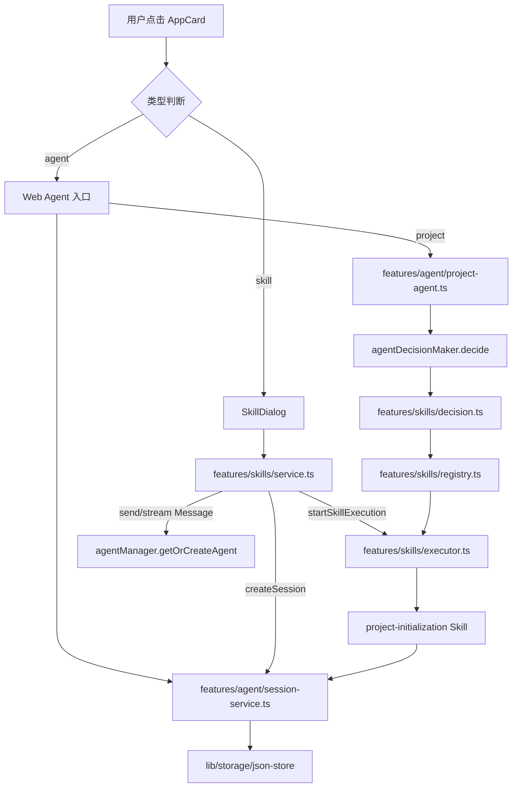

# F17：单元小结 Workshop —— 从首页点击到 Agent/Skill 会话

## 本单元学了什么

F.1 单元围绕一个问题展开：**用户在首页点击一个 Agent 或 Skill 入口后，系统如何在功能层接住请求并准备好会话？**

答案分布在两类 feature 中：

| 文件/模块 | 职责 |
|---|---|
| `features/agent/index.ts` | `features/agent` 的公共 API 出口 |
| `features/agent/defaults.ts` | 定义默认 Agent（产品经理、架构师、项目初始化等） |
| `features/agent/registry.ts` | 验证 Agent、把 Agent 同步到 Dock |
| `features/agent/session-service.ts` | 会话 CRUD、消息追加、摘要、统计 |
| `features/agent/project-agent.ts` | 项目初始化工作流，含 Taste/Accumulation |
| `features/agent/prompts/*` | 角色 Prompt 和项目访谈 Prompt |
| `features/skills/registry.ts` | Skill 注册表和路由 |
| `features/skills/service.ts` | Skill 发现、读取、启动、对话、流式、完成 |
| `features/skills/executor.ts` | Skill 执行与工具注入 |
| `features/skills/decision.ts` | 意图检测与 Skill 决策 |
| `features/skills/project-initialization/*` | 复合 Skill：项目初始化 |
| `shared/agent/types.ts` | Layer 0 Agent 解析接口 |

## 核心控制流复盘

## 关键设计决策回顾

### 1. 为什么功能层要封装 `agentSessionService`？

Web 不需要知道 `OriginOSAgent` 的运行时细节。它只需要：

- 创建会话；
- 追加消息；
- 读取会话列表；
- 获取摘要和统计。

`agentSessionService` 提供稳定的 Promise API，隐藏 JSON 文件读写。

### 2. 为什么 `shared/agent/types.ts` 属于 Layer 0？

`modules/collaboration-runtime` 需要解析 `Agent.md`，但不能直接依赖 `lib/integrations/pi-agent`。Layer 0 接口让 modules 在编译期只依赖类型，运行时通过依赖注入或动态导入拿到实现。

### 3. 为什么 ProjectAgent 要同时做 Taste 和 Accumulation？

项目初始化是最早收集用户偏好和信任历史的场景。把这些能力放在 ProjectAgent 里，可以让后续所有 Agent 服务受益。

### 4. 为什么 Skill 需要 Registry + Router + Executor + Service 四层？

- **Registry**：存储和发现 Skill；
- **Router**：根据上下文选择 Skill；
- **Executor**：安全执行 Skill，注入工具；
- **Service**：对外提供 API 和会话生命周期管理。

这种分层让 Skill 可以被动态扩展，而不影响上层调用代码。

## 单元验收实验

### 实验 1：追踪 Skill 入口

1. 在 `homeApps.ts` 中找到一个 `skill` 类型入口（如 `agent-creator`）。
2. 在本地运行，点击该入口。
3. 打开浏览器开发者工具，找到 `POST /api/skills/executions` 请求。
4. 在 `data/web/sessions/` 下找到对应的会话文件。
5. 验证会话文件中的 `agentType`、`projectContext.currentPath`、`outputDir`。

### 实验 2：追踪 Agent 入口

1. 在 `homeApps.ts` 中找到一个 Agent 入口。
2. 点击后，找到 `POST /api/agent/sessions` 请求。
3. 查看响应中的 `sessionId` 和 `projectContext`。
4. 在 `data/web/sessions/` 或 `data/web/projects/{projectId}/sessions/` 下找到文件。
5. 发送一条消息，验证 `messages` 数组追加。

### 实验 3：Project Agent 阶段推进

1. 点击“项目初始化”。
2. 输入项目名称，观察 welcome 消息。
3. 输入项目描述，观察是否进入 team phase。
4. 输入团队成员、目标、任务，观察 `projectContext.phase` 变化。
5. 在 review phase 输入 yes，观察会话状态变为 `completed`。

### 实验 4：Taste 信号提取

1. 在 Project Agent 对话中输入“我想要简单直接的方案”。
2. 检查控制台是否有 Taste 相关日志。
3. 查看 `ProjectAgentResponse` 中的 `tasteSignals` 字段。
4. 连续输入积极词汇，观察 `trustLevel` 上升。

## 常见问题与自检

| 问题 | 自检方法 |
|---|---|
| `features/agent` 和 `integrations/pi-agent` 的区别是什么？ | 看 `session-service.ts` vs `session-store.ts` |
| 默认 Agent 怎么出现在 Dock 上？ | 追踪 `initializeDefaultAgents` → `agentsToDockApps` |
| Skill 启动后为什么不直接调用 LLM？ | 看 `startSkillExecution` 的 handler 分支 |
| 项目初始化如何推进阶段？ | 看 `projectInitializationSkill.handleMessageByPhase` |
| Taste 如何影响 Prompt？ | 看 `getSystemPrompt` 中的 `tasteGuidance` |

## 本单元边界

- **不讲 bundled Skill handlers**：`features/skills/bundled/*` 的具体业务逻辑属于 Part G。
- **不讲 launcher 细节**：`features/services/launcher/*` 属于 F.2 单元。
- **不讲运行时内部**：`OriginOSAgent` 的流式机制属于 Part E。
- **不讲 cognitive 完整实现**：只涉及 ProjectAgent 中的 Taste/Accumulation 入口，完整认知系统在 F.5/F.6。

## 下一步

F.2 单元将讲：

- `features/services/launcher/*` 如何按 Agent 类型分发；
- `persistent-agent` 如何让 Agent 长期存活；
- `persistent-agent-manager` 如何管理实例生命周期；
- `use-persistent-agent` Hook 如何连接 Web 和运行时。

## 练习与验收

1. **画出本单元控制流**：不看教材，独立画出从首页点击到 `AgentSession` 创建的完整链路。
2. **解释每一层职责**：能向他人解释 `features/agent`、`features/skills`、`shared/agent` 三者的关系和边界。
3. **定位任意代码**：给定一个功能（如“Dock 显示默认 Agent”），能说出涉及哪些文件。
4. **发现边界问题**：找出本单元中至少一个 TODO、一个 `any`、一个无测试覆盖的关键路径。

**验收标准**：能不看代码解释 F.1 单元的整体架构，能独立完成一个 Skill 或 Agent 入口的端到端追踪。

## 章节收束

F.1 单元建立了 Part F 的基础：Agent 和 Skill 的功能层。我们从公共 API、注册表、会话服务，讲到项目 Agent 的工作流、Taste/Accumulation、Prompt 模板，再到 Skill 框架的注册、路由、执行、决策和复合 Skill 实现。

下一单元进入启动层和持久运行时，看会话创建之后，系统如何选择启动路径、如何让 Agent 长期工作。
