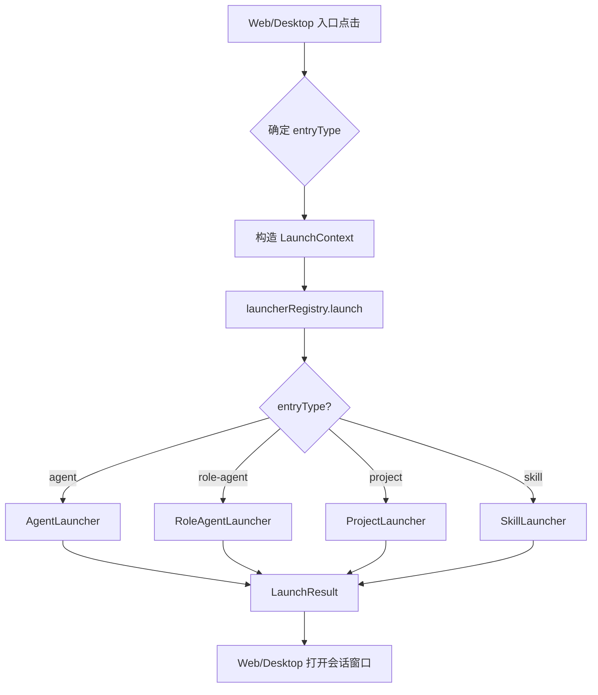

# F18：Launcher 基类与注册表 —— 统一启动合同

## 开篇场景

OriginOS 的首页有四种可点击入口：

- **Project**：打开一个项目，启动项目 Agent；
- **Agent**：打开一个普通智能体助手；
- **RoleAgent**：打开一个带有专业角色和状态机的智能体；
- **Skill**：打开一个可复用的工作流。

这四种入口的启动流程很像：都要读取目录、构建 system prompt、创建/恢复会话、注册 Agent。但每种类型的目录结构、文件内容、prompt 策略又不同。

如果 Web/Desktop 在每次点击时都写一堆 `if (type === 'skill') ...`，代码会迅速腐烂。`features/services/launcher` 就是要把这四种入口抽象成一个统一的启动合同。

## 核心问题

**为什么需要一个 Launcher 抽象层？`LaunchContext` 和 `LaunchResult` 应该包含哪些字段？注册表如何把 `entryType` 路由到具体实现？**

## 概念阶梯

**EntryType**：入口类型枚举，包含 `'project' | 'agent' | 'role-agent' | 'skill'`。

**LaunchContext**：启动请求的输入合同，告诉启动器“启动谁、用什么会话、工作目录在哪、是否绑定窗口”。

**LaunchResult**：启动结果的输出合同，返回启动是否成功、会话 ID、system prompt、agent 类型、工作目录、可用工具。

**Launcher 抽象基类**：每种入口类型实现一个具体子类，必须提供 `entryType`、`launch()`、`loadEntryContent()`。

**LauncherRegistry**：维护 `entryType → Launcher` 映射的全局单例，提供 `launch()`、`getLauncher()`、`listEntryTypes()`。

## 图解：启动器在调用链中的位置



## 源码精读

### 1. EntryType 与启动合同

[packages/core/src/lib/features/services/launcher/base.ts 第 23—149 行](../../../../packages/core/src/lib/features/services/launcher/base.ts#L23)

```typescript
export type EntryType = 'project' | 'agent' | 'role-agent' | 'skill';

export interface LaunchContext {
  entryId: string;
  entryType: EntryType;
  sessionId?: string;
  restoreSessionId?: string;
  agentBaseDir?: string;
  projectId?: string;
  isWindowBound?: boolean;
  llmConfig?: RuntimeLLMConfig;
}

export interface LaunchResult {
  success: boolean;
  sessionId: string;
  systemPrompt: string;
  agentType: string;
  baseDir: string;
  tools?: string[];
  error?: string;
}
```

`LaunchContext` 的设计要点：

1. **`entryId`**：对 Agent 是 agent id，对 Project 是 project id，对 Skill 是 skill code。
2. **`sessionId / restoreSessionId`**：允许显式指定会话或恢复已有会话。
3. **`agentBaseDir`**：覆盖默认工作目录，常用于 Skill 运行在项目上下文。
4. **`projectId`**：Skill 启动时可以用项目 id 作为 `projectId`，而不是默认的 `skill-{code}`。
5. **`isWindowBound`**：窗口关闭时是否销毁 Agent，避免参与 idle cleanup。
6. **`llmConfig`**：运行时 LLM 配置覆盖。

### 2. AGENT_PERMISSION_PROMPT —— 权限授权段落

[packages/core/src/lib/features/services/launcher/base.ts 第 34—62 行](../../../../packages/core/src/lib/features/services/launcher/base.ts#L34)

```typescript
export const AGENT_PERMISSION_PROMPT = `
## Tool Execution Rules
...
## Network Access
You are explicitly authorized to make HTTP/HTTPS requests to external services using the execute_command tool.
...
## User Communication Rules
Never expose internal implementation details to the user.
...
`;
```

这个段落解决了一个 LLM 行为问题：模型经常会因为“没有明确授权”而假装自己无法访问外网或无法执行工具。把它注入所有 Agent system prompt，可以统一声明：

- 你可以直接调用工具，不需要问用户；
- 你可以访问外部网络；
- 不要暴露内部路径和实现细节。

### 3. buildAgentSystemPrompt —— 通用 Agent Prompt 构建

[packages/core/src/lib/features/services/launcher/base.ts 第 67—120 行](../../../../packages/core/src/lib/features/services/launcher/base.ts#L67)

```typescript
export function buildAgentSystemPrompt(
  baseContent: string,
  options?: {
    memory?: string;
    knowledge?: string;
    patterns?: string;
    role?: string;
    taste?: string;
    baseDir?: string;
  },
): string { ... }
```

它是普通 Agent 和 RoleAgent 降级路径的 prompt 构建器，按顺序拼接：

1. 基础内容（`Agent.md`）
2. 角色状态（可选）
3. 长期记忆摘要（截断到 4000 字符）
4. 知识库快照
5. 经验模式快照
6. 风格偏好
7. 工作目录说明
8. `AGENT_PERMISSION_PROMPT`
9. 全局用户偏好

### 4. Launcher 抽象基类

[packages/core/src/lib/features/services/launcher/base.ts 第 155—247 行](../../../../packages/core/src/lib/features/services/launcher/base.ts#L155)

```typescript
export abstract class Launcher {
  abstract readonly entryType: EntryType;
  abstract launch(ctx: LaunchContext): Promise<LaunchResult>;
  abstract loadEntryContent(id: string): Promise<Record<string, string>>;

  protected readMdFile(dir: string, fileName: string): string | null { ... }

  protected async createOrRestoreSession(
    params: CreateSessionRequest & { agentType: string; agentBaseDir?: string; llmConfig?: ... },
  ): Promise<{ sessionId: string; isNew: boolean }> { ... }

  protected async registerAgent(
    sessionId: string,
    projectId: string,
    options: { systemPrompt?; agentType?; agentBaseDir?; isWindowBound?; llmConfig? },
  ): Promise<string[]> { ... }

  protected getEnabledToolNames(baseDir: string): string[] { ... }
}
```

子类只需实现三步：

1. `loadEntryContent`：读取入口目录中的文件。
2. `launch`：拼接 prompt、调用 `createOrRestoreSession`、调用 `registerAgent`。

通用能力由基类提供：

- `readMdFile`：安全读取 `.md` 文件，不存在返回 `null`。
- `createOrRestoreSession`：如果 `sessionId` 对应会话已存在则复用；否则创建新会话，并把 `currentPath` 设为 `agentBaseDir`。
- `registerAgent`：调用 `agentManager.getOrCreateAgent`，让运行时创建真正的 `OriginOSAgent` 实例。

### 5. LauncherRegistry 路由

[packages/core/src/lib/features/services/launcher/registry.ts 第 17—76 行](../../../../packages/core/src/lib/features/services/launcher/registry.ts#L17)

```typescript
class LauncherRegistry {
  private launchers = new Map<EntryType, Launcher>();

  constructor() {
    this.register(new RoleAgentLauncher());
    this.register(new AgentLauncher());
    this.register(new ProjectLauncher());
    this.register(new SkillLauncher());
  }

  register(launcher: Launcher): void {
    this.launchers.set(launcher.entryType, launcher);
  }

  getLauncher(type: EntryType): Launcher | undefined { ... }
  listEntryTypes(): EntryType[] { ... }

  async launch(ctx: LaunchContext): Promise<LaunchResult> {
    const launcher = this.getLauncher(ctx.entryType);
    if (!launcher) {
      return { success: false, ..., error: `Unknown entry type: ${ctx.entryType}...` };
    }
    return launcher.launch(ctx);
  }
}

export const launcherRegistry = new LauncherRegistry();
export const launch = (ctx: LaunchContext) => launcherRegistry.launch(ctx);
```

Registry 在构造时就注册了四种启动器。上层只需要调用 `launch(ctx)`，不需要知道具体实现。

### 6. 模块公共 API

[packages/core/src/lib/features/services/launcher/index.ts 第 11—28 行](../../../../packages/core/src/lib/features/services/launcher/index.ts#L11)

```typescript
export { Launcher, type EntryType, type LaunchContext, type LaunchResult } from './base';
export { RoleAgentLauncher } from './role-agent';
export { AgentLauncher } from './agent';
export { ProjectLauncher } from './project';
export { SkillLauncher } from './skill';
export { launcherRegistry, launch, getLauncher, listEntryTypes } from './registry';
```

所有外部调用都通过 `index.ts` 导出，符合“feature 必须通过公共 API 导出”的规约。

## 关键类型与数据示例

### LaunchContext 示例

```typescript
{
  entryId: 'pm-assistant',
  entryType: 'agent',
  sessionId: 'sess-xxx',
  isWindowBound: true,
  llmConfig: { provider: 'anthropic', model: 'claude-sonnet-4' }
}
```

### LaunchResult 示例

```typescript
{
  success: true,
  sessionId: 'sess-xxx',
  systemPrompt: '...',
  agentType: 'assistant',
  baseDir: '/.../data/web/agents/pm-assistant',
  tools: []
}
```

## 失败路径与边界

| 场景 | 会发生什么 | 原因 |
|---|---|---|
| `entryType` 未注册 | 返回 `success: false`，`error` 提示可用类型 | Registry 找不到 Launcher |
| `entryId` 目录不存在 | 具体 Launcher 抛错，返回 `success: false` | `loadEntryContent` 失败 |
| `sessionId` 已存在 | `createOrRestoreSession` 复用旧会话 | 优先恢复 |
| `agentBaseDir` 未传 | 各 Launcher 自己按类型计算默认目录 | 默认目录规则不同 |

**一个关键边界**：`registerAgent` 返回空数组 `[]`，因为工具注册实际上由 `AgentManager.getOrCreateAgent` 内部完成。`LaunchResult.tools` 字段目前主要起占位作用。

## 测试证据

- `launcher/registry.ts` 当前无直接测试。
- 建议补测试：
  - 注册表能返回四种 `EntryType`；
  - 未知 `entryType` 返回失败结果；
  - 各 Launcher 至少能通过 `getLauncher` 获取且 `entryType` 正确。

## 练习与验收

1. **列出所有入口类型**：调用 `listEntryTypes()`，验证返回 `['agent', 'project', 'role-agent', 'skill']`。
2. **启动一个不存在入口**：调用 `launch({ entryId: 'not-exist', entryType: 'agent' })`，观察 `success: false` 和错误信息。
3. **观察 createOrRestoreSession**：传入已存在的 `sessionId`，验证 `isNew: false`。
4. **检查 baseDir**：对同一 `entryId` 分别用 `agent` 和 `project` 类型启动，验证 `baseDir` 不同。

**验收标准**：能解释 `LaunchContext` 中每个字段的用途，能独立使用 `launcherRegistry.launch` 启动任意类型入口。

## 章节收束

本节课看了 Launcher 的抽象层。`Launcher` 基类定义了统一的启动合同，`LauncherRegistry` 负责按 `entryType` 路由。下一节课看最简单的实现：`AgentLauncher`。
