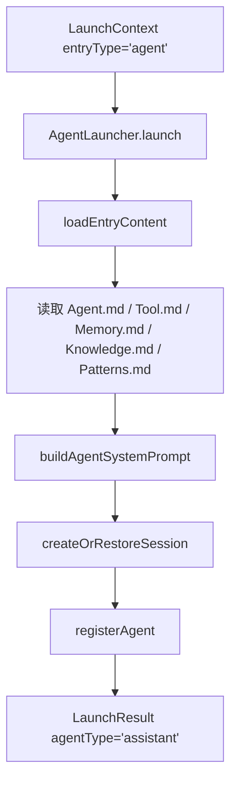

# F19：Agent Launcher —— 普通智能体如何启动

## 开篇场景

用户在 Dock 或首页点击一个普通 Agent 入口，比如“产品经理助手”。系统需要：

1. 到 `data/agents/{id}/` 读取它的角色定义；
2. 把长期记忆、知识库、经验模式注入 system prompt；
3. 创建或恢复一个会话；
4. 让 AgentManager 持有这个 Agent 实例，等待用户发送消息。

这就是 `AgentLauncher` 的职责。它是四种启动器中最简单的一个，因为它不需要处理项目本体、Skill 依赖或 RoleAgent 的状态机。

## 核心问题

**普通 Agent 的启动器为什么只需要读 `Agent.md`、`Tool.md`、`Memory.md`、`Knowledge.md`、`Patterns.md`？`buildAgentSystemPrompt` 如何把这些片段拼成最终 prompt？**

## 概念阶梯

**Assistant Agent**：`agentType='assistant'`，面向通用对话和任务，不绑定项目，也没有状态机。

**Agent 数据目录**：`data/agents/{id}/`，包含 `Agent.md`、`Tool.md`、`Memory.md`、`Knowledge.md`、`Patterns.md`。

**长期稳定记忆**：`Memory.md` 中的内容，启动时被截断注入 prompt，作为 Agent 的“自我介绍背景”。

**知识库快照**：`Knowledge.md` 中的内容，让 Agent 了解领域知识。

**经验模式快照**：`Patterns.md` 中的内容，让 Agent 了解常见最佳实践。

## 图解：AgentLauncher 启动流程



## 源码精读

### 1. AgentLauncher 类定义

[packages/core/src/lib/features/services/launcher/agent.ts 第 18—73 行](../../../../packages/core/src/lib/features/services/launcher/agent.ts#L18)

```typescript
export class AgentLauncher extends Launcher {
  readonly entryType = 'agent' as const;

  async launch(ctx: LaunchContext): Promise<LaunchResult> {
    try {
      const agentBaseDir = path.join(AGENTS_DIR, ctx.entryId);

      // 1. 读取入口内容
      const content = await this.loadEntryContent(ctx.entryId);
      const agentMd = content['Agent.md'] || '';

      // 2. 构建系统提示词（注入权限授权）
      const systemPrompt = buildAgentSystemPrompt(agentMd, {
        memory: content['Memory.md'],
        knowledge: content['Knowledge.md'],
        patterns: content['Patterns.md'],
        baseDir: agentBaseDir,
      });

      // 3. 创建/恢复会话
      const { sessionId } = await this.createOrRestoreSession({
        projectId: ctx.entryId,
        projectName: ctx.entryId,
        systemPrompt,
        agentType: 'assistant',
        agentBaseDir,
        sessionId: ctx.restoreSessionId || ctx.sessionId,
      });

      // 4. 注册 Agent 到 AgentManager
      const tools = await this.registerAgent(sessionId, ctx.entryId, {
        systemPrompt,
        agentType: 'assistant',
        agentBaseDir,
        isWindowBound: ctx.isWindowBound,
      });

      return {
        success: true,
        sessionId,
        systemPrompt,
        agentType: 'assistant',
        baseDir: agentBaseDir,
        tools,
      };
    } catch (error) {
      return {
        success: false,
        sessionId: '',
        systemPrompt: '',
        agentType: 'assistant',
        baseDir: '',
        error: error instanceof Error ? error.message : 'Unknown error',
      };
    }
  }
}
```

四个步骤非常清晰：

1. **定目录**：`data/agents/{entryId}/`。
2. **读文件**：`loadEntryContent` 读取五类文件。
3. **拼 prompt**：`buildAgentSystemPrompt` 注入记忆、知识、模式、工作目录和权限授权。
4. **建会话 + 注册 Agent**：复用基类方法。

### 2. loadEntryContent

[packages/core/src/lib/features/services/launcher/agent.ts 第 75—87 行](../../../../packages/core/src/lib/features/services/launcher/agent.ts#L75)

```typescript
async loadEntryContent(id: string): Promise<Record<string, string>> {
  const agentBaseDir = path.join(AGENTS_DIR, id);
  const result: Record<string, string> = {};

  for (const file of ['Agent.md', 'Tool.md', 'Memory.md', 'Knowledge.md', 'Patterns.md']) {
    const content = this.readMdFile(agentBaseDir, file);
    if (content !== null) {
      result[file] = content;
    }
  }

  return result;
}
```

只有这五类文件。`Tool.md` 的内容不直接拼进 prompt，而是交给 `AgentManager` 内部读取，用于过滤可用工具。

### 3. createOrRestoreSession 中的 projectId

注意 `createOrRestoreSession` 的参数：

```typescript
{
  projectId: ctx.entryId,
  projectName: ctx.entryId,
  agentType: 'assistant',
  agentBaseDir,
  sessionId: ctx.restoreSessionId || ctx.sessionId,
}
```

普通 Agent 没有项目概念，所以用 `entryId` 同时作为 `projectId` 和 `projectName`。会话文件会落在 `data/web/sessions/{sessionId}.json` 中，而不是项目目录下。

### 4. registerAgent 中的 isWindowBound

```typescript
{
  systemPrompt,
  agentType: 'assistant',
  agentBaseDir,
  isWindowBound: ctx.isWindowBound,
}
```

`isWindowBound` 告诉 `AgentManager`：这个 Agent 与窗口生命周期绑定，窗口关闭时应该销毁，不参与 idle cleanup。普通 Agent 通常从窗口启动，所以这个字段常为 `true`。

## 真实调用链

用户点击普通 Agent 入口：

1. Web 构造 `LaunchContext { entryType: 'agent', entryId: 'pm-assistant' }`。
2. 调用 `launcherRegistry.launch(ctx)`。
3. `LauncherRegistry` 路由到 `AgentLauncher`。
4. `AgentLauncher` 读取 `data/agents/pm-assistant/` 下文件。
5. 构建 system prompt 并创建 `AgentSession`。
6. `AgentManager.getOrCreateAgent` 创建 `OriginOSAgent` 实例。
7. Web 用返回的 `sessionId` 打开聊天窗口。

## 关键类型与数据示例

### Agent 数据目录示例

```
data/web/agents/pm-assistant/
├── Agent.md
├── Tool.md
├── Memory.md
├── Knowledge.md
└── Patterns.md
```

### Agent.md 示例

```markdown
---
agentId: pm-assistant
agentType: assistant
version: 1.0.0
name: 产品经理助手
---

你是一位资深产品经理，擅长需求分析、用户故事撰写和优先级排序。
```

### 生成的 system prompt 片段

```markdown
## 产品经理助手
...

## Long-term Stable Memory
[Memory.md 内容摘要]

## Knowledge Base Snapshot
[Knowledge.md 内容]

## Experience Patterns Snapshot
[Patterns.md 内容]

## Working Directory
Your working directory is: /.../data/web/agents/pm-assistant
...

## Tool Execution Rules
...
## Network Access
You are explicitly authorized to make HTTP/HTTPS requests...
```

## 失败路径与边界

| 场景 | 会发生什么 | 原因 |
|---|---|---|
| `Agent.md` 不存在 | `content['Agent.md']` 为空字符串，system prompt 只有通用段落 | `readMdFile` 返回 `null` 后被 `|| ''` 兜底 |
| `Memory.md` 不存在 | 不注入记忆段落 | `buildAgentSystemPrompt` 判断 `options.memory` 不存在 |
| `Tool.md` 不存在 | `AgentManager` 内部默认允许所有工具 | `loadToolConfig` 无配置 |
| 会话创建失败 | 返回 `success: false` | `agentSessionService.createSession` 抛错 |

**一个关键边界**：普通 Agent 的 `projectId` 就是 `entryId`，所以它在 `data/web/agents/{id}/` 目录和 `data/web/sessions/` 之间没有项目级的隔离。这是正确的，因为 Assistant Agent 本身不归属于某个项目。

## 测试证据

- `AgentLauncher` 当前无直接测试。
- 建议补测试：
  - 正常启动：验证 `success: true`、`agentType: 'assistant'`、`baseDir` 正确。
  - 恢复会话：传入已有 `sessionId`，验证 `LaunchResult.sessionId` 一致。
  - 缺失 `Agent.md`：验证仍能返回成功，且 system prompt 包含通用权限段落。

## 练习与验收

1. **创建一个测试 Agent**：在 `data/web/agents/test-agent/` 下放置 `Agent.md` 和 `Memory.md`。
2. **调用 AgentLauncher**：使用 `launcherRegistry.launch({ entryType: 'agent', entryId: 'test-agent' })`。
3. **检查会话文件**：在 `data/web/sessions/` 下找到对应会话，验证 `agentType` 和 `projectContext.currentPath`。
4. **修改 Memory.md 后重启**：观察 system prompt 中记忆段落的更新。

**验收标准**：能解释普通 Agent 启动的四个步骤，能独立追踪 `Agent.md` 到 `OriginOSAgent` 实例的完整路径。

## 章节收束

本节课看了最朴素的启动器 `AgentLauncher`。下一节课看 `ProjectLauncher`，它除了读 Agent.md，还要把项目本体注入 prompt。
